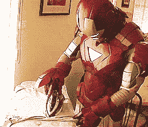
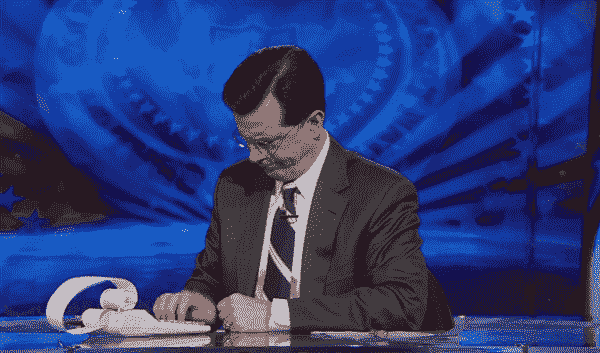

# 朝九晚五？更像是七比七！

> 原文：<https://medium.com/swlh/nine-to-five-more-like-seven-to-seven-580ebbae47a4>

## 为什么你可能一天工作超过 12 个小时

你正常的工作日是多长时间？8 个小时？9 个小时？你有可能每天花超过 12 个小时在工作上吗？

# 朝九晚五的工作？

朝九晚五的工作应该从……嗯，从周一到周五，朝九晚五。那就是一天八小时。**每周 40 小时**。然而，英国员工平均每周工作 42.7 小时，相当于每天工作 8.5 小时。

根据 [OECD](https://stats.oecd.org/Index.aspx?DataSetCode=ANHRS) 的数据，2016 年英国普通工人每周工作 36.5 小时。值得一提的是，这个数字是兼职和全职员工工作时间的总和。在美国，这个数字甚至更高。普通工人(包括兼职和全职)每周工作 38.6 小时。因此，可以有把握地假设一个全职工作的普通美国人每周工作超过 45 小时。事实上，美国有线电视新闻网披露了一项调查，发现美国全职员工平均每周工作 47 小时。

顺便说一句，如果你住在韩国、土耳其、哥伦比亚或墨西哥，并且有一份全职工作，那么你可能每周工作超过 50 个小时。)

请注意，这些统计数据只反映了那些只有一个主要工作的人。
根据英国国家统计局的数据，仅在英国，2017 年就有超过 100 万人有第二份工作。

所有这些从世界各地数百万人那里收集的数据都很有趣。
**但他们不说实话。**
请允许我解释原因。

# 加班和通勤

我的朋友罗杰是加州一家大公司的数据分析师。他的合同规定他必须每周工作 40 小时——从周一到周五上午 9:30 到下午 5:30。为了简化计算，我们把它改成上午 9 点到下午 5 点。

在之前的一篇[帖子](/@saaroron/yes-roger-you-do-have-a-choice-c68063e6d2ba)中，我提到罗杰总是加班。幸运的是，在他的办公室里，有一个自动系统记录他的工作时间。我们调查了他上个月的工作时间。我们发现:罗杰平均每周工作 46.7 小时。有一次，他在午餐时间下班去见医生。否则，他将超过美国每周 47 小时的平均水平。考虑到这一点，罗杰的平均工作日是从早上 9 点到下午 6 点半。

通勤呢？2015 年，美国人平均花费 27 分钟去上班。大概是一天一个小时。
不幸的是，在加州通勤上班要花更长的时间。罗杰花了两个多小时上下班。
**所以他的工作日实际上是早上 8 点开始，晚上 7 点半结束。然而，普通美国人的一天从早上 8:30 开始，到晚上 7 点结束。**

# 等等！这还不是全部。

你花多长时间准备工作？
梳妆打扮，收拾饭盒，做头发还是化妆？根据 YouGov 的调查，大多数人花 11 到 30 分钟准备工作。这意味着普通美国人每天花 20 分钟准备工作。我问罗杰。他早上 7 点醒来，说他要花大约 30 分钟熨衬衫、穿西装、打领带、擦鞋和做头发。这使得他的工作日正式从早上 7:30 开始。可悲的是，这还不是全部。我们大多数人花相当多的时间在家工作，通常是接电话、发短信或回复电子邮件。罗杰承认他下班回家后大约花 45 分钟打电话，查看和回复电子邮件。他的工作日在晚上 8:15 结束。

那么工作旅行或周末工作呢？去年，罗杰曾六次出差。他花数小时在飞机上，睡在旅馆里。他一天 24 小时都在工作。我甚至没有提到工作事件和会议、办公室外的会议/用餐以及强制性的办公室聚会。

罗杰的平均工作日是早上 7:30 开始，晚上 8:15 结束。当他意识到自己一天工作 12 小时 45 分钟，或者一周工作超过 63 小时时，他震惊了。

# 我们能做什么？

首先也是最重要的，我们开始计算我们实际上在工作上花了多少时间。想想你早上的例行公事和每天的通勤。注意你的加班(带薪或不带薪)和在家工作的时间。你必须对自己诚实。没有借口。

解决这个问题的最佳方法是将正常工作日与周末进行比较。例如，在周末你仍然会吃早餐和刷牙(我希望！)，但你不会花一个小时通勤。

一旦你意识到自己的工作时间，你就可以开始做出一些改变。也许你会意识到你花了太多时间通勤上班。也许，像我的朋友罗杰一样，你会减少加班时间。**毕竟，工作过度是一种** [**不健康的**](https://www.theguardian.com/lifeandstyle/2018/jan/15/is-28-hours-ideal-working-week-for-healthy-life) **习惯。**

你可能决定立即做出改变，也可能决定不做。这种做法不应该让你心烦意乱，它完全是为了控制你的工作习惯。请记住:你的自我意识是帮助你前进一步的工具，它不必马上发生。

# 我在乎什么？我是个体户！

在英国，超过 26%的个体经营者每周工作超过 45 小时。只有 17.5%的员工做同样多的工作。

作为一名自由职业者，我必须强调承认我们通常不认为是工作的时间的重要性。就我个人而言，每当我发出一份对工作的评估时，我都会加上日常工作之外需要花费的“额外”时间。
我问自己——我需要通勤吗？需要多长时间？我要花多长时间与我的客户沟通？我需要发电子邮件和打很多电话吗？如果我对这些问题中的任何一个回答是肯定的，我就认为它是有效的。

例如，我有一个项目需要大约 40 个小时的工作。我期待 10 个小时的通勤和与客户的沟通。因此，我认为这个项目是 50 小时的工作，并相应收费。

# 那你呢。

你在办公室花八个小时，另外两个小时在通勤上吗？你花时间在家工作吗？

你预计工作多长时间，而你实际工作了多长时间？

> 如果你觉得那是你想做的，就一起鼓掌👏

# 感谢阅读！更多帖子请[跟我来](/@saaroron)。

## 这个故事发表在 [The Startup](https://medium.com/swlh) 上，这是 Medium 最大的企业家出版物，拥有 314，785+人。

## 在这里订阅接收[我们的头条新闻](http://growthsupply.com/the-startup-newsletter/)。

