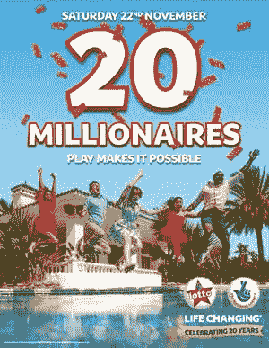
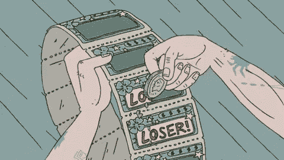
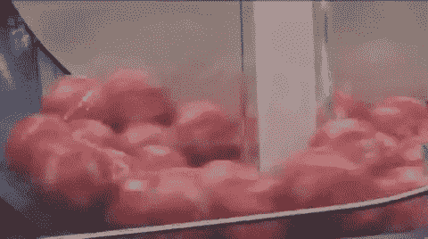

# 不，谢谢，我不想要彩票大奖

> 原文：<https://medium.com/swlh/no-thanks-i-dont-want-the-lottery-prize-8d52d84732c5>

## 我已经选对了号码

## 如果你今天中了彩票，你会做什么？

犒劳自己一辆全新的豪华敞篷车？买名牌衣服和闪亮的劳力士？你会退休然后[环游世界吗](/@saaroron/why-most-people-want-to-travel-4be3335c16be)？

说真的，你会怎么做？
也许，像大多数人一样，你会回答:

> “我会把 20%捐给慈善机构”
> “我会把它作为投资”
> “我会让我的孩子接受最好的教育”
> “我会偿还我的债务”

嗯，对你有好处。你是一个高尚的人。现在还有一个重要的问题，也是一个相当困难的问题:如果你今天中了彩票，你会接受奖励吗？

# **金钱**≦**自由**

在现实中，你不接受彩票大奖就是傻子，对吧？我的意思是，谁会傻到拒绝数百万美元呢？
嗯，我。我是那个愚蠢的人。

事实是，让某人想象一下中彩票会是什么样子，他们会立刻开始微笑。几年前当我被问到这个问题时，我的眼睛闪闪发光，因为我开始想象这将是多么惊人。梦想成真。
**这就是它真正的全部。只是一个梦。**

> “一切皆有可能！”
> 
> “嘿，你永远不知道！”

全世界的彩票机构花费数百万做广告，这些只是他们使用的一些口号。他们展示时尚的服装、大房子和阳光明媚的海滩度假胜地，让这个梦想看起来像真的一样。向我们展示幸福的样子。但是问题不在于广告牌广告，也不在于真正赢得彩票的几率低。

我们就是问题。我们做着那样的梦。我们相信金钱可以买到幸福，金钱可以买到自由。我们的世界是建立在一个错误的等式上的。一个几乎每个人日夜都在遵循的方程式。
**金钱=自由。或者更准确地说:很多钱=自由。**

这让我想知道，到底什么是自由？

> 随心所欲地行动、说话或思考的权力或权利。

金钱买不到你我随心所欲行动、说话或思考的能力。事实上，它可能会把这种感觉带走。我的意思是，如果你是一个亿万富翁，你应该像一个亿万富翁一样行动、说话和思考——对吗？你应该住在豪宅里，只和其他亿万富翁交流。你或许应该拥有至少一打高尔夫俱乐部，并拥有自己的酿酒厂。

自由与金钱无关。**自由=** [**一个选择**](/@saaroron/yes-roger-you-do-have-a-choice-c68063e6d2ba) **。一旦我们成功地按照这个等式生活，彩票就会从这个世界上消失。**

# 我中了彩票，但我仍然很痛苦

正如上面视频中的所解释的，彩票中奖让人们在中奖后的头几个月更快乐。但是不久之后，他们的快乐水平又下降了，回到了获胜前的水平。其实等于没中奖的人的幸福程度。
意思是，如果你在彩票中奖前很痛苦，那么即使你中奖了，你也会一直痛苦下去。金钱不会改变它。

有一些关于彩票中奖者以及他们的生活如何因赢得大奖而被毁掉的可怕故事。一些获胜者甚至被残忍地谋杀了。但是大多数彩票中奖者声称他们感到孤独，朋友和家人向他们要钱和投资。

如果你有赌博的倾向，那么中彩票不会改变任何事情。但是如果你在中彩票之前是一个快乐、平衡的人呢？嗯，有两个选择。你可能会改变——变得更加物质化，不理性地消费。或者你可能不会让它影响你，继续做让你开心的事。在这种情况下— **你为什么会想“赢”呢？**

# 彩票中奖会改变我的生活吗？

我 **不买彩票。**不是因为不切实际的 1/14，000，000 的胜算，而是**因为我不想赢。多年来，我一直有这样一个愿望，就像你们大多数读到这篇文章的人一样，奇迹般地有一个装满钱的袋子从天上掉下来。我以为它会“修复”我的生活。但事实是，我过去是，现在仍然是一个快乐的人。我的生活已经“固定”了。我追求我的激情，我被我爱的人包围着，我感到健康和感激。我已经选对了号码。所以我开始思考——**赢得 1000 万美元真的会影响我的生活吗？我想这可能会让我很困惑。这可能会迫使我改变我的思维方式和行为方式。说来好笑，我相信这会让我比今天更担心钱的问题。这会剥夺我大部分的自由。****

听着，我不是说你的抵押贷款被偿还了就没有什么好安慰的了。太棒了。但这正是重点。对于我们大多数人来说，我们出生时就存活了下来。我们的财务前景是安全的。不管怎样，找到支付账单的方法并不困难。但是，如果我们永远不知道什么对我们来说是足够的，那么我们将继续消费更多，需要更多的钱。这是游戏规则，我们都在玩。与邻居攀比。

事实是——你知道你可以工作来支付账单，但你不想这么做。你更喜欢中彩票。为什么？不是因为你懒，而是因为你不开心。**问问你自己这个**——如果我今天给你银行电汇 200 万美元——你明天会去上班吗？
如果你的直接回答是“见鬼，不！”那么这就是核心问题。中彩票不会给你带来最终的快乐，但是找到时间的意义会给你带来最终的快乐。

# 如何才能走出这种无止境的循环？

## 1.发现并[定义我们自己的‘足够’](/swlh/what-happens-when-you-find-your-enough-in-this-lifetime-65fdc4844aa6)。

你生活中实际需要多少钱？哪些物品是你真正需要的？没有升级和降级。只有适合你的和不适合你的。

## 2.找出赋予你意义的东西。

在巴哈马，没有人真的想整天喝玛格丽塔酒。这种好莱坞式的形象是唯物主义的，与你的内心世界无关。你想用你的时间做什么？不管答案是什么，现在就开始吧。

你不需要真的中彩票就能做你真正想做的事情。事实上，不赢得所有的钱可能会更容易。
**随心所欲。毕竟，这是你能赢得的最大的奖励。**

# 你好。感谢阅读。如果你喜欢，请鼓掌*👏*回应💬。[跟我来](/@saaroron)这里:

 [## 萨尔·oron⁦⁦👈—中等

### 阅读萨尔·oron⁦⁦写的最新故事👈在介质上。我是萨尔。大多对音乐和人充满热情。在…

medium.com](https://medium.com/@saaroron/latest) 

## **阅读更多:**

 [## 为什么爬山时很难看到顶峰

### 我爬错了山

medium.com](/swlh/why-its-hard-to-see-the-summit-when-you-climb-a-mountain-bf7c3bfb7237)  [## 在这一生中找到你自己的足够的重要性

### 当你认为极简主义是一种饮食时会发生什么

medium.com](/swlh/what-happens-when-you-find-your-enough-in-this-lifetime-65fdc4844aa6) 

## 这篇文章发表在 [The Startup](https://medium.com/swlh) 上，这是 Medium 最大的创业刊物，有 329，974 人关注。

## 在此订阅接收[我们的头条新闻](http://growthsupply.com/the-startup-newsletter/)。

