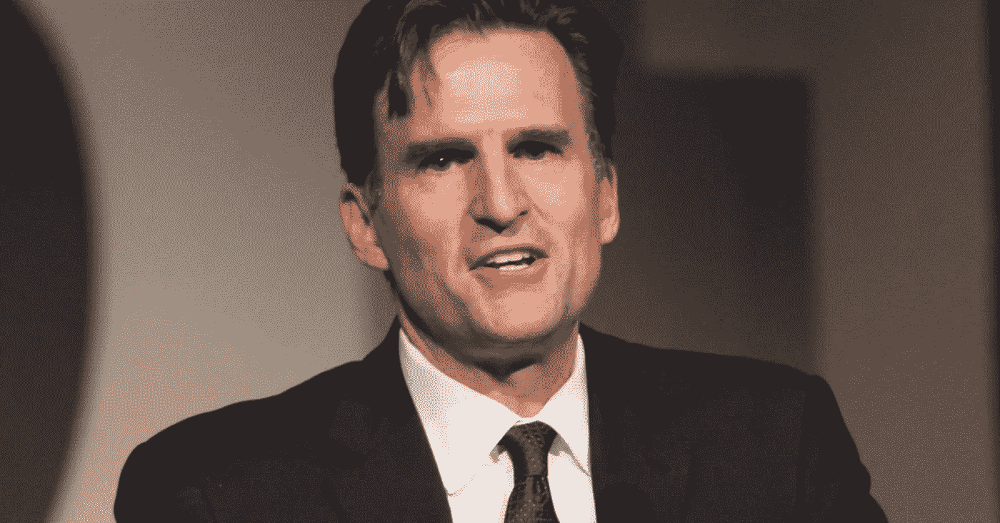

# 不，另一个杰夫

> 原文：<https://medium.com/swlh/no-the-other-jeff-565adf9d4bc>

Jeff Gennette, CEO Macy’s

今年表现最好的零售股票毫不奇怪:**亚马逊**2018 年迄今上涨 54%。

但是你可能会惊讶地发现，通常被认为是亚马逊受害者的**梅西百货**，是排名第二的零售商。今年以来，梅西百货的股价上涨了 50%以上，成为标准普尔 500 指数中表现第十好的股票。

梅西百货关闭了表现不佳的商店，投资了 **Bluemercury、Story Worldwide、b8ta** 和其他新公司，增加了 BOPIS 的使用(在商店购买在线提货)，并增加了移动支付。重要的是，梅西百货提高了许多基本零售 KPI 的绩效，包括库存周转、产品组合管理和 aur 增加。

祝贺杰夫·吉尼特、哈尔·劳顿、杰夫·坎特、马克·斯托克、RB·哈里森、里奇·伦诺克斯、雷切尔·谢克曼、托尼·斯普林、玛丽亚和巴里·贝克以及梅西百货的团队。

现在，让我们看看梅西的 3.0 版给消费者、品牌、贸易伙伴和投资者带来了什么…

*2018，大卫·j·卡茨*

## 这篇文章发表在 [The Startup](https://medium.com/swlh) 上，这是 Medium 最大的创业刊物，拥有 355，974+人关注。

## 在此订阅接收[我们的头条新闻](http://growthsupply.com/the-startup-newsletter/)。

