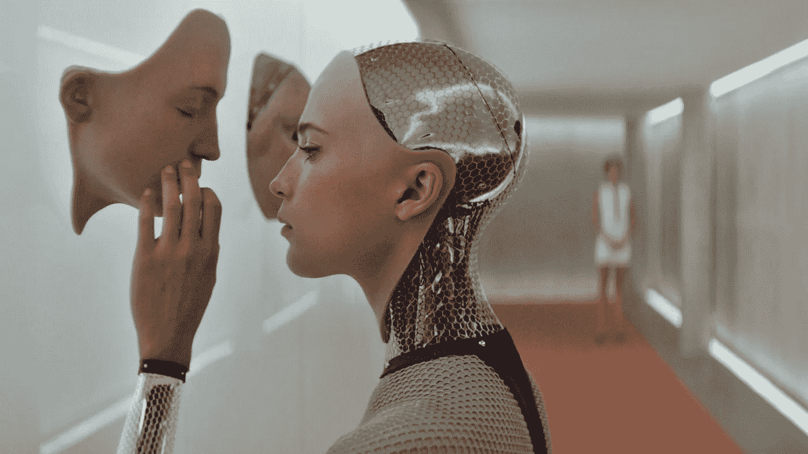
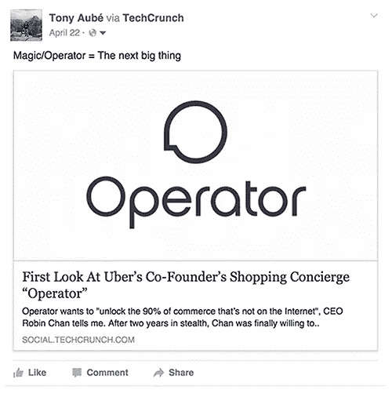
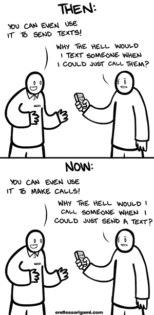
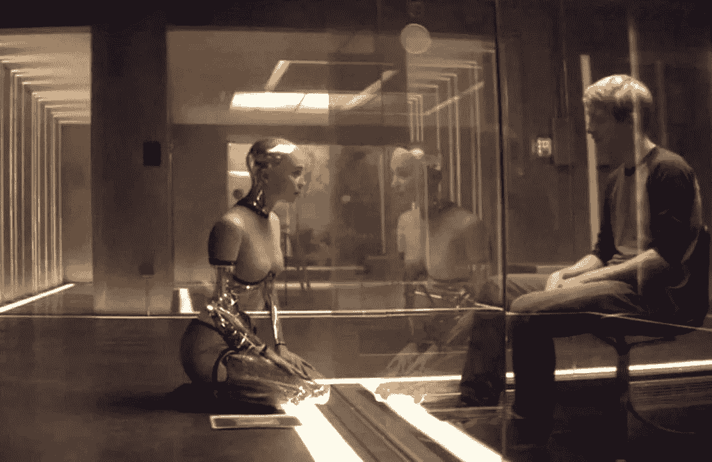
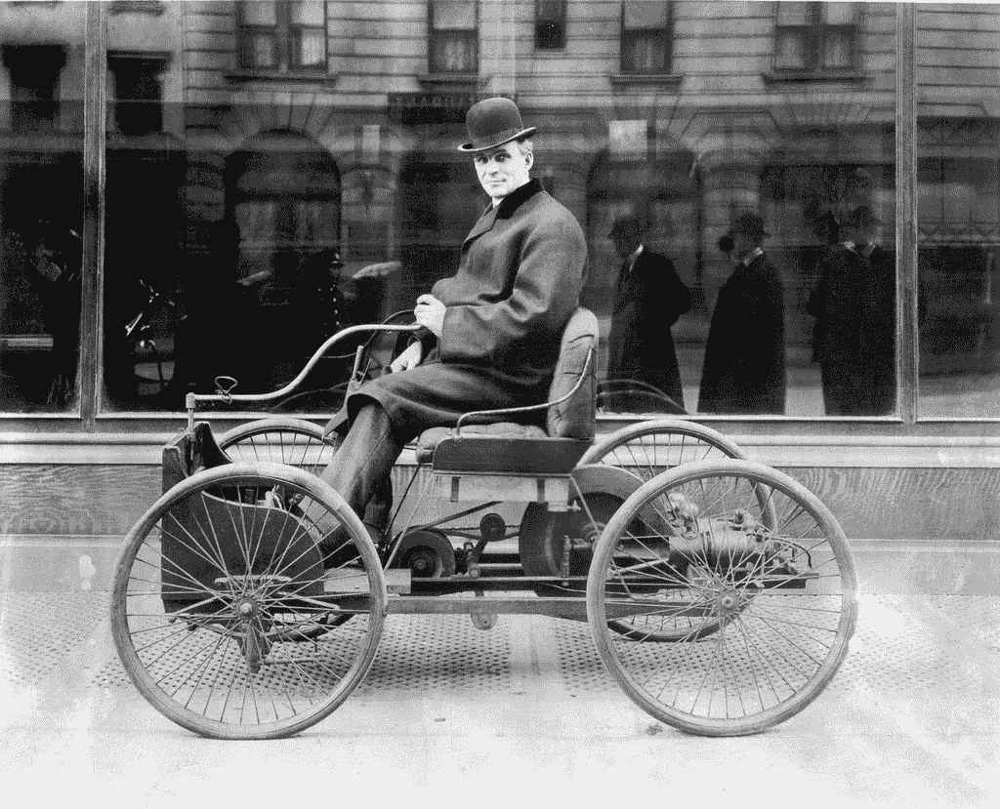
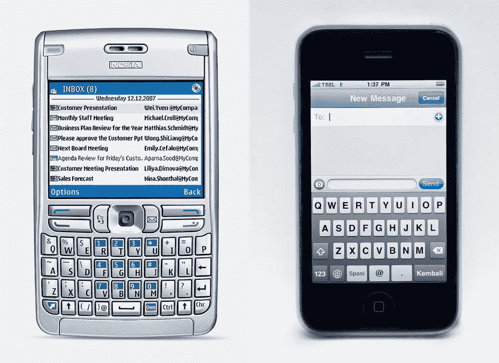
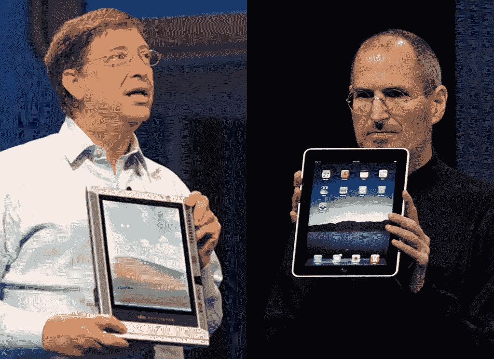
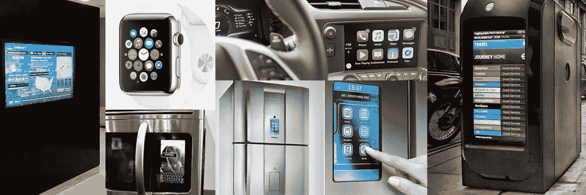

# 无用户界面是新的用户界面

> 原文：<https://medium.com/swlh/no-ui-is-the-new-ui-ab3f7ecec6b3>

## *关于无用户界面应用的兴起，以及作为一名设计师，你为什么应该
关注它们。*

几个月前，我和我的朋友分享了我认为像 [Magic](http://getmagicnow.com/) 和 [Operator](https://operator.com/) 这样的应用程序将会成为下一个大事件。

0 likes. Oh well, I guess it is time to change which platform I use to share my tech insights.

如果你不了解这些应用，它们的特别之处在于它们不使用传统的用户界面作为交互手段。相反，整个应用程序围绕着一个单一的信息屏幕。这些被称为'[隐形](http://www.producthunt.com/@rrhoover/collections/invisible-apps)和'[对话](http://www.producthunt.com/@chrismessina/collections/convcomm)'应用，自从我的第一篇帖子以来，一系列类似的应用进入了市场。就在我写这篇文章的时候，脸书正在发布 M ，这是一个集成了 Messenger 的个人助理，可以帮你做任何事情。

虽然这些应用在许多不同的市场运作，从 c [查看你的银行账户](https://digit.co/)，[安排会议](https://x.ai/)，[预订最好的餐厅](https://luka.ai)到[成为你的旅行助手](https://taylorbot.com)，但它们都有一个共同点:*它们将信息传递放在中心位置。*

# 信息的兴起

[Cellphones, then and now](http://endlessorigami.com/comic/cellphones-then-and-now/) by Endless Origami

马蒂·马柯能是一名软件工程师，几个月前去世了。我猜你没有听说他的死讯，你很可能不知道他是谁。然而，Makkonen 可能是通信领域最重要的人物之一。我的意思是——在亚历山大·贝尔的层面上——很重要。他是短信的发明者。

如果你没有意识到短信在今天已经变得如此普遍，请再想一想。短信是世界上使用最多的应用程序。三年前，它估计有 40 亿活跃用户。超过了[当时脸书用户数量](http://finance.yahoo.com/news/number-active-users-facebook-over-years-214600186--finance.html)的四倍。消息传递，尤其是 SMS 已经慢慢接管了世界。它现在是人类交流的基础，这也是为什么像 WhatsApp 和微信这样的即时通讯应用现在价值数十亿美元。

虽然消息传递已经成为我们日常生活的中心，但它目前仅用于个人通信的狭窄环境中。如果我们可以将消息传递扩展到这个范围之外会怎么样？如果信息传递可以改变我们与计算机互动的方式，就像它改变我们与他人互动的方式一样，会怎么样？

# 进入人工智能

在最近的电影《玛奇纳》中，一位亿万富翁创造了艾娃，一个拥有人工智能的女性机器人。为了测试他的发明，他带来了一个年轻的工程师，看他是否能爱上她。这部电影的整个前提是围绕图灵测试展开的，这是艾伦·图灵发明的一项测试(也在最近的电影[模仿游戏](http://www.imdb.com/title/tt2084970/)中出现)，目的是确定人工智能是否等同于人类。通过图灵测试的机器人将对人类产生巨大的影响，因为这将意味着人工智能已经达到了人类的水平。

Caleb, a computer programmer, interviews Ava to estimate if she is a thinking being or not.

虽然我们还远没有创造出像艾娃那样看起来和行为像人的机器人，但我们已经非常擅长在狭窄的环境中模拟人类的智能。AI 表现最好的环境之一是，你可能已经猜到了， [*消息传递*](http://www.bbc.com/news/technology-27762088) *。*

这要归功于深度学习，这是一个教会计算机自己理解和解决问题的过程，而不是让工程师编写解决方案。深度学习是一个彻底的游戏改变者。它让人工智能达到了以前认为几十年后才能达到的新高度。如今，计算机比以往任何时候都能更好地听、看、读和理解人类。这为人工智能驱动的应用打开了一个充满机会的世界，企业家们正奔向这个世界。

在这场淘金热中，短信是唾手可得的果实。这是因为，在所有可能的输入形式中，数字文本是最直接的一种。文本是不变的，它不像其他交流方式那样携带模糊的信息，比如声音或手势。此外，与传统应用相比，消息传递带来了更好的用户体验，因为它感觉自然而熟悉。当消息传递成为用户界面时，你不需要处理一个不断的充满不同菜单、按钮和标签的新界面流。这解释了目前隐形和对话式应用程序越来越受欢迎的原因，但你应该关心它们的原因不止于此。

# 走向无用户界面的计算机交互

最近，这些应用程序越来越受欢迎，这让我有了一个惊人的发现:技术进步，特别是人工智能的进步，越来越让传统的用户界面变得无关紧要。尽管我不喜欢它，但我现在相信技术进步最终会让 UI 成为过去的工具，不再是人机交互的必需品。这是一件好事。

有人可能会说，对话式和隐形应用并非没有用户界面。毕竟他们还是需要屏幕和聊天界面的。虽然这些应用程序在某种程度上确实需要 UI 设计，但我相信这些只是冰山一角。除此之外，新技术有可能彻底颠覆屏幕。我的观点是，看看下面的视频:

第一个视频展示了 project [Soli](https://www.google.com/atap/project-soli/) ，这是一个小型[雷达](https://en.wikipedia.org/wiki/Radar)芯片，由谷歌创建，允许精细的手势识别。第二个展示的是 [Emotiv](https://emotiv.com/) ，这款产品可以读取你的脑电波，并通过——请原谅——[脑电图](https://en.wikipedia.org/wiki/Electroencephalography)(简称 EEG)理解它们的含义。虽然这两种技术看起来都很神奇，但事实并非如此。它们目前是功能性的，并且有一些非常特别的共同点:*它们不需要 UI 来进行计算机输入。*

作为设计师，这是一个令人不安的趋势。在一个计算机可以看、听、说、理解并回复你的世界里，用户界面的目的是什么？当你可以直接与它对话时，为什么要设计一个管理你银行账户的应用程序呢？除了人机交互，我们正在进入脑机交互的世界。在这个世界里，[数字心灵感应](http://techcrunch.com/2014/09/24/digital-telepathy-is-the-future-of-the-human-species/)加上人工智能和其他输入手段可以让我们直接与计算机交流，而不需要屏幕。

# 技术耕作者

在 CHI 2014 的演讲中，斯科特·简森介绍了技术舵柄的概念。根据他的说法，技术舵柄是当我们把旧的设计贴在新技术上，错误地认为它会成功。这个词来源于一个舵柄，在很长一段时间里，它是人类已知的主要导航工具。因此，当第一辆汽车被发明时，他们没有方向盘作为导航手段，而是有舵手。

The steering wheel: a underestimated design.

由此产生的汽车非常难以控制，容易撞车。只有在方向盘被发明出来并加入到设计中之后，汽车才得以广泛使用。作为一名设计师，这是一个有价值的教训:环境或技术的变化通常需要不同的设计方法。在这个例子中，汽车发动机的新技术需要方向盘的新设计，以使最终产品，即汽车，发挥其全部潜力。

当一个技术问题被忽视时，通常会导致产品失败。当它得到承认和解决，它通常会导致一场革命和巨大的成功。如果有一家公司最能理解这一原则，那就是苹果公司，它发明了 iPhone 和 iPad:

As Steve Jobs said while introducing the iPhone, the problem with most phones was in the bottom 40%.

技术舵手是诺基亚在手机上安装了一个物理键盘。好的设计是创造一个触摸屏和数字键盘。

Microsoft didn’t succeed at its first tablet because their designer didn’t understand that the new context of a tablet needed an original, touch-friendly OS, to deliver a good user experience.

一个技术难题是微软在平板电脑上安装了 Windows XP。好的设计是开发一个新的、手指友好的操作系统。

我相信一个技术舵手正在把一个 iPad 屏幕贴在每一个新的 [*物联网*](https://en.wikipedia.org/wiki/Internet_of_Things) 物上。如果好的设计就是完全避开屏幕呢？

学习技术耕作告诉我们，过多地坚持旧的观点和想法肯定会失败。开发隐形和对话应用的新创公司明白这一点。他们明白 UI 不是产品本身，而只是一个允许我们访问产品的脚手架。如果避免搭建可以带来更好的体验，那么它肯定是应该的。

# 没有工作的设计师的未来？

所以我相信人工智能正在接管，UI 已经过时，所有的视觉设计师将很快失业吗？

不完全是。据我所知，计算机输出仍然需要 UI。在可预见的未来，人们仍将使用屏幕来阅读、观看视频、可视化数据等等。此外，正如 Nir 在他的[关于这个主题的伟大文章](http://www.nirandfar.com/2015/07/the-message-is-the-medium-3-reasons-apps-as-assistants-work.html)中提到的，对话式应用程序目前只擅长一组特定的任务。可以肯定的是，Emotiv 和 project Soli 等新技术也将如此。尽管它们改变了游戏规则，但它们很可能并不擅长所有的事情，而且在特定的任务上，UI 可能会比它们表现得更好。

然而，我确实相信这些新技术将从根本上改变我们对待设计的方式。对于那些打算从事科技行业的人来说，理解这一点是必要的。在未来，计算机能看、能说、能听、能回复你，你那令人敬畏的像素级完美素描技能有什么用？

让这成为对自满的合理警告。作为 UI 设计师，我们有一种倾向，认为 UI 是所有新设计问题的解决方案。如果有什么不同的话，人工智能革命将迫使我们重新设定我们对交互设计的假设。它将推动我们离开舒适区，着眼于更大的画面，将我们的注意力集中在体验的设计上，而不是实际的屏幕上。这对设计师来说是一个令人兴奋的未来。

💚如果您喜欢或从这篇文章中学到了什么，请点击推荐。

*为了保持简洁，本文使用术语 UI 作为图形用户界面的简称。更准确地说，它指的是近年来变得如此普遍的 web 和 app 视觉模式。*

*此文为* [*原载于 2015 年 11 月 11 日 TechCrunch 上的*](http://techcrunch.com/2015/11/11/no-ui-is-the-new-ui/) *。*

发表于*[**【SWLH】**](https://medium.com/swlh)**(***创业、流浪、生活黑客)**

******