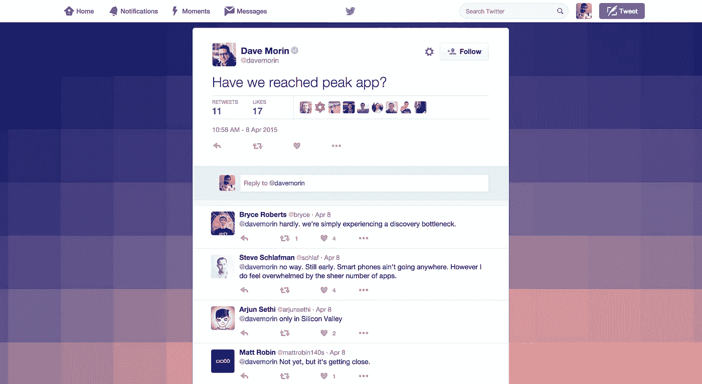
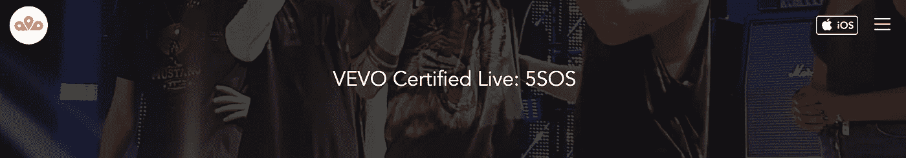
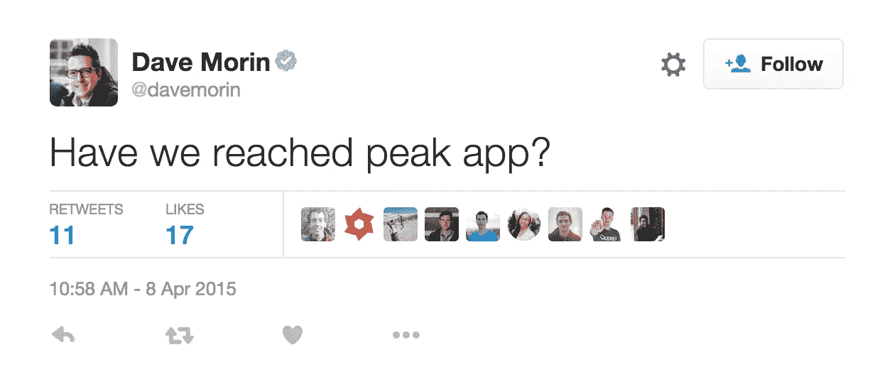

# 没人想要你的应用。

> 原文：<https://medium.com/swlh/nobody-wants-your-app-6af1f7f69cb7>

## 2015 年推出应用的经验教训

我们在 2015 年 3 月 4 日推出了 Momunt。我们很幸运地在[发布节](http://launchfestival.com)在数千人面前登台亮相，保证了我们的第一批 1000 名用户。第二天我们在[寻找产品](https://www.producthunt.com/tech/momunt-2)，在那里我们做得相当好，又多了几百个。最初几周一切看起来都很好。数字越来越多，所有的东西都向右上方移动。但是很快，我们的初始用户开始离开，注册新用户变得越来越困难。

## 我们的应用程序需要改进

首先，我想澄清一点，我不认为摩蒙特是完美的。我确实认为这很好，但是有很多问题阻碍了我们的发展。话虽如此，我认为所有新应用和技术创始人都会面临一些趋势。

## 橱窗购物的早期用户

我们最初的用户是技术狂热的早期采用者。分析显示，他们下载应用的频率似乎更多是为了测试 UX，而不是实际使用它。我不知道为什么我对莫蒙特有不同的期待。作为一家科技公司的创始人，我会尝试我听到的每一个新应用，但实际上我只在手机上使用 10-12 个应用。原来…我不是一个人。

## 如果不是尝鲜，那是谁？

如果技术早期采用者正在删除你的应用程序，你显然需要找到其他人来喜欢它并分享它。对我们来说，我们发现很多最初的牵引来自于通过 Momunt 创建的故事，这些故事展示了流行音乐会的所有视觉效果。

## 下载浏览量

这里有一个例子，它的浏览量和分享量比我们创建的时候多了数万次。当这一切发生时，我们非常激动！耶——人们喜欢我们的东西。

 [## VEVO 认证直播:5SOS

### 使用 Momunt 发现您周围正在发生的事情。查看从附近或任何地方实时共享的每张照片和视频…

www.momunt.com](http://www.momunt.com/W8V4SFnIlh) 

我们创作的每日故事产生了成千上万的浏览量。然而，我们并没有将这些浏览量等同于下载量。这太疯狂了——每 1000 个眼球，我们大概会有一次下载。

> 每 1000 次网络浏览下载一次。

## 你的漏斗一定是坏了

我们最初认为，浏览量和下载量之间的巨大差异肯定是一个设计缺陷。也许我们的行动号召不够好？所以我们改进了它:

这次更新对下载率没有任何影响。所以我们认为我们需要一种更简单的方法来找到下载按钮。我们在每页的右上角放了一个按钮:

零影响。

如果很难在网站上获得浏览量，这是有意义的——但是产生数以千计的网页浏览量感觉很简单。为什么没人下载？

可能是 app store 上的转化率吧？不，那是 53%。所以有一半的人去了 app store 下载，但是只有千分之二的人会点击！！？？！？！

## 匹克 App？

这条推文比一般的戴夫·莫林推文吸引的注意力少得多，但我一直无法将它从脑海中抹去。当我读那条推特的时候，我真的很纠结我能做些什么来让人们关注我们正在做的事情。

在这条微博发布的时候，莫林的公司刚刚发布了孔，我想知道，尽管有大量的媒体报道，他们是否也面临着比他们预想的更多的问题。

在这一点上，我觉得很有信心，尽管人们总是想要让他们的生活变得更好的服务——以应用程序的形式出现的服务的吸引力是不够的。

## 坊间传言

为了测试我们的理论，我们聘请了一名兼职营销人员，他管理着一个小型街头团队，向普通人询问关于应用程序的问题。总体结果是，几乎没有人想要一个应用程序。绝对没有人想要一个新的社交媒体应用。这表明了一个事实，即应用程序世界是如此臃肿，消费者不堪重负。消费者不知道他们应该拥有什么，什么不重要，什么重要，他们只是希望一切都更简单。人们希望用短信发送照片或将其发布到 Instagram 上——他们不需要新的解决方案。鉴于 Momunt 是一款社交媒体应用，我们知道我们必须做出改变。

## 品牌与应用

我们将很快宣布我们的官方重新发布和重新品牌化，但足以说它不会基于社交媒体应用程序——公司的成功也不会基于应用程序下载。人们只是不想要新的应用程序。他们希望来自品牌的新的和引人注目的服务足够吸引人，可以与他们的朋友分享。

前进。

像往常一样，你可以在 team@zeroslant.com 找到我

发表于*[**# SWLH**](https://medium.com/swlh)**(***《创业》、《流浪癖》、《生活黑客》)**

******