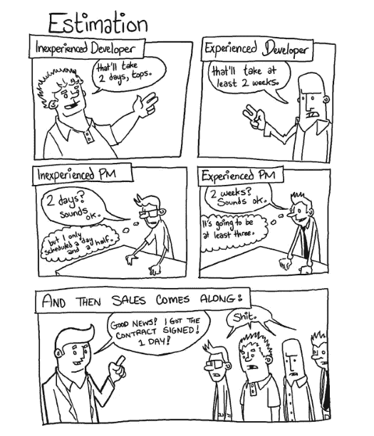
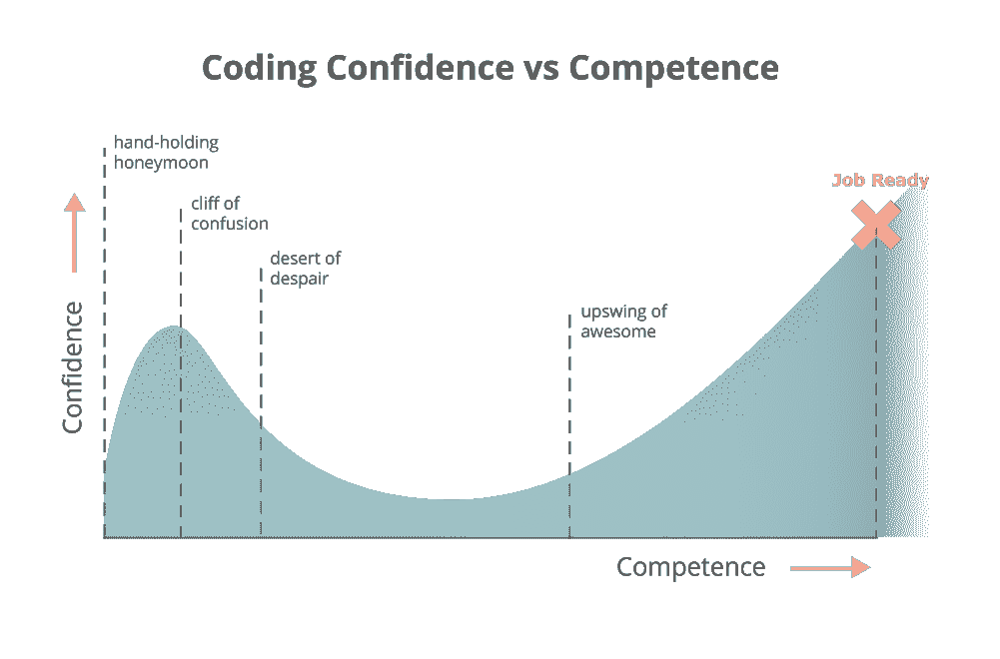

# 非科技创业者如果避免这 8 个错误，还是有机会的。

> 原文：<https://medium.com/swlh/non-tech-founders-still-have-a-chance-if-they-avoid-these-8-mistakes-a5ec94781c5>

## 99%非科技创业者创业失败背后的原因。

1999 年是音乐行业最重要的一年之一。音乐爱好者第一次可以在网上听他们喜欢的歌曲。历史被创造了。潘多拉创始人蒂姆·韦斯特格伦永远改变了音乐产业。他是一个在对技术一无所知的情况下追随自己热情的音乐家。

但这不正是所有成功故事的共同点吗——一个人以疯狂的热情去解决他/她痴迷的问题。

他的想法催生了一个新的音乐流类别，现在价值数十亿美元。

底线——你不一定要成为一个技术人员才能建立一个颠覆性的科技创业公司。唯一重要的是你解决问题的信念和热情。就是这样。

AirBnB 的布莱恩·切斯基(扰乱了酒店业)、戴尔的迈克尔·戴尔(扰乱了电脑)、Kickstarter 的扬西·斯蒂克勒(扰乱了融资)、LinkedIn 的雷德·霍夫曼、Pinterest 的埃文·夏普……他们都做过。不胜枚举。

在 [Indiez](http://www.indiez.io) ，我们与来自 20 个不同国家的 600 多位创始人交谈过，我们知道这些创始人正在做一些令人惊叹的事情。

最棒的是——即使他们对技术一无所知，他们也是不可阻挡的。他们解决问题的热情令人难以置信！

但是，让我们面对现实吧…创业是艰难的。任何告诉你不是这样的人都是在对你撒谎。

创业公司有生有死。每一天。成千上万。

总有一天你会发现自己崩溃了。最重要的是，没有技术背景会让它更具挑战性。

90%的创始人会在这种情况下辞职。但是剩下的 10%继续改变世界。

**在仔细观察了 100 家由非科技创始人创办的初创公司后，我们总结了一些常见错误。**

这是对初创公司创始人的真诚请求，以避免这些明显的错误。

我敦促你检查一下你是否正在做这些事情，然后花点时间去改正它们！

停下来一次。重新思考和校准，你还有时间去打破坚果壳，改变世界。

所以，开始了—

# 1.雇佣最便宜的开发人员

## 问题-

创始人通常不希望在创业的初始阶段投资开发资金，所以他们会寻找廉价的解决方案。有些人甚至以每小时 10 美元的低价从 Fiverr 或 Upwork 等平台上雇佣开发人员。

但是想想这样的开发者打造的是什么样的 MVP？印象深刻吗？

让我来告诉你一个糟糕的代码是什么样子——错误的递归循环——当一件事情解决了，另一件事情又中断了。

底线是，如果你的开发者很烂，你的产品也会很烂。没有人会使用一个有缺陷的产品，忘了付钱吧！

如果很烂，就卖不出去。要在这个竞争激烈的市场中获胜，你必须让你的用户惊叹。

## 解决方案-

一个好的工程师总是自己测试他们的产品，并写出非常干净的代码。所以不要在这点上妥协。

如果你还没有准备好理解你的开发人员所需要的技能，让他们接受专家的面试。你可以在[的导师](http://www.codementor.com)上找到这样的专家。

深入到他们过去的工作经历中去了解他们能做什么。Hackerank 可能是寻找合格开发人员的好地方。

此外，努力深入了解他们过去的工作经历。就他们以前的项目提出正确的问题——你是如何建立的？你用了什么技术？你为什么用那种技术？最大的挑战是什么？你花了多少时间？您如何评价代码质量？对你来说，修改代码有多容易？

如果招聘似乎是一个挑战，你可以让像 [Indiez](http://www.indiez.io) 这样的公司来打造你的 MVP。

# 2.微观管理工程师

## 问题-

设定无法实现的截止日期，总是不知从哪里冒出来紧急任务，不断要求更新——这些都是工程师讨厌的事情。

微观管理不好。

作为一名创始人，你总是有很高的期望和巨大的目标要实现。但不要让这种情况让你和你的技术团队发疯！

理解开发需要时间。你不像他们那样理解技术。

你对控制的持续需求甚至会降低他们的效率。

## 解决方案-

沟通是关键。

建立每日站立和每周会议的程序。随时了解前一天的任务、当前的挑战和当天的里程碑。使用[解决方案-](https://medium.com/u/4fecc4c082c#！@$!$!#!#….
<h2 id=)

[要明白，只有当你有合适的资质和浓厚的兴趣时，你才能学会编程。](https://medium.com/u/4fecc4c082c#！@$!$!#!#….
<h2 id=)

[为了开发你的产品，你需要一个能处理复杂问题的人。为此，要么雇人，要么外包给 IT 公司(看看 Clutch.co)或像](https://medium.com/u/4fecc4c082c#！@$!$!#!#….
<h2 id=) [Indiez](http://www.indiez.io) 这样的平台。

但一定要了解基本知识。网上有很多很好的资源，我推荐你从斯坦福大学的[计算机科学 101](https://lagunita.stanford.edu/courses/Engineering/CS101/Summer2014/about) 课程开始。另外，这里有一篇小的有用的文章[来理解后端概念](https://hackernoon.com/the-non-techies-guide-to-servers-af1fa3dbf7d8)。此外，Intercom 还有一个博客，让[了解技术基础，以便更好地与团队](https://www.intercom.com/blog/talking-tech-with-non-tech-people/)沟通。

# 4.雇佣那些不认同愿景的人

## 问题—

一个成功的创业公司是由一群愿意走出自己的方式，解决问题和提出想法的人创建的。

因此，仅仅根据技能来招聘不会符合预期。

不要雇人只为你写代码。他们应该关心你在建设什么，你在解决什么问题。

如果他们没有连接到视觉，他们将不会在坏的时候与你在一起。创业公司一直都有不景气的时候。

## 解决方案—

**规划长远**。雇佣一个对你正在建造的东西感兴趣的人。当你雇佣和你有相同信念的人时，他们会为了你们共同的目标竭尽全力。

这才是创业成功的真正驱动力。如何检查信仰？问他们为什么要加入你？他们在业内有类似的经历吗？他们对这个行业有什么看法？

# 5.我会找一个科技联合创始人来免费建造它

## 问题—

你认为找到一个技术上的联合创始人是建立你的产品的最好的解决方案吗？考虑提供股权以换取免费的产品？

如果是的话，那么按下刹车，因为你不能冲进这样的事情！

想一想，如果这种伙伴关系不太好，或者如果共同创始人没有相同的愿景或不够热情，会发生什么。你会糊涂的！

## 解决方案—

一家科技公司确实需要一名首席技术官，但这并不是首要目标。

把寻找你理想的 CTO 想象成寻找你的生活伴侣。放弃匆忙或省钱的诱惑，先看看这是不是一个好的搭配！

建立第一个版本，然后开始向潜在的技术联合创始人推销。花时间和他们在一起，和他们一起工作，然后再做决定！陈楚翔写了一篇关于寻找科技联合创始人的精彩博客。

# 6.身居高位

## 问题—

你是不是假设你和团队沟通的很好，然后看到最后的结果就失望了？

当涉及到构建产品时，你不能含糊地描述你想要什么。你的交流需要切中要点，详细而清晰。

模糊的草图，从其他应用程序复制的设计模型，要求在应用程序中重新创建，不定义用户的旅程——都是与团队沟通的低效方式。

## 解决方案—

你不需要成为技术专家来编写好的用户故事，使开发任务变得容易。这里有一个写用户故事的[指南](/of-all-things-tech-progress/user-stories-the-practical-way-497c80489e27)可能会有所帮助。这里有一个在开发之前创建的项目文档的[示例。这些看起来似乎很难管理，但从长远来看，它们有助于设置有助于避免技术债务的过程。](https://arkenea.com/Arkenea%20-%20Sample%20FS.pdf)

使用 Proto.io 和 Zeplin 等工具创建线框和模型。

# 7.觉得自己不知所措

## 问题—

仅仅因为你的产品非常依赖开发人员/技术团队，你可能会感到不知所措。毕竟，他们才是构建 IP 的人。对吗？

不对。

## 解决方案—

你作为创始人的技能——你推销愿景、获得第一批付费客户、建立和扩大团队的能力同样重要。永远不要认为自己不知所措，要控制局面，这样你就永远不会处于妥协的境地。

**始终拥有代码，并确保您可以访问您所有的数据库/账户。自己获得一个 Github 帐户，并要求开发人员对该帐户做出承诺。AWS(服务器)和其他账户也是如此。**

# 8.只雇佣一个开发人员

## 问题—

你可能认为雇佣一个优秀的开发人员是不费吹灰之力达到目标的简单方法:你节省了成本，结果符合你的期望。

但是孤注一掷是有风险的！

不仅如此，唯一的开发人员还要处理大量的任务，过度疲劳，并有可能精疲力竭。

## 解决方案—

一个解决办法是，如果你负担得起，雇佣第二个开发者。它加速了你的发展，增强了团队精神，在一定程度上消除了依赖性。

另一个解决方案是开始与外部机构/合作伙伴合作来开发你的技术。这样，您就不需要处理决定需要多少资源或在早期管理它们的麻烦。

这些错误中有没有阻碍你实现目标的？你是做决定的最佳人选。

犯错是任何成长过程的一部分。但是，最好能及早识别并纠正。话虽如此，但完成事情的唯一方法就是开始！准备好了吗？

现在出去吧。大胆尝试，大胆挑战。

如果你想解决一个问题，你没有理由找不到解决方案。

你建立想法的热情和信念是你所做的一切的核心。从数据中学习，继续前进。

**让我们建造令人敬畏的。🙌**

在 [Indiez](http://www.indiez.io?utm_source=Blog&utm_medium=medium_bottom_inline_link&utm_campaign=8%20steps%20to%20become%20a%20successful%20non-tech%C2%A0founder.&utm_content=non_tech) ,我们努力管理来自谷歌、脸书、优步、Spotify、Booking.com 等公司的 1%顶尖科技人才。

加入 100 多位与 [Indiez](http://www.indiez.io?utm_source=Blog&utm_medium=medium_bottom_inline_link&utm_campaign=8%20steps%20to%20become%20a%20successful%20non-tech%C2%A0founder.&utm_content=non_tech) 一起打造成功产品的了不起的创始人。

## [在此了解更多关于我们的信息— Indiez.io](http://www.indiez.io?utm_source=Blog&utm_medium=medium_bottom_inline_link&utm_campaign=8%20steps%20to%20become%20a%20successful%20non-tech%C2%A0founder.&utm_content=non_tech)

