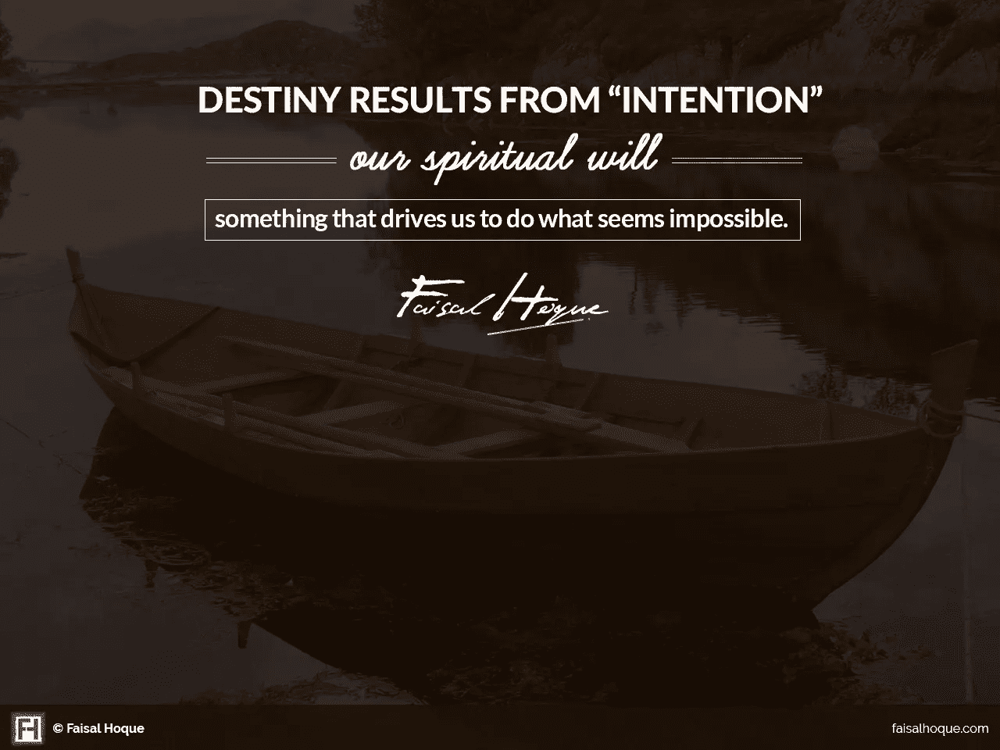

# 不是生活中的每一课都能学到，有些是必须经历的。

> 原文：<https://medium.com/swlh/not-every-lesson-in-life-can-be-learned-some-have-to-be-lived-cc16095e8e79>

[Photo by [Denys Nevozhai](https://unsplash.com/photos/z0nVqfrOqWA?utm_source=unsplash&utm_medium=referral&utm_content=creditCopyText) on [Unsplash](https://unsplash.com/search/photos/traveler?utm_source=unsplash&utm_medium=referral&utm_content=creditCopyText)]

## 生活发生在试图让它发生和让它发生之间。

> 小时候，我目睹了战争和饥荒。作为一名大学生，我在大夜班当门卫；作为 90 年代初以来的连续创业者，我一直在创新、技术和全球商业的前沿世界旅行；做了二十年的作者，我一直在探索科学与人文的交集；作为一名旅行者，我怀着无比感激的心情环游世界。

我们都有故事。那是 1986 年 8 月。从孟加拉来的时候，我刚刚结束了在 SIU 大学的第一个夏季学期。我 17 岁，是工程学院的学生。在支付了夏季和秋季的学费后，我有 700 美元来生存，接受教育，并继续我的生活！我的新美国朋友建议我向校园“清洁工程”的“艺术和科学”自我介绍——如果想生存的话，要快！我值夜班。我非常擅长擦地板(考虑到我的强迫症)，不久我就被要求打扫大学官员的办公室。这是我“成年”开始的地方。[阅读更多>](https://faisalhoque.com/corridors-of-carbondale/)

在人生的旅途中，会有许多相遇。有些是计划好的；有些是偶然的；有些是因为神的干预。80 年代中期的 3 月 16 日，17 岁的我离开了家。虽然，一个十几岁的孩子在这个年龄离开家去上大学没什么不寻常的，但多年后，当我在这个特殊的日子写这篇博客时，我不禁对那段旅程中发生的事情心存感激。 [**阅读更多>**](https://faisalhoque.com/2008/07/12/chance-encounters/)

当我还是个孩子的时候，我想成为一名企业家、工程师和发明家。从少年时代起，我就一直热情地追求这个梦想。19 岁时，我在明尼苏达大学学习时开发了他的第一个商业软件产品，然后在 Pitney Bowes 和 Dun & Bradstreet 担任管理职务。1991 年，Pitney Bowes 在完成他的本科学位之前招募我加入他们在 R&D 的一个小组。

1994 年，通用电气聘用了我，当时我是该公司最年轻的技术高管之一，他利用我在一家初创公司的创新，发起了业内首批综合性 B2B 电子商务业务。

作为一名连续创业者，我已经从天使、战略合作伙伴和机构投资者那里筹集了风险资本，为我的创新型企业对企业创业提供资金。像一些创始人一样，我也从自己公司的 CEO 职位上被赶了下来，并在一次又一次的衰退中幸存下来。不管情况如何，我从未放弃我的创业精神。

我还担任过各种角色，包括首席执行官、董事会主席以及 F500 董事会和管理层的顾问。我与跨行业、私营和公共部门的全球品牌建立了客户/合作伙伴/合资企业/业务转型关系，如通用电气、万事达卡、美国运通、诺斯罗普·格鲁曼、百事可乐、IBM、家得宝、网景、印孚瑟斯、法国社会保障服务、Gartner、Cambridge Technology Partners、摩根大通、CSC 等。

我当时没有意识到的是，我会从写作中获得多少个人满足感。对我来说，写作是那些快乐的发现之一，它帮助我更好地与我的目标、我的世界和我自己联系起来。

十年前，当我开始写作时，我被我的企业激励着去建立思想领导品牌。但这些年来，随着我越来越深入写作，最大的满足感来自于为自己写作，来自于内心。[安妮·弗兰克](http://en.wikipedia.org/wiki/Anne_Frank)曾经说过，“我可以在写作时摆脱一切；我的悲伤消失了，我的勇气重生了。”

我不是安妮·弗兰克，但我肯定能理解她的感受。写作是为自己和他人寻找灵感的一种方式。就像你不必成为一名厨师去[给自己做饭](http://www.businessinsider.com/cooking-can-boost-your-creativity-2014-3)一样，你也不必成为一名职业作家去获得写作的好处。

我写过几本书，包括 [*万物互联——如何在创意、创新和可持续发展的时代转型和领导*](http://everythingconnectsthebook.com/) 和 [*生存并茁壮成长——有韧性的企业家、创新者和领导者的 27 种实践*](http://survivetothrive.pub/) *。*我定期给 [*快公司*](http://www.fastcompany.com/user/faisal-hoque)*[*商业内幕*](http://www.businessinsider.com/author/faisal-hoque)*等投稿。我的作品还出现在《华尔街日报》*、*、*商业周刊*、*福克斯、哥伦比亚广播公司、金融时报、兼并&收购、福布斯*、*卓越领导力、赫芬顿邮报*以及其他出版物上。**

## **以下是我一路走来必须学习的 12 条重要经验(排名不分先后):**

****1。** ***生活中没有什么是完美的*** 。如果我们不能接受和赞美不完美宇宙的本质，那么，作为领导者，我们忽视了有才华的人；作为企业家，我们忽略了机会；作为专业人士，我们没有做出贡献；作为人，我们不会带着感激生活。**

****2。**科学和技术之间有一条分界线，基础人文学科或所谓的“软技能”必须站出来——批判性思维、沟通、**、T39【移情、正念、弹性、决策、自我意识、** 等。—让我们成为更好的领导者的技能。**

****3。**在波涛汹涌、无人可援的时候， ***是我们的技能拯救了我们*** 。掌握我们的技能需要全心投入。只有通过每天的投入，我们才能提高我们真正的手艺。奉献是我们最好的可持续自我投资。**

****4。一次做一件事会带来更高的质量，而且在很多情况下，会带来更快的产出。不要试图一心多用，而是练习一次专注于一件事。 ***“单挑”是一个值得开发的技能*** 。活在当下并不意味着我们不关心未来。****

****5。** ***无所畏惧的行动往往意味着进入未知的领域*** ，挑战常规路径，或者抛开对安全和舒适的需求。我们哪里来的精力这样做？通常来自我们真实的目的——我们生活中的个人召唤。**

****6。** ***我们尝试的事情越多，就越有可能失败*** 。这是人类的本质。失败和逆境必然会带来痛苦、折磨和失望。接受痛苦并在痛苦中成长是我们成长的一部分。**

****7。**无论我们做什么，在哪里做，或者我们创造得有多好，没有合适的人在身边，我们不会成功*。***

*****8。T21 说不比说是需要更多的勇气。但是如果我们这样做了，我们就能保护自己不做出错误的决定。“不”帮助我们保持专注，防止不必要的复杂性和错误的转向。它让我们避免和错误的人交往。*****

***9。 ***重要的是避开那些让我们堕落*** 的人，浪费我们的时间，带我们倒退，对我们的苦难没有同理心。我们必须刻意地花时间和那些提升我们、让我们变得更强大的人在一起。***

****10。** ***灵感可以来自任何地方和任何人*** 。我的经常来自[做饭](http://www.fastcompany.com/3044691/work-smart/an-unconventional-and-delicious-way-to-be-more-creative)，写作，听音乐，冥想，或者看电影。**

****11。** ***让自己曲折一点，拥抱偶然。*** 没什么浪费的奢侈品。把它想象成驾驶一辆汽车而不用担心目的地——你只是在路上享受风景、场景和气味；注意它们，你会开始知道你要去哪里。**

****12。** ***有时候无知是成就大事的重要前提。我们可以通过承认这是一个我们刚刚涉足的复杂甚至不透明的世界来巧妙地无知。因此，初学者的思维可能是一种资产。但是只有当你采取正确的方法——避免消极的模式——去创造一个新的开始。*****

**最重要的是，我必须学会生活发生在试图让它发生和让它发生之间 。正如一句古老的民间谚语所说，如果你把绳子拉得太紧，它就会断。如果你把它拉得太松，拨弦时它就不会发出音乐。在你开始做新的事情之前，调整你的期望。要知道，结果仍然可能达不到你的理想，但仍然可以算作成功。**

**快乐小径我的朋友们…**

****版权所有 2018，作者费萨尔·霍克。保留所有权利。****

**我是一名[企业家和作者](http://faisalhoque.com/speaking/)。[沙多卡](http://shadoka.com/)等公司创始人。Shadoka 让抱负成为领导、创新和变革的动力。Shadoka 的加速器和解决方案汇集了管理框架、数字平台和思想领导力，以实现创新、转型、创业、增长和社会影响。**

**著有《 [*万物互联——如何在创意、创新和可持续发展的时代转型和领导》*](http://www.amazon.com/Everything-Connects-Creativity-Innovation-Sustainability/dp/0071830758/ref=sr_1_1?ie=UTF8&qid=1376488798&sr=8-1&keywords=everything+connects%2Bfaisal+hoque) 》(麦格劳·希尔)和《 [*生存并茁壮成长:弹性企业家、创新者和领导者的 27 种实践*](http://survivetothrive.pub/) 》(励志出版社)。在推特上关注我。*免费使用* [*万物互联*](http://app.everythingconnectsthebook.com/login.php) *领导力 app 和* [*生存茁壮*](http://app.survivetothrive.pub/login.php) *弹性 app。***

****

## **这篇文章发表在 [The Startup](https://medium.com/swlh) 上，这是 Medium 最大的创业刊物，拥有+368，366 名读者。**

## **在这里订阅接收[我们的头条新闻](http://growthsupply.com/the-startup-newsletter/)。**

****