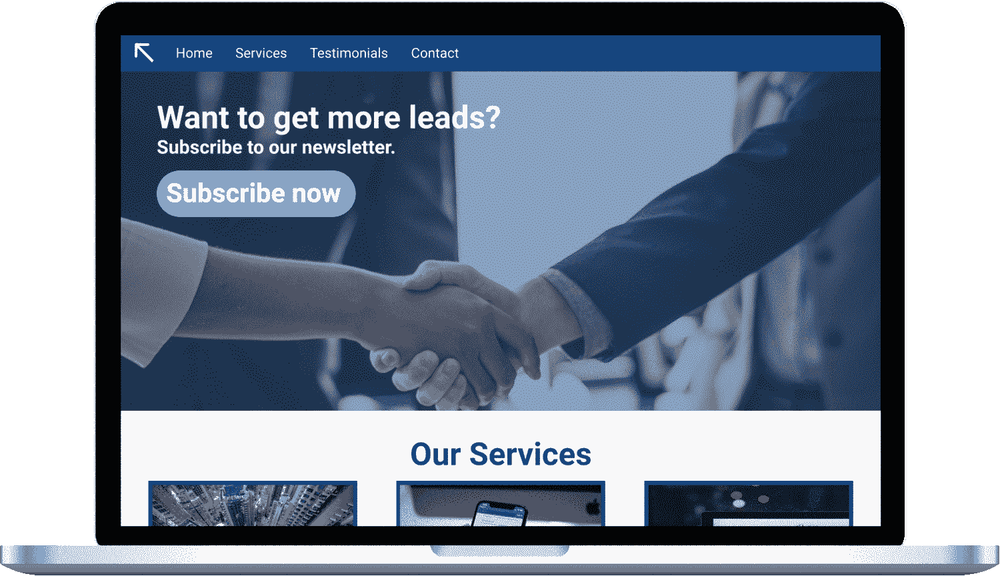
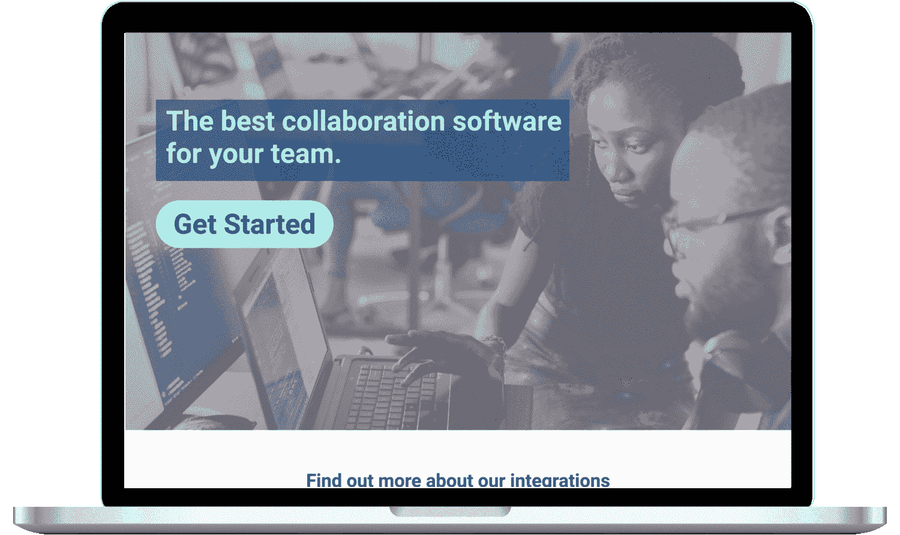
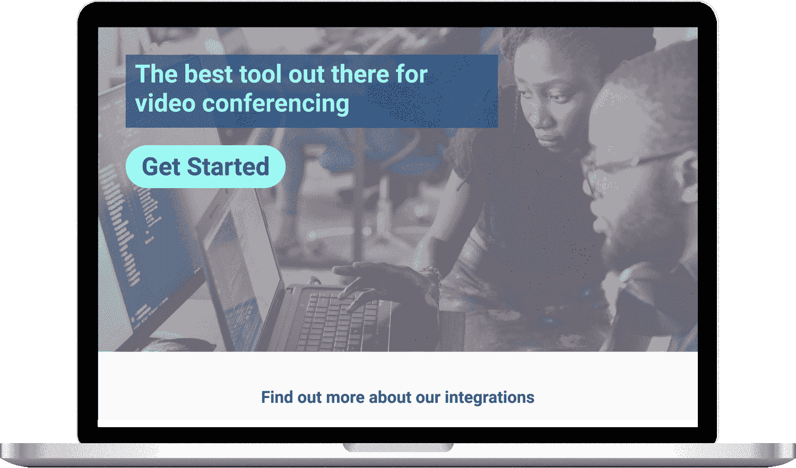

# 不仅仅是科技巨头:UX 的下一个大浪潮是个性化

> 原文：<https://medium.com/swlh/not-just-for-tech-giants-the-next-big-wave-in-ux-is-personalization-72d606b32fec>

Photo by [Headway](https://unsplash.com/photos/5QgIuuBxKwM?utm_source=unsplash&utm_medium=referral&utm_content=creditCopyText) on [Unsplash](https://unsplash.com/search/photos/user-experience?utm_source=unsplash&utm_medium=referral&utm_content=creditCopyText)

网飞、脸书和亚马逊有什么共同点？他们都押注于个性化来改善他们的用户体验。他们也有大笔资金和海量数据。这使得他们能够为自己的个性化需求开发高度定制的机器学习算法。这给小公司带来了什么？个性化对我们大多数人来说只是一个难以实现的目标吗？不再是了。像[这样的公司，除非](https://unless.com/?utm_source=thestartup&utm_medium=medium&utm_content=uxblog)正在创造公平的竞争环境，让这种转换优化技术更容易获得。让我们看看个性化是如何改变 UX 的，并列出一些你可以应用的实际例子。

# **个性化和 UX，我们将走向何方？**

在一个家用电器会说话的世界里，我们已经如此习惯于包含个性化的应用程序，以至于它几乎已经被遗忘了。我们不再寻找新的电影和电视剧，我们期待推荐。我们不需要寻找在我们地区参加的活动，我们在脸书墙上就能看到。购买新的东西是轻而易举的事，因为我们总是能得到我们感兴趣领域的产品建议。这就是为什么访问一个不符合你需求的网站会令人不快。如果默认内容不好把握，摩擦程度就更高了。网站个性化可以解决这个问题，以及其他 UX 问题。

直到最近，个性化还主要存在于科技巨头的领域，但随着云计算的快速发展，基础设施成本的降低，以及新的 SaaS 提供商进入该领域，较小的公司实施这项技术变得更加容易。让我们探讨几个个性化如何改善用户体验的例子。

# **排除杂念**

如果有人通过电子邮件进入你的页面，你需要做的最后一件事就是让他们注册订阅你的时事通讯。很有可能，他们已经做了。使用个性化技术，您可以消除这种干扰，提供更干净、更相关的体验。最精彩的部分？使用 UTM 参数只需几分钟就能实现。如果一个人点击了带有 *UTM 来源=电子邮件*的链接，你可以设置一个条件并移除你想要隐藏的元素。

# **让网站访问者沿着漏斗向下移动**

为了跟进上面的例子，您可以利用个性化技术来更明智地使用房地产。除了显示时事通讯注册选项，你可以优先显示最近的公告，推广新产品，或者引导访问者进入漏斗。毕竟，如果有人已经选择接收你的电子邮件，可以肯定他们对你公司的产品感兴趣。个性化可以帮助你让你的 UX 更聪明，过滤更多的线索。

Change CTAs to steer visitors down the funnel

# **降低跳出率**

根据尼尔森诺曼集团的研究，用户经常在 10-20 秒内离开网页。这是一个非常短的时间让别人内化你的品牌的价值主张。如果你正在努力解决关键登录页面的高跳出率问题，个性化会有所帮助。从分析这些页面的流量来源开始。哪些网站向你推荐流量，流量来源能告诉你被推荐访客的哪些信息？分析每个推荐人吸引了什么样的访问者，并为他们创建受众档案。然后针对每个概要创建页面个性化。

让我们看一个例子。假设您为开发人员和营销人员提供协作软件。你的一些网络流量来自像 StackOverflow 和 Github 这样的网站。为了降低来自这些网站的访问者的跳出率，实现针对开发者的个性化。改变你推销产品的方式，关注它的技术方面，突出对编码人员重要的特性。你可以对营销人员中流行的推荐来源做同样的事情。

Tweak your product pitch to appeal to different audience segments

# **促进广告活动的转化**

Google Ads 平均转化率为 [2.70%](https://www.growthpoint.info/adwords-benchmarks/) 。这是非常低效的，但是如果你有一个精细的广告设置，试图用 A/B 测试来优化转化率同样是无效的。个性化提供了一个更好的方法，允许你改善广告和登陆页面之间的对称性。

坚持上面的例子，如果你销售协作软件，并运行谷歌广告来突出你的产品的不同功能，你可以动态地将广告的搜索查询(比如视频会议与合作写作)注入到登录页面中，以最大化相关性并提高你的转化率。

Highlighting product features based on ad search queries

# **准备好开始了吗？**

这些只是个性化如何改善用户体验的几个例子，你不需要网飞的资源来实现它们。你可以从谷歌分析和谷歌广告等基本工具中的数据开始试验这项技术。如果你准备好应用个性化或者想了解更多，[给我写信](mailto:gquintan@chirppoint.com)。

## 这篇文章发表在[《创业](https://medium.com/swlh)》上，这是 Medium 最大的创业刊物，有+ 374，357 人关注。

## 在这里订阅接收[我们的头条新闻](http://growthsupply.com/the-startup-newsletter/)。

