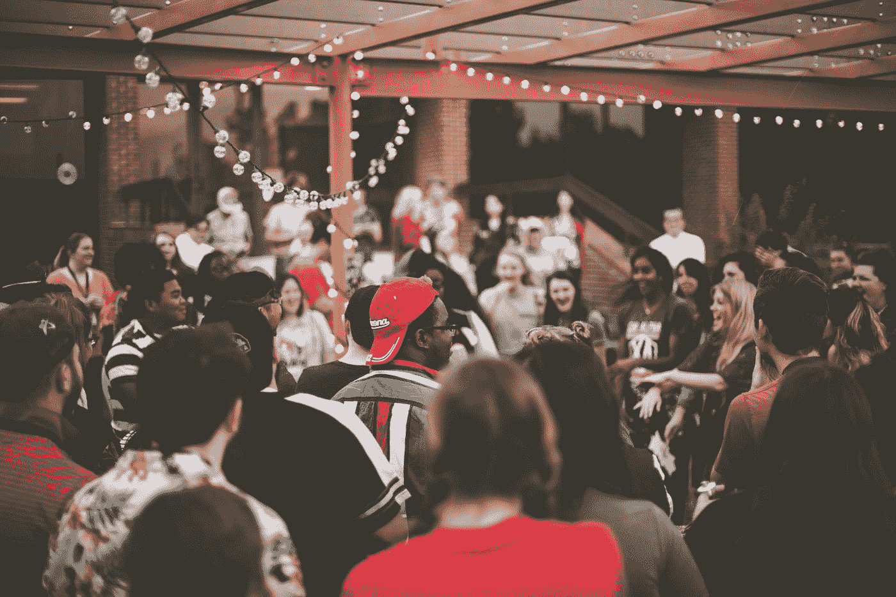

# 不一定是最好的，但无疑是最受欢迎的

> 原文：<https://medium.com/swlh/not-necessarily-the-best-but-undoubtedly-the-most-popular-cd10f27df1de>

## 根据你的说法，那是…

> 我们将一起离开，
> 但仍然是永别了
> ，也许我们会回到地球
> ，谁知道呢？
> 我想没有人应该受到责备
> 我们要离开地面(离开地面)
> 一切还会像从前一样吗？

这是新年的最后倒计时。**显然，它将被称为 2019 年**。不是一个很有创意的名字，但是嘿！至少我们是一致的。

虽然我真的被岁月、年龄的象征意义以及我们对时间的总体感知迷住了，但我不得不把它留给以后的文章。

# 我今年最好的决定

2018 年加入 Medium。这可能是我今年做的最好的决定。它帮助我重新获得控制，恢复清晰。
可以肯定地说，我今年大部分时间都在 [**媒体**](/@saaroron) 上创作内容，最近还在 [**Youtube**](https://www.youtube.com/channel/UC4211nC0IOB0FS6eGWM7x7g) 上创作内容。对于这一内容，我心中只有一个使命:**帮助你开始或继续你的自我实现之旅**。如此简单，有时却又如此困难。

我还花了大量时间追求我的其他爱好，比如创作我的音乐《T21》和为别人创作音乐。

这一年中我几乎每天都做的一件事就是反思和观察。就像我在最近的一篇文章中建议的那样，我认为我们都应该花时间反思我们的生活，而不仅仅是在每年的年末。通过这种方式，我们可以真正定义和关注对我们有意义的东西，同样重要的是，什么是没有意义的。

# 无疑是最受欢迎的

为了庆祝我迄今为止的旅程，我决定分享我在 Medium 上最受欢迎的十篇帖子。根据你的掌声，这是！

[**10。为什么 0 美元从来不是真正的‘免费’**](/swlh/why-0-is-never-really-free-250ba824f65f)**(2018 年 728 次鼓掌)**

** [## 为什么$0 永远不会真正“免费”

### 免费的价格太贵了

medium.com](/swlh/why-0-is-never-really-free-250ba824f65f) 

___________________________________________________________________

[**9。我就是这样发现了自己的超能力**](/swlh/this-is-how-i-discovered-my-superpower-b2f1a67fb100)**(2018 年 768 次鼓掌)**

** [## 这就是我如何发现我的超能力的

### 以及如何找到你自己的！

medium.com](/swlh/this-is-how-i-discovered-my-superpower-b2f1a67fb100) 

___________________________________________________________________

[**8。朝九晚五？更像是七比七！**](/swlh/nine-to-five-more-like-seven-to-seven-580ebbae47a4)**(2018 年 774 次鼓掌)**

** [## 朝九晚五？更像是七比七！

### 为什么你可能一天工作超过 12 个小时

medium.com](/swlh/nine-to-five-more-like-seven-to-seven-580ebbae47a4) 

___________________________________________________________________

[**7。这就是创业者与大多数人不同的地方**](/swlh/this-is-what-differs-entrepreneurs-from-most-people-7303ad592d9f)**(2018 年 802 拍手)**

** [## 这就是企业家与大多数人的不同之处

### 对创业的误解

medium.com](/swlh/this-is-what-differs-entrepreneurs-from-most-people-7303ad592d9f) 

___________________________________________________________________

[**6。此生找到自己足够的重要性**](/swlh/what-happens-when-you-find-your-enough-in-this-lifetime-65fdc4844aa6)**(2018 年 993 拍手)**

** [## 在这一生中找到你自己的足够的重要性

### 当你认为极简主义是一种饮食时会发生什么

medium.com](/swlh/what-happens-when-you-find-your-enough-in-this-lifetime-65fdc4844aa6) 

___________________________________________________________________

[**5。另一个 Declutter 似乎没人在说**](/swlh/the-other-declutter-no-one-seems-to-be-talking-about-4c8e20757752)**(2018 年 1014 次鼓掌)**

** [## 另一个似乎没人谈论的整理者

### 以及删除脸书朋友会如何改变你的生活

medium.com](/swlh/the-other-declutter-no-one-seems-to-be-talking-about-4c8e20757752) 

___________________________________________________________________

[**4。不要只是接受失败，要期待失败！**](/swlh/dont-just-accept-failure-expect-it-6b23d798fa4c)**(2018 年 1100 次鼓掌)**

** [## 不要只是接受失败，要期待失败！

### 说真的。这是必然会发生的。

medium.com](/swlh/dont-just-accept-failure-expect-it-6b23d798fa4c) 

___________________________________________________________________

[**3。我家外面有个无家可归的人**](/@saaroron/there-is-a-homeless-person-outside-my-house-1df730c9e32f)**(2018 年 1241 次鼓掌)**

** [## 我房子外面有一个无家可归的人

### 我不知道该怎么办

medium.com](/@saaroron/there-is-a-homeless-person-outside-my-house-1df730c9e32f) 

___________________________________________________________________

[**2。有钱，其他都穷**](/swlh/rich-in-money-poor-in-everything-else-b849beedbcb)(2018 年 1284 次鼓掌)

 [## 有钱，其他都很穷

### 我为千万富翁工作时发生了什么

medium.com](/swlh/rich-in-money-poor-in-everything-else-b849beedbcb) 

___________________________________________________________________

[**1。为什么拥有 0 美元比拥有 1 美元好得多**](/swlh/why-having-0-is-much-better-than-having-1-15729410c2d1)**(2018 年 3854 次鼓掌)**

** [## 为什么拥有 0 美元比拥有 1 美元好得多

### (或 5 美元，或 100 美元)

medium.com](/swlh/why-having-0-is-much-better-than-having-1-15729410c2d1)** 

# **以下是 2019 年你可以从我这里期待的**

**知道我帮助人们在生活中做出积极的改变绝对是**我生命中最有收获的事情之一。我想分享我未来的创作计划。我认为解释这一点的最佳方式是分享我 2018 年的最后一篇文章(除了这篇)..)中，我写了我为什么创建我的内容以及我的目标是什么:****

** [## 这就是我早上起床的原因——萨尔·oron⁦⁦👈-中等

### 我相信我们都能从彼此身上学到难以置信的经验。不论年龄、性别、种族或宗教，每个…

medium.com](/swlh/this-is-why-i-get-up-in-the-morning-f648a9ec6e67)** 

## **如果你喜欢我的任何文章或视频，并愿意支持我的创作——你所要做的就是在[媒体](/@saaroron)和/或 [Youtube](https://www.youtube.com/channel/UC4211nC0IOB0FS6eGWM7x7g) **:** 上关注我**

** [## 生命的迹象 Youtube 上的萨尔·奥龙

### 生命的迹象是一个由萨尔奥龙创立的频道，其唯一的使命是:创造高质量的视频来帮助你开始或继续…

www.youtube.com](https://www.youtube.com/channel/UC4211nC0IOB0FS6eGWM7x7g)  [## 萨尔·oron⁦⁦👈-中等

### 阅读萨尔·oron⁦⁦的作品👈在介质上。创建内容的唯一使命是:帮助你开始或继续你的…

medium.com](/@saaroron) 

## 这篇文章发表在 [The Startup](https://medium.com/swlh) 上，这是 Medium 最大的创业刊物，拥有+404，714 名读者。

## 订阅接收[我们的头条新闻](http://growthsupply.com/the-startup-newsletter/)。

******************