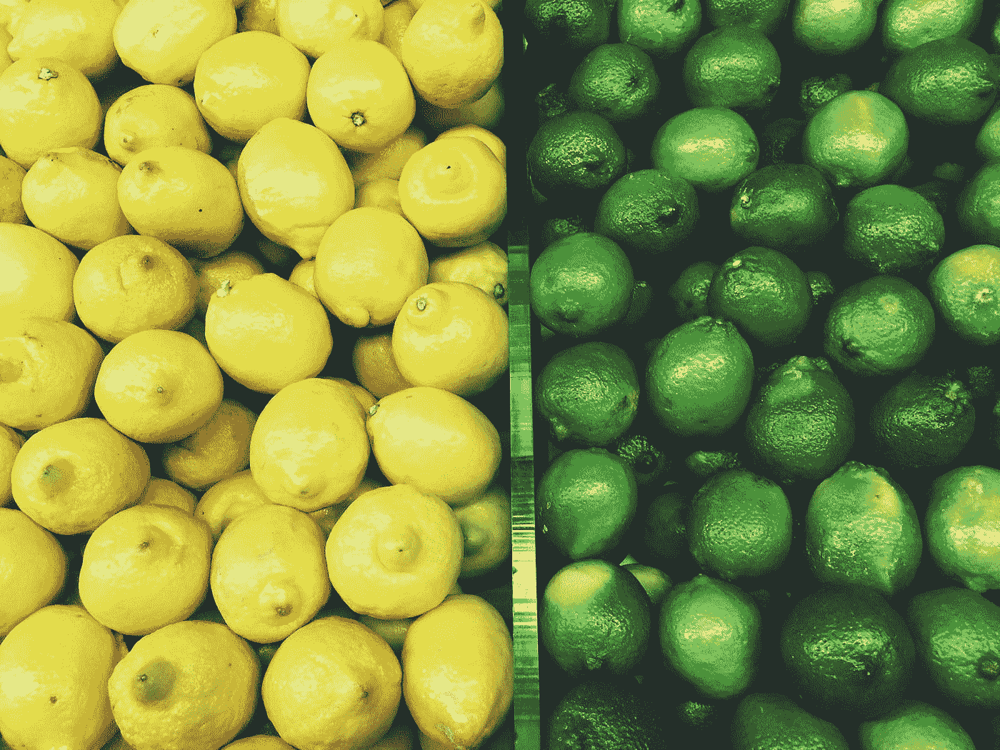

# 没有什么是通过简单的选择实现的

> 原文：<https://medium.com/swlh/nothing-is-achieved-through-easy-choices-512784230aba>

## 为什么你需要努力工作以获得巨大的成果

“lemon and lime lot” by [Jon Tyson](https://unsplash.com/@jontyson?utm_source=medium&utm_medium=referral) on [Unsplash](https://unsplash.com?utm_source=medium&utm_medium=referral)

柠檬和酸橙的区别很容易发现。一个是黄色的，另一个是绿色的。它是如此简单，以至于我们几乎不需要考虑它。

但是生活和商业的巨大差异并不那么简单。它们可能涉及复杂、令人恐惧、不舒服和无法抗拒的…