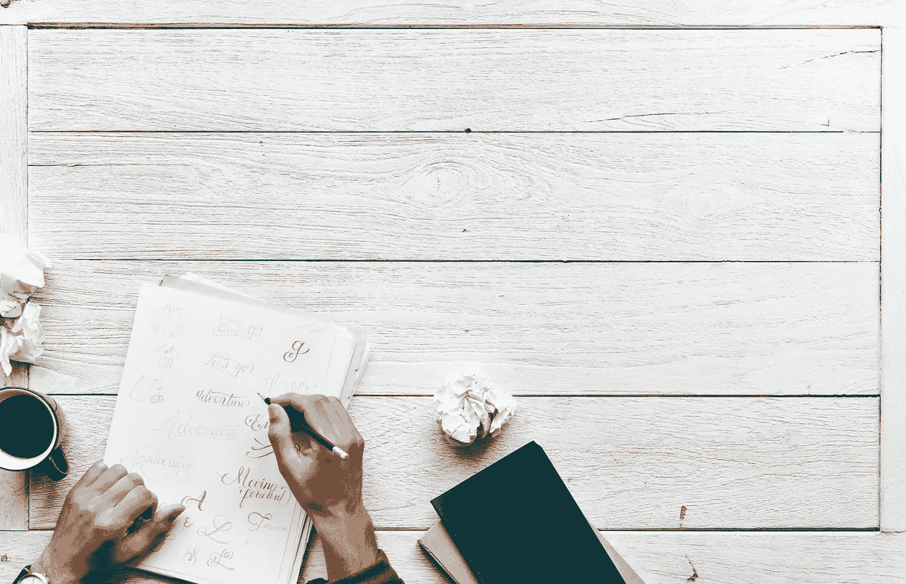

# 现在是开始思考 2019 年个人目标的最佳时机

> 原文：<https://medium.com/swlh/now-is-the-best-time-to-start-thinking-about-2019s-personal-goals-a1c133fe83c>

现在是开始考虑明年个人目标的好时机。以下是对我有效的方法:

1。从工作中抽出一些时间，让你的欲望和日常任务之间保持一定的距离。(求隐居；几乎没有互联网。)

2。回顾过去一年的目标，祝贺并奖励自己已经实现的目标。(说真的，做有意识的决定去买/去/做你真正想要的东西。)

3。对于还有机会的目标，12 月是你最后的冲刺，让它有价值吧！(这就是为什么这是一年中专注于目标的最佳时机。)

4。反思失败的目标，决定他们失败是否可以，或者他们是否不应该失败。(对我来说，“可以有失败的目标”通常是那些我在开始时信息有限和缺乏远见的目标；如果我因为能力不足而失败，那么我会把这些作为下一年的学习重点。)

5。考虑重新分配一些失败的目标，作为下一年新的(和更新的)目标。

6。退一步，我的意思是，真的退很远；问问自己生活中想要什么，你认为真正重要的是什么。(我这样反思:“我多么想在这个地球上度过我的 33 岁，让我最后没有遗憾。”)

7。目标可能是地球上最个人化的东西。正因如此，它们必须是关于 ***你的*** **核心**。所以我审视自己的核心技能、核心知识、核心兴趣和核心激情。(我也会考虑我在这个行业中有哪些“不公平优势”,以及如何设定目标来利用它们)

8。用笔和纸。慢慢地、有意识地写，用你最好的笔和最好的手写。(这个真的管用，很可能是因为；你投入的时间和精力越多，这个文档就越有价值。把它当成你的“大宪章”。)

9。使用像 S.M.A.R.T(具体、可衡量、可实现、现实、及时)这样的“目标启发法”或 OKRs(目标和关键结果)这样的方法。

10。把你的文件挂在墙上，并以此为荣。(如果你不能在工作场所这样做，把它挂在你的家庭办公室、个人房间或其他个人工作空间。只要确保它每天可见。)

Get to writing.

> 当你跨越每个目标时，记住*我们之所以成为我们，是因为我们的行动和我们做出的选择*。我们不是我们的智力，不是我们的教育，不是我们的头衔，不是我们的社会角色，当然也不是我们的年龄/性别/种族。

—

奥赞是一位伦敦作家兼企业家，他在人员、公司文化和学习等领域拥有专业知识。

LinkedIn->【https://www.linkedin.com/in/ozandagdeviren】
亚马逊作者页面->[https://www.amazon.com/-/e/B014QVYMQG](https://www.amazon.com/-/e/B014QVYMQG)

## 这篇文章发表在 [The Startup](https://medium.com/swlh) 上，这是 Medium 最大的创业刊物，有+392，714 人关注。

## 在这里订阅接收[我们的头条新闻](http://growthsupply.com/the-startup-newsletter/)。

