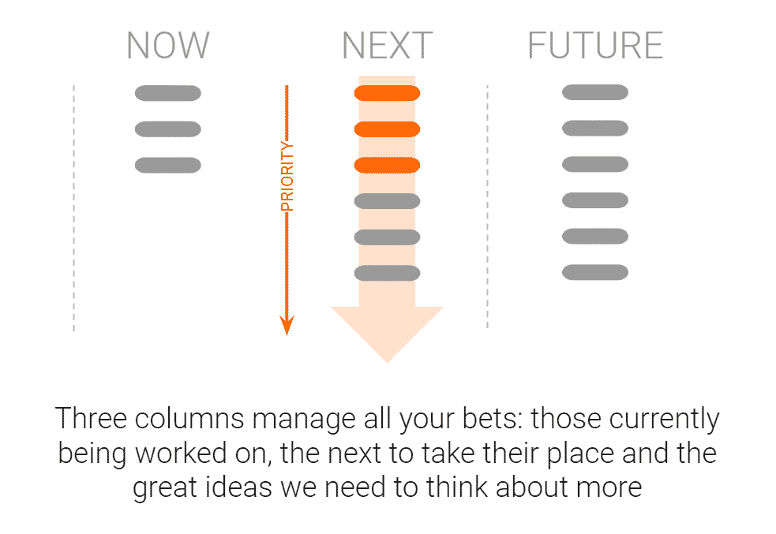

# 现在、未来、未来——实现您的战略的简单方法

> 原文：<https://medium.com/swlh/now-next-future-a-simple-approach-to-delivering-your-strategy-903f96cc243e>

对于一个公司来说，也许没有比**优先化**更重要的能力了。在我的[上一篇文章](/swlh/the-fairy-tale-approach-to-strategy-creating-purpose-and-clarity-b730fc1c4edd)中，我写了确立你的愿景的重要性——公司的整体长期方向。这一愿景反映在您的战略中，即实现长期愿景所需的步骤。

有两个重要原因可以说明，发展一种严格的优先排序文化将极大地改善你的业务；**速度**和**效率**。

# 速度和速率的区别

许多领导团队谈论速度和敏捷性。他们希望通过项目交付率来衡量成功，并确保他们能够快速响应不断变化的需求。

不幸的是，速度并不等同于速度。想象你的战略项目是由许多小船组成的舰队。舰队中的每艘船都有自己的速度，相当于每个项目的交付速度。

请允许我就速度和速率之间的区别来说一会儿古怪的话:速度是物体经过距离的速率。速度是稍微特别一点的东西——它也测量行进的方向。你可以认为速度是某个方向的速度。

这听起来可能很无聊，但是考虑一下这将如何应用到战略项目中。您可能展示了快速交付项目的高能力，但是它们是一致的吗？他们对你的业务战略方向的贡献是一样的吗？

我们战略的目的是在组织中的个人和我们承诺的项目之间建立一致性。有了清晰的战略，企业中的任何人(尤其是领导团队)都可以定期测试所做的工作是否有助于实现我们的目标。

# 效率、附带项目和一切照旧的诅咒

你知道最终会让每一个企业失败的一件事吗？

时间。

无论你是一家初创公司还是跨国公司，成功与失败的区别在于我们如何利用我们的资源。现金和人力是我们实现目标的杠杆。减少交货时间可以通过花费更多的现金或使用更多的人来实现，然而，这通常是徒劳的。

高效利用资源是缩短交付价值时间的最佳驱动因素。优先化是我们可以用来最快速传递价值的最强大的能力。

虽然我已经努力阐明了战略和愿景的重要性，但我想建议，当我们面临二元选择时，有一个糟糕的战略和一个良好的优先化流程比反之更好。

请容忍我；战略允许我们将我们的资源投入到一个统一的目标中，但是如果这个战略目标碰巧是错误的，如果我们有一个学习和适应的过程，我们仍然可以成功。

即使我们最初的战略指向与成功相反的方向，我们快速判断项目商业价值的能力，以及将这些知识和更新的假设传递到我们的战略中的能力，将使我们能够走向正确的方向。

重要的是要有一个过程，让我们能够回顾我们完成的项目，并选择我们下注的地方——控制我们承诺的项目的规模和数量，以最大限度地获得成功和学习。这个过程给了我们真正的敏捷性，这正是我们的领导所期望的。

# 太多项目的成本

摧毁速度的最有效的方法之一是投入太多的项目。一个更有效的方法是容忍那些甚至还没有正式承诺的项目。

所谓的“办公桌旁”项目、来自整个组织的好主意(尽管总是来自首席执行官)、兼职、虚荣项目、任何以“创新”为名的项目，以及伪装成“照常营业”的任务，都会分散我们的注意力，使我们无法专注于我们应该为取得成功而做的事情。

停下来想一想，你现在正在做多少事情。你能说出你的组织目前正在进行的项目有多少？你今天做了什么工作？你清楚这些任务对你的战略有什么影响吗？你清楚是谁要求的吗，或者为什么会同意？

我接触过的每一家企业都犯有允许过多项目的错误，总是错误地认为这是满足客户需求或击败竞争对手所必需的。每一家公司都错了，因为快速交付的最佳方式是专注。团队内部的多任务处理只会降低交付速度。

多任务或上下文切换会增加相当大的开销。作为个人，多任务处理[已经被证明](http://brainrules.blogspot.com/2008/03/brain-cannot-multitask_16.html)会导致我们多犯 50%的错误，生产力下降 40%,完成一项任务要多花 50%的时间。同样的低效率会扩大到团队。

当然，这并不意味着你的整个企业一次只能做一个项目——很明显，你的财务团队、人力资源团队、开发人员和销售主管需要做持续的工作。目的是确保**明确定义的**、**适当熟练的**和**适当规模的**团队被分配到重要的工作。

作为一个组织，你需要考虑像销售这样的运营团队需要做的“标准工作”,以及特殊的、需要分配资源的项目工作。

命题开发、产品工程、创新和研究项目，甚至基于项目的客户工作(如企业销售实施)都是需要纳入路线图的项目工作类型，并构成优先化流程的基础。

# 确定路线图优先级的简单方法

像战略一样，优先化是另一个可能变得曲折和过于复杂的过程。如果优先排序或投资控制过程变得费力，企业就会停止这样做，同时进行太多项目而不够专注、把资源让给声音最大的人的旧习惯就会重现。

优先化是这样一种情况，即使有缺陷的纪律也比没有纪律好。在某种程度上，你是否真的选择了最重要的东西并不重要，重要的是你选择了一件东西。目的是迅速决定我们应该做什么工作，并排除其他一切**。**

[众所周知(也许是虚构的)](https://www.inc.com/jory-mackay/warren-buffetts-personal-pilot-reveals-billionaires-brilliant-method-for-prioritizing.html)，沃伦·巴菲特曾就如何选择自己的人生给了他的飞行员一些建议:

*   第一步:在一张纸上写下你的 25 个职业目标。
*   第二步:只圈出你最喜欢的五个选项。
*   第三步:把前五名放在一个列表上，剩下的 20 名放在另一个列表上。

似乎很容易？然而，巴菲特的诀窍是将这 20 项列为“不惜一切代价避免”的清单。这就是我将要描述的公司运作流程。

**“现在、下一个、未来”**，是一个听起来简单的过程。项目工作和战略赌注可以分为三栏，现在、下一步和未来:

*If this looks like Kanban to you, it is. If you don’t know what that means, it’s not important right now.*

在**‘Now’**栏中，你应该列出当前正在进行的项目。

在**“未来”**一栏，你应该列出那些没有足够的数据来进行优先排序，但可能听起来很大且令人兴奋的项目。这可能是你所有区块链项目的归属。

**‘下一个’**栏是完成所有工作的地方。“下一个”列中的项目按重要性排列(我们将在后面讨论这是如何发生的)，最重要的在顶部。

这是一个“拉动”系统。只有当我们的“现在”项目中的一个完成时，我们才能从“下一个”栏目中转移一些东西。“下一步”栏顶部的项目对我们企业的成功至关重要，我们已经对其进行了审查，以确保它们符合我们的战略。

# 论项目的性质

企业内部的团队应该理解优先化流程适用于任何投资。在我工作过的企业中，技术人员经常为他们知道应该完成的工作保留神秘的技术储备。这种积压的存在总是弊大于利，因为项目从来没有留出交付的时间。

应该鼓励整个企业的团队将他们的战略项目——尤其是那些需要其他团队资源的项目——添加到现在/下一个/未来的待办事项中。这应该鼓励团队从商业角度证明重要工作的合理性，也让高层领导明白不投资这些项目的代价。

在我工作过的公司中，我倾向于建议超过两周的项目进入战略委员会，对于更小、更短的工作，给予当地领导(如产品负责人)自主权。这允许团队保持对他们自己的一些任务的所有权，但是使他们与整体战略保持一致。在您的业务中，您可能想要处理路线图项目的组成部分，以及在领导层没有考虑的情况下，哪些内容被放在了待办事项列表中。

# 召开优先级会议

*为了让这篇文章专注于优先化的“为什么”，我将“如何”分成了一篇单独的文章:* [*召开优先化会议*](/@Mark_Ridley/running-a-prioritisation-meeting-578ebf8fe811) *。*

会议的关键是将所有利益相关者聚集在一起，并促进关于我们的筹码放在哪里的公开讨论。会议的一个重要元素是对我们真正能够同时运行的项目数量保持坚定和诚实。你能为你的整体速度展示的数据和证据越多，这个过程就会运行得越好。

简而言之，优先级会议通常每月举行一次，每次一小时。会议期间，前 15 分钟应关注“现在”栏中当前赌注的状态更新。下一个重点是讨论“下一个”委员会中任何新的、紧急的参与者，其中新的计划需要紧急分类。

会议的最后 40 分钟将用于讨论下一列顶部的顺序。假设我们知道该列的“工作进行中”(WIP)限制——我们可以同时运行多少个大型项目——我们只需要关注“下一个”列顶部的类似数量的项目。

“未来”栏在会议期间被用作所有那些听起来很棒的想法的暂存笔，这些想法只是没有被列入待办事项。在会议的最后几分钟，小组应该考虑是否应该从董事会中删除任何未来或下一个赌注。

在会议结束时，小组成员应该了解当前的项目流程，并就业务投入的相对优先级进行咨询。会议的结果可以在整个组织内共享，以确保个人对未来有清晰的看法，并了解业务的方向。

[*详细流程见此处*](/@Mark_Ridley/running-a-prioritisation-meeting-578ebf8fe811)

# 发现、定义和交付

在过去的两篇文章中，我们已经看到了如何定义公司愿景和总体战略。今天，我们讨论了如何确定战略赌注的优先顺序。在下一篇文章中，我将介绍这个过程的最后一个要素——根据我们对投资回报的信心来控制和控制投资。特别是，我们将看看如何避免投资，直到最后负责任的时刻。这是区分优秀和伟大产品公司的最后一块拼图。

记住；你的策略从来都不是完美的，总是需要改变。拥有一个快速有效地考虑战略的过程比一个复杂的、不频繁的过程要强大得多。

**无情地划分优先级是用有限的资源取胜的最有效的方法。**

## 这篇文章发表在 [The Startup](https://medium.com/swlh) 上，这是 Medium 最大的创业刊物，有+386，297 人关注。

## 订阅接收[我们的头条新闻](http://growthsupply.com/the-startup-newsletter/)。

