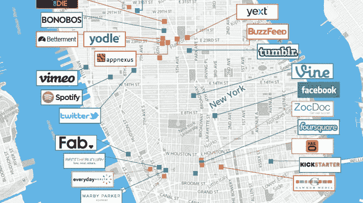
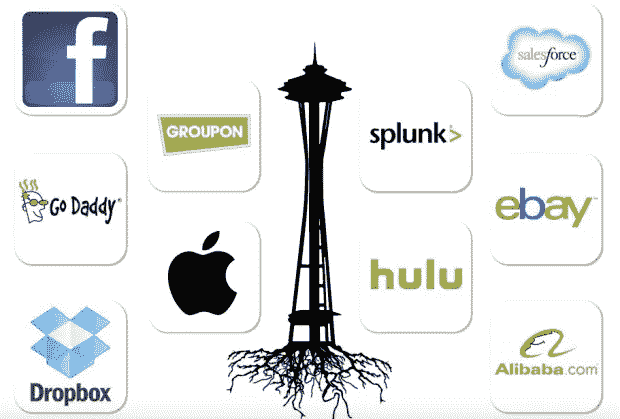

# 纽约科技追赶硅谷，而西雅图陷入困境。原因如下。

> 原文：<https://medium.com/swlh/nyc-tech-catching-up-to-silicon-valley-while-seattle-flails-here-s-why-97ba7147b5f6>

创业世界是一个有趣的地方。随着美国各地的城市努力建立自己的硅 XYZ，建立一个充满活力的生态系统所需的变量不断受到争议。我最近与两位纽约的技术人员进行了交谈，这让我重新考虑了创业生态系统如何发展和繁荣的一个公认规则。

# 美国创业生态系统的一点背景

一些有趣的统计开始。首先，根据 Compass 的[全球创业生态系统报告，去年美国十大创业城市分别是:](http://ter.li/5erq81)

1.  硅谷
2.  纽约
3.  洛杉矶
4.  波士顿
5.  芝加哥
6.  西雅图
7.  奥斯汀
8.  亚特兰大
9.  丹佛/博尔德
10.  费城

不出所料(尽管最近[出现了各种混乱和‘SV 的天要塌下来了](http://ter.li/2sq7c3))我们把硅谷放在了首位。在过去的两年里，SV 生态系统已经获得了全球前 20 名创业生态系统中所有创业出口的近 50%的价值，相当于其他所有生态系统的总和。

至于纽约，它做得很好——真的很好。之前排名第五，现在被公认为美国第二成功的创业生态系统。这是一个令人印象深刻的跳跃，考虑到它现在的排名高于历史上强大的波士顿和西雅图。

需要注意的一点是，纽约的晚期创业公司和拥有数百名员工的成熟科技公司数量较少。这就是为什么纽约的成功故事(像 Etsy 和 Shutterstock，每个的市值都不到 20 亿美元)落后于波士顿、芝加哥、西雅图和洛杉矶的成功故事的潜在原因

那么……纽约市是如何向前推进的呢？当我们考虑建立一个强大的创业生态系统所需的细节时，有哪些反直觉的事件可能被忽略了？

# 获胜者骑自行车回来

最近，我和[彼得·博伊斯](http://ter.li/cjpxuw)聊起了东海岸创业生态系统的兴起。关于背景，Peter 目前在 General Catalyst Partners 工作。这家成立 16 年的公司管理着 36 亿美元的资产，总部位于纽约城外的剑桥。彼得之前曾联合创立了 Rough Draft Ventures、哈佛大学风险投资伙伴和 HackHarvard。他还在纽约的初创公司呆过一段时间，包括 Skillshare，并与人合作创办了一家专注于金融的初创公司。他对纽约市和东海岸的风险和创业生态系统了如指掌。

在我们的播客采访中，Peter 提到东海岸有一批令人印象深刻的新公司。他们以一种略有不同的纽约第一的方式建立自己的公司:

> “我认为，我们很幸运地在 General Catalyst 的投资组合中看到 Oscar Health、Warby Parker 和我们的投资组合公司 bracade 所扮演的角色，这是一个商业房地产 B2B 市场……这三家公司正在建立新的创业型和技术型公司，嵌入到许多领先公司所在的同一生态系统中。我认为这是一个真正令人耳目一新的、有趣的机会，可以在纽约建立这种风格的公司。”

[Peter Boyce](https://medium.com/u/99d2523540f2?source=post_page-----97ba7147b5f6--------------------------------)

我和其他几位东海岸的创始人聊过，东海岸仍然在发展同样的“向前支付”文化和规范，这种文化和规范遍布硅谷，并促成了它的成功。也就是说，你需要有相关经验的本地人，在下一代人创建公司时，他们可以分享这些经验。人们通常将这种动力框定为成功的创始人，带领年轻、经验不足的创始人走过公司建设的起起落落。你需要高层人士来创造这种信息和信任链。

彼得提出了成功创业生态系统的另一个重要特征。生态系统中需要有人退出，并能参与进来，为新公司提供资金支持。

> “这是现在正在发生变化的部分。我们有一些五、七年前成立的成功公司，它们要么被收购，要么进行其他形式的交易，但它们创造了一批有趣的年轻人，他们可以成为天使投资人，也可以再次成为创始人。我真的很受鼓舞。
> 
> 我们需要更多。我想说旧金山有几十年的这种遗产。我认为纽约和波士顿在这方面正在加速发展，他们在过去五年里做了很多工作。就算五到七年吧。我认为那是它的一部分。"

但正如彼得提到的，这一切才刚刚开始。纽约并没有真正把人们推向生态系统。只有为数不多的几次 IPO 或重大退出——2015 年，纽约唯一的科技 IPO 是 Etsy(当然，这也是自 2009 年以来科技 IPO 最糟糕的一年)。有传言称 Buzzfeed、DigitalOcean、SquareSpace、Warby Parker 和其他一些总部位于纽约的科技公司将在今年某个时候上市。

纽约市还发生了什么，使得生态系统成为如此强有力的竞争者？一个现在(与短短几年前相比)初创公司甚至不需要穿越整个国家来获得资金或雇佣员工，就可以在纽约市建立总部的地方？

# 失败的力量

我最近也和蓝围裙的产品经理凯瑟琳·鲍(Catherine Pao)聊过。在加入蓝色围裙之前，凯瑟琳曾在纽约的两家初创公司从事产品营销工作:Fab 和 DigitalOcean。你可能知道，Fab——曾经拥有近 700 名员工的 10 亿美元公司——[于 2015 年破产](http://ter.li/e61kl8)。

Catherine Pao

在[我们在播客](http://ter.li/qzhwpc)上的聊天中，Catherine 说了很多关于 Fab 的事情——他们做对了什么，他们做错了什么，以及她如何能够[应用她在蓝色围裙](http://ter.li/uygnbd)中学到的这么多东西。在这样的环境中工作的机会——一个有着成长型文化和实验自由的巨额资金支持的独角兽——给了凯瑟琳一次在创业界独一无二且极具价值的经历。

她是其中之一。最让我感到有趣的是，她现在和 Fab 的另外六个人一起工作。凯瑟琳说:

> “对我来说，所发生的一切的一线希望真的是许多 Fab 员工去城市周围的其他公司工作的惊人散居。我实际上加入了蓝围裙，因为我基本上是由我以前在 Fab 工作过的人带进来的。我们现在有六个人来自蓝围裙的 Fab。我最喜欢的一些人包括我们现在的产品负责人(他是营销产品经理，我在 Fab 时和他一起工作过)。我认为 Fab 故事的这一部分总是会丢失。”

总部位于纽约的电子商务独角兽公司的内爆似乎让东海岸创业生态系统中的许多其他公司受益。它让人们回到生态系统中，然后建立新公司，并帮助扩大其他成长型创业公司的规模。以前在 Fab 工作的人已经开始创建一些纽约最热门的创业公司，从 theSkimm 到 General Assembly 到 ClassPass。这有着巨大的影响，即使他们来自一家对投资者来说表现不佳的公司。

这就是纽约发生的事情吗？纽约市没有大量突破性 IPO 的事实，是那里的初创公司和科技公司蓬勃发展的重要但难以捉摸的原因之一吗？

想想也挺有意思的，因为它让人感觉不喜欢经常被引用的“我们需要许多成功的退出来建立一个强大的生态系统！”我们许多人都认为这是必不可少的变量中最重要的一个

我甚至认为，那些在纽约苦苦挣扎的公司——目前你可能会把 Foursquare 或 Gilt 归入这一类——可能不会因为帮助纽约科技公司而获得与未来几年出现的任何成功的 IPO 公司一样多的赞誉。但如果你快速搜索一下，这两家公司的员工现在都在纽约的 Buzzfeed、InVision、Betterment 和 DigitalOcean 担任高级职位。

即使是一个 700 万美元资助的初创公司 Turntable.fm 的小例子也显示了类似的结果和影响。前 Turntable.fm 成员现在继续在纽约建立令人惊叹的公司，在 Giphy、Spotify、SeatGeek 和 Vimeo 工作。

有趣的是，“失败是好事”这句格言似乎渗透到了科技和创业公司工作的方方面面。它似乎甚至适用于生态系统的规模。

# 那么…西雅图有什么不好？

回顾美国生态系统排名，我提到西雅图在 2015 年下降了 4 个点，纽约、波士顿和芝加哥都报告了更强的生态系统……怎么了？为什么微软、亚马逊、Expedia、Real Networks 的主场没能为下一代创业公司打下基础？纽约是如何在一场明显领先的比赛中击败他们的？

西雅图的软件开发人员比美国其他任何科技地区都要集中。这也是为什么这么多硅谷公司在这座城市设立工程办公室的部分原因。那么，为什么这些有才华的开发人员不离开他们轻松的工作去创办自己的科技公司呢？

Big tech co outposts in Seattle

也许他们已经“去过那里，做过那件事”，并且正在享受一份稳定的工作。也许他们知道他们可以要求有竞争力的薪水，不想冒失去它的风险。有一点是肯定的:虽然西雅图有很多开发人员，但他们可能与那些在西雅图和纽约的初创公司工作的开发人员是非常不同的类型。喜欢在早期创业公司工作的人和那些加入大到拥有二级工程办公室的科技公司的人是不一样的(比如 Salesforce，Yahoo！、脸书、谷歌)。

> *可能像纽约一样，西雅图需要更多的失败。更多的失败需要更多的风险。*

西雅图似乎缺乏风险。在与科技和创业人士谈论西雅图时，我注意到了几个趋势。首先，在西雅图，除了种子/首轮融资之外，很难筹集到与 SV 竞争的资金。甚至根据指南针报道*——“西雅图的弱点是资金。虽然它足以为大部分有前途的早期创业公司提供资金，但缺乏大型风险投资基金会导致后期投资的明显缺口——这是西雅图生态系统在 2015 年不属于全球精英的一个关键原因。”*

西雅图的投资者可能比其他城市的投资者更厌恶风险。一些西雅图投资者还认为，年轻的创始人可能不是经营自己公司的最佳人选。引入“成人监管”的想法是西雅图投资者普遍存在的想法，至少直到几年前还是如此。

我不确定答案是什么，但我认为其中一些因素可能导致西雅图作为科技和创业公司的世界级城市的衰落。即使事情在过去几年发生了变化(根据我从那里的人那里听到的，听起来好像是这样)，建立一个强大的生态系统所需的长期周期意味着我们不能指望西雅图的科技生态系统达到纽约市已经达到的高度，至少在未来几年内。