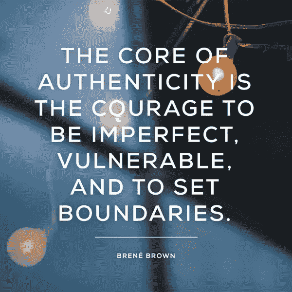

# 向真实性宣誓

> 原文：<https://medium.com/swlh/oath-to-authenticity-b60d761fa904>

***做自己，别人都已经名花有主了。王尔德。***

Photo by [Damian McCoig](https://unsplash.com/photos/2HqpqSqy0zg?utm_source=unsplash&utm_medium=referral&utm_content=creditCopyText) on [Unsplash](https://unsplash.com/search/photos/snowflake?utm_source=unsplash&utm_medium=referral&utm_content=creditCopyText)

十年前，当我最终决定离开学术界，改变职业道路，进入一个企业环境时，我并不知道会发生什么。毫无疑问，我热爱研究，但我知道学术体系不再适合我，我真正的使命在别处。在那之前，我在学校或实验室的表现、价值观或能力从未受到过真正的挑战，但我已经有了成功的记录。后来我决定转战企业界。

意识不到深度，我一头扎进了办公桌、开放空间、绩效和 360 度评估、领导力发展项目、冗长的电话会议、商务旅行、团队建设活动、目标、评级和会议、会议、会议……

Photo by [Archaique Chang](https://unsplash.com/photos/zK6p9T45m94?utm_source=unsplash&utm_medium=referral&utm_content=creditCopyText) on [Unsplash](https://unsplash.com/search/photos/ocean-dive?utm_source=unsplash&utm_medium=referral&utm_content=creditCopyText)

我甚至不熟悉基础知识，更不用说细微差别了。这是一个更加结构化的世界，对错误不太宽容，在这个世界里，文字、肢体语言和感知在很大程度上很重要，相比之下，我以前交往的世界里充满了疯狂但天才的科学家。

面对不确定性，当我们缺乏基础时，有时我们假装拥有它们作为一种生存机制。所以我决定模仿那些似乎在任何时候都在一切之上的人。当我面临逆境和困难时，我不断地问自己，在这种或那种情况下，我的“公司榜样”会做些什么。我的解释大多都失败了，我问他们如何最好地处理一种情况，然后吸收他们说的每一句话和他们的每一个模仿，我记住他们的姿势和态度，我利用每一个机会获得更多关于“领导力”的线索。

多年来，这个策略帮助我挺过了一段时间，但大多数情况下，我知道我上班时会把东西落在办公室门口，这同样适用于回家。我几乎感觉自己生活在两个不同的角色中:与家人和朋友在一起的真实的自己，与同事在一起的“想成为的自己”，扮演着我的榜样的影子。我害怕“百分百诚实”和“透明”。我有时会因为冒名顶替综合症而感到被贬低，无法全力以赴，并暗自不开心。突然之间，在那样的环境中生存比做我自己更重要。现在我对海洋中的细微差别有了很好的理解，我想把我的头伸出水面一会儿，呼吸新鲜空气，抛弃我建立的想要成为的皮肤，展示我真实的自我和价值观，满足我对自我完整和诚实的需要。

原来，我并不孤单。我们认为诚实和透明很可怕，因为它们可能会让事情分崩离析，我们可能会让人们失望或愤怒。事实上，[许多人非常害怕成为完整的自己以及它可能带来的后果。这是一个非常可悲的事情，任何人都应该感到他们不得不隐藏真实的自我，以便被雇用，接受，欣赏或爱。](https://www.forbes.com/sites/kathycaprino/2016/09/18/lets-face-it-were-completely-afraid-of-authenticity/)

我与我的朋友、导师、经理、教练、同事进行了建设性的交谈，还查阅了无数的 [Ted 演讲](http://mike-robbins.com/tedxberkeley/)，来自[研究](https://hbr.org/2015/11/the-powerful-way-onboarding-can-encourage-authenticity)的数据，以及[文章](https://www.siliconrepublic.com/advice/workplace-culture-future-of-work-sandra-henke-hays)。我也很幸运，因为我周围都是知识渊博的领导和充满同情心的朋友，他们一直告诉我要“做真实的自己”。我从来不认为这是一个流行词或口号，尽管在这个问题上有压倒性的意见。休斯顿大学的研究教授布琳·布朗给出了我最喜欢的真实性定义。

我发现，在《哈佛商业评论》引用的一项研究中，真实性被证明对工作满意度、角色表现和工作参与度有积极影响。来自谷歌研究的数据显示，心理安全，即在真实的工作场所创造的信任感、尊重感和接纳感，是为什么顶级团队成功而其他团队步履蹒跚的决定性因素。

我知道真正的自我需要一段时间才能实现，所以我耐心而坚定地在职业和个人生活中成为完整的自己，尝试谦逊和真诚。当我开始这项内心工作时，我能够比任何其他角色都更真实地分享我的激情(如医疗保健、人工智能、区块链、物联网等领域的颠覆)。我可以与人们建立更深层次的联系，并感受到作为一个团队尽最大努力的激励。神奇的是，我的“真实自我”和“想要成为的自我”之间的差距开始消失。

作为一个个体、一个团体和一个有机的企业，保持真实是很重要的，这样才能创造一个真实的工作场所，所以我们都被鼓励每天带着完整的自我去工作，在那里脆弱和犯错是安全的，在那里我们可以实验，在那里我们的人性被拥抱。

但是不要误解我。真实不是大声说出你的想法，不是无视其他人的想法/感受，也不是不经意地传递你的真实。“《T2》的合著者加雷思·琼斯说:“做真实的自己远不止是‘做你自己’。为什么每个人都应该在这里工作？”？:创建真正的组织需要什么。"**如果你想成为一个领导者，你必须做好你自己-*巧妙地*** "

正如 Brené所说的那样，真实性需要对我们的思想、情感和行为之间的联系保持警惕和意识。这也意味着保持对我们意图的关注。真正的真实性实际上需要自我监控，而不是缺乏自我监控。事实上，根据定义，设定界限就是自我监控——思考你在分享什么，为什么分享，应该和谁分享。

请观看他在 HBR 的视频以获得更多见解。

# 那么，如何做到地道呢？(给自己和自己的注释)

*   **了解真实的自己。直到你这样做，真正的你才真正诞生。**
*   做你自己，拥抱脆弱。
*   监控你自己:你的意图，你的情绪，你的误解，你的信仰，你的偏见。
*   监控你的背景:你的听众，你的环境。
*   **掌握给予和接受建议的艺术**这样你就能参与更深层次的联系，并真诚地合作。真实的反馈是你收到的最好的礼物。
*   **尝试谦逊，同时冒险**超越自己的能力。不要害怕失败，不要害怕犯错。走出你的舒适区！
*   **设定界限。忠于你的价值观和抱负。真实性显然与诚信原则相关联。**

幸运的是，身份不是一成不变的。从生到死，我们都在进步，我们可以成长。也许这段旅程并不意味着成为什么。也许这是关于不要成为不是真正的你的一切，这样你就可以成为你本来应该成为的那个人。

如果你觉得这个故事有趣，请随意鼓掌一次、两次或五十次👏👏👏👏👏

如果你看不够，请在[媒体](/@ezgitasdemir)和[推特](http://twitter.com/ezgitasdemir4)上关注我🤗

这里还有一些你可能会感兴趣的文章:

[领导](/swlh/leadership-n-capacity-to-lead-eb05c9253698?source=linkShare-2f38921d4043-1526162876)

[用心的领导](/swlh/the-mindful-leader-an-interview-with-michael-bunting-901c38742cff)

[战略学习](/swlh/strategic-learning-an-interview-with-professor-willie-pietersen-510314827a3d)

**——————**

*Ezgi Tasdemir 博士是诺华肿瘤公司的员工。本文由 Ezgi Tasdemir 创作。所有观点、分析和观点完全独立，仅属于作者，不代表诺华或任何其他公司或组织的观点或意见。作者没有从诺华或任何其他制药/非制药公司获得任何资助或支持。*

## 这个故事发表在 [The Startup](https://medium.com/swlh) 上，这是 Medium 最大的创业刊物，拥有 317，629+人关注。

## 在这里订阅接收[我们的头条新闻](http://growthsupply.com/the-startup-newsletter/)。

