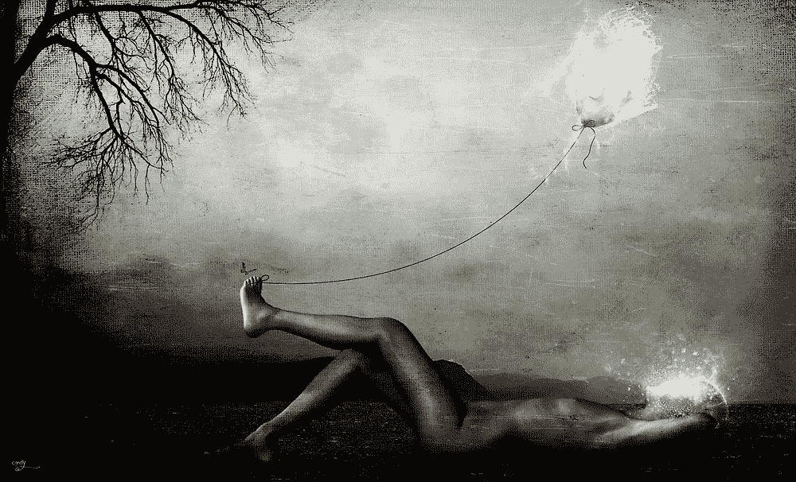
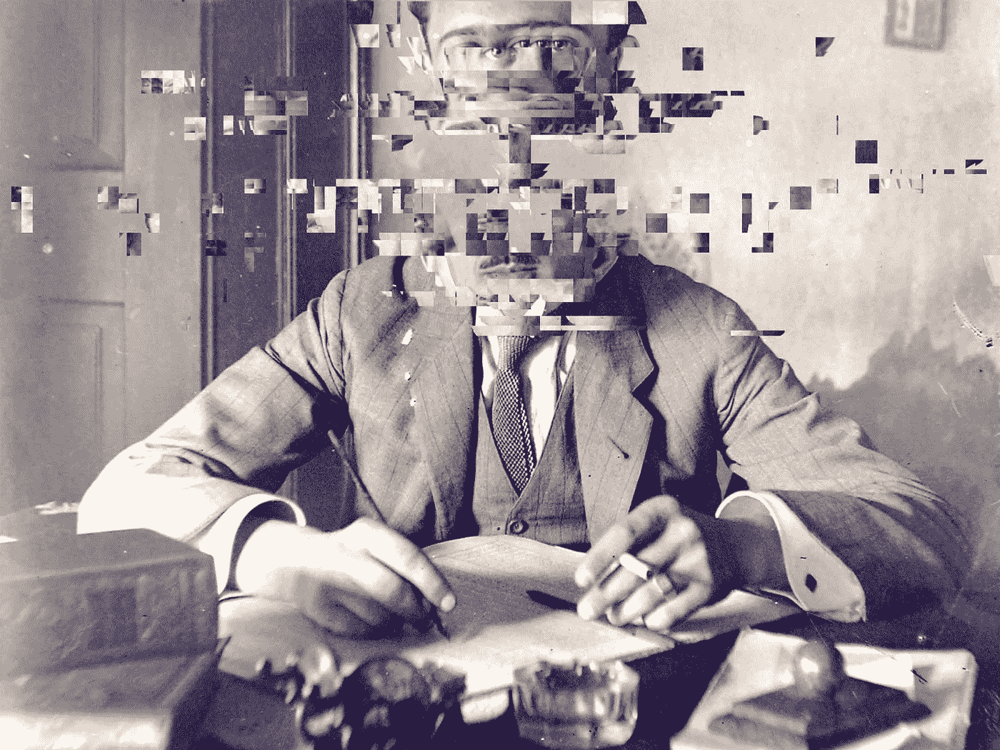

# 障碍还是机遇？

> 原文：<https://medium.com/swlh/obstacles-or-opportunities-6cdaa93fba9b>

定义你自己，正面还是反面

生活不断挑战我们，在我们的道路上设置障碍，这取决于我们接受它们并从中学习，收获经验带来的好处。

我们大多数人都会避开障碍。它们是我们被迫忍受的负担。从我们最好的舒适和非常重要的可预见的永无止境的欲望和梦想状态的设定路径中断。我们可能会担心地接受它们为“生活”,但仍然会无意识地参与其中。真是浪费。

你想要什么都可以。此外，生活在那里试图给你，试图发展你的性格，精神力量和个人完整性。克服障碍是定义你的东西，是什么把你塑造成一个独特的人，从我们开始时一般的灰色和乏味的粘土球中。

当我们放弃抵抗，当我们接受障碍并把它们视为机遇时，我们可能会找到我们想要的一切，或者至少是我们需要的东西，这往往就足够了。

“你寻找的东西正在寻找你。”—鲁米

选择你自己和一条通向抵抗而不是诱惑的道路；接受而不是回避；一种力量、好奇心和韧性，而不是舒适、安逸或权利。

我们达到、发展和成为有目标的人的潜力，通过他人过着有意义的生活，只受到我们的想象力和我们围绕和抵御想象力的界限的限制。

我们到底在害怕什么？成功和必须实际做工作，创造价值，关心生活，而不仅仅是幻想。害怕没有安全感，害怕孤独？如果我们做一些不同的事情，超越我们所知的，挑战我们自己和我们的信仰，我们的部落可能会渐行渐远或离开..

这个星球上很快会有 100 亿人，会有人像你一样有动力、有爱心、真诚、有同情心、聪明，在外面寻找你。所以做你自己，让他们找到你。

如果你愿意，你可以也一定会找到你的部落。你可以成为你想成为的任何人。这取决于你。

# 掷铜板解决问题

当我要做出重大人生决定时，我会掷硬币。正面表示“做”，反面表示“不做”。如果它侧着地或者迷路了..跳上一架飞机，把剩下的事情想清楚。第三种情况还没有发生，但我很乐观。

你可能会认为依靠运气来做重大的人生决定是荒谬的，我们需要认真的思考。咩。我们的想法比任何东西都更容易妨碍我们，如果我们“需要”任何东西，那就是来自任何人的建议和研究，除了我们自己和我们舒适的信任圈。他们非常关心我们的安全。有更好的选择。但是回到硬币。

我的方法比只有头或尾更系统和自我解释。

抛硬币的结果并不重要。重要的是结果在你的即时反应中揭示了什么，如果你坚持到底，结果的潜力是什么。这就像一个由各种可能的故事组成的系统角色扮演游戏。

当硬币落地时，你会有什么感觉？你是否满足，不确定，没有安全感？真实意味着什么？它会变成三局两胜或五局三胜的游戏吗？为了得到你真正想要或不想看到的结果，你还要继续抛硬币多少次？这一切说明了什么情况，以及你与即将做出的决定的关系？深刻的东西。爱死了。

在过去的十年里，我用这种方法来决定是否接受一份工作，辞掉一份工作，回到学校，买一套房子，开办多种业务，决定去哪里旅行，去多久以及是否应该回来。

它还没有失败。但那可能只是我。

我们真的不像我们认为的那样了解自己，与其简单地依赖错误的情绪、闪亮的新东西或钻石外壳，不如承诺路的另一边长满绿草……正面或反面的方法肯定有一些优点。

这一切的丑陋之处在于，决定最终是对还是错变得无关紧要，这是一种对待生活的惊人姿态和心态。所以，在我的智慧生命开始之前，我会继续抛硬币&从那里算出剩下的。保持有趣。

# 今天的垃圾想法

在这个残酷的世界里为所欲为。

思考不是成长

思考是思想，自我思考，是好奇心，是概念的内在联系，是想法、背景和感官输入的归档。真是不可思议的事情。但有一点不一定是增长。因为成长需要行动，它需要状态/环境的改变，最终需要压力或紧张性刺激来挑战我们的状态或思维。因此，思考本身，思考的行为，可以是成长的一部分，但绝不是成长的标志。思考是一种娱乐形式，我们可能会发生或打算从中成长。

对与没错

学习如何“正确”和如何不“错误”是不同的；还有学习避免，分离，隐藏和接受无知作为第三种选择。一个需要指点和演示，另一个需要实验可能的结果，最后一个只需走开。你可以选择你的道路，你是什么样的人，你设定的优先次序，你产生的影响以及如何产生影响。简而言之，通过工作和保持你的正直来产生影响。有了它，你就不会出错了。

孙子

“有许多获得胜利的方法，其中最巧妙的不需要战斗。认识你自己，你的敌人，资源，理由和推理；进攻策略第一，人第二，资源最后。”

无聊

花更多的时间在空虚中，什么也不做，不去思考或者用你已经知道的东西填满它(你的头脑和头脑)。你想要创造一个开放的空间，让新的思想、观念和概念来填补这个空白，创造你还没有过甚至还没有理解过的新的联系和经历。

孩子们很聪明

孩子们宁愿自己受苦和犯错，也不愿相信或把别人的错误当成真理。这体现了在挑战“我们所知道的”时令人难以置信的毅力、力量和纪律。

## 这个故事发表在 [The Startup](https://medium.com/swlh) 上，这是 Medium 最大的企业家出版物，拥有 298，432+人。

## 订阅接收[我们的头条新闻](http://growthsupply.com/the-startup-newsletter/)。

