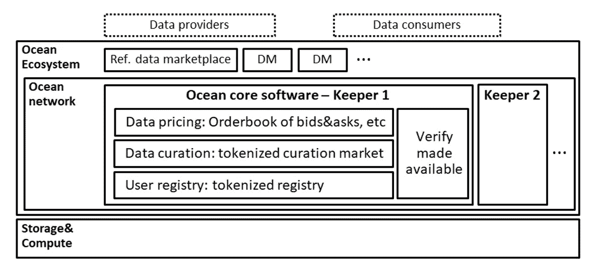

# 海洋协议——数据市场民主化

> 原文：<https://medium.com/swlh/ocean-protocol-democratizing-data-markets-3d7c67fae50d>

## [区块链 vNext 系列](/@sgrasmann/blockchain-vnext-a-series-ff5469aa1f22)(第二部分)

在关于下一代区块链技术的[系列的第一部分](/@sgrasmann/filecoin-and-ipfs-f5e84ae79afa)中，我们看了一下 FileCoin 和 IPFS 的去中心化数据存储。但是，将你自己的数据存储在一个安全的地方，并限制对你自己和你的朋友或家人(假设是“可信的、众所周知的实体”)的访问只是整个故事的一小部分。

Picture by [Joseph82](https://pixabay.com/de/users/Joseph82-2049827/), found on [Pixabay](https://pixabay.com/de/qualle-aquarium-tropische-fische-1288749/)

[来自](/@trentmc0)[海洋协议](https://oceanprotocol.com/)的 Trent McConaghy 喜欢这样说:

> “数据要免费”和“数据要贵”。

他这么说是什么意思？嗯——我们大多数人每天都在泄露数据。我们这样做可能是为了在脸书或 Youtube 上获得喜欢——或者在媒体上获得掌声。或者当我们使用可穿戴设备来跟踪我们的体育活动时，我们这样做是为了从我们的数据中获得洞察力。

但是许多人和公司可能会对我们的数据感兴趣。他们会付钱——也许是很少的钱——来获取这些数据。到目前为止，还没有一个可信的市场可以进行这些微交易。嗯——非常明确的是:数据市场已经存在。我们只是没有注意到它们，因为我们没有积极参与这些市场。

我们的数据要么被卖掉，给我们看平时不想看的广告。或者我们的数据是在我们不知情的情况下被暗中处理的，甚至可能是我们不同意的事情。因此，目前我们的数据事实上是“免费的”，而且是“昂贵的”——最终的数据提供商(我们)没有从这些数据中获得回报。

所以一些聪明人问自己:

*   我们能否使用区块链构建模块和令牌来创建一个民主、多样化的数据市场？
*   我们如何在提供数据的人、评估数据集价值的人、清理和整理数据的人和想要使用数据的人之间平衡这个数据市场？
*   我们如何创建一个对免费数据提供者(数据共享区)、像非政府组织这样的小型数据提供者有吸引力的系统，同时也吸引后来加入的大玩家？
*   我们如何利用区块链生态系统的功能来解决这些问题？
*   我们如何利用比特币生态系统设计的优秀部分——针对不同玩家的激励系统——来推动蓬勃发展的数据生态系统？

海洋协议想要成为这些问题的答案。海洋想要成为一个生态系统的**基质**，这个生态系统的工作方式如下。我将尝试从数据提供商的角度，向您提供我对市场设计目标的高度理解:

1.  让我们假设您想要向生态系统提供一个数据集。你可以这样做，但你必须对你的数据下一定的初始“赌注”。你用海洋代币打赌。所以你要支付一定的基本费用才能成为这个市场的一部分。这一点很重要:数据始发者在游戏中有一定的利害关系。这可以防止人们用垃圾数据淹没系统。
2.  如果其他人现在想使用你的数据，他们也使用海洋代币来支付使用费。
3.  但是作为原始数据创建者，您并没有得到所有这些令牌。在这个市场上还有其他参与者:那些运行节点来查找你的数据并使你的数据可访问的人。这些人也会从代币账单中得到一定比例的钱。你可以自己扮演这个角色，也可以将这个任务委托给第三方。这个系统的建立是为了激励这些第三方的出现。我们可以称这些第三方为“矿工”。
4.  但我们的生态系统中还有另一个问题:一方面，我们希望我们的市场很大，能够接触到我们数据的许多潜在消费者。问题是，随着市场的增长，这个市场可能会变得很难理解。不管这个市场有多大:如果我们提供了大量的数据，我们希望因此得到回报。我们希望我们的数据闪闪发光，而且我们希望它易于访问。我们期望我们的生态系统激励好的数据。我们希望我们的生态系统能够自我修复。我们希望它以某种方式策划。但不是由单个参与者策划的——而是由大众策划的——或者市场中的第四个参与者:受到激励来判断数据价值的专业策展人。这方面并不像听起来那么简单。一个生态系统依靠它的平衡生存:只有当市场不过度强调三个或四个重要的数据集时，它才是相关的。然后谷歌或脸书会进入这个市场并统治它。我们会失去平衡。生态系统需要多样性。它需要对丰富生态系统价值的新数据集有吸引力。它还需要让利基数据提供商和新来者大放异彩，并获得他们的市场份额。Ocean Protocol 试图用数学来解决这些问题:在向数据发起者或管理者支付代币时，他们不使用线性函数，而是使用对数函数。它尊重这样一个事实，即对于所有参与者来说，找到某个数据集的前十个“粉丝”比下十个“粉丝”需要更多的工作。这听起来微不足道，但对实现市场平衡起着至关重要的作用。

> 对我来说，这听起来是个不错的计划。

我希望现在我已经引起了你的全部注意…

海洋更进一步。麦康纳非常深入地研究人工智能(AI)和机器学习——正如你可以在他令人印象深刻的[简历](http://trent.st/)中看到的那样。他希望海洋生态系统解决人工智能领域的一个重要问题:你通常需要大量数据来训练你的算法——让它们变得更好。该领域的专家表示，如果你用大量数据来填充 20 年前的算法，你会比用更少的数据来训练一个更好的现代算法获得更好的结果。如今，只有极少数玩家能够接触到这些海量数据。正是这些玩家在人工智能上投入了大量资金。

小的 AI 创业公司，因为缺乏数据，根本没有竞争的机会。Ocean 希望利用其上述协议和生态系统来打开市场，使人工智能民主化，并推动小公司的人工智能研究。他们还想付钱给非政府组织，让他们提供数据，并通过海洋生态系统获得报酬。

> 我对这些想法的深度印象深刻。

## 技术

我浏览了关于[市场](https://oceanprotocol.com/marketplace-framework.pdf#why)和[技术初级读本](https://oceanprotocol.com/techprimer.pdf)的可用海洋协议白皮书，以便了解海洋协议想要如何实现上面解释的想法。

一个关键的想法是，通常避免将数据收集到集中或分散的云中，而是将数据分散在防火墙后面，并将算法带到数据中，而不是相反。数据是“粘性”的。移动大量数据通常非常昂贵。此外，保护大型数据集的迁移和访问也很困难。因此，将数据保存在其原始位置附近通常是一个好主意。

让我们从与 Ocean 的治理目标高度一致的技术市场设计开始:

市场旨在让高质量的数据发光。因此，Ocean 使用了**利益证明** (PoS)机制，在这种情况下，利益意味着**“对数据未来流行度的信念的度量”**。

如下图所示，Ocean 将其生态系统架构分为两个主要层:

1.  不同的数据市场
2.  保持器节点

Source: [Ocean Tech Primer](https://oceanprotocol.com/techprimer.pdf), page 10

让我们先来看看这些 Keeper 节点:它们有四个不同的主要任务:

*   **用户注册中心**管理其用户的利益，包括白名单
*   **数据管理**列出了一组经过管理的可用数据集
*   **数据定价**定义数据访问(包括免费数据)的定价
*   **验证**确保节点确实如承诺的那样提供对数据的访问

这些节点可以在本地或云中运行。它们保证算法被带到正确的文件中——确保它们在正确的数据集上工作。节点还保证了数据的不变性和算法根据规则运行，例如防止数据被盗。

有趣的一点是，Ocean 本身并不在这些 keeper 节点中存储数据——这些节点控制和管理对底层(加密)数据的访问。 [IPDB](https://ipdb.io) 、 [BigchainDB](https://www.bigchaindb.com) 和 [CoalaIP](https://www.coalaip.org/) 似乎在这两者之间的数据访问层的实现中扮演着至关重要的角色。

> 对我来说，这一切在运行时的细节是如何实现的还不是很清楚。某种类型的运行时图片将真正有助于了解哪些代码在哪里运行以及何时使大图片工作。

似乎 Ocean 想要验证在您的数据上运行的算法，以证明它们确实在做它们想要做的事情。解释如何实现这一点的相关技术白皮书仍在编写中。

Ocean 声称，高级市场是围绕现有的和即将出台的**数据保护法**设计的，如 [GDPR](https://www.eugdpr.org/) 。整个市场及其所有参与者都受到激励，并通过公用事业代币控制自己。如果玩家不按照协议中的规则行事，这些令牌很容易丢失。Ocean 使用**令牌管理的注册中心**来管理所有利益相关者之间的平衡并建立信任。

Ocean 目前确定了七个利益相关方:

*   数据提供者
*   数据消费者
*   数据市场
*   数据聚合器
*   数据参考
*   网络管理员
*   监管机构。

**数据聚合器**是一个有趣的物种:它们的作用是将增值服务引入市场，例如通过清理、转换或增加不同的数据集并创建新的数据集，而不会失去原始数据提供商的 IP 跟踪。

> 市场报告深入探讨了市场设计。这些话题好像真的想通了。

## 提供资金

海洋协议总部设在柏林，仍处于早期阶段。我没有找到太多关于一个 ICO 或者类似方面的资料。但是他们的技术也有早期投资者，比如离群值投资公司和来自新加坡的数据市场合作伙伴。

CTO 兼联合创始人 [Trent McConaghy](https://trent.st) 之前创办了其他几家科技创业公司，如[attrib](https://www.ascribe.io/)、 [BigchainDB](https://www.bigchaindb.com/) 和 [IPDB](https://ipdb.io/) 。其中大多数也为海洋议定书的活动奠定了基础。他为这些公司找到了许多公认的合作伙伴，正如你在这里看到的。

## 对社会的影响

海洋肯定会影响社会甚至人类。这些方面是他们活动的核心焦点，你可以在 Trent 的许多出版物中读到。

> 赢回我们自己数据的所有权听起来是个不错的计划。

但可能性更大:如果你想到数字医疗或物联网等领域，Ocean 的基本设计听起来也非常有希望用作智能解决方案的基础。

考虑存储患者的医疗数据。如果你设计这些系统，你真的想确保这些数据不会丢失或访问没有必要的控制。同时，以匿名方式处理这些数据是有意义的，例如用于研究。这些问题在常见的集中式云场景中很难解决。位于一个中央数据湖中的数据越多，攻击者获取这些数据的动机就越大。

在物联网场景中也看到了类似的问题。在许多情况下，不止一个玩家参与其中。让我们来看一个测量汽车轮胎压力的传感器。谁可以使用该传感器收集的数据？轮胎的制造商？汽车制造商？汽车司机？还是车主？或者保险公司？撞车后报警？所有这些方面肯定都有正当的理由以某种方式访问这些数据的某些部分。

> 如果我们有能够解决这些多利益相关者数据场景的标准机制，难道不是很有帮助吗？我想:是的！

## 结论

海洋是一个需要密切关注的热门候选。现在还早。但是潜力是存在的…我希望我能给你一些这个酷技术的发展方向的想法。

如果你想潜入更深的海洋，我可以推荐[里斯·林德马克](/@RhysLindmark)和[特伦特·麦康纳](/@trentmc0)之间的采访[。](/@RhysLindmark/25-trent-mcconaghy-ocean-protocol-cryptoeconomic-primitives-mapping-humanitys-plan-to-self-c8423a600da)

***免责声明:*** *本文无意成为任何形式的投资建议。如果你打算投资本文提到的某个项目，自己做研究并寻求专业支持。*

## 这篇文章发表在 [The Startup](https://medium.com/swlh) 上，这是 Medium 最大的创业刊物，拥有 277，994+读者。

## 在此订阅接收[我们的头条新闻](http://growthsupply.com/the-startup-newsletter/)。

