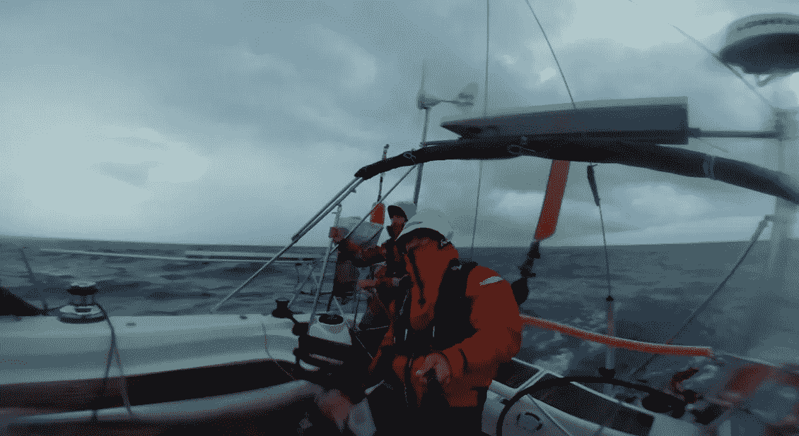
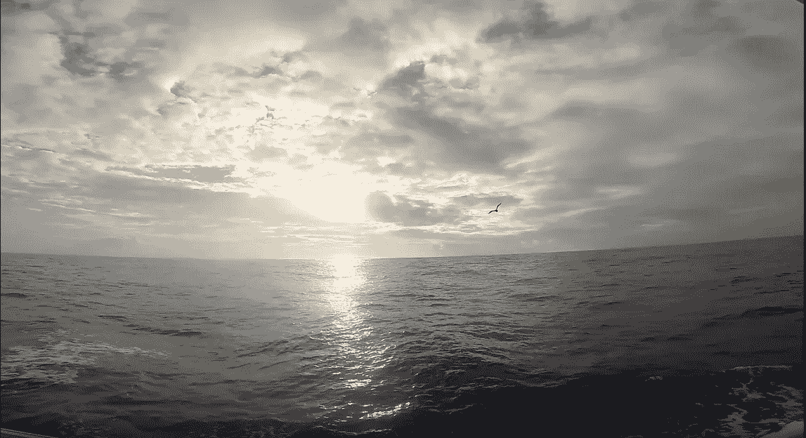
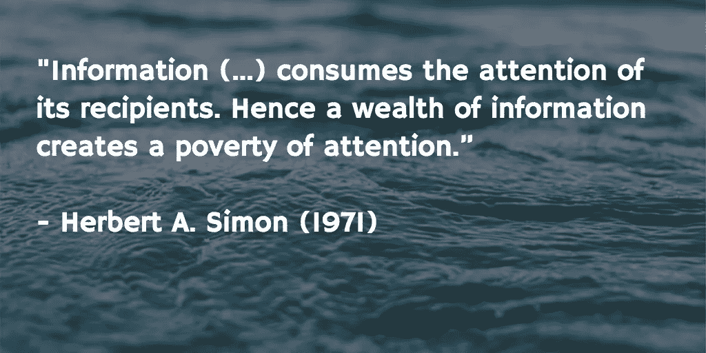
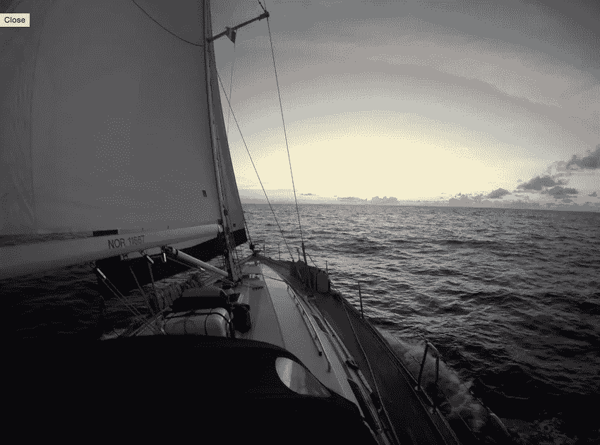

# 3 堂关于 1 个月不横渡大西洋的课

> 原文：<https://medium.com/swlh/offline-is-the-new-black-83d818a2eb6d>

## 离线是新的黑色

> 2015 年，我完成了第二次**横渡大西洋的航行。**

我是一个来自**的城市人**和一个来自**的创业者**，目前全职在 Buffer 工作，经营一份拥有 1 [万名订户的时事通讯](http://remotive.io)。

**腾出时间离线从来都不容易**！

几乎从来没有一个“合适的时间”去做这件事；断开连接时，您可能会失去业务和机会。

琼恩、特鲁德、亚瑟和我花了 21 天时间，从圣马丁(加勒比海)航行到奥尔塔(亚速尔群岛)

我很乐意分享**我通过下线** **学到的东西。**

# 1)创业者能断开吗？

我很幸运能够休一个月的假去下线，并让我的兄弟来完成我所有的其他任务。

我的朋友亚瑟也是这次航行的船员，他正在休假，这也是一个很好的分离方式。

> 就业务而言，下线一个月感觉就像“解雇我自己”。

感觉棒极了！

后退一步反思我所做的事情是一个**绝妙的练习**。以下是我下线时问自己的问题:

> 我最喜欢什么活动？
> 
> 我的参与对我的业务有什么影响，例如，我可以授权吗？
> 
> 如果我明天不再出现，对团队和用户有什么影响？

Steering — picture by Thur

问这些问题可能会让人害怕，但这都是为了找到你的努力对你和你的公司最有价值的地方。

如果有人能比你做得更好，那就太棒了！如果你特别喜欢做另一项任务，那么继续做下去可能是个好主意！

… **回答问题时要对自己诚实**这将有助于你在回来后专注于最重要的事情，并有助于找到你最感兴趣的事情。

> 都是关于**学会让自己变得多余。**

当我回来的时候，我确保开始专注于我更喜欢的**任务，并且对我有最大的影响。**

离线对我的创造力也很有帮助，在大多数早上，大约 5 点钟，我们会用头灯在纸上写下想法和创意——它帮助我想出新的想法和商业创意。

# *2)下线需要承诺*

在家或在路上，我几乎总是与**保持联系** …

我发现连接是无价的，特别是作为一个经常在网上做生意的旅行者，你可以在任何地方连接！

 [## #吊床时间！

### 后院策划会议与迈克！

instagram.com](https://instagram.com/p/6XsyBul-fy/?taken-by=rodolphedutel) 

我对此心存感激，并且仍然希望能够**有时远离这一切**来培养我自己的知识和发现——以及[的意外收获](http://www.chicagotribune.com/bluesky/hub/ct-buffer-productivity-serenedipity-bsi-hub-20150923-story.html):

我们现在能够**飞往任何国家**并保持**接入全球网络，**我们去的大多数地方都有 WiFi/4G；我们一直保持联系。

互联网无处不在，离线可能会很棘手。我选择在船上——也可能在山上或丛林中……

我发现**有意下线**很关键。如果你不积极寻找**方法断开**，它不太可能自己发生。

如果我的环境没有让我完全脱离物理连接，**我可能会在几天后在网上“检查事情”**。

> 当互联网离你只有一个点击/应用的距离时，不默认它是很棘手的！

> **这个词的意思是“*外来的”*现在是“*下线”***
> 
> **线下是新黑！**

**我遇到一个 8 岁的孩子**他说离线几周比航海冒险本身更极端；这让我对断开连接有了更多的思考。

脱离你目前的心态和现有的习惯(比如检查我们的手机)需要时间——**我花了 3 到 5 天才开始感觉脱离了我的日常活动，**即使航海让我们忙得不可开交。

掌握一项新技能或开展一项活动有助于我完全活在当下。例如，[Outsite.co](http://outsite.co)提供营地给**逃离**和**脱离**加州。

Calm Ocean — Picture by Thur

# 3)让我的学习回到线上

在航行的最后，我们到达了奥尔塔岛，然后我飞回了我的家乡巴黎，大约凌晨 1 点就睡着了。

几个小时后，一个熟悉的声音把我吵醒了——雨点正落在我的百叶窗上。

在我睁开眼睛之前，一些想法闪过我的脑海:

> “下雨……真糟糕，在我值班期间，驾驶舱将会是潮湿的……我想知道他们是否已经换了帆？.."。

片刻之后，**我睁开眼睛**，意识到我不再是在一艘船上了——我回到了巴黎，在我公寓的**安全的**…

> 看到我们如此快速地适应艰难和便利，以及我们的行为如何相应地改变，真是令人惊讶- **我们的环境影响着我们的行动。**

第二天，我完全**回到了城市生活**，我开始思考**我的注意力持续时间:**

> 当我早上醒来的时候，离我拿手机还有多久？

“ **79%的智能手机用户**在每天早上起床**后的 15 分钟**内查看他们的设备**。”— *尼尔·埃亚尔***

离线**训练你的注意力**只对你当前拥有的信息做出反应——没有来自外部世界的额外信息**。**

> 与获得**通知相反。**

Herbert A. Simon, a Nobel laureate.

似乎我不是唯一一个感觉需要断开连接的人:[Jason Fried’s](/woah-basecamp-3/basecamp-3-work-can-wait-4adfb285c84b)s[最近宣布，Basecamp 可以在工作时间之外暂停通知，这非常受欢迎！](/woah-basecamp-3/basecamp-3-work-can-wait-4adfb285c84b)

我们自己的注意力是一种稀缺商品。我们集中注意力的地方是我们如何喂养我们的大脑。

对我来说，离线可以让事情变得更清楚。

我的上一次旅行提醒了我管理自己精力的重要性，我是多么享受实践创造力，以及拥有一个清晰的头脑是如何实现这一切的。

因此，我现在每天都在尝试**午睡**或**冥想**和 [**我已经开始写书**](http://www.remotebook.io/) ，**记日记**更多的是和**一起玩涂色书。**

> 我们都已经接受了吃得更好和多锻炼对保持良好的身体状态是很重要的。我们现在开始通过管理我们的注意力来更好地保护我们的大脑。

在长达一个月的中断旅行后重返工作岗位是我非常感激的事情:这感觉很棒，令人耳目一新。

> 下线帮助我彻底检查了我对所有事情的感觉，并确定了什么项目和活动最让我兴奋。

Picture by Thur

当我写完这篇文章时，我正坐在从巴黎飞往纽约的航班上，我刚刚看了看窗外:

看着**大西洋**勾起了很多回忆！

然后，机组人员宣布我们将比预定时间晚**一个小时……**

> 想到这比我们上次横渡大西洋快了整整 20 天，我不禁笑了。

## 如果你喜欢这篇文章，如果你想推荐它，它对我来说意义重大，☺

发表于*[**# SWLH**](https://medium.com/swlh)***(****创业、流浪、生活黑客* ***)****

******

*-*