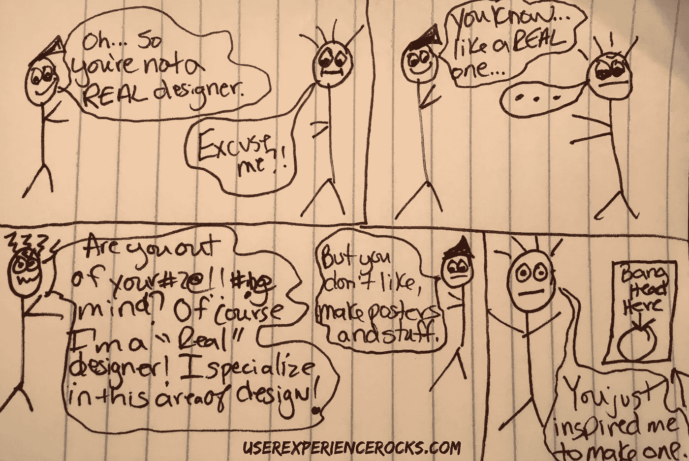

# “哦，所以你不是一个真正的设计师。”

> 原文：<https://medium.com/swlh/oh-so-you-re-not-a-real-designer-3379404ac7bf>

我们拥有有史以来最支持、最棒的社区之一。我喜欢成为其中的一部分。我甚至无法告诉你，我看到过多少社交帖子和论坛被已经在这个行业工作多年的人完全覆盖，他们帮助回答问题和指导新设计师。我们的社区棒极了。

我最近参加了一个会议，无意中听到了一段对话，这段对话让我非常恼火。

一位与会者和一位演讲者聊天，这位演讲者发表了一篇关于 UX 战略的精彩演讲，其中包含了交互设计和用户研究技巧。他的演讲内容丰富，经过深思熟虑，与会者对会议赞不绝口。

后来有几个人走到房间前面祝贺他，包括我自己。

我越过站在我面前的与会者说，“这很好，但会议标题具有误导性，因为你不是真正的设计师。”

## “你不是真正的设计师。”

演讲者看起来有点吃惊。

我傻眼了。然后我就生气了，于是我就淡定的靠近，说:“不好意思，在你看来到底什么才是“真正的”设计师？”

我非常努力地让我的声音里没有愤怒和讽刺，但显然只是部分成功，因为这个家伙从自信到吃惊和不舒服，并且雄辩地说，“你知道，他不喜欢，像我团队里的设计师那样制作图形和东西。”

我在那里扩散了一点，意识到这个人不是设计师，他只是没有一点线索。

我觉得自己像个蠢蛋，因为那个家伙只是理所当然地无知，然后说，“明白了。是的，在总体设计职业中有很多不同的专业。平面设计是其中之一，但还有很多很多。”

然后我们坐下来，在课间休息时聊了很长时间关于各种各样的设计职业，因为他很好奇，想了解更多。

有时我会忘记，人们(甚至是科技行业的人)对设计行业有多少不同的职业并没有一个明确的认识。

## “即使是科技行业的人也不明白设计行业由多少种不同的职业组成。”

平面设计不比交互设计不比用户研究不比前端开发不比信息架构不比内容策略等等..设计行业是由各种背景的人组成的，他们聚集在一起设计令人惊叹的产品。没有“更重要”或“不太重要”，只有“设计团队”。

## 没有“更重要”或“不太重要”，只有“设计团队”。

我在会议上与这位老兄(后来发现他是一名系统管理员)的互动中得到的教训是，愤怒不是对无知的适当回应——教育才是。

## "愤怒不是对无知的恰当回应——教育才是。"

(除非这种无知与精英混球的魔力紧密相连，在这种情况下，怜悯是恰当的回应)。😉

*发表于* **创业、旅游癖和生活黑客**

-