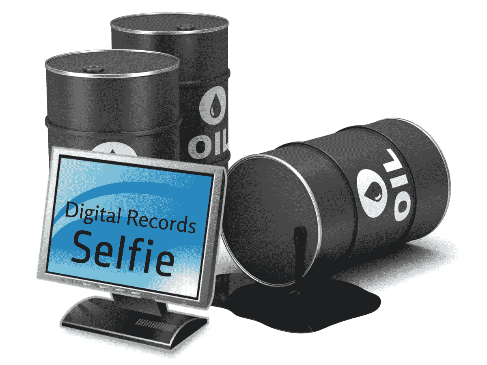
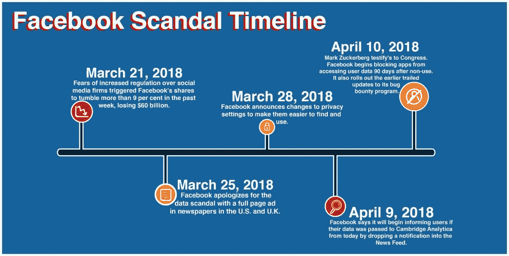
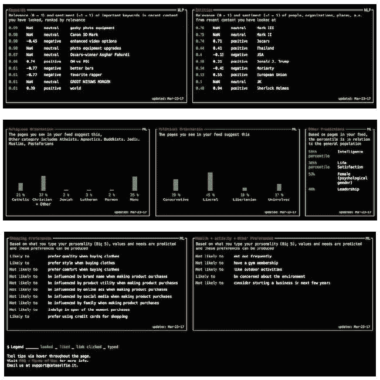
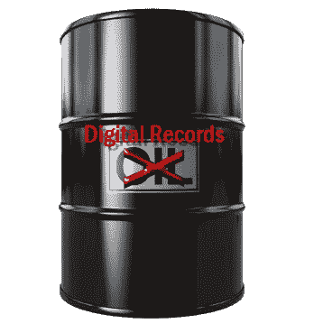
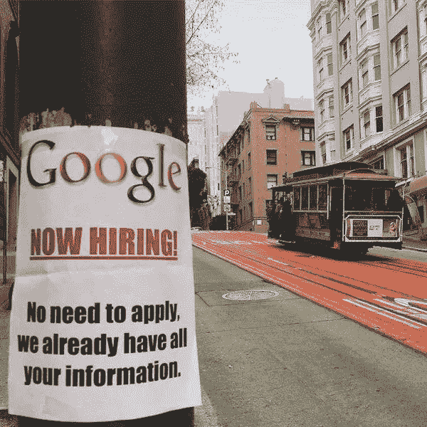
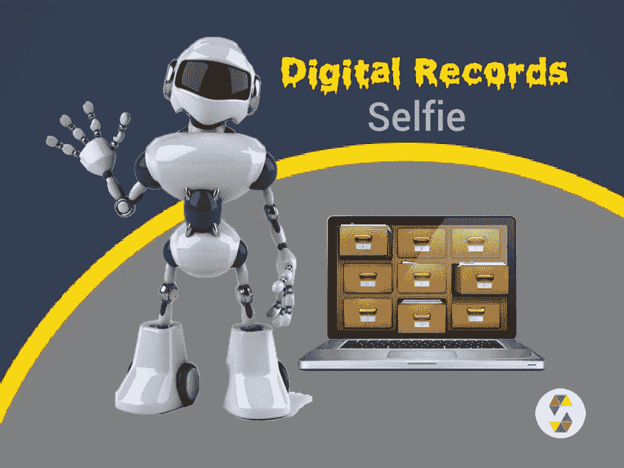

# 石油与数字记录，以人工智能燃料的形式重复历史

> 原文：<https://medium.com/swlh/oil-vs-digital-records-repetition-of-history-in-the-form-of-fuel-for-artificial-intelligence-133469490d84>

如果特定的机制能够让每个人在一生中收集他/她的数字记录(行为跟踪),并管理自己的数据，这将是每个人的巨大财富。在这种情况下，谷歌、脸书和……的机器人和爬虫将被个人机器人取代，或者至少被迫与个人机器人合作。因为他们的个人机器人完全可以获得个人数据。

这篇文章的作者是索马耶赫·戈拉米女士和迈赫兰·卡泽米尼亚先生，文章于 2018 年 12 月以波斯语和英语写成。

[*波斯文*](https://www.soliset.com/digital-records)

近年来，像脸书和谷歌这样的公司已经从在线广告中赚了数十亿美元。他们的经理和员工的主动性、创造性和创新性是这些成功的最重要因素。但可以肯定的是，这一过程的饲料和燃料是网络用户的在线跟踪或个人行为的数字记录，这些记录由这些公司逐渐和不断地收集和存储。换句话说，在许多情况下，如果没有访问和使用个人行为的数字记录，就没有今天的成功。提醒一下，人工智能的使用只是基于信息和细节。

在这方面，已经进行了许多努力来通过访问个人的数字记录来预测个人的私人特征和属性。还有许多关于这一主题的研究论文和文章。例如，2012 年，在 [*的 PNAS 文章*](https://www.pnas.org/content/110/15/5802) 中，通过使用 58000 个统计样本，证明了脸书可访问的数字记录可以自动准确地预测广泛的个人特征，如性取向、种族、宗教和政治观点、性格特征、智力、幸福、成瘾物质的使用、父母离异、年龄和性别。与此同时，2018 年的剑桥分析公司丑闻就是在这种背景下发生的，你可能还记得，2018 年，脸书首席执行官马克·扎克伯格在该公司的剑桥分析公司丑闻发生后，就脸书的数据隐私做法向参议院委员会作证。

[Facebook’s Cambridge Analytica data scandal](http://www.laloyolan.com/news/facebook-s-cambridge-analytica-data-scandal/article_702b3c7a-f972-539c-a7f8-f202fd478634.html)

人们还为透明度做出了其他努力，如 [*数据自拍*](https://dataselfie.it/#/) ，这是 Chrome 浏览器的扩展，旨在帮助人们了解脸书对他们的了解程度。通过下载数据自拍，该软件像脸书一样跟踪人们的活动，但数据自拍的目标是在用户不知情的情况下，显示有多少用户信息是可跟踪的。

[Data selfie >> The information you share consciously and unconsciously](https://dataselfie.it/#/)

同时，这个主题在各个方面都很重要，例如，很明显，像脸书、谷歌这样的公司，通过收集越来越多的用户信息，他们会赚得更多。相反，如果我们保持乐观，不去设想将来会有什么进一步的误用！也许这些情况对用户来说还不错。例如，用户可以更容易地找到他们喜欢的书或其他类似的物品。

但事实是，人们往往连自己的信息都无法访问和管理，而且个人也没有办法利用这些可用的信息。例如，人们永远无法修改他们的信息或开发和整合这些信息，或者他们无法将这些信息提供给其他广告公司，或他们的顾问或心理医生。同时，在人工智能的帮助下存储、处理和分析这些信息可以在个人形式上有其他成就，但目前，一切都被收集和处理这些信息的公司所拥有和垄断。这篇文章的主要问题是一样的，社会成员无法获得自己的信息，只能非常有限地分享这些成就，这公平合理吗？

一种特殊的机制使每个人能够收集她/他一生的数字记录并管理其数据，这对每个人来说都是一笔巨大的财富。同时，通过使用人工智能和个人机器人，可以为社会实现更多。在这种情况下，谷歌、脸书和……的机器人和爬虫将被个人机器人取代，或者至少被迫与个人机器人合作。因为他们自己的个人机器人完全可以获得个人数据。

# 重复石油的历史，这一次是个人行为的数字记录。

第二次世界大战后，石油在工业世界的发展中发挥了重要作用。每天，各种行业和车辆对石油的需求都在直接和间接地增加，石油被称为“黑金”。许多拥有石油储备的国家长期以来没有意识到石油的重要性和价值，并放弃了以最低价格勘探和开采其储备的权利。这些国家的人民和政府通常把石油称为又黑又臭的物质，一文不值，很容易燃烧。但当他们逐渐意识到石油的重要性和真正价值时，他们提高了石油销售的价格，甚至在很多情况下取消了之前的协议，认为这些协议很残忍。

个人行为的数字记录在很多情况下就像石油一样，甚至可以被赋予“数字黄金”的称号。直到二十年前，很少有人能够通过收集和存储无关紧要的信息(以个人行为的数字记录形式)赚取数十亿美元。有些人已经一步一步地朝着这个方向前进，他们的成就为他们自己创造了数十亿美元的公司，也为世界人民的生活带来了更多的繁荣。

乍一看，一切似乎都符合。但产生这一天文数字收入的燃料和饲料是个人的数字记录，目前其所有权和管理实际上只属于这些公司。如前所述，继续这一进程似乎不合理也不公平。个人应该在拥有、管理和利用自己的信息方面发挥主要作用。

Oil vs. Digital Records

增加数字记录价值的原因与石油相似，都是因为工业或技术公司通过努力和使用石油或数字记录获得了巨额收入，从而提升了数字记录的价值。当然，在开始工作时，原业主没有赚钱的角色，但在了解此事后，原业主要求大份额是相当合理和公平的。出于这个原因，也许石油的历史将会重演，我们将会目睹许多关于个人行为数字记录所有权的法律辩论。

# 为什么人们需要存储他们的数字记录？

或许含糊之处在于:我们知道脸书、谷歌和……不承认他们的用户，并存储用户的数字记录以帮助更多地了解他们。但是，当个人可以表达自己对任何主题的观点、品味和需求时，他们为什么要保留自己的数字记录呢？

首先，人们对自己和自己品味的描述并不精确。其次，人的记忆力非常有限。例如，在数字记录中可以不断地存储一个人在一段时间或一生中访问过的所有互联网地址，甚至真实地址和位置(使用 GPS 和……)，以及停留时间等细节，但人的记忆没有这样的能力。再次，人工智能需要大量的信息和细节才能做出正确的决定和结论。提供的相关信息和细节越多，人工智能的效率就提高得越多。这就是为什么脸书没有针对每个主题和广告的特别问卷。但是了解人们并预测他们的个人特质是以个人的数字记录为基础的。每个主题所需的问卷将会非常庞大，而且肯定不可行。比如想象一下 Pinterest 想通过一个问卷调查得到的信息，找到并提供你想要的图片！我们都知道这是不可能的。

[Do you trust Google to protect your data](https://www.quora.com/Do-you-trust-Google-to-protect-your-data)[?](https://www.quora.com/Do-you-trust-Google-to-protect-your-data)

人工智能近年来的巨大进步和发展，直接受到了日益增加的信息和细节的影响。这些信息通常存储在互联网上或者……因此，个人的数字记录对他们自己来说是一项巨大的投资，因为它们是人工智能在不同方面的最佳素材；多样性、细节、完整性和准确性。当然，随着时间的推移存储这些信息可以为个人机器人提供最高的精确度。脸书和谷歌等公司的用户信息量不低，但无法与个人机器人存储的个人行为数字记录的信息量相比。据说，脸书只需考虑脸书上的 10 个赞，就能比同事更好地预测个人的性格和行为，比邻居更好地预测 70 个赞，比父母更好地预测 150 个赞，比配偶更好地预测 300 个赞！

让我们想象一下，通过获取个人一生的所有数字记录，并利用人工智能的最高成就，个人机器人如何能够对人类有用并接近人类。这些机器人能够深入识别个性特征，并拥有丰富的准确信息，可以为人们服务。

# 个人机器人是如何工作的？存储数字记录的机制是什么？

要设计个人机器人，机器学习和人工智能方面的大量经验和成果都是有的。谷歌和脸书在智能广告活动、电报机器人、微软和亚马逊的虚拟助手以及数十种相关软件方面的经验是这方面的实用知识。

此外，我们都很熟悉个人机器人的各种不同功能。假设你要阅读新闻，就像 Pinterest 对照片做的那样，你自己的个人机器人对标题做的那样。意思是，根据你的口味和兴趣，给你提供新闻的标题。现在，假设你正在计划一次旅行，你会发现所有合适的选择，例如，门票和酒店，按照你通常的口味和你最近的愿望排序。

个人机器人可能需要一点时间，但总是会用从你的数字记录中间接获得的新信息来更新自己。为了存储个人信息和记录，个人机器人依赖于提供的内存，但这些信息肯定是加密的，因此只有个人自己才能决定通过个人机器人来使用它。用户可能希望使用笔记本电脑的内存(本地存储)来存储他们的数字记录，或者他们可以从云存储或大公司的存储服务器中获得帮助，或许分散式网络和区块链技术可以提供信息的保护和独家使用。

Digital Records >> Selfie

该主题最重要的部分以及与今天情况的不同之处在于，人们应该能够为自己的数字记录做出决定，并且这些信息的所有权和管理权应该只放在他们手中。不幸的是，现在情况并非如此，甚至没有一种机制可以让个人在任何需要的时候使用他们的数字记录，供个人使用或发送给广告公司或心理学家或任何他们想要的人。

这是文章的结尾，我们期待收到您的反馈。

## 2018 年 12 月 23 日
索马耶赫·戈拉米
迈赫兰·卡泽米尼亚

[网站](https://www.soliset.com/)
推特
[电报](https://t.me/soli_set)

## 这篇文章发表在 [The Startup](https://medium.com/swlh) 上，这是 Medium 最大的创业刊物，拥有+402，714 名读者。

## 在此订阅接收[我们的头条新闻](http://growthsupply.com/the-startup-newsletter/)。

