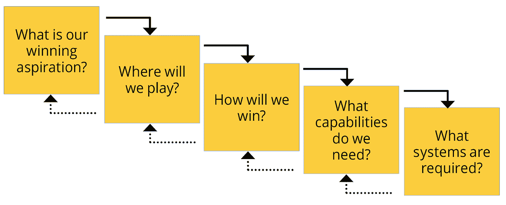
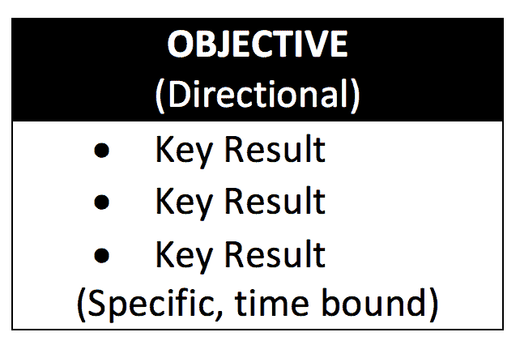
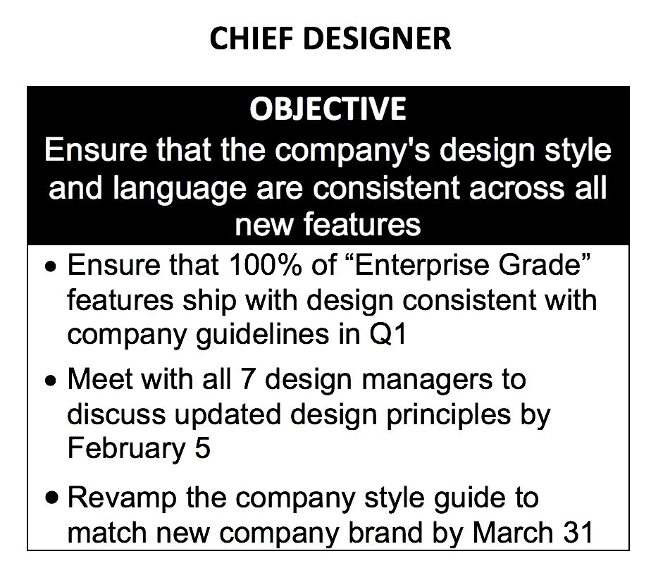
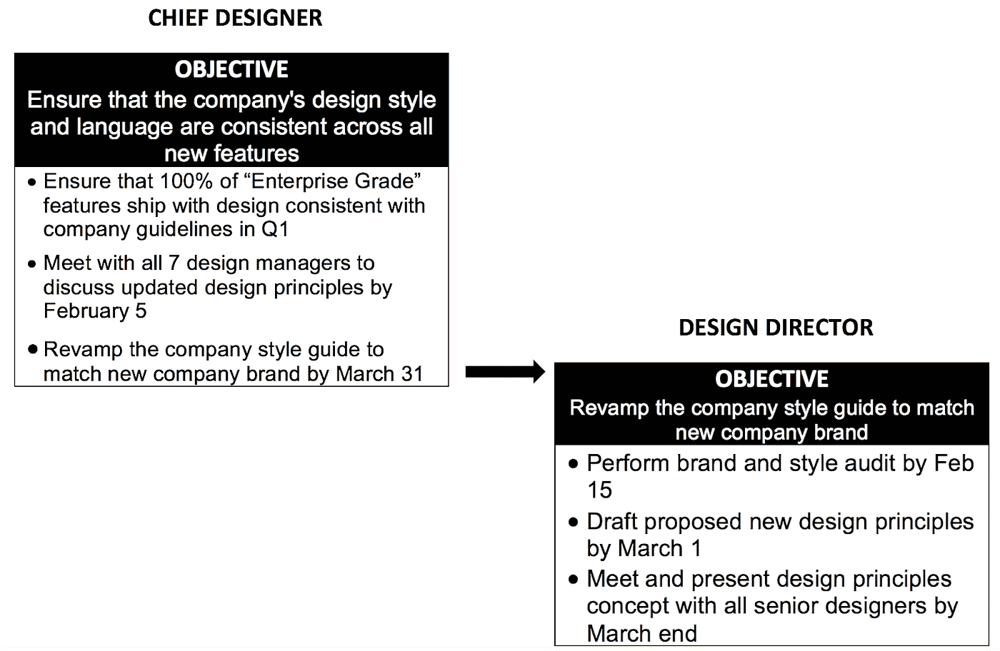
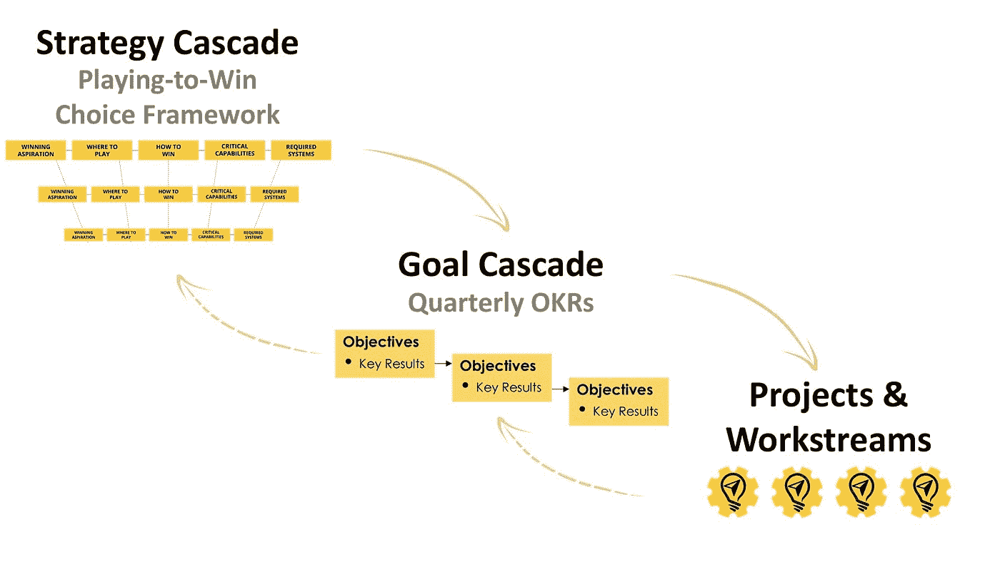
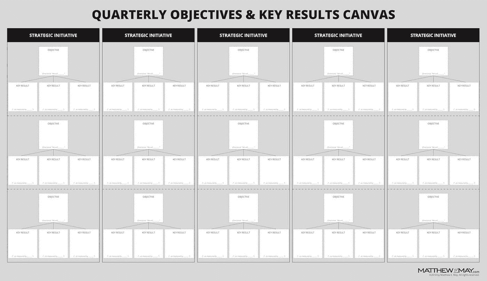
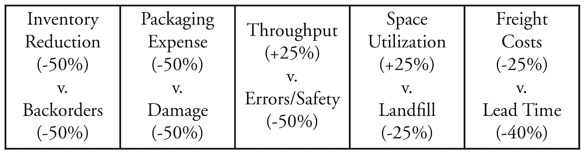

# OKRs:战略部署的神奇钥匙

> 原文：<https://medium.com/swlh/okrs-the-magic-key-to-strategy-deployment-d0a070ad4bf1>

(source: Bigstock Photo)

“所以你充满激情？有多热情？你的激情会引导你做什么？如果心没有找到与头脑完美的韵律，那么你的激情就毫无意义。OKR 的框架培养了疯狂，包含在其中的化学反应。它为我们提供了一个充满风险和信任的环境，在这里失败不是一种可被解雇的罪行。当你拥有这样的结构和环境，以及合适的人，魔法就在眼前。”——**波诺**， *U2*

作为一名战略和创新顾问，我花了大量时间与高层领导团队合作，主持会议，重点回答五个基本问题:

*   *我们的成功愿望是什么？*
*   我们去哪里玩？
*   *我们将如何取胜？*
*   *我们需要什么能力？*
*   *需要哪些管理体系？*

这就是现在众所周知的战略选择框架，被称为“为赢而战”，由罗杰·马丁开发，并在他的同名书中提出。在过去的五年中，这个框架已经在世界上许多最成功的企业中扎根，原因很简单，那就是它是一种简单而有效的方式来理解一个许多人觉得令人畏惧或痛苦，或者两者兼而有之的概念:*战略*。

在这种观点下，战略的定义与其说是一个分析或计划，不如说是一系列紧密结合的 *选择*的*级联，这些选择将玩家独特地定位于创造相对于竞争的可持续优势和卓越价值。*

如果做得好，在企业层面以这种方式定义的战略也应该通过组织向下传递到部门、业务单位、职能、团队，以及理想情况下的个人。让整个组织在概念上与关键选择保持一致，是走向主导特定游戏空间的有力一步。

然而，在某种程度上，战略制定者必须将注意力转向第六个不同的问题:*我们将如何有效地部署我们的战略？*

换句话说，他们必须根据自己的选择采取行动。

我经常看到公司对他们闪亮的新战略如此兴奋，渴望开始行动，以至于他们立即投入到项目和工作流程中。很多时候，我看到最初的重点被散弹枪式的部署方式冲淡了。这提出了一个真正的问题，让领导人挠头想知道哪里出了问题。

答案是，在他们善意的热情中，他们忽略了一个基本但关键的步骤:设定目标，提供可衡量的里程碑并交付具体结果，让他们知道他们的战略是否在轨道上以及在多大程度上有效。这些目标应该以与它们所支持的策略相同的方式级联。

输入“目标和关键结果”或 OKRs 的概念。如今，作为一个广为人知并被广泛采用的推动进步的框架，缩写词 OKRs 是由传奇的英特尔首席执行官安迪·格罗夫创造的，他在 20 世纪 70 年代中期担任高级工程经理时创造了这个词，作为推动执行力的一种手段。OKRs 是格罗夫对彼得·德鲁克的“目标管理”的继承。格罗夫把 OKRs 教给了他手下的人，其中有一位名叫约翰·杜尔登的年轻工程师，他在英特尔工作了五年后，加入了凯鹏华盈(Kleiner Perkins)，这是一家硅谷风险投资公司，他现在担任董事长。

多尔在他最近出版的畅销书《衡量什么是重要的》中写道，格罗夫这样解释了他对管理的简单而有效的观点:“目标系统管理的两个关键短语是目标和关键结果，它们符合这两个目的。目标就是方向。关键的结果必须被衡量，但是最后你可以毫无争议地说，‘我做了吗，或者我没做吗？’是的。不简单。没有任何评判。"

okr 的工作非常简单:目标是意向的方向性陈述，即“什么”每个目标由三到五个关键结果进一步界定，这些结果是具体的、有时限的，因此是可衡量的。关键结果是“如何”一般来说，okr 与年度目标挂钩，但每个季度都要设定、跟踪和评估。

OKR 的结构也很简单:

然后，关键结果会向下传递到公司的下一级，成为该级目标的基础。然后，该级别设定他们自己的关键结果，这些结果成为下一级别的目标，以此类推。

例如，ABC 公司的首席设计师制定季度 okr:

然后，她的关键结果将成为下一个适当级别的目标。例如:

下一级，也许是高级设计师，然后采用设计总监的关键成果作为他或她的目标。

像任何好的框架一样，okr 是可访问的，并允许来自组织所有部分的输入和解释，包括较低的级别和外部边缘。但就像任何技术或方法一样，如果走极端或以非本意的方式使用，它将无法产生预期的结果。就 OKRs 而言，期望的结果是透明的结盟和参与。

例如，okr 只被用作松散的指导方针，并被狭隘地解释为陈述目标的胡言乱语，它只不过是一个花哨且有点智能的待办事项列表，与除了编写它们的个人之外真正重要的事情无关。另一方面，作为一个不允许下级包括他们自己的目标的严格的行军命令，OKRs 将走上传统的绩效评估的道路，这是大多数专业人士私下讨厌的事情，认为没有什么价值，但却不得不做，因为公司政策规定他们必须这样做。

从概念上讲，okr 位于级联策略和工作流/项目之间。

在我的工作中，我发现 OKR 研讨会是一种快速有效的方法，可以一次一个层次地发展 OKRs。为了让事情进展顺利，我创建了一个可共享的 [wall canvas](https://www.dropbox.com/s/rnwhczbp89u51sn/OKRCanvasGeneric.pdf?dl=0) ，它运行良好，允许跨职能的小团队专注于他们的目标和关键结果，同时促进透明度、参与度和协作。

理想情况下，OKR 会议的结果应该公开分享，根据反馈进行调整，并输入到一个易于使用的系统中，以跟踪和交流视觉进度。这样的系统不需要非常复杂，甚至不需要数字化。

## **神奇的“弹力”OKRs**

正确使用时，OKRs 可以产生非凡的转变，看起来确实像魔术。在我担任丰田战略顾问期间，我目睹了很多，丰田在他们的零部件供应链运作中完成了一项看似不可能的任务。

新任命的部门总裁为这个 20 亿美元的部门制定了一个由三部分组成的延伸目标。她认为这个组织很好，但还可以更好。她的目标是重新思考并改造整个供应链，使其在敏捷性和创新性方面达到她认为的世界级运营水平。她设定了三个关键结果:降低 1 亿美元的运营成本，从供应链中去除 1 亿美元的库存，以及丰田经销商的客户服务评级提高 50%。她告诉她的高级领导团队，她希望在三年内实现这些目标，这让他们感到震惊。

称这些为挑战性目标是一种保守的说法。他们是 BHAGs，用吉姆·科林斯著名的首字母缩略词来表示巨大的、令人毛骨悚然的、大胆的目标。

哭喊着“不可能！”大声喊道。(注意:在设定目标以推动新思维时，让人们走出舒适区至关重要。换句话说，最初的不可能性通常是一件好事。)

但部门总裁对她的高级领导团队充满信心，不会妥协。她知道降低自己的雄心只会导致更努力或更长时间的工作，而不是更聪明，当然也不会更有创新性。她要求她的团队集思广益找出答案。

他们做到了，通过跨职能部门的横向协作。为了实现总统的主要目标，她的高级领导确定了需要达到的十个目标:

*   **减少 50%的库存**
*   **将延期交货减少 50%**
*   **减少 50%的包装费用**
*   **减少 50%伤害。**
*   **将吞吐量提高 25%**
*   **提高安全性/减少 50%的错误**
*   **将空间利用率提高 25%**
*   **减少 25%的垃圾填埋使用量**
*   **降低 25%的运费**
*   **将交付周期缩短 40%**

这个部门从未尝试过如此高的标准。但更具攻击性的目标实际上以新的方式吸引了人们的大脑，迫使他们重新思考和设计流程。

魔法存在于 OKRs 设定的隐藏维度中。该倡议的最终使命是改造整个供应链，但任何供应链的各种自然功能之间都存在固有的冲突。该战略的真正艺术在于认识到这些紧张关系，引起对它们的关注，并利用它们来激发新的思维和推动合作。

乍一看，十个目标的列表似乎是一个简单的主愿望列表。但是再看一眼。看看你能否找出紧张点。

给你个提示。看一下前两个目标，库存和延期交货。在大多数供应链中，它们是同一枚硬币的两面。增加库存，减少延期交货。库存减少，延期交货量普遍上升。因此，高级团队出色地，但违反直觉地，将两者配对，让一个对抗另一个，以产生创造性的张力。

如果你回头看看上面的列表，你会发现这十个目标实际上是五对相互冲突的目标。这个简单的图形有助于可视化配对:

并非所有的 okr 都完全满足，但该组织已经非常接近了:从库存和成本中扣除了 9，000 万美元，客户服务改善了近 40%。但这就是“延伸”OKRs 的本质:任何完成率在 70%及以上的都被认为是成功的。

想想看，如果你 100%完成了你所谓的伸展运动，它们到底有多伸展？

## **外卖**

当您努力部署您认为可靠的战略时，当项目和工作流看起来奇怪地与战略脱节时，考虑采用目标和关键结果框架。您所寻求的转变可能只需几步之遥。

## 这篇文章发表在 [The Startup](https://medium.com/swlh) 上，这是 Medium 最大的创业刊物，拥有+397，714 名读者。

## 在这里订阅接收[我们的头条新闻](http://growthsupply.com/the-startup-newsletter/)。

