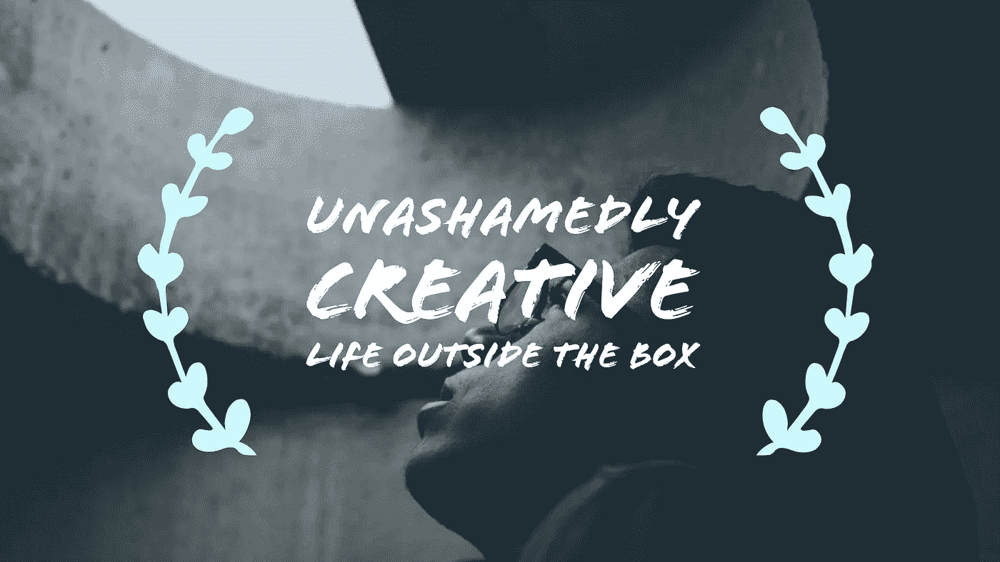

# 大胆创新

> 原文：<https://medium.com/swlh/on-being-unashamedly-creative-e1d80743107>

如何在生活中拥抱创造力

有一根线。它从创意到创意，从艺术家到艺术家，从作家到作家。一张无形的网将我们所有人联系在一起，无论我们的地理位置、艺术追求、语言、信仰、年龄、政治观点或国籍如何。当我们遇到另一个创意时，这个无形的网络在我们之间建立了联系。这是一个共享的范例，一段共同的历史，进入艺术家秘密社团的密码。它微妙却强大，它困住了我们所有人。

就在昨晚，我在浏览 Instagram 时，无意中发现了两位令人难以置信的作家的两篇帖子，它们呼应了我一生都感受到的相同情绪。多年来，我听到无数成功的作家、摄影师和艺术家/创意人员重复这种观点。这种情感勾勒出了将我们所有人联系在一起的线索。这是什么？是内心的声音制造了对脆弱的压倒性恐惧，就像一个鹰钩鼻的女巫不知疲倦地在她的大锅上工作。

这是一个声音在说，*“你的努力不值得，你的技能缺乏，你的方法完全错误，你疯狂地离开安全和现状，你永远不会真正成功地追求抓住你的心并驱使你创造的梦想。事实上，你完全是在妄想，你这个疯子。你有问题。你最好的做法是抓狂，害怕，整夜担心，怀疑你创造的一切。戒就戒，戒就戒！”*

令人心碎的是，在我周围的几乎每一个创意中，都有这种声音的[证据。如果得不到解决，它会导致沮丧，因为内心的梦想和激情就像日出前的篝火一样开始萎缩。如果我们幸运的话，就只能到此为止了——梦想的破灭和它的缓慢衰退。如果我们不幸运，而且我们大多数人都不幸运，事情会比这更严重。梦想破灭了，留给我们的是空虚，但我们渴望更多的东西。我们已经尝到了创造之火的滋味，我们已经感受到了我们的艺术表达像穿过乌云的太阳一样迸发出来的激动，我们就是不能忘记它！空虚和绝望像某种黑暗和邪恶的东西聚集在一起，开始用痛苦和嫉妒的剧痛刺穿我们的内心。那么我们就不能再庆祝别人的成功了。相反，我们用一句“如果我想的话，我可以做到的”来打发它，并在哭泣和内心愤怒的同时继续前进，因为我们觉得我们已经错过了我们的机会。这是一种流行病，这是真实的，我一直在那里，并不时接近边缘…](http://www.michaelehenson.com/blog/schizophrenic)

但是，还有希望！我们不必为失去的机会而痛苦，也不必在脆弱的阴影下颤抖。我们可以打破我们建造的盒子的墙壁，收集我们深藏在内心深处的那些梦想的碎片，并开始按摩它们回到生活中。各位艺术家和创意人员，这是我的请求，迈出这一步吧！

# 采取行动

如今，要让自己脱颖而出非常困难。宇宙中讽刺的数量正在达到危险的水平。我们生活在一个人们在社交媒体上分享生活方方面面的世界。我们被食物、衣服、一张接一张的自拍以及其他各种荒谬的图片所淹没，这些图片构成了数亿人平凡的日常生活。尽管如此，我们还是不愿意分享我们的艺术。为什么？

这个问题的一部分是，这几亿人没有真正分享他们自己。他们只分享了很小一部分的精华。不仅如此，他们分享的那一点点自我很可能是欺诈性的。它被安排得看起来“只是如此”，或者它在我们没有真正看到现实的地方进行了某种程度的干预。他们不真实也不脆弱，所以实际上比看起来更安全…

让社交媒体偶像易于分享的正是让我们难以[分享我们的创造性追求](http://www.michaelehenson.com/blog/tips-for-creatives)的东西——脆弱性。为了真正创造有价值的东西，我们 ***将自己*** 倾注其中。无论是一首歌、一本书、一篇博文、一篇文章、一幅画还是一首诗，我们将艺术融入生活的努力不可避免地在每一次创作中留下了我们的一部分。有时候，我们甚至意识不到我们为艺术所做的牺牲有多深，直到我们要分享它的时候。只有那时，我们才开始感到紧张和脆弱。突然，我们害怕让我们的创造进入这个世界，因为我们不能忽视随之而来的风险。人们可能不喜欢它，甚至更糟，他们可能会忽略它！在我们的艺术中，我们尽可能以最真实的方式分享我们最私密、最个人的想法和情感。这种犹豫没有错，这是所有艺术家都必须克服的障碍。一旦你迈出了这一步，扫清了障碍，就永远不要停止！世界**需要**释放你的创造力！你有故事、洞察力、创造力和知识，而这些只有你拥有。我和世界各地的创意人员恳求你，**继续创作！！**

拥抱创造力的过程包括改变我的生活方式。随着我在旅程中走得更远，我意识到真实的重要性，拥抱我的创造力，并让它发光。长久以来，我把我的创作兴趣和想法藏在我心灵阁楼的一个积满灰尘的小盒子里。我一直瞒着我的朋友和家人，因为泄露出去很可怕。我担心别人会怎么想。我不想被贴上呆子或傻瓜的标签。这份名单会一直列下去……我脑海中那些尖叫着让我放弃的声音不知疲倦。然而，我已经决定我的创造力值得冒险。我写的文字，我拍的照片，我拍的视频，我画的信和艺术作品，以及我进行的深入交谈都值得与“盒子外的生活”相关的风险。我被赋予了无与伦比的创造力和追求创造力的激情。我会失去理智，继续让这种生活的压力、环境的压力和我自己对脆弱的恐惧阻止我这样做。这是我在自己的生活中开始的一场运动，也是我与我认识的每一个创意者分享的一句口头禅——*。拥抱你的创造力，热爱它，享受它，并且[让它像太阳一样在你得到的每一个机会中闪耀。我个人是这样做的，我鼓励你也这样做。正如你所做的，我很乐意与你联系，听你的故事，欣赏你的艺术！](http://www.michaelehenson.com/blog/ice-cream-truck)*

*加入大胆创新的运动吧！如果这引起了你的共鸣，一定要订阅关注我，给我留下一些评论，鼓掌，和[我们来连线](http://www.michaelehenson.com)！*

*我认识的许多创意人员都面临着同样的挫折和内心斗争。这是一种流行病，但有一种方法可以[拥抱你的创造力](http://www.michaelehenson.com/blog/embraceyouridentity)，仍然保留内心的负面声音，并打破你的盒子与世界分享你的艺术— *创造之旅*。一本充满见解和经验的电子书，旨在让你的创作追求更上一层楼。*

# *[点击此处获取免费副本！](http://www.michaelehenson.com/opt-in)*

**

## *这个故事发表在 [The Startup](https://medium.com/swlh) 上，这是 Medium 最大的企业家出版物，拥有 271，206+人。*

## *在这里订阅接收[我们的头条新闻](http://growthsupply.com/the-startup-newsletter/)。*

**