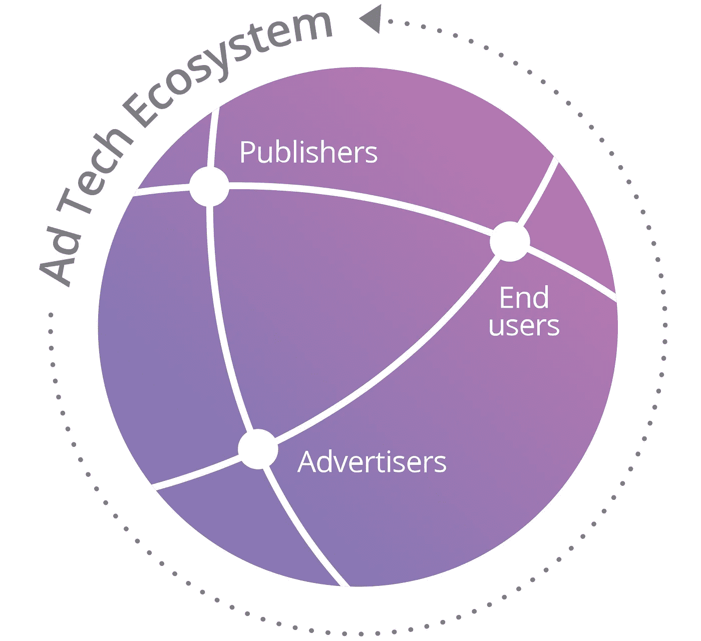

# 论打破垄断🤔反思移动搜索，速度快 10-100 倍。介绍 WonderSwipe👆🏼

> 原文：<https://medium.com/swlh/on-breaking-monopolies-rethink-mobile-search-10-100x-faster-introducing-wonderswipe-fe3158ca5436>

## 搜索不同。

Also see: WonderSwipe’s more complete 30s [demo video](https://www.youtube.com/watch?v=kTCl1QLpw_I)

我是冯盖瑞。15 年前，我开始把 isoHunt.com 作为一种爱好。现在我开始 [WonderSwipe](http://wonderswipe.com) ，我的第二个爱好。我希望它还能有更多的意义，而且胸怀大志永远不会有坏处。

许多人试图打破谷歌的搜索垄断。我相信他们都失败了，因为没有人，即使是微软的必应/雅虎，能够正面攻击谷歌的搜索垄断。对抗谷歌的 AI 智囊团，数据和基础设施，不可能有胜利。但这也不意味着每个人都应该放弃和停止网络搜索的创新，因为它是**停滞不前**。

第一，上一个大垄断是什么？窗户。什么打破了它？这不是真的坏了，但 iPhone 和智能手机让个人电脑变得越来越无关紧要。

> 你不能废黜国王，但你可以缩小王国。(这可能是一个糟糕的类比)

我相信随着越来越智能的人工智能，谷歌将继续成为占主导地位的搜索引擎。没有人知道如何运行一个比谷歌更优化和可扩展的搜索引擎。但我看到了人类知识看门人周围的方式，因为我相信对人们来说，整个搜索/研究体验和知识管理不仅仅是算法和基础设施:

1.  一个用户界面工具，一个移动前端，除了“简单地”移植桌面的搜索界面和维护搜索排名算法，谷歌在这方面没有创新。这是 WonderSwipe 的第一阶段，上周在 iOS [应用商店](https://itunes.apple.com/us/app/wonderswipe-research-browser/id1336740934?mt=8)推出。
2.  一个真正的搜索社交层:通过 WonderSwipe 的亮点，你可以策划和众包每个搜索查询的最佳信息。高亮显示就像在 WonderSwipe 中长按摘要一样简单。让在网上管理人类知识再次成为一个更人性化的过程。人类的专业知识和治疗不是人工智能可以取代的。
3.  分割搜索选项。在搜索输入点有一个简单的用户界面，你可以很容易地选择 DuckDuckGo(或其他任何东西)进行私人搜索，亚马逊(或 __)进行购物，百度搜索中国，等等。使搜索引擎可插拔，垂直，从而减少依赖任何单一的搜索引擎作为一站式商店。垂直搜索引擎也更适合每个垂直领域，比谷歌的一刀切要好。(我从 isoHunt 了解到的)

以下是 WonderSwipe 第一阶段的内容和方法，上周[推出了](https://itunes.apple.com/app/wonderswipe-research/id1336740934?mt=8)。细节决定成败。我的建议是，为了乐趣和利益，彻底反思我们如何搜索和管理知识。在这个过程中，不仅仅是为了把我们的眼球喂给广告机器，因为我们现在越来越意识到我们的[时间没有用在](https://www.youtube.com/watch?v=C74amJRp730)上。

我不会说我已经为 WonderSwipe 找到了整个产品的市场适合度，所以请告诉我这是不是疯狂/蹩脚/行不通/棒极了/或者介于两者之间。

> WonderSwipe 已于 2018 年 4 月在 iOS [应用商店](https://itunes.apple.com/us/app/wonderswipe-research-browser/id1336740934?mt=8)上线！ [**立即免费获取**](https://itunes.apple.com/us/app/wonderswipe-research-browser/id1336740934?mt=8) 。请继续阅读为什么我认为它是自谷歌以来最大的搜索工具，并观看我们下面的 30s 演示视频。如果你也认为它很棒，告诉我们并在这里为我们投票。

[WonderSwipe](http://wonderswipe.com/)’s icon, and [demo video](https://youtu.be/AuvhVxz3CGo)

网上有太多的东西&没有太多的时间去摆弄浏览器标签或在浏览器历史中来回浏览。

你上一次在智能手机上认真搜索是什么时候？根据像这样的统计数据和花在移动设备上的时间[超过桌面设备](https://www.recode.net/2017/7/24/16020330/google-digital-mobile-ad-revenue-world-leader-facebook-growth)，不太可能是最近或频繁的。对我来说，除非我被困在移动 Safari 或 Chrome 而没有笔记本电脑。包括谷歌在内的移动网站在智能手机有限的屏幕空间上投放更多广告，这并没有帮助 UX。

👉🏼所以，下面的 ***3 个场景*** 要用 [WonderSwipe](http://wonderswipe.com/) 代替常规浏览器，所以移动搜索停止吸吮:

1.  ***太慢；没搜？***
    10–100 倍的文章加载和浏览速度，在应用内测量。慢速数据网络上的差异甚至更大。
2.  ***结果太多；没浏览？***
    无标签:轻松浏览搜索结果，无需点击或背景标签标签标签标签标签标签。
    免提模式:自动浏览，搜索结果摘要像有声读物一样读出并同步滚动。
3.  ***太长；没看(TL；DR)？***
    阅读器模式(如 [Pocket](https://getpocket.com) ，Safari 的)，尽可能提供每个搜索结果的摘要。

答经过两年的开发，我相信我的解决方案已经准备好了。WonderSwipe 旨在以最快的方式找到你想要的答案。随着互联网对丰富信息过载的支持，以及最近对脸书(newsfeed)、Youtube (autoplay)、Snapchat(Snapchat)等的反弹。我们想创造一个与时间槽相反的东西，让真正的[时间](https://www.theverge.com/2018/1/17/16903844/time-well-spent-facebook-tristan-harris-mark-zuckerberg) [得到充分利用](https://www.youtube.com/watch?v=C74amJRp730)。我们希望创造新的、高效的、有意义的信息搜索、管理和分享方式。我们是像广告驱动的社交应用这样的时间消耗最大化主义者的对立面，我们希望成为时间*最小化*。这里是 WonderSwipe 第一阶段在[应用商店](https://itunes.apple.com/us/app/wonderswipe-research-browser/id1336740934?mt=8)上发布的[演示视频](https://youtu.be/AuvhVxz3CGo)，我想说这大约是功能完成的一半。

WonderSwipe demo ([in HD](http://apptrailers.itunes.apple.com/apple-assets-us-std-000001/PurpleVideo128/v4/59/21/56/592156ba-56ec-345e-45ba-b8ad5202076a/P51936542__AT_video_gr50.mp4), on mobile), on iPhone X — searching 🔍 **dunkirk date before or after pearl harbor**

iPhone 6 version

注意 [WonderSwipe](http://wonderswipe.com/) 是 ***不是*** 一款浏览器。这是不同的东西，一个研究和参考工具。当你的搜索不是琐碎的时候，它会最好地增强搜索，并显示信息性文章，WonderSwipe 可以对其进行文本提取和摘要。WonderSwipe 的第二阶段将添加高亮显示和注释供您自己参考，并使其可以在社交层共享，以便学习者可以帮助像您一样的其他学习者，快速筛选和显示搜索结果中的钻石。对于每个可搜索的主题。

我们相信，这种网络规模的社交突出将使我们转向更有意义的分享，并将[时间花在学习和管理上](https://www.theverge.com/2018/1/17/16903844/time-well-spent-facebook-tristan-harris-mark-zuckerberg),超越在病毒式参与度指标中滋生的简单喜欢和情感，推动轰动效应、假新闻和广告时间下沉。

WonderSwipe 目前在[推出](https://itunes.apple.com/ca/app/wonderswipe/id1336740934?mt=8)是*而不是*浏览器，唯一的目标是进行搜索，并在结果中找到你的答案*可笑的* ***快速*** 。当你想要一些网站的完整 HTML 功能时，它确实包括应用内浏览器(iOS 上的 SafariView)作为一个点击式备用。(在[演示](https://youtu.be/AuvhVxz3CGo)视频中，应用程序右下角的地球图标)

我在 BitTorrent 搜索引擎 [isoHunt](https://www.reddit.com/r/IAmA/comments/t9g4q/i_am_gary_fungih_founder_programmer_of_isohuntcom/) 上工作了 11 年，在此之前，我一直在使用和观察谷歌的发展。我相信 WonderSwipe 将成为继谷歌之后网络搜索领域最大的用户体验改进。这要从我们意识到移动搜索现在很糟糕开始。

More and more computing time shifts from desktop to mobile, while time spent on the Web in current browsers shrink.

Mobile web browsing haven’t fundamentally changed much. And all serious web browsing start with a search.

# 网络的问题

随着内容的激增，网络搜索变得越来越乏味。智能手机加剧了这种情况。我会点击一个有希望的搜索结果，等待 5 秒钟([相当乐观](http://ns.umich.edu/new/releases/25026-accelerating-the-mobile-web-vroom-software-could-double-its-speed)在最好的手机网络条件下)，读一点，看到它与我要找的东西无关，点击浏览器返回到谷歌的搜索页面，滚动到另一个有希望的搜索结果，冲洗并重复。对一个重要的感兴趣的话题进行任何认真的搜索都太乏味和缓慢了。

这种模式在桌面浏览器上类似，尽管它在更快的 WiFi、浏览器标签之间的轻松切换(这样你就可以在后台加载搜索结果，而无需点击和等待)、浏览器扩展以及轻松的 Cmd-F / Ctrl-F 来突出显示找到的网页中的关键词以便快速浏览的帮助下会更好。

> 但是，如果你能以 10-100 倍的速度进行移动搜索，并拥有我在上面列出的桌面浏览器的所有优点，会怎么样呢？

除了一点，WonderSwipe 不能让你在任何地方都有快速 WiFi。但它确实弥补了网速慢的问题，在整体搜索体验上可能会超过桌面访问速度。(从这里开始简称 SX，就像在 [UX](https://en.wikipedia.org/wiki/User_experience_design) 一样)

# WonderSwipe 的解决方案

这就是 WonderSwipe 提供的内容，向您展示超级智能手机:

*   通过水平滑动搜索结果，在搜索结果之间导航，就像在照片库中滑动一样。WonderSwipe 的基石是这个完全手势化的 2D 用户界面。(更多见下文)
*   就在谷歌返回一页搜索结果后，WonderSwipe 开始工作，在后台并行加载所有 10 个结果。因此，你滑动到的第一个结果可能仍然像普通浏览器一样需要 5 秒钟(但可能更短)，你滑动到的其他结果不需要等待时间。
    这是我在标题中提到的知识访问速度快 10 倍的**最坏情况。**
*   每一个结果将或者以网页的原始 HTML 和 Javascript 呈现(在加载时间的最坏情况之上)， ***或者*** 如果检测到是一篇具有要提取的文本主体的文章(由[前可读性](https://mercury.postlight.com/web-parser/)提供支持)，则该文本将被进一步概括并呈现。
    本文文本提取+摘要避免了 Javascript、HTML 渲染和早期图像加载，即使在摘要中添加了移动 CPU 处理，**平均将结果访问时间减少了 2 倍**。屏蔽需要 Javascript 的文章中的[广告和其他不受欢迎的内容](http://uk.businessinsider.com/ad-tech-executives-refuse-to-admit-ads-slow-down-web-pages-2015-7)是一个副作用，对于像你这样的用户来说，这是加快访问速度所必需的，不会有任何影响。
*   如果出现文章摘要，点击其中一个摘要即可查看网页的全文。包含该摘要的段落将滚动到原文中。
*   如果您之前的搜索或任何其他 WonderSwipe 用户的搜索找到了一篇文章，带有摘要的结果会缓存在我们的云中。加载来自我们云缓存的结果只需 0.5 秒！这是加载时间减少 10 倍的另一个因素，总共将知识访问速度提高了 100 倍。

WonderSwipe’s debug console, logging timestamps of the ideal case. Here, 9 cached results load in parallel within a total of ~0.5s, in total.

## 此外，奖励:

*   您的搜索查询的关键字会在每个搜索结果、HTML 网页、摘录的文章文本或摘要中突出显示。
*   当你阅读时，WonderSwipe 保持在纵向模式，即使你在探索知识的过程中对卫生纸和其他东西大惊小怪，并且不可避免地不知不觉地旋转你的手机。你可以在一个完整的网络视图中阅读搜索结果，只有图片和视频启用了横向模式。
*   **免提模式。**将您的搜索结果变成有声读物！在任何汇总的搜索结果上，点击📢扬声器图标打开文本到语音转换模式。阅读视图中的当前摘要句子，并在阅读时向下滚动摘要。当一个搜索结果的所有摘要都被阅读后，WonderSwipe 将自己“滑动”到下一个摘要搜索结果，读出文章标题，并继续阅读其摘要。这种情况会持续下去，直到您再次点击扬声器图标停止，或者它到达当前 Google 搜索页面上最多 10 个结果的末尾。
*   搜索结果的缩略图被预览并显示为有弹性的标题。在摘要文章上，其他找到的图片一起列在摘要下面。
*   从另一个应用程序的复制文本中提取网络链接，然后点击搜索该链接、摘要和所有内容。（🔍粘贴:<link>在底部)

请注意，我的高达 100 倍的知识访问速度基准是依赖于网络的(很明显)。由于 WonderSwipe 的文章文本优先且仅加载的方法，并行地，通过缓存的摘要进一步加速，当在特别慢、间歇的移动网络上比较 WonderSwipe 与传统浏览器时，整体改进实际上可能更加深远。

我也没有定量地包括进一步的知识转移改进，这些改进来自于文章摘要和搜索关键词的突出显示，因为这些都有些主观。WonderSwipe 目前的朴素摘要算法平均将字数压缩到原始文本的 40%,因此从表面上看，这是加快文章阅读速度的另一个 2 倍因素。根据你的[快速阅读](https://en.wikipedia.org/wiki/Speed_reading#Skimming_and_scanning)能力，关键词高亮是进一步加速文本扫描的一个很好的帮助，在你浏览搜索结果时提取意思。因此，我可以将我的基准提高到 200 倍或更多，但是谁会考虑已经是天文数字的改进呢？😅

Wonderful!

还有你说的[语音搜索](http://streetfightmag.com/2017/06/21/why-voice-search-is-in-your-future/)呢？浏览搜索结果是如此上千年。是的，这是有用的，但这只是在严肃的主题搜索中加快了查询输入部分的速度。如果是像[这种](https://www.google.com/search?q=who%27s+the+president+of+the+united+states)的琐碎搜索，WonderSwipe 不是它设计的解决方案。你可以使用 WonderSwipe 或任何老派浏览器，直接在搜索结果的第一页找到答案。或者你真的可以问问 Siri 或谷歌或 Alexa 或 Cortana。

然而，如果你的搜索不是无关紧要的，比如“[人工智能是对人类的威胁吗](https://www.google.com/search?q=is+AI+a+threat+to+humanity&oq=is+AI+a+threat+to+humanity)”，那就需要在搜索结果的第一页之外进行一些挖掘，语音助手不太可能给出简单的答案(或任何答案)。比如，当 Siri 不能给出简单、真实的答案时，它就会默认使用网络搜索，这种情况经常发生。你也可能在谷歌搜索时找不到任何好的答案，你将不得不改进你的搜索查询。所有这些都涉及浏览搜索结果以解读相关性，这种非平凡的搜索正是 WonderSwipe *设计的目的。*

# 设计原理

WonderSwipe 源于我对移动搜索速度缓慢的认识。太慢了，而且我们经常直到稍后在桌面上才注意到，或者当你忘记的时候根本不注意。如果我们的计算范式从桌面转移到移动，我们集体后退一步，不再费心访问这个图书馆，那么网络作为人类知识的巨大图书馆有什么意义？

> 问题在于获取和知识转移的速度。

There is more to the Web than timber.

另一方面，WonderSwipe 不是浏览器的替代品。这是一个超集，围绕搜索。并非所有的搜索结果都是带有可以提取和总结的文本的文章。当 WonderSwipe 失败时，例如在没有 Javascript 就无法运行的 web 应用程序上，默认情况下会呈现原始的 HTML 网页，或者您可以通过打开应用程序中的 Web 视图来显式加载它。

WonderSwipe 试图在任何可能的地方提取意义(文章文本)，当它这样做时，它进一步应用算法摘要来解决你的 TL；DR 问题，这在移动中尤其明显。因此，这是一个进一步的认知负载减少**，超过了整个搜索体验中可测量的 100 倍加载时间减少。**

在优化 SX 时，我意识到标准浏览器的工作流程是一维的。你点击一个链接，你返回，你点击另一个链接，你再次返回或你点击一个新的链接。这是一条线性时间线，你可以在其中来回穿梭。但是，当你可以在 2D 滑动并从一个搜索结果直接流向下一个搜索结果时，为什么要局限于 1D 用户界面呢？搜索结果列表已经被方便地排序，WonderSwipe 只是将它们水平排列。向左或向右滑动下一个或上一个搜索结果，向上或向下滑动进入特定搜索结果的摘要和图像或全文。完美、流畅、完全符合 2D 的手势，因为它是为现代智能手机设计的。

这让我们想到了这个应用程序的名字。在使**滑动**成为没有按钮的单一用户交互中心的过程中，获取网络知识成为了**的奇迹**。而且是无限的——当到达搜索结果 1-10 的末尾时，再向左滑动一次会自动在谷歌上搜索下一页。进一步的滑动继续到结果 11–20、21–30 等等。

在每个搜索结果中，对于分裂成多个网页的文章，你通常需要点击中间的“下一页”, WonderSwipe 还会尝试获取所有文章页面，并将其作为一个单一的文本体呈现，然后汇总在一起。俏皮！

# 注意力是新的稀缺资源

为了完全不折不扣地为 SX 优化，我建议打破目前网络生态系统中用户的*输家*命题。对你来说，用户不是谷歌的客户，对大多数网络出版商来说，你也不是。如果你没有付钱给他们，你只是他们真正顾客的眼球，广告商。你在阅读和优化知识访问方面的便利性并不是他们的优先考虑事项，*用广告分散*你的注意力才是。

> 但是你的关注是有价值的。

This is an attention deficit crowd.

credit: [cloudflare](https://www.cloudflare.com/website-optimization/firebolt/)

随着网络信息的泛滥，它比以往任何时候都更有价值。随着我们变得越来越不无聊，注意力成了新的稀缺资源。因此，从用户的角度出发，对 SX 进行彻底的优化是非常重要的，并且需要从根本上进行重新思考。这些无关紧要的网站要么是为了赚钱而故意为之，要么是无意中带有非最佳的笨重设计，或者是对移动小屏幕和较慢网络不敏感的传统设计。如果不在客户端对它们进行整体修复，移动网络将继续变得无关紧要。有句谚语说:“资本家会卖给我们吊死他们的绳子。”我们别再买他们的绳子了。

这意味着优化网络上的知识提取到它的逻辑终点。通过完全放弃 Javascript 广告、跟踪和交互性，WonderSwipe 能够实现 10-100 倍的访问速度，而不打折扣。网络视图是一个按钮，点击它就可以找到需要的搜索结果，但它只是在你明确请求时的一个后备。

这就把我们带到了使命宣言… 🥁🥁🥁

# 未来

让 WonderSwipe 成为更大的奇迹，我们的使命是**让网络成为你的。**这是我粗略的路线图:(我稍后会写更多)

*   改进文章文本提取和摘要。我目前只是使用未经调整的，现成的图书馆。
*   对本地缓存的先前搜索结果进行离线引用和搜索。
*   一个**社交监管层**用于每个网络搜索:书签、高亮和注释。首先是个人有用，其次是公共利益——一个私人研究和笔记工具，同时也减少了从搜索查询到整个网络知识的摩擦。
*   Q&A，对于没有找到相关结果的真正困难的搜索查询。想想生命线就像给一个想成为百万富翁的朋友打电话。是的，有 Quora，但我在寻找一个更开放的系统，一个更能与搜索查询整合的系统。
*   明确的分享比 [LMGTFY](https://lmgtfy.com) 有用得多。想想可嵌入的、精选的搜索结果。
*   个性化/推荐的趋势搜索。一些公共发现的最新有趣搜索。
*   扩展增压某些类别的网站与额外的，有用的数据。例如:购物搜索结果的价格历史，假新闻检查。用于发展新的开放标准的开放 API。
*   建立/使用一个比谷歌更好的通用搜索引擎(也许)。宾，DuckDuckGo？添加其他专业搜索引擎，如亚马逊不同的垂直市场(肯定)。
*   采用[球棒](/@AttentionToken/bat-roadmap-1-0-988ed947cf0d)，如果不黄了。
*   创建一个知识硬币，让用户直接资助作者和策展人。如果 ICO 泡沫没有先破灭。
*   为(苹果)手表、平板电脑、电视、AR 眼镜、VR 谷歌调整应用大小。

WonderSwipe on a demo search (30s [video](https://youtu.be/AuvhVxz3CGo))

问题和评论？我想听听他们！没有你的参与，我做不到。这是自 2003 年 isoHunt 以来我开始的最令人兴奋的想法和项目。我希望你和我一样觉得 WonderSwipe 很有用。

阅读更多关于我们想在搜索和知识共享中解决的问题的想法，请点击 Medium(页面顶部)关注我们，或:

*   为我们投票并向我们发送关于[产品搜寻](https://www.producthunt.com/posts/wonderswipe)的反馈
*   在[时差](https://join.slack.com/t/wonderswipe/shared_invite/enQtMjk5MzM4MTYxNTU3LTZlNDI0NDMyMzAzMjA5MDFkNGUyNzI3ODZjZTI3NTU0ZmE5ZTMyYzZkZDYzMTI0NGVkM2IzNjc3ZTAzNTc1YTM)上与我们聊天，了解支持问题或反馈
*   跟随我们来到[脸书](https://www.facebook.com/WonderSwipe/)
*   [推特](https://twitter.com/WonderSwipe)美国

你想下载 WonderSwipe 试试吗？对于那些[注册测试版](https://www.producthunt.com/posts/wonderswipe)的人，你应该已经收到了一封邀请电子邮件，其中包含在 TestFlight 上兑换 WonderSwipe 的代码。如果没有，WonderSwipe 已经于 4 月 18 日在 iOS [应用商店](https://itunes.apple.com/us/app/wonderswipe-research-browser/id1336740934?mt=8)上线。

我们现在正在开发我们的 Android 版本。敬请关注。

## 这个故事发表在 [The Startup](https://medium.com/swlh) 上，这是 Medium 最大的企业家出版物，拥有 322，555+人。

## 在此订阅接收[我们的头条新闻](http://growthsupply.com/the-startup-newsletter/)。

