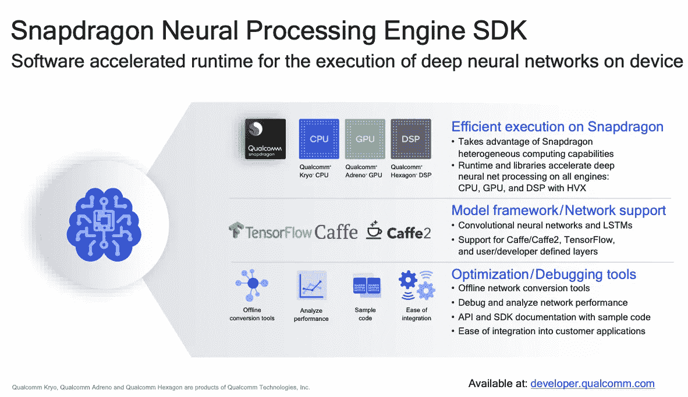

# 关于人工智能设备:下一个“智能”事物

> 原文：<https://medium.com/swlh/on-device-ai-the-next-smart-thing-c71ceda34d74>

使用设备上人工智能的好处、挑战和未来。

“black cordless headphones beside closed black laptop computer and smartphone” by [Christopher Gower](https://unsplash.com/@cgower?utm_source=medium&utm_medium=referral) on [Unsplash](https://unsplash.com?utm_source=medium&utm_medium=referral)

> 到 2022 年，80%的智能手机将具备设备上的人工智能功能，高于 2017 年的 10%——Gartner

如今，人工智能已经不再是一个科幻词汇。它已经以智能手机、智能手表、平板电脑等形式成为我们生活中不可或缺的一部分。我们今天的生活在难以想象的程度上围绕着这些设备。Siri 和 Cortana 等虚拟个人助理的使用正在增加。如果没有谷歌地图的指引，我们将会束手无策。简而言之，人工智能正在快速发展，并正在改变我们的生活方式。如今的智能设备比它们的前辈要“聪明”得多。软件和硬件领域的快速进步已经开启了一个时代，智能正在从云转移到设备上，并彻底改变我们的生活。

# 人工智能、机器学习和深度学习

人工智能是一个超集，包含机器学习和深度学习。Francois Chollet 在他的《Python 深度学习》一书中将人工智能描述为自动化通常由人类执行的智力任务的能力。然而，对于任何展示人工智能的机器来说，它都需要从过去的经验中学习，这些经验以数据集的形式出现，称为训练数据。这些学习然后被用于预测未知测试数据的结果。

[source](https://www.amazon.in/Deep-Learning-Python-Francois-Chollet/dp/1617294438?tag=googinhydr18418-21&tag=googinkenshoo-21&ascsubtag=7a78c4ea-6933-4284-99a3-b40c2afc6d42&gclid=Cj0KCQjw08XeBRC0ARIsAP_gaQAQ2Qibmtn1yYETSNButOstldaUuxcWiOaOXpFMmuVcxacxz52hSwQaAikgEALw_wcB)

因此，从本质上讲，人工智能是一个更广泛的术语，但对于任何展示人工智能的机器来说，它们都需要使用机器学习算法进行训练。

> "机器学习是让计算机在没有明确编程的情况下行动的科学."—斯坦福。

深度学习是机器学习的一个子领域，它是从数据中学习表示的一种新方式，强调学习越来越有意义的表示的连续*层*。深度学习已经能够在图像分类、语音识别、手写转录、改进的机器翻译等领域取得很多成功，这只是其中的几个例子，该领域的研究正在取得更重要的成果。

# 基于云的人工智能

[Source](https://www.v2soft.com/cloud-based-ai-services-gateway-to-artificial-intelligence-in-your-business)

由于深度学习算法对大量数据进行处理，因此大多数操作都发生在云上。例如，语音识别任务如何在你的手机上工作？我们的声音被录在手机上，然后被上传到云端的机器学习服务器上。整个处理都在服务器上进行，生成的结果被推送到智能手机上。基于云的人工智能既有优势也有劣势。

## 优势

*   访问服务器上的大量数据，我们知道这是驱动人工智能的数据
*   云上的 AI 将数据分析提升到了一个新的水平。这是因为在云环境中有大量的历史和当前数据可用。人工智能从数据中学习模式，并给出近乎准确建议。
*   节约成本是使用云服务的一个重要方面。组织只需要在需要的时候花钱购买他们需要的存储。

## 不足之处

然而，基于云的人工智能也有一定的缺点。

*   等待时间，即发送输入和获得输出/结果之间的时间延迟，特别是在自动驾驶汽车的情况下，需要立即获得结果。
*   在云上发送数据可能会引起隐私问题。
*   可靠性问题

# 对设备上人工智能的需求

人们普遍认为，人工智能就是大数据和云。相反，人工智能也可以本地化，就在智能手机的手掌上。

人工智能一直在向边缘设备发展。这之所以成为可能，是因为计算能力的提高，再加上人工智能算法的改进以及强大的硬件和软件的生产。这些进步使得在智能手机和汽车上而不是在云中运行机器学习解决方案成为可能，这一趋势正在上升。

[https://www.qualcomm.com/news/onq/2017/08/16/we-are-making-device-ai-ubiquitous?cmpid=oofyus181544](https://www.qualcomm.com/news/onq/2017/08/16/we-are-making-device-ai-ubiquitous?cmpid=oofyus181544)

# 在本地使用人工智能的好处

[On-device AI works without having to go back to a server and consumes less of your battery life.](http://On-device AI works without having to go back to a server and consumes less of your battery life.)

今天，人工智能变得无处不在。基于人工智能的服务正在慢慢转向家用设备、车辆、物联网等方面的个性化体验。在设备上安装人工智能有很多好处:

*   **性能**

毫无疑问，设备上的处理比云要快得多，因为它节省了从手机到服务器再回来的路程。这是一个重要的因素，因为一些使用的人工智能案例无法承受延迟。这在自动驾驶车辆的情况下尤其有用，在这种情况下，车辆需要施加制动，并且不能承受甚至一秒钟的滞后。

*   **隐私**

如今，智能手机以指纹、虹膜扫描、声音识别等形式存储了大量敏感数据。将所有这些数据保存在设备上可以确保安全性，而服务器上的安全性可能会受到影响。

*   **可靠性**

网络连接在世界许多地方都是一个问题。这意味着在信号不好或没有信号的地方，从服务器获取数据会变得很困难。设备上的人工智能可以为这个可靠性问题提供解决方案。

*   **网络带宽**

在设备上，人工智能还可以节省网络带宽。定期向云来回发送数据会带来网络带宽的急剧增加。

*   **省电**

省电也是当今手机关注的一个重要问题。在本地使用人工智能将节省电力——无论是在电话上还是在服务器机房——因为电话不再使用移动无线电来发送或接收数据，服务器也不再用于处理硬件

# 硬件改进

在设备 AI 上运行并不是一件容易的事情。功率和热效率是最需要关注的两个方面。人工智能工作负载可能是内存和计算密集型的。同样，必须牢记器件的功耗、散热和尺寸限制。因此，需要在硬件和软件领域实现突破性的进步和创新，以实现设备人工智能。各种各样的公司已经在这个领域投资了相当长的一段时间，并提出了卓越的解决方案。该领域的一些主要参与者包括:

*   **高通**

高通的愿景是普及智能设备。他们的[重点](https://www.qualcomm.com/news/onq/2017/08/16/we-are-making-device-ai-ubiquitous?cmpid=oofyus181544)是高性能硬件/软件和优化的网络设计。高通骁龙移动平台已经成为最高性能移动设备的首选 SoC。高通 Hexagon 数字信号处理器正被广泛用于处理人工智能工作负载。随着硬件的改进，高通也推出了[骁龙神经处理引擎](https://developer.qualcomm.com/software/snapdragon-neural-processing-engine) (NPE)软件开发工具包(SDK)。它的特点是为卷积神经网络(CNN)和递归神经网络(RNN)的设备上执行提供了加速的运行时间，这些网络非常适合图像识别和自然语言处理等任务，

*   **华为**

中国巨人已经开发了麒麟 980，这是一款配备人工智能(AI)功能的 7 纳米移动芯片组。除了提高设备的性能，[麒麟 980 还具有提高网络连接和数据下载速度的潜力。](https://gadgets.ndtv.com/mobiles/news/huawei-mate-20-india-launch-q4-2018-kirin-980-soc-1920112)

[Source](https://mightygadget.co.uk/huawei-hisilicon-kirin-980-vs-qualcomm-snapdragon-845-vs-samsung-exynos-9810/)

麒麟 980 支持 Caffe、Tensorflow 和 Tensorflow Lite 等常见的 AI 框架，并提供了一套简化设备上 AI 工程难度的工具，允许开发人员轻松利用双 NPU 的领先处理能力。

*   **谷歌**

谷歌也[加入了这股潮流](https://www.theverge.com/2018/7/26/17616140/google-edge-tpu-on-device-ai-machine-learning-devkit)将其人工智能专业知识从云端带到设备上。谷歌的新 Edge TPUs 正朝着这个方向前进。[边缘的 TPU](https://cloud.google.com/edge-tpu/)；一个微小的人工智能加速器，将在物联网设备中执行机器学习工作。

在其最新的 Pixel 3 产品中，谷歌使用设备人工智能为用户带来最佳的人工智能体验。谷歌去年试行了这项技术，现在播放的是 T1，为 Pixel 2 带来了自动音乐识别，今年，手机应用程序和相机都使用了设备上的人工智能，使用户能够更无缝地与世界互动。

> “我们希望为人们提供新的人工智能驱动的能力。随着我们在设备上人工智能方面的进步，我们可以开发新的、有益的体验，这些体验可以在你的手机上运行，并且快速、高效，对你来说是隐私的”——谷歌

ARM 和 Mediatech 也在为这种设备上的人工智能任务设计芯片，并制造自己的人工智能加速器，而 NVIDIA 的 GPU 正在主导训练算法的市场。

# 挑战

尽管设备上人工智能的概念看起来很有前景，但它也有自己的一系列挑战。基于云的服务的整个想法是允许需要大量计算和数据的任务由适合它的硬件来处理。云不仅提供这方面的专业知识，还提供实现这一目标的资源。设备上的人工智能仍处于发展阶段，但需要时间来成熟。实现计划中的目标需要突破。除此之外，还有与功耗、散热问题和尺寸限制相关的明显限制。神经网络尺寸的增加伴随着其功率需求的指数增长，从而影响设备的尺寸。

# 结论

不可否认，On Cloud AI 还是非常必要和重要的。它们为大数据问题提供了最佳解决方案，在云上运行机器学习算法具有很多优势。然而，设备上的人工智能可以在实时和敏感的应用程序中发挥强大的作用，这些应用程序无法承受延迟或信息泄漏。

## 这篇文章发表在[《创业](https://medium.com/swlh)》上，这是 Medium 最大的创业刊物，有+ 382，862 人关注。

## 订阅接收[我们的头条新闻](http://growthsupply.com/the-startup-newsletter/)。

