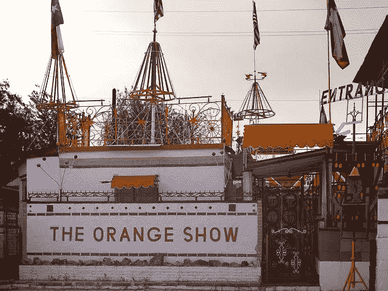
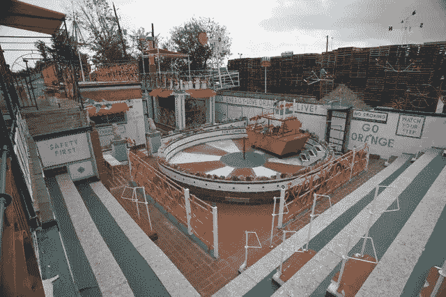
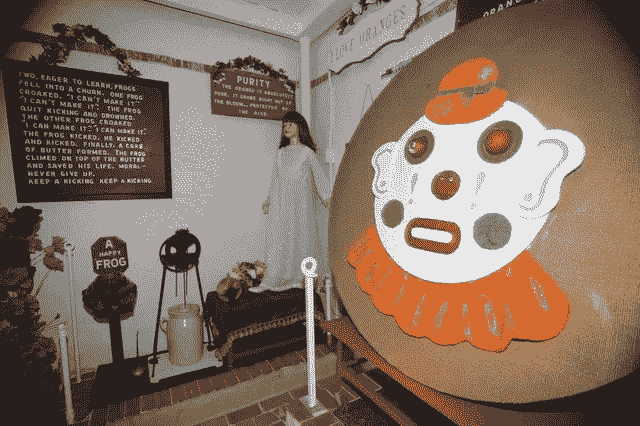

# 分析献给橙子的一生

> 原文：<https://medium.com/swlh/on-living-your-life-absurdly-obsessed-3a82dc415bca>

## 从一个人的橘子纪念碑得到的人生教训

[Original photo](http://orangeshow.org/photos/3226/in/44/) taken by [Jonathan Beitler](https://www.barrelhousemedia.com). Licensed under [Attribution](https://creativecommons.org/licenses/by/3.0/).

我在休斯顿度过了 12 年。这不是一个美丽的城市，整个没有分区的事情。一个加油站坐落在一个特殊的角落，旁边是 Galleria(该市的头号旅游景点)、一家成人新奇商店和一栋住宅阁楼。那个角落的景色不可磨灭地印在我的脑海里。这就是休斯顿——一个狂野的城市，不关心你我对整洁和可预测的渴望。

尽管它很受欢迎，但我最喜欢的休斯顿景点不是购物中心。这是橙色秀。橙色秀是民间艺术的缩影，这是一个 3000 平方英尺的装置，包括一个绿洲、一口许愿池、一个池塘、一个舞台、一个博物馆、一个礼品店和许多从未在那里举办过的展览的座位。它隐藏在郊区的一个街区，由混凝土、砖、钢和许多发现的物体组成，包括齿轮、人体模型、瓷砖、拖拉机座位和小雕像。看一看:

[Original photo](http://orangeshow.org/photos/3260/in/44/) taken by [Jonathan Beitler](https://www.barrelhousemedia.com). Licensed under [Attribution](https://creativecommons.org/licenses/by/3.0/).

橙色秀的每一件作品都是由休斯顿邮政工人杰斐逊·戴维斯·麦克基萨克手工放置和手绘的。从 1956 年到 1979 年，他辛勤工作了将近 24 年，组装这座纪念碑。

麦克基萨克先生希望橙色秀传达他对努力工作和吃橙子的信念。说真的。这个人喜欢橘子。别误会，我喜欢好的橘子。但是，我从来没有想到要收集一万吨工业垃圾来证明我在乎。

## **荒诞之美**

整件事都很荒谬。只是坚果。24 年！那是四分之一世纪！事实证明，这还不到麦克基萨克先生一生的三分之一。我在某个地方读到过他在《橘子秀》上工作，至少在某些小的方面， ***十多年来的每一天*** 。他大部分时间都是一个人度过的，并不是因为他是个隐士。事实上，他建造这座纪念碑是为了吸引人群和分享他的理论。

Inside The Orange Show Monument. [Original photo](http://orangeshow.org/photos/3286/in/44/) taken by [Jonathan Beitler](https://www.barrelhousemedia.com). Licensed under [Attribution](https://creativecommons.org/licenses/by/3.0/).

在休斯顿南部一个安静的街区孤独地劳作了四分之一个世纪，慢慢地将路边的垃圾添加到一个迷宫般的怪物边界上。但是，事情是这样的。杰斐逊·戴维斯·麦克基萨克花了 24 年时间建造了一个跳蚤市场/艺术装置来展示一种水果，这一事实远没有把你的一生奉献给虚无那么荒谬。

现实是大多数人没有讲述他们的故事，没有找到他们的目标，没有拥抱他们的激情。我不是说他们的生活没有价值，但是他们经常没有目的和目标。根本就没有一生的工作。奥利佛·文德尔·霍马斯说:“许多人带着他们的音乐死去。太多时候是因为他们总是准备好生活。在他们意识到之前，时间已经用完了。”

## **一个悲伤的结局**

麦基萨克先生在这里的时间结束了。对我们所有人来说都是。他于 1980 年去世，在完成《橘子秀》七个月后。显然他死得很失望。他希望成群结队的人来看他的杰作，了解他关于努力工作和长寿的理论，当然，还有橙子。我说过他真的很喜欢橘子吗？沮丧，他退出，不久后去世。

## **半错或半对**

麦克基萨克先生说对了一半。他找到了他的激情。他犯了一个错误，也是我们很多人经常犯的错误，那就是认为其他人的认可最终是重要的。我正在读塞斯·戈丁的《T2 伊卡洛斯骗局》，这是一本关于艺术创作重要性的极好的书，不是传统意义上的艺术创作，而是寻找对你个人有意义的工作。戈丁写道，

> “瞬间掌声带来的肤浅快乐和真正联系带来的持久影响之间存在巨大差异。”

我们太沉迷于外部认可，尤其是在商业领域。虽然追求名誉和利润不是道德上应受谴责的目标(毕竟，后者仍然是商业成功的广泛接受的衡量标准)，但如果我们把它们作为目标，我们就会错过成为杰出人士的机会。这些成果是出色工作的副产品。

我想起了史蒂夫·乔布斯曾经说过的一句话——“我的激情是建立一个持久的公司，在这里人们被激励着去制造伟大的产品。其他一切都是次要的。当然，盈利是件好事，因为这能让你制造出优秀的产品。但是产品，而不是利润，才是动机。[前苹果公司首席执行官约翰]斯卡利将这些优先事项转变为目标是赚钱。这是一个微妙的区别，但最终意味着一切:你雇佣的人，谁得到了晋升，你在会议上讨论了什么。”

## **为拥抱你的激情，创造艺术**干杯

杰弗逊·戴维斯·麦克基萨克找到了他的目标，拥抱了他的激情，创作出了你所见过的最古怪的艺术品之一。通过这样做，他和我建立了联系。我被这个知道什么对他重要的人所激励。

对你来说，这可能看起来很荒谬，一个人花三分之一的时间来建造像橙色秀这样的东西，是对时间的巨大浪费。但是，这不是你的选择。这是麦基萨克先生的选择。他成功了。他做出了选择，并坚持完成了他认定的毕生事业。荒谬，是的，但也古怪而精彩。

[Original photo](https://unsplash.com/photos/LcEU_t6UCpU) by [Jenelle Ball](https://unsplash.com/@xxvs?utm_source=medium&utm_medium=referral) on [Unsplash](https://unsplash.com?utm_source=medium&utm_medium=referral)

橙色秀代表了一切伟大的个性、自由、艺术、目标和激情。这也是一个有着美好结局的警示故事。麦克基萨克可能不知道，但人群最终还是来了。不仅如此，橙色秀基金会，这个在他死后不久成立的保护他的作品的组织，催生了休斯顿艺术汽车游行和休斯顿国际艺术节。他唱了他的歌，最终我们很多人都听到了。

如果你来休斯顿，我希望你能参观橙色展览。更重要的是，我希望你分享你内心的音乐，并且我们都提醒彼此为了正确的理由这样做。

**大家好，我是 Brett Cenkus，一名** [**得克萨斯州的商业律师**](https://www.businessattorneyinaustin.com/)**20 多年的连续创业者。在我的职业生涯中，我明白了既成功又充满幸福的生活的显著因素是你所热爱的和你所做的相一致。我很想知道这对你意味着什么。**

**如果你在做生意，做着有趣的事情，一位经验丰富的公司律师可以帮你，** [**伸出援手**](https://www.businessattorneyinaustin.com/contact-austin-business-attorney/) **。**

## 这个故事发表在 [The Startup](https://medium.com/swlh) 上，这是 Medium 最大的企业家出版物，拥有 306，472+人。

## 在这里订阅接收[我们的头条新闻](http://growthsupply.com/the-startup-newsletter/)。

