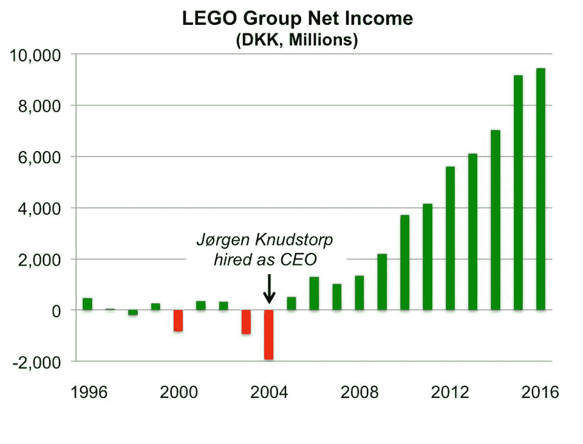
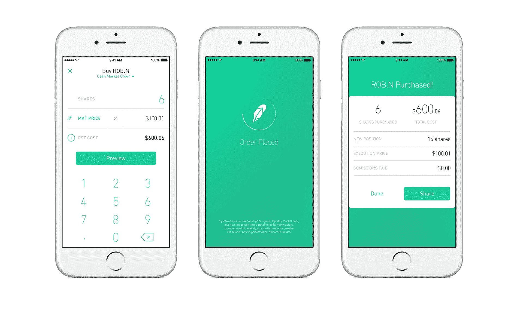

# 衡量你的使命

> 原文：<https://medium.com/swlh/on-measuring-your-mission-ccc465410280>

## 推动产品使命的决策的价值

最成功的团队都有强大的使命宣言，并以行动为后盾。

关心产品影响力的公司通常会取得巨大的成功，而关心公司使命的团队更有能力就如何最好地影响公司使命做出明确的决策。

一个人只需要有勇气坚持自己的原则。

## 老生常谈的史蒂夫·乔布斯的例子

史蒂夫·乔布斯并不是如何制造产品的榜样，但他为改进苹果的运营以更好地与其使命保持一致而采取的一些措施值得关注。

例如，这个来自 1997 年苹果全球开发者大会的片段是史蒂夫·乔布斯对一个观众提问的回答，这个问题是关于他为什么杀死 OpenDoc，一个苹果在 1992 年最初创造的企业软件产品。

> 我一直发现的一件事是，你必须从客户体验开始，并回溯到技术。你不能从技术入手，试图找出在哪里销售它。—史蒂夫·乔布斯

这表明了乔布斯对苹果的愿景——一家制造消费者喜爱的创新产品的公司。按照这个顺序。这样的立场是苹果公司成功的原因。

## 测量任务—乐高

衡量对于理解产品提供的影响是必不可少的，如果一个团队没有以推进其使命的方式执行，那么这个团队就没有创造出他们所认为的价值，并且可能没有创造出他们本可以创造的价值。

让乐高扭亏为盈的人 Jr gen Vig Knudstorp 曾经说过他的公司的使命…

> 成为儿童不可替代和无法抗拒的品牌

为了证实这一点，Knudstorp 和 LEGO 严格测量了消费者网络推广得分(NPS ),以寻求成为儿童每年圣诞清单上最受欢迎的玩具。

像之前许多失败和正在失败的公司一样，2000 年早期版本的乐高发现自己扩大了产品的复杂性，以努力向顾客提供更多的产品。制造看起来很酷或创新的东西，但忽略了他们的核心原则，即建立消费者喜爱的品牌。

当 Knudstorp 在 2004 年接任首席执行官一职时，2005 年，乐高引入了净推广者分数作为他们的“创新”如何与客户产生共鸣的指标。

乐高重新关注以这种方式衡量成功，帮助该公司从无关紧要的边缘，回到最知名和最受欢迎的儿童玩具品牌之一。

## “唯一重要的指标”

Robinhood 产品副总裁 [Josh Elman](https://medium.com/u/3fca1ea3f7bf?source=post_page-----ccc465410280--------------------------------) 在 [ProductCon 2018](https://productcoalition.com/10-talks-from-productcon-that-will-make-you-a-better-product-manager-56e92f3ea464) 的演讲中雄辩地总结了衡量使命的挑战*唯一重要的指标*:

> *成功是根据用户在预期时间周期内执行某个关键行为的次数来衡量的*

找到表明你的使命成就的标准，并有勇气做出进一步推进这些标准的决定，这是成功团队和公司的核心能力。

当你看 Robinhood 的产品时，很快就会发现该公司对执行其使命的关注程度:

> 我们认为，每个人都应该有机会进入金融市场，并肩负着激励新一代投资者的使命。

他们的使命是让投资变得可及，这导致他们脱离了许多其他投资平台提供的拥挤、专注于功能的体验，让位于更时尚、更简单的体验，更像他们的目标“新一代投资者”习惯于在日常产品中看到的体验。

*你在推进什么使命，你如何衡量它？*

*感谢阅读！我是* [*杰克·摩尔*](/@jacknotjohn) *，我喜欢写关于产品的东西。*

你可能会喜欢我的其他故事:

 [## 如何创建完美的产品开发流程

### 打造一流产品开发实践的技巧和资源

medium.com](/swlh/how-to-create-the-perfect-product-development-process-2e6d3b72ce38)  [## 视频游戏公司能教给我们什么是路线图

### Feral Interactive 如何在固定范围的开发环境中处理管理期望

productcoalition.com](https://productcoalition.com/what-a-video-game-company-can-teach-us-about-roadmapping-57632be90e87) 

## 这个故事发表在 [The Startup](https://medium.com/swlh) 上，这是 Medium 最大的企业家出版物，拥有 322，555+人。

## 在这里订阅接收[我们的头条新闻](http://growthsupply.com/the-startup-newsletter/)。

