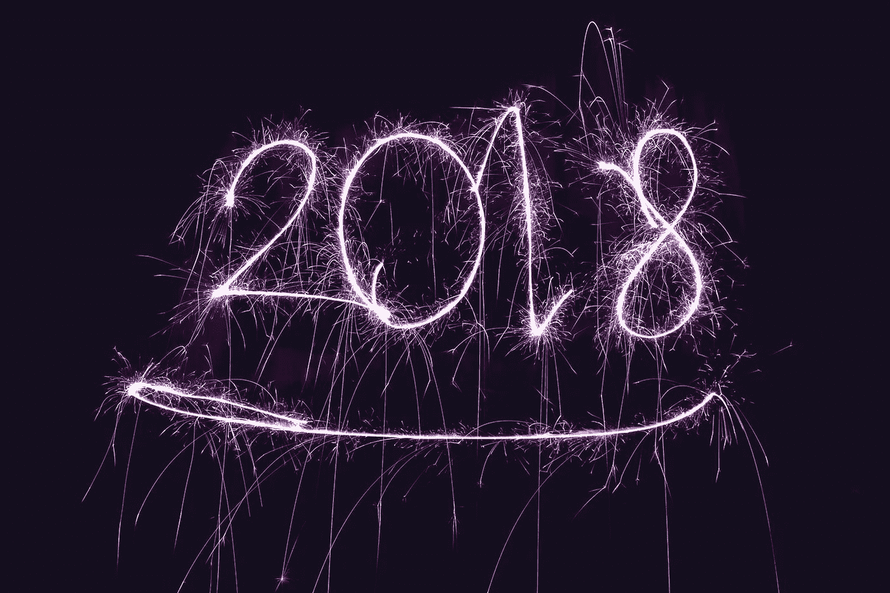
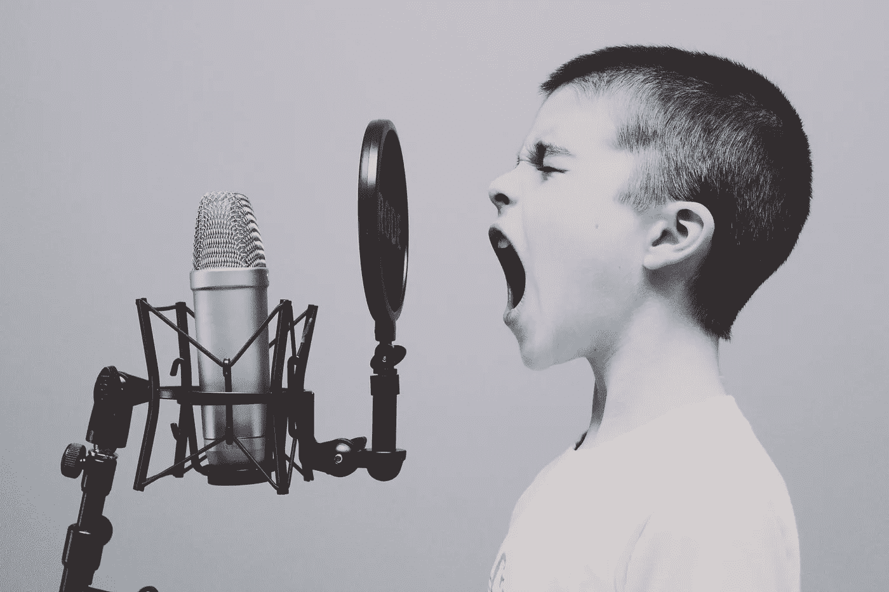
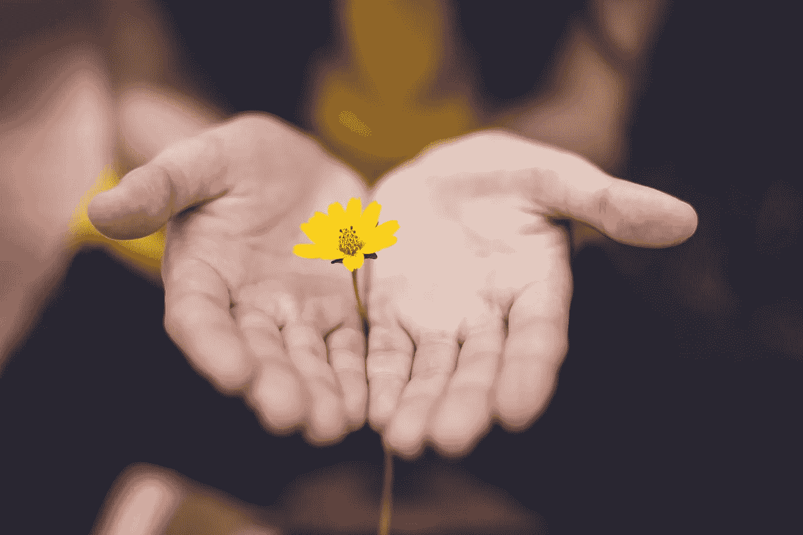
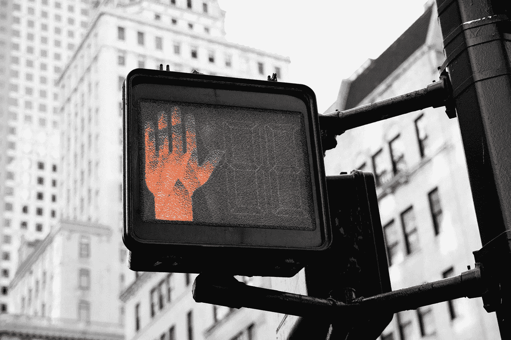
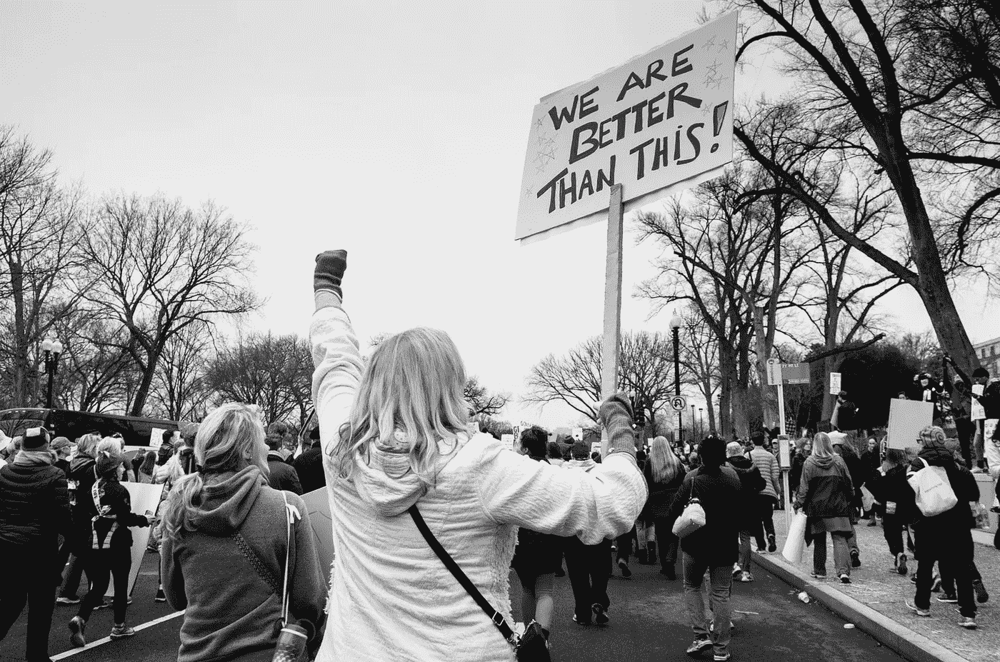

# 一(1)个赢得 2018 年的激进计划。

> 原文：<https://medium.com/swlh/one-1-radical-plan-to-win-2018-8e26340f057b>

## 你需要的话，停止许愿，开始行动！！！

Photo by [NordWood Themes](https://unsplash.com/photos/zNS6oFkwlG4?utm_source=unsplash&utm_medium=referral&utm_content=creditCopyText) on [Unsplash](https://unsplash.com/?utm_source=unsplash&utm_medium=referral&utm_content=creditCopyText)

每年的这个时候，我们中的许多人都会花一点时间来反思过去 12 个月发生了什么。对你来说这是胜利的一年吗？这是你人生中最具挑战性的一年吗？无论你如何看待它，回顾过去会让大多数人产生“不畏艰险”的欲望，并在即将到来的新的一年里真正赢得生活。但是我们怎么做呢？

*这个问题的答案对我们每个人来说都有点不同。*

有些人从小做起做得更好；其他人则从大处着手。有些人喜欢简单；其他人，富足的爱人。有些人需要问责；有些人无视责任。这种区别很重要。

如果你看看全球范围内的社会统计数据，许多人带着对饮食和锻炼的新的或更新的承诺接近**【赢得生活】**。一些人尝试通过清理家庭、思想和生活中的杂乱无章的“额外包袱”。然而，其他人以一千种不同的方式对待它，对大多数人来说，在接下来的几个月里，不管尝试采取什么形式，承诺开始失败。

Photo by [Jason Rosewell](https://unsplash.com/photos/ASKeuOZqhYU?utm_source=unsplash&utm_medium=referral&utm_content=creditCopyText) on [Unsplash](https://unsplash.com/?utm_source=unsplash&utm_medium=referral&utm_content=creditCopyText)

2018 年奥运会的成功和创造一个成功的行为是一个有意识的行为。这不是偶然发生的事情。本质上，你的日常活动必须绘制出完成你详细的 12 个月计划的小步骤。

***但是这里就躺着你没有计划的情况*** 。这意味着你当前的日常行为是由不必要的事件和朋友、家庭成员甚至陌生人的意见驱动的孤立活动，影响了你的总体规划。

## 让你在 2018 年成为杀手的两(2)个决定性因素。

## 1.适应性

世界上最成功的人都有一个共同点；他们适应性很强。这意味着他们可以改变！他们可以改变他们处理问题的方式，他们对一段关系的看法，是的，他们甚至可以很容易地改变他们的想法。他们这样做没有刺激或怨恨，而是充满活力和韧性。

Photo by [Geetanjal Khanna](https://unsplash.com/photos/8CwoHpZe3qE?utm_source=unsplash&utm_medium=referral&utm_content=creditCopyText) on [Unsplash](https://unsplash.com/?utm_source=unsplash&utm_medium=referral&utm_content=creditCopyText)

用维珍创始人理查德·布兰森的话说:

> “只有傻瓜才不会改变主意！”

能够改变主意的人并不古怪或优柔寡断。他们适应性很强！在一个每天看起来都不一样的世界里，这是一项值得练习和提炼的生活技能——那就去做吧。

## **2。宽恕**

无论你如何辩解，如果不能原谅，你就不会快乐和成功。怨恨、不信任和仇恨会比悉尼人在七月去欧洲旅行更快地将你推向绝望。

> “它们是消耗注意力和扭曲视角的情感”。

Photo by [Lina Trochez](https://unsplash.com/photos/ktPKyUs3Qjs?utm_source=unsplash&utm_medium=referral&utm_content=creditCopyText) on [Unsplash](https://unsplash.com/?utm_source=unsplash&utm_medium=referral&utm_content=creditCopyText)

如果你的生活中有一个你很难原谅的人——也许是时候去尝试了，即使只是在你的思想和内心。如果你被消极情绪所困，你就无法赢得 2018 年的奥运会——宽恕的真正受益者其实是你自己！

## 这很简单，但并不容易！

S 你将会收到的一些最好的建议都是一些简单的事情，你可以通过这些事情走向成功，并获得你想要的成功行为。但是这里有一个棘手的部分——人们经常混淆简单的 T4 和简单的 T7。

一个很好的例子就是抱怨的毒性和破坏性。如果你抱怨你是个婊子！(句号。简单)。

Photo by [Kai Pilger](https://unsplash.com/photos/1k3vsv7iIIc?utm_source=unsplash&utm_medium=referral&utm_content=creditCopyText) on [Unsplash](https://unsplash.com/?utm_source=unsplash&utm_medium=referral&utm_content=creditCopyText)

> 世界上没有比抱怨更浪费时间的了。

这解决不了任何问题，而且每当你抱怨时，这让你感觉到的问题越来越大。好吧，那答案是什么？停止抱怨(简单，但不容易。)大多数人都沉迷于抱怨。他们天生就喜欢找茬、找借口、指责他人、保护自己等等。但是，世界上的行动者和震撼者似乎都在同一页上理解一个永恒的真理；成功在问题的另一面。

> 他们不会浪费一秒钟来哀叹这个问题；他们立刻开始思考如何越过它，绕过它，在它下面，或者他妈的 [*穿过它*](https://www.goalcast.com/tag/adversity/) *！*

# 2018 年的方法。

Photo by [Brooke Lark](https://unsplash.com/photos/BRBjShcA8D4?utm_source=unsplash&utm_medium=referral&utm_content=creditCopyText) on [Unsplash](https://unsplash.com/?utm_source=unsplash&utm_medium=referral&utm_content=creditCopyText)

## 1.列出 2017 年你让自己惊喜的五(5)项成就和方式

查看你的日历、工作流程、手机上的照片或者任何你能记下年初你在做什么的地方。把你的思想带回到当时世界上正在发生的事情，以及你在工作和人际关系中的个人生活。

花点时间反思你在今年年初的情况，你的感受以及你对这一年的愿景将让你看到你在 2017 年的成长方式以及你危及自己成功的方式。

写下过去一年你成功完成的 5 件事(如果你有更多的话，可以写更多)。带他们进去！让自己感受到自豪和快乐，这种快乐来自于能够到达你计划到达的地方。

## 2.列出 2017 年你觉得危及自己成功的五(5)种方式

这真的很重要。每个人都有自己的方式，每一年。不要下结论说你不够好或者你根本不能做出任何改变，而是要找出在过去的 12 个月里你做错了什么。

**这里有一个例子:** *你可能想在工作中更多地说出你的反馈和创意。相反，你维持现状，大部分时间都感到不满足。你屈服于想要被喜欢，害怕被拒绝阻止你在项目和会议中发表意见。*

利用上面的例子，找出过去一年中你以自己的方式获得的 5 种(或更多)不同的方式。然后想想类似的行为是如何阻碍你在 2017 年展现和成长的。更加意识到你的自我危害特性，并养成习惯，认识到那些阻止你成为最好的自己的行为。

> “解决问题的第一步是承认它确实存在”。

## 3.选择三颗北极星，为 2018 年定下基调

找到你自己的北极星将教会你如何阅读你内心的罗盘，表达你的愿望，识别和修复可能阻碍你进步的无意识信念。

Photo by [Tim Graf](https://unsplash.com/photos/ErO0E8wZaTA?utm_source=unsplash&utm_medium=referral&utm_content=creditCopyText) on [Unsplash](https://unsplash.com/?utm_source=unsplash&utm_medium=referral&utm_content=creditCopyText)

决定你在未来 12 个月内想要关注的几个方向。从确定你想做或努力的事情开始。什么并不重要，只要是你真正渴望的东西——理想的是你感兴趣或感到兴奋的东西。你热衷于什么？去吧。

这应该是你为了自己而想做的事情，而不是为了某事或某人。努力做一些你目前力所不及的事情通常会有所帮助——拓展我们的目标总是激励和刺激成长！

自豪而自信地仰望你的北极星。把它们写下来，想象出来，然后告诉别人——让自己负责在这 12 个月的旅程结束时实现它们。

> "在一天结束的时候，不要找借口，不要解释，不要后悔."

## **4。遵守纪律并采取行动**

处决不是在 3 小时后开始，也不是在明天或你休息后…而是现在开始！

纪律使我们生活中的表现和创造成为可能。显现和创造照亮了我们，赋予了我们生命的意义。限制是创造向上成长的容器。当我们一直生活在一个安逸舒适的地方时，我们就被思维的局限所控制。我们需要在努力和投降之间取得平衡。当我们走出舒适区时，进化就会发生。我们不能在坚持给我们错误安全感的安全模式和习惯的同时进行转变。为了体验不同的结果，我们必须改变一些事情，做一些不同的事情。

***我们认为我们讨厌纪律；但事实是，我们都需要它。***

Photo by [Kyle Johnson](https://unsplash.com/photos/Yi-4X9ZJU6Y?utm_source=unsplash&utm_medium=referral&utm_content=creditCopyText) on [Unsplash](https://unsplash.com/?utm_source=unsplash&utm_medium=referral&utm_content=creditCopyText)

具有讽刺意味的是，正是纪律创造了自由。当你开始一项新的活动，如健身房、有氧运动或自我发展，你可能不想每天都做。你必须让自己去做。你不想，但你还是做了。然后有趣的事情发生了…

突然你到了一个你想做的点。如果有事情发生阻止你去做，你实际上会感到失望或不安。**当你到达那一点时..那就是你在我朋友里面的时候！**

绘制你的总体规划，突出你的重点，培养你的能力，点燃你内心的火焰——这就是你如何播下胜利的种子！最初，你可能看不到切实的结果，但可以肯定的是，增长正在表面下发生。当你坚持下去的时候，动力就会产生，创造一个自我强化的胜利循环。

> *记住:* **纪律创造结构。结构创造习惯。习惯为你创造了赢得一月、二月和一年中其他时间的自由！**

> “除了人类，每一种生命形式似乎都在尽最大努力。一棵树会长多高？尽可能的高。另一方面，人类被赋予了选择的尊严。你可以选择全部，也可以选择少一些。为什么不全力以赴迎接挑战，看看你能做些什么？”吉米·罗恩

这一年，当你更新健身会员资格并承诺一个新的开始时，把你自己固定在适应性和宽恕的王国里，用批判的眼光回顾 2017 年，吸入好的一面，反思坏的一面。最终，设定你的北极星，并训练自己创造一个防弹的仪式习惯结构，消除你自己不安全感的疑虑。我今天要做别人不愿做的事，所以明天我就能做别人不能做的事

你和你的目标之间唯一的障碍是你不断告诉自己为什么你不能实现它的狗屁故事。

> 停止抱怨，行动起来！

Photo by [Jerry Kiesewetter](https://unsplash.com/photos/Qc6vnbE4JQs?utm_source=unsplash&utm_medium=referral&utm_content=creditCopyText) on [Unsplash](https://unsplash.com/?utm_source=unsplash&utm_medium=referral&utm_content=creditCopyText)

2018 年是你向世界展示真实自我最好版本的一年。**双赢。它总是在里面！**

> 新年快乐！

# 我想做的是…

***……就是写值得你花时间，能给你带来价值的东西。我安静地写了几年，现在我把它放在那里，感谢媒体。如果你喜欢阅读，请点击💚这样其他人也会看到它(你最多可以点击 50 次)！！***

## 西德尼

## 这篇文章发表在 [The Startup](https://medium.com/swlh) 上，这是 Medium 最大的创业刊物，有 277，994+人关注。

## 订阅接收[我们的头条新闻](http://growthsupply.com/the-startup-newsletter/)。

