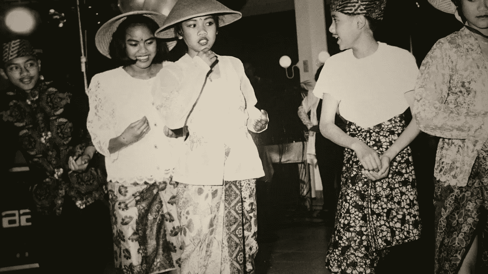

# 一个锚定力矩

> 原文：<https://medium.com/swlh/one-anchor-moment-5dce7224653c>

> “婚姻对我来说是一个全新的概念。”

一年前，我遇到了维吉尔·旺索卡里奥(Virgil Wongsokario)，他是一位荷兰企业家，对名为“在线视频力量”的在线视频教育和制作充满热情。那时候，直到几天前，我们才有机会见面喝杯咖啡。

我在 LinkedIn 上关注他，他在那里通过短视频发布免费内容。在他早期的一个视频中，他谈到了他对视频的热情来自哪里。视频很短，但足够长，可以吸引我的注意力并保持我的兴趣。我知道在那一瞬间，我想知道更多关于他的真实性。

# **在咖啡馆**

所以，几天前我在鹿特丹的一家咖啡馆遇到了维吉尔，我很想知道更多关于他的热情源自哪里。我们聊了聊我们的生活，像往常一样闲聊。慢慢啜饮完我的咖啡后，我打破了僵局。

> “我看了你的视频”*我用中性的声音说。*
> 
> “哪一个？”他惊讶地问道。
> 
> “你谈到你对视频的热情来自哪里的那本书”我回答道。
> 
> “你想起了那段视频！?"*他一边笑一边问我。*
> 
> “是的，我记得很清楚。我想知道你是否愿意和我分享这个故事的延伸版本？”*我问。*

我真诚地对他的过去感兴趣，以及它如何将他塑造成今天这样一个积极向上的人，他坐在我旁边，脖子上戴着耳机。他注意到我对那个问题有多认真。他低着头思考了几秒钟，对我来说，这更像是焦急等待答复的几分钟。最后，他抬起头，同意和我分享他的故事。他甚至允许我把它写下来。

# **维吉尔的故事**

维吉尔是在他母亲十六岁时出生的。随着他的成长，他从未见过他的亲生父亲，所以他的母亲独自抚养他和他的弟弟。你可以想象，一个母亲独自抚养两个孩子是很难的。所以，每个周末，维吉尔和他的弟弟都在另一个有姻亲关系的家庭，这个家庭同时也是他的养父母和兄弟。在八岁，也许是九岁的时候，维吉尔周围的世界发生了变化。他的养父宣布他要结婚了。

对维吉尔来说，那是一个神奇的时刻。

> “我来自一个只有我、我弟弟和我妈妈的家庭。那时我父亲从未出现在我的生活中。所以，人们结婚的想法对我来说是未知的——婚姻在我的生活中不存在。当我听到养哥结婚的消息，知道结婚意味着什么的时候，我很感动。想象一下，一觉醒来，穿上了一套漂亮的衣服。太酷了！从远处我可以看到发生的一切。”

维吉尔开始大笑，因为他试图回忆起第一支舞。从他的声音中，我可以听出他既尴尬又高兴的语气。

> “第一支舞是《男孩 2:男人》中的一首歌，名为《路的尽头》。我真不敢相信我还记得那场舞会。我还和我的堂兄妹一起表演了一场，房间里挤满了家人和朋友，享受着整个婚礼。我看见我的养父和他的妻子开着这辆酷酷的敞篷车离开了。这给我留下了如此深刻的印象。”

Performance by Virgil (far left) and cousins

维吉尔向我表达了这么美好有趣的一天这么快就结束了对他来说是多么的失望。他只希望那些时刻能持续更长时间。当时，他对此感到非常失望和难过。直到婚礼后一周，一个男人找到了他。

> “没有人告诉我有人拍摄了整个婚礼，我也没有注意到。一周后，突然有一个人走近我，给我看了那天的视频。所以，我看着它，我不知道该怎么想或怎么感受它。我内心有太多的情绪。我一面觉得很怪异，一面又觉得很美。我只是无言以对。我可以重温我珍惜的每一刻。”

那是视频第一次走进维吉尔的生活——回忆情感，重温那些珍贵的瞬间。那是他对视频的热情开始的起点。维吉尔称这是他的“一个锚定时刻”。那时候他没有马上培养自己的激情——忙着当孩子。当维吉尔上大学，学习通信和媒体时，他得到了一个制作视频的项目。

> “我和九岁的我建立了联系。我可以连接到一个锚时刻，我想制作自己的视频。那是多年后，我第一次接触制作视频。从那以后我就一直这么做。”

维吉尔说的最后一句话是:*“我一个人走不了这么远。感谢这么多人走进我的生活，支持我，让我成为今天的我。”这些谦逊的话语提醒我，我们可以给别人的生活带来多大的改变。*

# 系列:展开

我们的过去塑造了我们昨天的样子，它没有定义我们今天是谁——我们今天如何生活，塑造了明天的篇章。揭开你想成为的人的神话。

有时，我会遇到一些人，他们愿意分享他们的故事，讲述他们的过去如何将他们塑造成今天的样子。他们的故事在我心中留下了足迹。

在这一系列 [**【展开】**](/series/60170929bd69) 中，我想和你们分享他们的故事。

*原载于 2018 年 2 月 20 日*[*ye-chen.com*](https://ye-chen.com/one-anchor-moment/)*。*

## 这个故事发表在 [The Startup](https://medium.com/swlh) 上，这是 Medium 最大的企业家出版物，拥有 298，432+人。

## 订阅接收[我们的头条](http://growthsupply.com/the-startup-newsletter/)。

