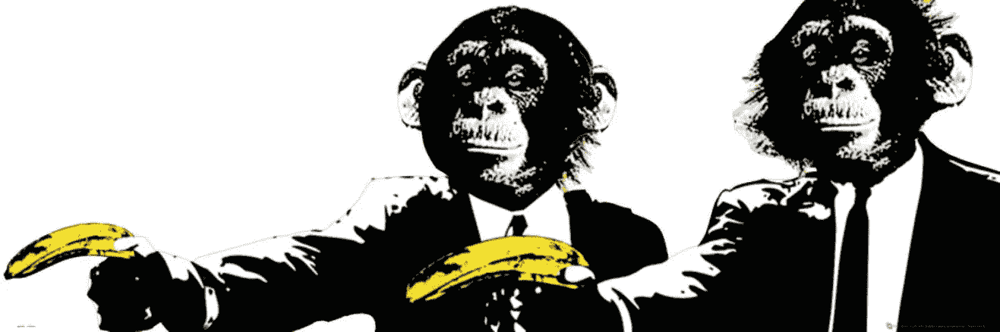

# 一个习惯将成功者与普通人区分开来

> 原文：<https://medium.com/swlh/one-habit-separates-the-successful-from-the-average-3d8d1fdfa31e>

## 一个 3 分钟的道德故事，将释放你的真正潜力。

一群科学家兴奋地测试他们最新的实验。

他们搭建了空间:一个大房间，空荡荡的，除了中间的一个梯子。在梯子的顶端，够不着的地方，有一串香蕉。

为了开始实验，他们把五只猴子放进房间，观察它们做了什么。

你可以想象，猴子们很快就发现了香蕉，并开始爬梯子。但是每次他们这样做的时候，其余的猴子都被喷上冷水。

尽管猴子很聪明，它们还是学会了这条规则。所以，很快，猴子们会阻止其他猴子爬梯子。

很快，没有一只猴子敢再爬上梯子了。

然后，科学家们用一只新猴子替换了其中一只猴子。当然，它一进房间，就开始爬梯子。

而且——你猜对了——它被猴子痛打了一顿，并很快适应了它的行为。

一个接一个，剩下的猴子换上新的猴子，重复同样的过程。

剩下的是一个由 5 只猴子组成的房间，尽管它们中没有一只被洗过冷水澡，但它们仍然会殴打其他追逐香蕉的猴子，因此拒绝爬梯子。

没有一个人明白为什么。

# 成功人士挑战并寻求风险

大多数人接受假设为真理，不去寻找自己的真理。他们寻找过去的模式，从众，接受他们那个时代的规范。

相反，那些成功的人专注于寻找他们自己的真理。他们以数据和逻辑为基础。他们会问问题。他们不仅做好自己的工作，而且做得很出色。同样，他们也经常站在新思想的前沿。

最重要的是，他们通过寻求真相来避开传统智慧。他们很谦虚，但是很自信。他们提出深刻的问题，与专家交流，查看各种类型的数据，实验和测试他们的假设。

正如埃里克·温斯坦所说，如果你想成功，共识应该激发你的蜘蛛感官。这意味着你在主动测试自己的想法，而不是神奇地等待事情发生。这是提出问题和积极寻找答案的结合。

在每一个企业或机构，你都会有一小群人，很难找到其他人。大多数人都像实验结束时的猴子。大多数人会跟随他人。大多数人都不好奇，不主动。他们需要别人告诉他们真相。

这总是涉及到不确定性。你在冒险，采取行动，这可能会导致失败。

另一方面，只有按照别人告诉你的去做，风险才小得多。这样更安全。从短期来看。

# 结论

想干大事？想做基础工作？你绝对可以。

但事实并非如此，你可以确定一件事:*世界会改变，不会等你去适应。*

# 喜欢这本书吗？鼓掌，这样其他人也可以阅读它，或者关注更多像这样的故事。

## 这个故事发表在[的创业](https://medium.com/swlh)上，这是 Medium 最大的创业刊物，有 333，853+人关注。

## 订阅接收[我们的头条新闻](http://growthsupply.com/the-startup-newsletter/)。

