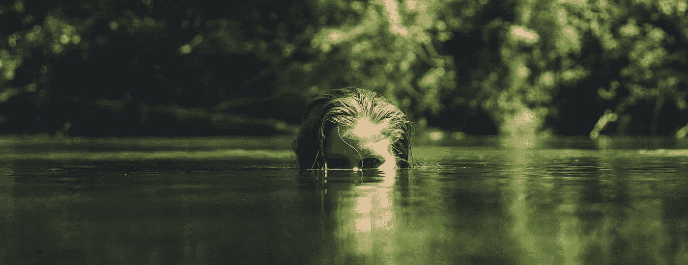

# 自我黑客:一个习惯将成功者与其他人区分开来

> 原文：<https://medium.com/swlh/one-habit-separates-the-successful-from-the-rest-b3cb5f84d36a>

[Focus](https://unsplash.com/photos/8SSuaY2e_EY?utm_source=unsplash&utm_medium=referral&utm_content=creditCopyText)

我的室友说我活得像个机器人。

在我通常的时间醒来后，我洗了个冷水澡，穿上我的 T2 和一套衣服(当然，我有多套)。我吃什么，我什么时候社交、锻炼、洗衣服和买杂货，同样都是由[预先决定的](https://journal.thriveglobal.com/you-need-a-solid-daily-routine-your-long-term-success-depends-on-it-4fb12ea21369)。而剩下的一切——[学习](http://www.jstor.org/stable/40212266?casa_token=Dul_pq3EHP8AAAAA:8pDyNmMZ6_FYR3SBR55n0LCUnYCLqsT7D8Hleec5P7g_HdVHXQOOvTLMK-SXV7QWg7DiUDW7RSpaUv7vag62zLG6vZprhPtuGOLxxqhcdr7pL980CYg)和[写作](https://writingcooperative.com/focus-your-writing-routine-ac8b1e0dc3d6)——都是根据…