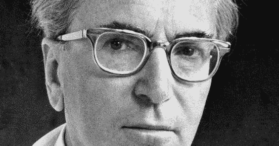

# 一个将消极的自我对话转化为积极的成长和能量的习惯

> 原文：<https://medium.com/swlh/one-habit-to-turn-your-negative-self-talk-into-positive-growth-and-energy-529f5a35b4de>

Photo from Brainpickings.org

## 每个人都有能力控制他们感知自己经历的方式。

你可以选择去看组成你生活的“疯狂的生活”或疯狂的故事，或者提升你的视角，将它视为[感知的进化游戏，它创造了你的体验，即](/@ARTaghavi/humanity-is-at-a-crossroads-the-one-belief-we-must-all-believe-to-create-the-world-we-wish-to-see-668ec7411a62)——胜利者弹性地接受障碍，将其作为他们日常生活的一部分，失败者因痛苦和沮丧的感觉而抵制它。

我不是说任何人是“赢家”或“输家”，这是在你自己经历的背景下。最终，如果你乐在其中[成长，玩游戏](http://grahamduncan.blog/2018/the-playing-field/)应对你遇到的每一个挑战，你就赢了；如果你经历痛苦和挫折，你就输了。

传奇精神病学家和大屠杀幸存者**维克多·弗兰克尔意识到了这一点，他说:**

A young Viktor Frankl by Emily May Rose

弗兰克尔在经历、观察和研究大屠杀幸存者时意识到了这一点，甚至在那场恐怖中得出结论:

> 一个人的一切都可以被夺走，除了一样东西:人类最后的自由——在任何特定的环境中选择自己的态度，选择自己的道路

我的观点是，我们所有人都有能力驾驭想象力这一复杂的天赋。

显然，在像大屠杀这样极度痛苦的情况下，说起来容易做起来难，但这无疑让你正确看待自己面临的挑战，不是吗？

快乐的秘诀就在于此——无论发生什么，都要给自己讲好故事。

考验、磨难和挑战就是生活，仅此而已——彻底控制你的反应和回应是那些生活得很好的人和那些在旅程中挣扎的人的区别。

我们陷入了这个奢华的陷阱，让我们认为障碍、挑战和约束不是礼物，尽管正是挑战让克服和胜利成为可能。没有这一点，荣耀是不可能的。

就像没有黑暗，就没有光明，没有痛苦，就没有快乐。

关于一个人的自我谈话和能量的讲述是一个人如何谈论他们自己的“生活故事”。

例如，我父亲独自一人带着自己的学生存款从伊朗来到美国，并最终“成功”(我们可以在另一篇文章中讨论这意味着什么)。

一路上，他很自然地想家，不开心，甚至抑郁。

他已经多次告诉我他这些年的经历，那不是热情、精力和胜利。

尽管他最终获得了数学博士学位，并成为了乔治·华盛顿大学的一名教授——但这段旅程是一场斗争，我想知道如果可能的话，这段旅程本可以变成更伟大的事情。

爸爸做了什么能让他的主观体验变得更丰富？

意识到自己每时每刻的经历已经成为我的困扰，我相信对每个人来说，拥有创造他们想要的世界的 [**是至关重要的——无论他们是企业家还是学者。蓝领工人或学者。**](/@ARTaghavi/humanity-is-at-a-crossroads-the-one-belief-we-must-all-believe-to-create-the-world-we-wish-to-see-668ec7411a62)

直到今天，爸爸还在谈论他的经历有多艰难，我不怀疑那是艰难的(他经历过，也说是如此)。

然而，我们的想象力有能力让事情看起来如此令人生畏，因为它们让我们远离了当下——而当下的力量是深远的。

我想知道的是:

如果爸爸能更好地理解当下的力量会怎样？

如果这能让爸爸把他脑子里的游戏变得简单一点呢？

如果他养成了能够控制自己、恢复能力和自信的习惯——让自己相信他应该得到更多(我的父亲[和我](/the-mission/this-5-minute-daily-habit-will-get-people-to-treat-you-how-you-want-to-be-treated-be5cf1a52828)一样，过去和现在都不相信自己的价值)。

如果这让他走上了超级弹性的道路，而不是他自己经历的压力呢？

这是导致积极或消极结果的强制压力函数之间的差异。

我觉得这些对话很有意思，因为爸爸有勇气、毅力和智慧(他在家乡的国家考试中是最高分的)成为 11 个孩子中唯一一个离开他的国家并出发去更多地方的人——没有任何支持和肯定。

另一方面，我知道他在旅途中肯定没有让自己轻松。

我想知道他是否能更好地控制自己的经历？

人们显然可以理解为什么他经历了一段混乱的时期，离开了一个“充满政治动荡”的国家(他是在“大革命”之前的 70 年代来到这个国家的)。

这是一个“胜利的故事”。“你爸爸的一生应该被拍成电影”，我经常被告知。

当我(怀着感激之情)看着我这一代美国人和世界各地的其他人，从努力追求美好生活的移民到留在原地建立帝国的几代同堂的家庭，我意识到我们都注定要做几乎完全相同的事情——那就是战胜和胜利。

我们都是人类，而且是超级人类——我们已经进化了 40 亿年来赢得胜利，这使我们生来就超级成功。

你知道这个结果花了多少钱吗？很多很多的克服。

很多很多的工作。

在我们之前，有太多的人来来去去，让我们所有人在这里过着这种生活。

**一个缩小范围，将消极的自我对话转化为积极能量的习惯**

> 总是在发生的每件事情中看到积极的结果。就这么简单。

这并不意味着乐观或不现实。

事实上，我敦促你以建设性的眼光看待发生的每一件事——但仍然在每一件事中看到受祝福的学习和成长。

感受到的痛苦越多，你成长的就越多。你做得越多，你做得越好。

很快你就会期待痛苦。

当你这样做时，你将超越痛苦，变得不可触摸。

这是你成为超人，最大限度发挥潜力的时候，因为你意识到自己有无限的潜力。

这是真正的精通展现自己的时候，这是你有勇气重写行业规则的时候。

这就是那些迷失在通往目标的道路上的人和那些收到反馈，平静地引导他们去他们想去的地方的人之间的区别。

想象一下，如果你养成并掌握了这一习惯，你的整个生活、每时每刻的经历会有什么不同。

爸爸本可以经历一次引人入胜的成长之旅，而不是耗尽他精力的消极的自我对话。

人类意识的力量是上帝给我们所有人的礼物。该由我们来决定如何处理它。

掌控你的人生。

## [每周一次点击接收我承诺的改变游戏规则的文章，这是你在互联网上其他地方找不到的。你还会收到我的指导，告诉你如何在你所做的事情上成为世界上最好的。你不会后悔的。](https://betreatedhowyouwanttobetreated.com/optin-main)

## 这篇文章发表在《T4》杂志《创业》(The Startup)上，这是 Medium 最大的创业刊物，有 312，596 人关注。

## 在这里订阅接收[我们的头条新闻](http://growthsupply.com/the-startup-newsletter/)。

