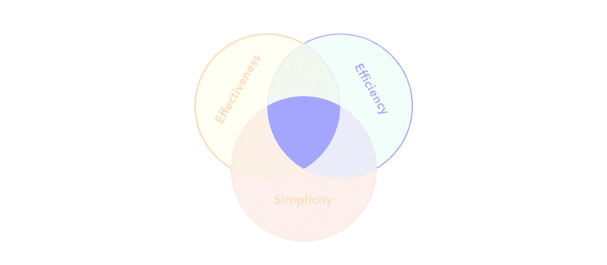

# 一个日志系统来管理它们

> 原文：<https://medium.com/swlh/one-journaling-system-to-rule-them-all-ccf2f511584a>

在二进制游泳的时候，我的生活很简单。我很有效率。而且有效。

好吧，这可能只是我的看法，但无论如何。

我早餐吃一碗 1 和 0，下午在(二进制)树荫下度过，晚餐做一些繁重的编译工作。我的任务清单很简单，过去只有一个条目——*完成任务*。我把它标记为完成。每天都是。

但是很快事情发生了戏剧性的转变，我陷入了疯狂。*咳咳*……我的意思是说管理职位。

不管我列了多少待办事项清单，我都记不住它们。我给了无数的黑客一个公平的机会来帮助我达到生产力的缩影，但不知何故这种浪漫通常在几周内就消失了。无论我使用哪种生产力黑客，我最终都诅咒自己没有效率。

不是因为我突然变得邋遢。好吧，*也许*，一点点。

但是，我感觉有人在用一台比大型强子对撞机更强大的粒子加速器轰炸我的待办事项。我无法在一天之内完成所有的事情，未完成的事情只是被遗忘的待办事项中的一个小点。

嗯，直到几年前我发现了[子弹杂志](http://bulletjournal.com/)。

神奇的配方？它的简单。它有一个编写[任务](http://bulletjournal.com/get-started/#tasks)、[事件](http://bulletjournal.com/get-started/#events)和[注释](http://bulletjournal.com/get-started/#notes)的精益方法。所有这些都用不同的符号来表示，开始的时候，感觉好像我在研究一些象形文字。但是一旦我养成了习惯，就没有回头路了。

最棒的部分是它通过其[索引](http://bulletjournal.com/the-index/)、[月日志](http://bulletjournal.com/monthly-log/)和[日日志](https://help.bulletjournal.com/article/27-daily-log)来跟踪任务、事件和笔记的简洁方式。这三者的结合确保了你的任务不会滑入黑洞。永远不会。

只需要一天中的几分钟来计划和回顾要完成的任务。我通常会在晚上做一个回顾，看看我已经完成的任务和我需要转移的任务。然后，到了月底，我又做了一次回顾，来处理未完成的任务。

仅此而已。

而且效率之神自从我用了之后就一直照在我的光头上。啊…我夸张了。不是每天。但是，它并不像以前那样令人沮丧。

出于好奇，为什么是模拟系统？为什么要使用笔记本和钢笔等过时的东西？

嗯，模拟系统让我更专注于完成任务。如果你在想为什么我们不能把所有的事情都打下来，因为这样肯定会更快，我们可以“更快”地完成事情，那么这里是我的两美分(*或一卢比三十美分*)——写下任务有一种疯狂的美丽。

当你写下它们的时候，它们会发现一种难以置信的力量去完成。这就像你的[笔迹在你的脑海中留下了一个印象](http://journals.sagepub.com/doi/abs/10.1177/0956797614524581)，你开始处理这个想法。然而在数字待办事项中，你总是点击鼠标就能远离干扰，这是不可避免的。

还在想[子弹杂志](http://bulletjournal.com/)是否适合你？除非你使用它，否则你永远不会知道它会给你的生活带来的简单。我希望当我还是程序员的时候就知道这一点——这将极大地帮助我保持条理。

从哪里开始？通过观看下面的视频-

快乐日志。

喜欢你读的书吗？请点击👏下面这样别人就能找到了！

这是我们第 20 版的 [**周刊快讯**](http://blogs.quovantis.com/newsletter/) **。**这是我们的[档案](http://blogs.quovantis.com/newsletter/)，如果你想在**注册下面的**之前查看之前的版本。

## 这个故事发表在 [The Startup](https://medium.com/swlh) 上，这是 Medium 最大的企业家出版物，拥有 308，692+人。

## 在这里订阅接收[我们的头条新闻](http://growthsupply.com/the-startup-newsletter/)。

