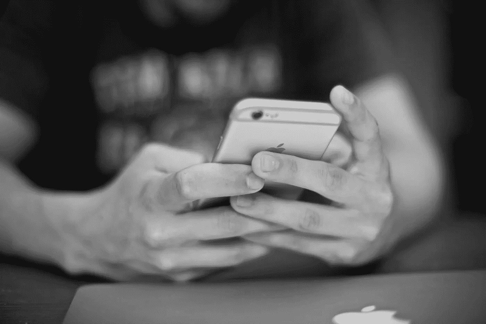

# 一个电话:“我没有时间”

> 原文：<https://medium.com/swlh/one-phone-call-i-dont-have-time-d3dc7e0d0bbf>

> 时间是我们最想要的，但却是我们用得最差的—威廉·佩恩

在短短的三天里，我从人们那里听到的头号理由或借口是“我没有时间”做任何事情。无论是去健身，去看望亲人，还是申请在线课程。这些听起来熟悉吗？对我来说的确如此。所有这些被家务杂事、大项目和紧急任务塞满的日常日程让我们别无选择，只能对我们的同事、朋友和家人说:“我没有时间”。

我也是一样，直到今天，我仍然时不时地被我的待办事项清单所困扰。每当我说“我没有时间”的时候，我实际上是在说“这不是我的优先事项”，或者更糟糕的是“你不是我的优先事项”。很痛，对吗？

三周前，我阿姨打电话问我上次去看望我的祖父母是什么时候。我用“从 2018 年新年庆典开始”回复，我又加了一句“因为没时间”。我可以注意到我的阿姨平静地回答:“虽然你很忙，但你的祖父母也不年轻了。 ***他们想你了*** ”

我感到一股强烈的负罪感席卷全身。我所能想到的就是当我不再为我的祖父母腾出时间的时候。

# **给定时间的数值**

自从那通电话之后，我想永远把这句话从我的字典里抹去。我再次意识到付出时间的价值；对接受者来说最有价值，对给予者来说最满意的礼物。你和我，我们不能停止时间，我们只能得到这么多，而且永远不知道会有多少。

> 当你给别人你的时间时，你也给了他们你生命中的一部分，而你永远也不会再回来。你的时间就是你的生命。这就是为什么你能给别人的最好礼物是你的时间。”—华理克

打完电话后，我最想做的就是挤出时间。我毫不犹豫地放下了手头的工作。我后退一步，试图弄清楚为什么我想腾出更多的空闲时间。这不仅是为了我的祖父母，也是为了所有我乐意付出时间的人。总之， ***时间是一个选择*** 。

通过不再说“我没有时间”，我在那三周的生活中消除了许多借口。起初，我没有意识到我是在用它作为一个讨厌习惯的借口。但是当我最终这么做的时候，我注意到了它带来的好处。以下是我的三大好处。

# **1。** **我不再拖延了**

我经常对自己说“我以后再做。我现在没时间。”，有时一天超过两次。尤其是当我不喜欢做某件事的时候。我浪费了太多的时间，把我推迟的事情堆积起来。一旦我意识到我在拖延，我就能改掉这个习惯。

不管你是企业家还是大学生，你都必须及时完成任务，以培养纪律性并获得成功。不要把事情留到最后一分钟，你会发现你能腾出多少时间。

> 拖延是时间的窃贼—爱德华·杨

# **2。** **我不再有负罪感**

我甚至数不清有多少次因为取消了一个珍贵的家庭时刻或一个与朋友的有趣聚会而感到内疚。都是因为我没完没了的待办事项，这只会让我自己一直感到忙碌。当我重新发现时间的价值时，我看了看右上角摆着我那棵枯死植物的凌乱的书桌，突然想到 ***生命转瞬即逝*** 。

你应该总是为你爱的人腾出时间，否则，你可能会花很多年后悔自己太忙了，没有时间见朋友或和祖父母一起吃饭。

> *“建立在自私原则上的荣耀，是羞耻和内疚。”—威廉·考伯*

# **3。** **我开始生活了**

忙碌的生活不是充实的生活。

如果你的生活充满了日程安排，包括工作、清洁、烹饪、购物和睡觉，我很抱歉这么说，但你不是在过你的生活。 ***你就是单纯的存在*** 。你活着就是为了赚钱，仅此而已。不要再说你没有时间过快乐和有趣的生活，否则，随着年龄的增长，你将没有什么可回忆的。你现在可能不这么想，但你最终会的。

> 忙碌的生活是一种浪费——弗朗西斯·克里克

# **不要再说“我没有时间”**

“我没有时间”，你实际上说的是“这不是我优先考虑的”，或者更糟糕的是“你不是我优先考虑的”。

当真相可能很难被听到时，语言经常被用来提供一个礼貌的回答。有时，我们甚至会使用更礼貌的语言，最终陷入像我这样的境地。你如何利用你的时间是非常重要的。这是有限的资源，不应该浪费。不要冒险对自己和他人不诚实地说出你生活中的优先事项。改变你的语言，你可能会发现什么是最重要的。

*原载于 2018 年 2 月 21 日*[*ye-chen.com*](https://ye-chen.com/one-phone-call-i-dont-have-time/)*。*

## 这篇文章发表在 [The Startup](https://medium.com/swlh) 上，这是 Medium 最大的创业刊物，拥有 299，352+人关注。

## 在这里订阅接收[我们的头条新闻](http://growthsupply.com/the-startup-newsletter/)。

