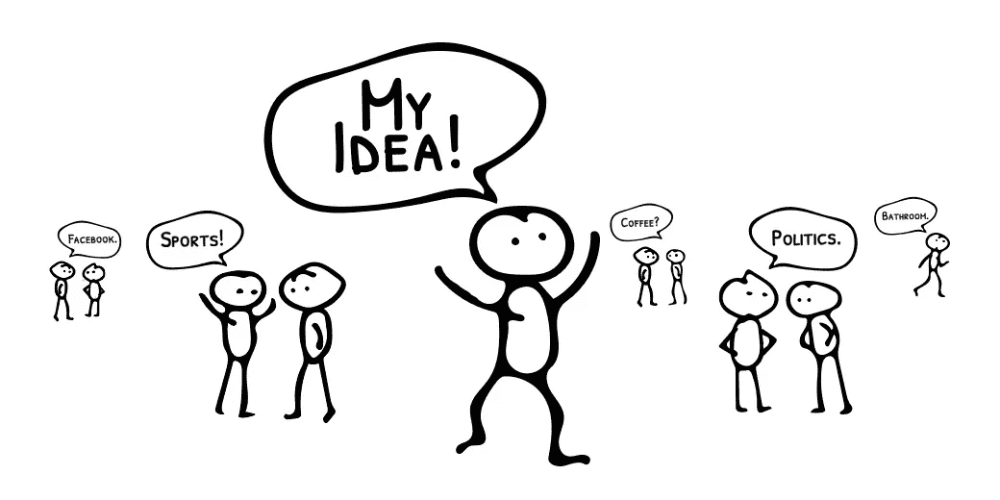
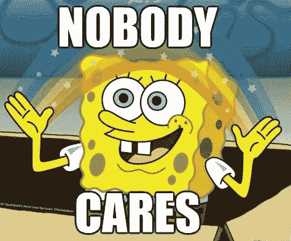
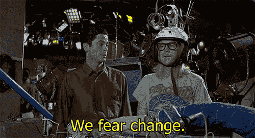

# 一句话可以粉碎、激励和解放你的事业

> 原文：<https://medium.com/swlh/one-phrase-that-can-crush-motivate-and-free-your-business-9a839a426bbd>

## 如果我告诉你**“没人关心”**你的生意，你会有什么反应？当你听到这句话时，你心里有什么感觉？

当我们听到**“没人在乎”**时，我们倾向于首先将其理解为对自己的反思:

*   我的想法很糟糕
*   我永远不会成功
*   我不适合这份工作
*   我永远做不到*(填入你最喜欢的成功故事的名字)*所做的

事实证明，首先向内看的反射是“没人在乎”是怎么回事的完美证明。

这是关于我们都沉迷于自己的事实。

这不是一个判断性的陈述，而是一个进化的事实。我们生来就是为了维持自己的生存。因此，[我们大部分时间](https://www.scientificamerican.com/article/the-neuroscience-of-everybody-favorite-topic-themselves/)都在思考、谈论，当然还有在[社交媒体](http://infolab.stanford.edu/~mor/research/naamanCSCW10.pdf)上发布关于我们自己的信息。

所以，当我们说“没人关心”你的生意时，这不是关于你、你的想法或你的能力。这是因为没有人在乎，因为每个人都狂热地消费自己。

反过来，这产生了一个有趣的悖论:

因为我们沉迷于自己，我们期望其他人关心我们在做什么。同时，没有人有时间给你，因为他们也为自己而着迷。

Terrifying or Magical? ([source](https://imgur.com/gallery/CakjE))

# 迷恋

那就是《无人问津》的“暗恋”视角。世界对你不感兴趣的孤独感觉。没人能看到你在做的所有神奇的事情。

这是你需要拥抱“没人在乎”这个事实的时候，这个事实几乎与你无关。“没人管”讲的是别人对自己的关注。

通过认识到这一点并接受它，你可以开启一些强有力的积极行动。

# 动机

有一种观点认为，为了让人们接受一种新产品或服务，它需要比他们目前使用的任何解决方案都要好“10 倍”。要让某人改变，你不能仅仅比竞争对手更好，你必须让某人改变现有的行为。

众所周知，人们往往不喜欢改变。

Garth [source](http://popkey.co/m/VlDmq-we-fear-change-garth-waynes-world).

但是“没人关心”甚至在采用之前就已经涉及到另一个层面。如果每个人都把大部分时间花在自己的事情上，那么首先要怎样才能引起他们的注意呢？这不是关于竞争的噪音，这是关于你的客户自己头脑中的噪音。

你与客户互动的质量和频率也必须提高“10 倍”才能引起他们的注意。

你的客户对你的工作了解多少？你通过什么渠道联系他们？你是否到处张贴小信息，希望他们会注意到？还是你抓住他们的肩膀摇晃他们？

*(NOTE: Please don’t go out and literally shake anyone.)* [source](https://content.invisioncic.com/r263943/monthly_2018_01/ptafight.gif.5fa8a6746ca600fb2afa5a54d9171fa7.gif)

但这是我们所有人都要面对的障碍。

如果你不努力和你的顾客握手，怎么能指望他们会注意呢？

**这就是“无人问津”的动力。如果你的*结果*不够强，问问自己*做的*够不够。**

我们很容易高估自己的影响力，因为我们做的每件事都需要付出很多努力。但是，你做了足够的努力来克服“没人关心”的障碍吗？你是在摇你的顾客的肩膀吗？

在你决定你的想法不够强或者人们不感兴趣之前，仔细看看你在做什么来引起他们的注意。

很有可能你需要比你想象的多做“10 倍”的事情才能产生真正的影响。

# 自由

“没人在乎”的另一个好处是它为你尝试的一切提供了自由。

Sweet freedom ([source](https://jokideo.com/hello-freedom-eagle-meme/))

当我们分享我们的工作时，最大的障碍之一是害怕别人会怎么想。

*   他们会喜欢我的产品或服务吗？
*   他们会理解我的信息吗？
*   他们会讨厌我们引入的新功能吗？
*   他们会看/看/听我放出来的内容吗？
*   如果我再发邮件，他们会生气吗？
*   他们会觉得我很绝望吗？
*   他们会认为我是个骗子吗？

一旦你接受了“没人在乎”，它就把你从焦虑中释放出来，让你进步。

**“没人在乎”意味着你可以少浪费一些时间去焦虑不安，继续做事情。**

“没人关心”并不意味着你的工作变成了一片空白，永远不会被人看到。这意味着，没有人坐在座位的边缘等待你的下一步行动，以便他们可以解剖它。

如果有人看到了你的所作所为并做出回应，那就太好了。即使他们不喜欢你的产品、文章、播客等。至少你有一个反馈，可以通知你的下一步行动。

最酷的是，如果有人对你做的上一件事不高兴，并不意味着他们不会喜欢下一件事。因为人们太专注于自己的生活，他们很容易忘记并继续前进。

你的观众不会像你一样纠结于你的成功和错误。他们沉迷于自己的成功和错误。

当你拥抱“没人在乎”时，你可以享受你愿意尝试的自由。你可以花更少的时间去思考，更多的时间去做。

# 不是你，是我们所有人

这里最重要的是要记住，你、你的客户以及每个人都首先关注自己。这不是一个判断，也不意味着我们都是可怕的人。这就是我们的构造。

但是，如果你接受这个想法，并消除它可能在内心搅动的情绪，它可以提供你成功创业所需的动力和自由。

# 如果你想在业务发展上获得帮助，请获取我们的免费工作表，阐明你的宏观愿景和目标。

## 这篇文章发表在[《创业](https://medium.com/swlh)》上，这是 Medium 最大的创业刊物，有 306，065+人关注。

## 订阅接收[我们的头条新闻](http://growthsupply.com/the-startup-newsletter/)。

