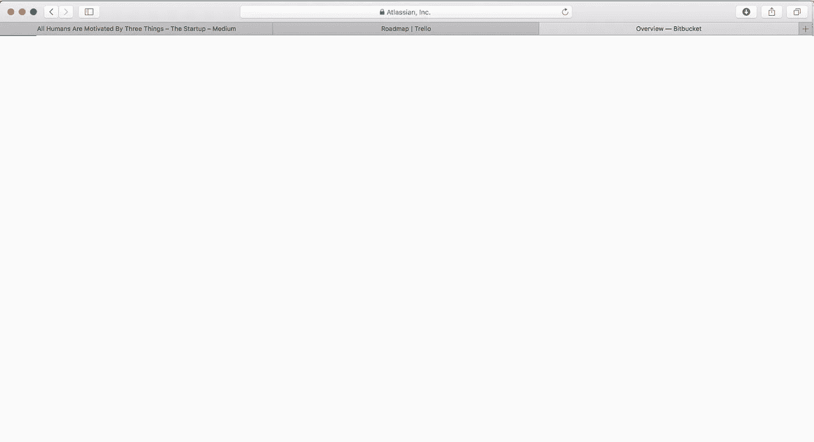
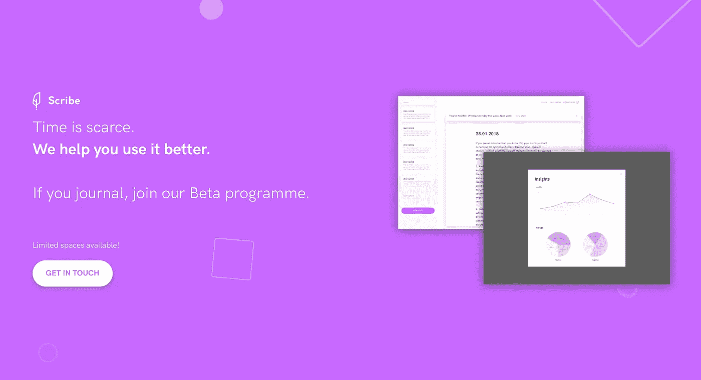

# 一种更好聚焦的技巧

> 原文：<https://medium.com/swlh/one-technique-for-better-focus-a623ea467e0a>

## 三标签技术

三四年前我开始注意到它。

每当我早上打开我的笔记本电脑时，这种恼人的感觉就会出现。

当我快速浏览 Chrome 浏览器的标题时，甚至有点恐慌。

我还没有抽出时间阅读的所有文章。

所有这些不同的项目。

所有那些工作的提醒，未完成的任务。

真正的焦虑，都是因为我选择把所有东西都放在手边，无论我在做什么，无论是工作日还是周末，都很容易看到。

所以我开始实施一个自我强加的规则:

只打开过三个标签。

在一个浏览器上。

只有我当前正在做的任务(我说的当前是指现在，而不是 10 或 30 分钟后)。

当我不可避免地走神时，也许可以在第一页上放一篇文章浏览一下。

# 我们生活在一个分心的世界

听起来有点像自闭症，对吧？

然而它非常有效。不仅会提高你的生产力，还会提高你的生活质量。

**浏览器标签就像手机上的通知:**

**不断的触发因素会分散你的注意力，转移你的注意力，让你偏离你拿起产品时想要做的事情。**

那个 YouTube 标签会把你带进一个分散注意力的兔子洞&适度愉悦的娱乐。

概述你要开始的新项目的标签会让你在需要开始之前就担心它。

那个 Messenger 标签会一直向你闪烁一个数字，直到你屈服&看看“Karen 已经向你发送了一条消息”提醒背后可能隐藏着什么。

在一个我们不停工作的世界里，我们也会不停地分心，无法专注于一项任务超过几秒钟。(准确的说是 8 个)。

任务转换，生产力的敌人，在我们的生活中横行霸道，毫无疑问，甚至被鼓励。

# 遵循三页规则

所以，如果你想完成更多的工作，同时在这个过程中感觉更放松，试着坚持一周三个标签。

为此，只需问自己一个简单的问题:

你需要立即打开什么？你可以关闭哪些在接下来的 5 分钟内不需要的东西？

然后行动:

1.关闭您的浏览器
2。在接下来的 5 分钟内打开 2-3 个你需要的标签
3。给自己一个“款待”标签:故意让自己分心(我是一名产品设计师，所以倾向于保持一篇关于用户体验或产品管理的中型文章开放)

## 这篇文章发表在 [The Startup](https://medium.com/swlh) 上，这是 Medium 最大的创业刊物，有 328，729+人关注。

## 在这里订阅接收[我们的头条新闻](http://growthsupply.com/the-startup-newsletter/)。

