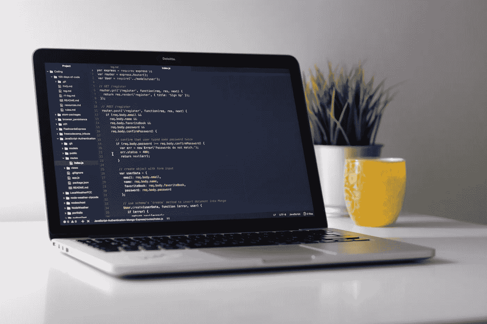

# 每个企业家都应该开始学习的一件事

> 原文：<https://medium.com/swlh/one-thing-every-entrepreneur-should-start-learning-89733ff1a2f7>

如果你是一名企业家或者渴望成为一名企业家，有一项技能你必须学会。不是销售，不是营销，不是财务。正在编码。我不是说你要成为编程的大师，而是你要有足够的知识去把握基本面。大多数非技术创业者低估了编码的重要性。

当然，非技术型创始人还有其他技能，如金融、市场营销和销售等，但理解编码语言的基础知识可以让非技术型创始人更好地理解业务，让他们理解他们以前不理解的东西。

你可以成为非技术技能的大师，但是你应该建立对编码的良好理解，这里有一些你应该尽快开始学习的理由。

# 你可以开始创业

如果你有一个想法，你想通过创建一个应用程序来发展成为一个企业。你可以通过设计登陆页面、建立网站或创建邮件列表来开始推广你的想法。如果你有一些基本的编程技能，你可以顺利地完成所有这些。

如果你有高级技能，你甚至可以采取小步骤来构建你的原型。创建一个业务原型将使你能够展示给其他人，这样你可以得到反馈，并了解你的产品是否有市场。你甚至可以抓住投资者的兴趣并筹集资金。

我并不是说你应该成为一名编码忍者，这需要时间，而且在你达到足够的编程熟练程度之前，你开始开发你的应用程序就太晚了。最好雇佣擅长开发应用程序的人。

如果你理解编程是如何工作的，那么和自由开发者交流清楚地解释你想要的是什么会更容易。

# 学习编码，开启另一个世界

伟大的企业家是伟大的创新者。你需要更加创新，才能达到最伟大的企业家的水平。学习编码将为你打开一个新的视角。

编码让你以不同的方式看待世界，你可以发现许多你以前从未想过的创新机会。如果你已经掌握了市场营销和金融等非技术性技能，你可以将它们与编程结合起来，发现许多未开发的领域。

# 改善与技术人员的沟通

你有没有遇到过这样的情况，你和你的技术团队坐在同一张桌子上，却不知道他们在谈论什么？

如果你对我上面提到的问题说是，那么不要担心这是正常的。如果你想克服沟通障碍，你需要对编码有一个基本的理解。

这样想想，你的技术团队在说另一种语言，而你不懂他们的语言，那么如果你不和他们说同一种语言，你如何有效地领导他们并与他们沟通？

只说英语能和只说俄语的人交流吗？同样的事情也适用于你的技术团队。学习他们的语言以便达成共识。在俄罗斯的情况下，你可以用手势交流，但在技术谈判中不起作用。

# 你不必依赖他人的专业知识

假设你有一个很棒的想法，并且你准备和一个代理或自由开发者谈。但是，仅仅因为你对编码一无所知，就意味着你必须依赖自由职业者或代理机构所说的。

当你谈判一个应用程序的价格时，价格是基于在项目上花费的一个小时。如果你没有技术背景，那么你将不知道你的应用程序需要多长时间来开发，这是不好的。我会在下面解释原因。

如果你被告知，你的应用程序将需要 200 个小时来开发，你唯一的选择就是相信开发者，接受他的价格。你不知道开发这个应用程序需要 200 个小时还是 150 个小时。如果你了解应用程序开发是如何工作的，你将能够评估该项目需要多长时间，并就价格进行谈判。

缺乏编码知识可能会导致你付给开发人员过高的报酬。你也很难衡量项目的质量，因为你缺乏所需的技能。你最好尽快报名参加软件编程课程。

## 这篇文章发表在 [The Startup](https://medium.com/swlh) 上，这是 Medium 最大的创业刊物，拥有+400，714 名读者。

## 订阅接收[我们的头条新闻](http://growthsupply.com/the-startup-newsletter/)。

