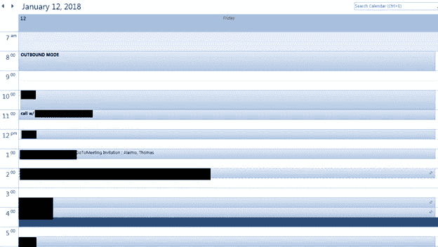

# 一个能帮你突破销售配额的窍门

> 原文：<https://medium.com/swlh/one-trick-that-will-help-you-crush-your-sales-quota-6cf04acf2678>

终极生产力黑客

Photo by [Sonja Langford](https://unsplash.com/photos/eIkbSc3SDtI?utm_source=unsplash&utm_medium=referral&utm_content=creditCopyText) on [Unsplash](https://unsplash.com/search/photos/timer?utm_source=unsplash&utm_medium=referral&utm_content=creditCopyText)

没有别的办法:销售很难。

有持续的压力和每天的拒绝，为了成功需要很多技巧。其中最重要的，也是最难掌握的，就是时间管理。有这么多事情要做，通常很难在一天中找到时间来完成你的待办事项清单。如果你已经是一个时间管理大师，并且有一个完整的时间表，那么恭喜你！无需进一步阅读。

如果没有，看看下面的四个步骤，它们可以帮助你完成今年的定额。这是一个我称之为“出站模式”的系统

外向模式是一种简单的方法，可以将你工作日的第一个小时用于潜在客户和建立销售渠道。没有分心，没有偷懒，100%专注于手头的任务。

以下是进入出站模式的四个步骤:

# 1.准备工作在前一天晚上开始。

> “没有准备就是准备失败”——本杰明·富兰克林

为了以正确的方式使用出站模式，您需要做好准备。在没有明确计划第二天要做什么的情况下，你不应该晚上离开办公室。这意味着为任何会议、RFP 或你待办事项清单上的任何事情做好准备。前一天晚上就把工作做好，这样你就可以在销售时间表现得更好。

这种准备包括准备好你的潜在客户。列出你要给谁打电话，你联系他们的原因，准备好他们的联系方式，这很重要。这样，当你第二天早上进入出站模式时，就不会浪费物流时间。

只有准备工作完成后，你才能离开办公室。

# 2.把日历划掉。

这是大多数人跳过的一步。他们告诉自己，“是的，我明天早上一定会去找的。”明天早上，他们看着自己的日历，看看它是开着的，然后让不用动脑的任务填满他们一天的第一个小时。

或者他们会说，“我今天早上错过了，但我会在下午晚些时候找整整一个小时，我保证。”不太可能。一天中会突然出现很多事情，这使得早上成为设置你外出模式的理想时间。

这就是沃伦·巴菲特所说的“先支付自己”。

给自己这段时间去做那些能让你成功的任务，并在月底把钱放进你的口袋。

下面是一个真实的截图，展示了当我关闭出站模式时，我的日历每天的样子。

# 3.不要分心。

> "同时做两件事等于什么都不做。"— Publilius Syrus

既然已经承诺了出站模式，那就充分利用它吧。主要的干扰有几种形式:

**邮件:**让我们保持真实。你的老板、销售支持、同事和客户可能会在这个时间给你发邮件。你会看到他们的名字并想点击它。你知道中断后平均需要 25 分钟才能回到原来的工作状态吗？不要点击邮件。它可以等一个小时。

**社交媒体:**不断查看我们的信息已经成为我们集中注意力的真正障碍。狗图片、特朗普推文和梦幻足球都可以等等。还记得我说过的任务中途被打断吗？不要屈服。

**同事:**这个可能有点棘手。我们都有一个能让你喋喋不休的同事。他们在周一早上来，当他们告诉所有人他们的周末时，已经是吃午饭的时间了(顺便说一下，如果你是那个人，我们需要谈谈)。你可以友好地告诉他们，你正在粉碎它，稍后可以赶上他们。他们会原谅你的。

# 4.去追它！

> “光忙是不够的。蚂蚁也是。问题是，我们在忙什么？”——亨利·大卫·梭罗

你已经准备好了。你已经承诺了。你不会分心。现在有趣的部分开始了。

打那个电话。

发送电子邮件。

坚持不懈，玩得开心。

这是销售最好的部分！

[*【此文最初由 Salesforce Quotable 博客发布。】*](https://www.salesforce.com/quotable/articles/trick-to-crushing-your-quota/?d=7010M000001yE2y)

# 想要加快你的个人发展吗？
[在这里注册我的简讯](http://eepurl.com/c-46aj)

**关于作者**

[Tom Alaimo](https://www.linkedin.com/in/tom-alaimo-573a1878/) *是一位充满激情的 B2B 销售专业人士。他目前是* [*TR Talk 播客*](https://soundcloud.com/ryan-warner-799706255) *的共同主持人，他和瑞安·华纳采访了各自领域的领导者，了解千禧一代如何快速跟踪他们的个人发展。Tom 也是 TechTarget 的客户经理，住在旧金山。*

[网站](http://tomalaimo.com/) | [播客](https://soundcloud.com/ryan-warner-799706255) | [邮箱](mailto:thomasalaimo7@gmail.com) | [推特](https://twitter.com/TomAlaimo_TTGT)|[LinkedIn](https://www.linkedin.com/in/tom-alaimo-573a1878/)|*|*|[脸书](https://www.facebook.com/thomas.alaimo.12) | [Instagram](http://instagram.com/talaimo7) | [媒体](/@TomAlaimo_TTGT) |

## 这个故事发表在 [The Startup](https://medium.com/swlh) 上，这是 Medium 最大的企业家出版物，拥有 302，074+人。

## 在这里订阅接收[我们的头条新闻](http://growthsupply.com/the-startup-newsletter/)。

