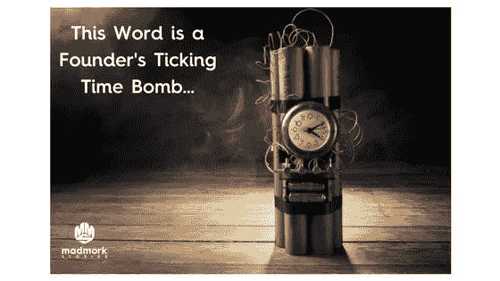

# 创始人必须摒弃一个词

> 原文：<https://medium.com/swlh/one-word-founders-must-banish-66c61a3edfef>

如果你注意到这篇文章的标题，有一点可能是显而易见的:我选择使用“必须”这个词，而不是“应该”。

**为什么？**

首先，因为“must”意味着重要性和紧迫性，而“should”听起来更温和、不那么紧急。第二，因为我讨厌“应该”这个词事实上，我非常讨厌它。“恨”是一个非常强烈的词，我把它留给真正值得的东西。但是语言很重要。我们对词汇的选择不仅影响我们的感受，也影响他人对我们的看法。

最近我最喜欢的播客之一是蒂姆·费里斯的“[导师部落](http://www.tribeofmentors.com/)”。在他的一个播客中，他采访了一位前海豹突击队员、著名作家和伊拉克战争中获得勋章最多的海豹突击队员之一:乔科·威灵克。在采访中，蒂姆问了乔科一个问题，这个问题是他在《良师益友部落》中采访的 130 位名人都会问的:“如果你能在广告牌上放点什么，那会是什么？”乔科的回答是:“自由=纪律。”这似乎有悖直觉，直到乔科解释说，当你训练有素时，你就会减肥并保持身体健康。当你对财务规划和管理有纪律的时候，你增加了你的资产价值和财务健康。当你在创业公司中严格执行产品管理时，你就能制造出优秀的产品并按时交付。当你在雇佣忠于你的创业公司使命和价值观的人时，你保存了你公司的文化，并使它变得更强大。

所以我讨厌“应该”这个词。花一分钟想想你自己作为一名创始人或初创企业创始人的情况。这些情况中有多少听起来是真实的？

-我真的应该跟踪那个客户，找出他不签合同的原因

-我应该和这位产品经理谈谈，了解他为什么不能和工程团队一起工作

-鉴于我看到的上一个风投的反馈，我应该继续努力

-我应该花更多的时间和我的妻子在一起，考虑到我工作的时间

-我应该带着所有的压力去健身房锻炼一个小时

-我应该多睡会儿。在过去的五天里，我一直工作到凌晨 3 点

-我应该告诉我的联合创始人，我们的钱快用完了(通常会伴随着剧烈的抽搐、深深的叹息、流泪、砸碎笔记本电脑或以上所有情况)

我敢打赌，阅读这些陈述的大多数人都曾在某个时候犯过这样的错误。现在回答这些问题:

1.思考或说出这些陈述会让你有怎样的情绪感受？

2.你是否立即对这些事情采取了果断的行动？如果你做了，你有什么感觉？如果你没有，在一周、一个月或三个月后说出同样的句子，你会有什么感觉？

你看到一种模式出现了吗？我做到了，这就是为什么我开始讨厌“应该”这个词。这也是为什么我选择做出超人的努力，从我使用的词语中禁止它；甚至潜意识里。

超级蔻驰托尼·罗宾斯在他的书《唤醒内心的巨人》中讲述了我们如何创造强大的生活。他提到的一件事，我满怀热情地相信，就是需要简单地做决定。做决定解放了我们，给了我们目标，给了我们焦点。作为创业者更是如此。我经常发现我压力很大，因为我需要对一些我还没有完全决定的重要事情做出决定。我做决定花的时间越长，我就越紧张。一旦我做了决定，不管是好是坏，我都觉得自由了，我进入了执行模式。这是关键，因为执行力和对行动的偏好是决定创业成功与否的因素之一。( [**鸣叫本**](https://ctt.ec/d88dK) )

这是我讨厌“应该”这个词的另一个原因“应该”就是优柔寡断的意思。意思是我需要做点什么，但我不会去做。我要考虑清楚。我要延期。我要把罐子踢到路边。我将在优柔寡断中漂流。

例如，我辅导的一位客户有一天谈到，他意识到自己花了太多时间工作，担心自己的工作状况(他在一家初创公司工作)。他认识到，花在工作上的时间或担心工作的时间严重影响了他从事其他对他来说重要的事情的能力:与伴侣在一起的时间。他的友谊的质量和力量。甚至他花在其他活动上的时间，如阅读或户外活动。当我问他会如何花时间与朋友重新交往或从事一项有益的活动时，他回答说:“嗯，我真的很喜欢读书。我想我可以和朋友们建立一个每月一次的读书俱乐部，在那里我们可以读一本有趣的书，边喝咖啡边讨论。这将有助于我更经常地见到我的朋友，并让我忘记工作。我真的应该那样做。”又是那个词。于是我继续说道:“感觉花时间和朋友在一起，阅读对你来说真的很重要。是什么阻止你现在开始这个读书俱乐部？”

我们对这个想法谈得越多，他就越兴奋。谈话结束时，他决定在我们下次见面前举办读书俱乐部。他的举止完全变了。他感到快乐、兴奋和宽慰。两天前，他给我发来了 excel 列表和谷歌表单，上面是他发出邀请的人的信息。他从“应该”变成了“愿意”。他从不确定走向确定，从犹豫不决走向行动。更重要的是，我们完成我们需要做的事情越多，我们就越有力量去迎接更多的挑战。

**如何将“应该”从我们的词汇中删除**

首先，我不是说你应该把“应该”这个词从你的词汇中完全删除(没有双关语的意思)。它存在于英语中是有原因的，有时你会觉得它是最合适的词，尤其是当你和别人说话并试图提供帮助或建议的时候。当它延迟或瘫痪我们的决策时，或者当它强化了我们试图改变的特定行为模式时，它会伤害我们创始人。

这里有一些提示，告诉我如何处理突然出现的“应该”的情况——尤其是当涉及到我的生意、我的孩子和我的亲密关系时。

1.只要这个词一出现在我的脑海里，我就会试着把这个行动/决定归类为“必须现在做，必须在 x 日之前做，或者干脆不做。”如果是前两个中的一个，它会作为一个后面有日期的任务进入 Asana 或我的日历(取决于任务的性质)。如果没有，我就随它去。

2.我对自己说“不立即或在不久的将来这样做的后果是什么”？根据后果的严重程度，有问题的项目会进入我的任务列表或者被丢弃。

3.如果是相当重要的事情，我可能也会问自己“一旦我完成了这件事，我会有什么感觉？”或者“如果我没有完成这件事，我会有什么感觉？”我的感受很重要。如果我知道忽略这个任务会让我感到内疚，或者会让我更加内疚，那么它会被放在任务列表中，后面还有一个现实的日期。一个现实的日期很重要，或者如果你错过了，这个项目就变成了你“应该”做的事情。

4.根据事情的重要性，或者如果它涉及一个或多个其他方，我也会问自己延迟或不做任务是否会伤害我的正直。对自己和他人诚实是我的教练教给我的第一件事，尽管我偶尔会有挣扎，但我通常会信守诺言。如果我告诉某人我要做某事，我就会去做。如果我迟到了，我会主动承认这一点，并看看我是否能与另一方就有问题的项目商定一个新的截止日期。

5.我学会了简单地说“不”。我们每个人都努力争取成功。问题是你越成功，就越需要学会说“不”( [**推文这个**](https://ctt.ec/55rkw) )。你的盘子里有太多的事情要做，分清轻重缓急并执行是持续成功的关键。我过去常常接受人们在喝咖啡时提出的大多数会面要求。现在，考虑到我的优先权，我更有选择性了。我宁愿坦诚相待，这样可以节省我们两个人的时间。它还帮助我专注于我需要做的事情(而不是我“应该”做的事情)。

6.最后，我在脑子里练习改变正在讨论的句子的性质，把“应该”这个词换成“将要做”或“必须做”，然后看看我的感觉如何。奇怪的是，特别是如果这个项目真的很重要，当我说“我要做 X 或 Y”的时候，我通常会感到一股小小的能量和热情。它实际上帮助我完成了那个项目。

“应该”是一个非常危险的词，因为它可以把我们留在无人区。当我们与他人一起使用它时，我们可能要求的严肃程度也会受到质疑。比如说，今天我和我的一个好朋友 Sachit Kamat 共进午餐，他曾是 Linkedin 的高管，现在是 [Zently](http://www.zently.com/) 的联合创始人兼首席执行官。作为一名与工程师密切合作的前产品经理，他说:

“我从来不对工程师使用这个词(应该)，因为它创造了空间来建造一些不是预期的东西。”( [**推特本**](https://ctt.ec/Rejce) )

所以，最后，你可能与之交谈的听众的情况和类型也很关键。如果你需要完成某件事或者想让别人做某件重要的事，“应该”不是你的朋友。“应该”=暧昧和暧昧是一个创始人的敌人。( [**推特本**](https://ctt.ec/K6hRn) )

现在你真的“应该”回去开始创业了，

疯狂默克

讲故事的人

## 这个故事发表在 [The Startup](https://medium.com/swlh) 上，这是 Medium 最大的创业刊物，拥有 290，182+人关注。

## 在这里订阅接收[我们的头条新闻](http://growthsupply.com/the-startup-newsletter/)。

