# 一年的编程让我来到了这里

> 原文：<https://medium.com/swlh/one-year-of-coding-got-me-here-99fc2bdfd3b8>

> 整整一年前，我从未打开过我的 macbook 终端。

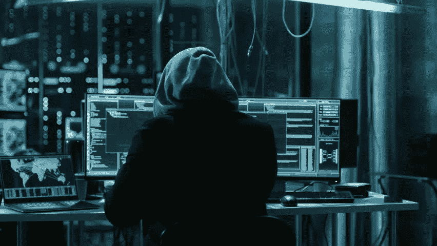

My image of a coder

感谢流行文化，我认为一个*程序员*是一个*黑客*的同义词，是一个喜欢在黑暗的地下室工作，戴着巨大耳机，穿着帽衫的人。我不知道有任何一个网络开发人员或任何人能反驳或挑战我脑海中的那个形象。

我是那种离刻板印象最远的人。我是一个外向的英语老师，热爱莎士比亚和塞林格，有戏剧天赋，是教授自由研究的硕士。为了学术研究和偶尔跟踪前男友，我可以浏览谷歌，但除此之外，还有我电脑的文字处理器，我对科技世界相对不太了解。

*一年前，我对编码真正包含的内容有了 **0.0 的了解**，这还不够明显吗？然而，快进到 2018 年 1 月，我正处于人生重大转变的边缘，我爱上了网络开发，即将开始软件工程师的职业生涯，事情与当时的情况相去甚远。*

就在一年前，我在职业生涯中变得焦躁不安，并准备迎接新的挑战。我遇到过一些编码训练营的毕业生，并被 web 开发的魅力和未知世界所吸引。整个领域本身感觉陌生，神秘而性感。尽管我脑海中有反社会编码者的形象，我的好奇心还是形成了。我想知道:

> 如何开发一个应用程序？编码员实际上是做什么的？但是等等，互联网是怎么运作的？

一时兴起，我注册了一个免费的 [Codeacademy](https://www.codecademy.com/learn) 课程，我相信这是 HTML/CSS 的入门课程。我不确定自己是否有智力或能力去学习它，但是渴望就在那里。我开始参加西雅图当地的技术聚会，试图结识业内人士，并开始探索我能获得什么样的机会。

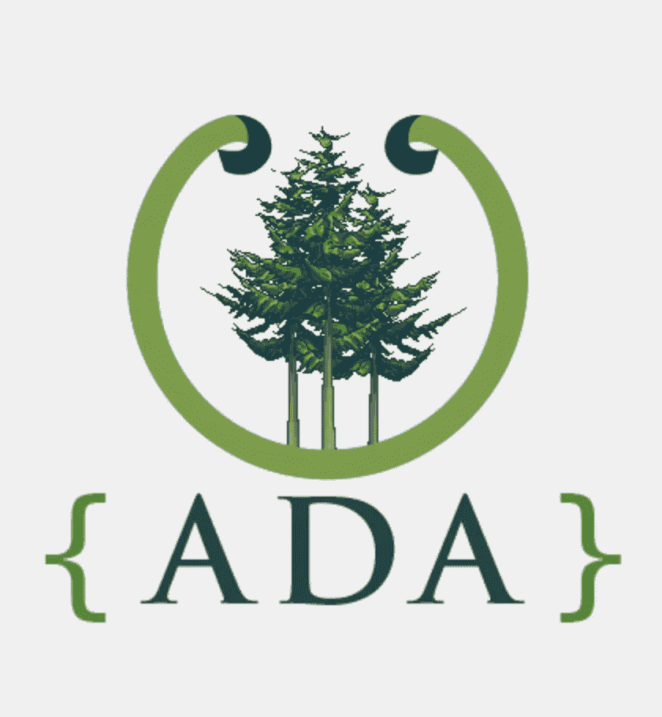

当一个新朋友告诉我关于 Ada 开发者学院的时候，一切都改变了。

训练营感觉遥不可及，因为大部分费用在 10-20K 之间，但她解释说 Ada 是免学费的！我了解到 Ada 是一个非常受人尊敬的培训项目，面向那些想成为软件开发人员的女性和不同性别的人。它与其他训练营的独特之处在于，它长达一年，允许真正融入学习过程，并保证之后有五个月的技术实习。不足为奇的是，它在录取方面的竞争也非常激烈，所以参加考试感觉希望渺茫。 ***但我却对它如饥似渴*** *。参加一个强调学生间合作而不是竞争的项目对我来说是如此梦幻，以至于我沉迷于其中。这是我从 2017 年 1 月到 3 月谈论的全部内容。*

我竭尽全力准备，拼命干了几个月，直到申请窗口打开。当我在 2017 年 3 月 29 日打开我的录取通知书时，我说我的整个生活都改变了，这并不是多余的。第二天我就辞职了，把我所知道的一切都抛在了脑后。

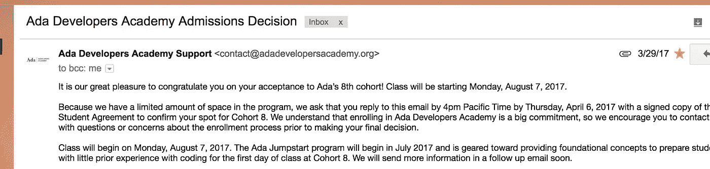

I vividly remember opening this email while standing in line at H&M to buy a pair of pants lol

当我接近我从事编码职业的一周年时，我想把我在过去 12 个月中经历的所有变化都分门别类会很有趣。

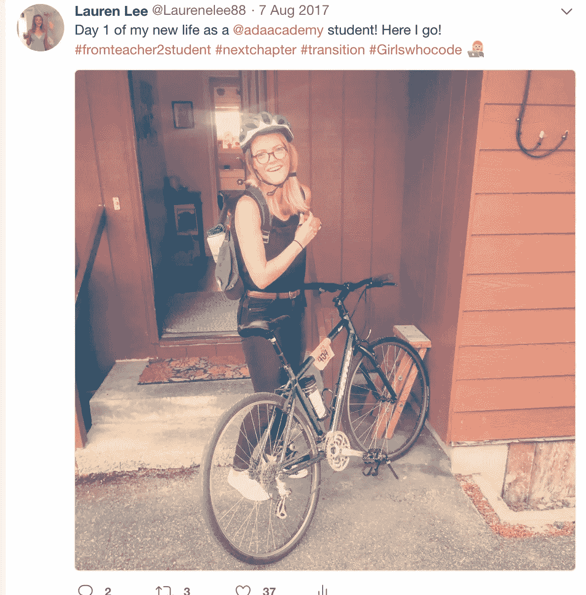

Day 1 — Commute to School!

# 所以是这样的:

1.正如我提到的，我养成了积极参加技术会议的习惯——尽可能多的参加(有时一周 5 次以上！)在努力建立我的开发者和企业家网络的过程中——我很快了解到，虽然这个领域由男性主导，但有许多由女性和人们组成的 rad 社区正在努力改变这一事实，现在我很幸运能够成为其中的一员。

2.我离开了一份我热爱的工作，离开了和我一起工作了七年的许多优秀的同事

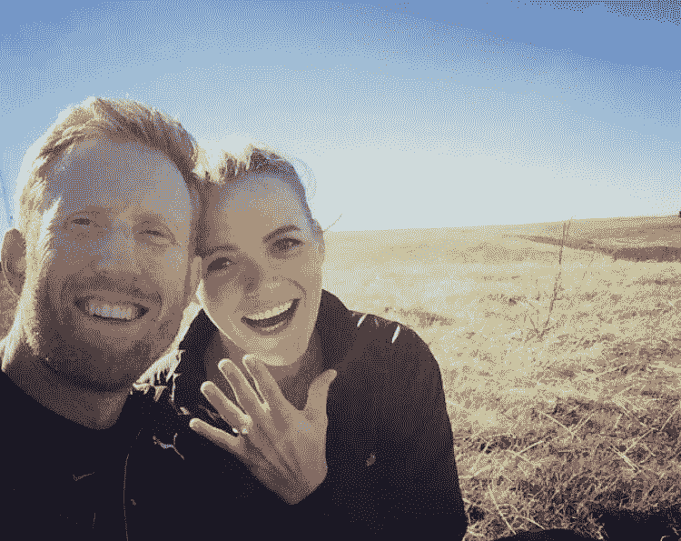

Sonoma, CA — Feb 2017

3.卢克和我订婚了！

4.我和其他 47 位令人惊叹和鼓舞的人一起，成为了 Ada 团队的一员

5.十年来我第一次重新开始上学，主要是讲课式的，每天从 9 点到 5 点。

6.我读了桑迪·梅斯

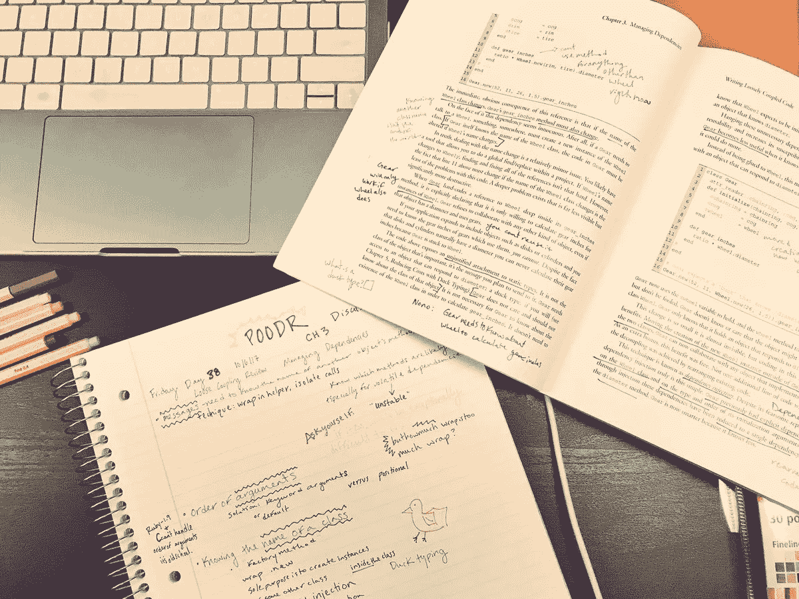

my POODR notes and annotated book

7.我开始在西雅图的科技行业结交朋友和导师

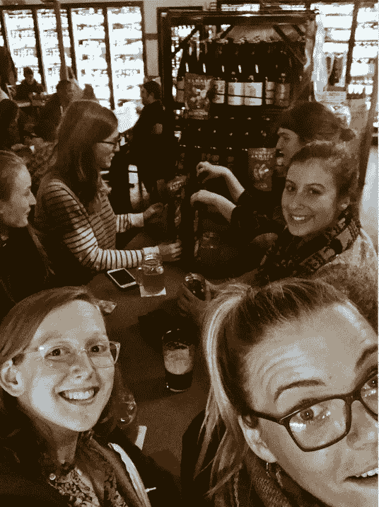

My coding buds

8.我学习了 Ruby，Ruby on Rails，HTML & CSS

9.我迷上了桑迪·梅斯

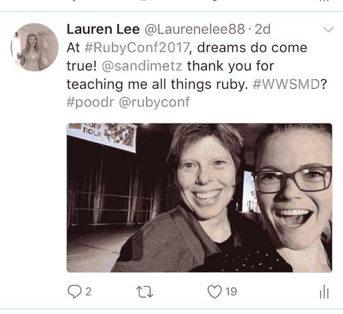

Me and SANDI METZ!

10.我作为一名机会学者参加了新奥尔良的 RubyConf，在那里我了解到我的编码朋友社区并不仅仅存在于西雅图(在这里阅读更多关于那次经历和我对写列表的明显热爱

11.我遇到了桑迪·梅斯！←

12.我了解到 Java 和 Javascript 是 ***不同的***

13.最终了解到 ***什么*** 那个 ***区别*** 是什么(特别感谢我的行业导师@mjdwitt 在我让他给我解释的时候他尽力掩饰自己的笑声)

14.我参加了我的第一次铁人三项赛！

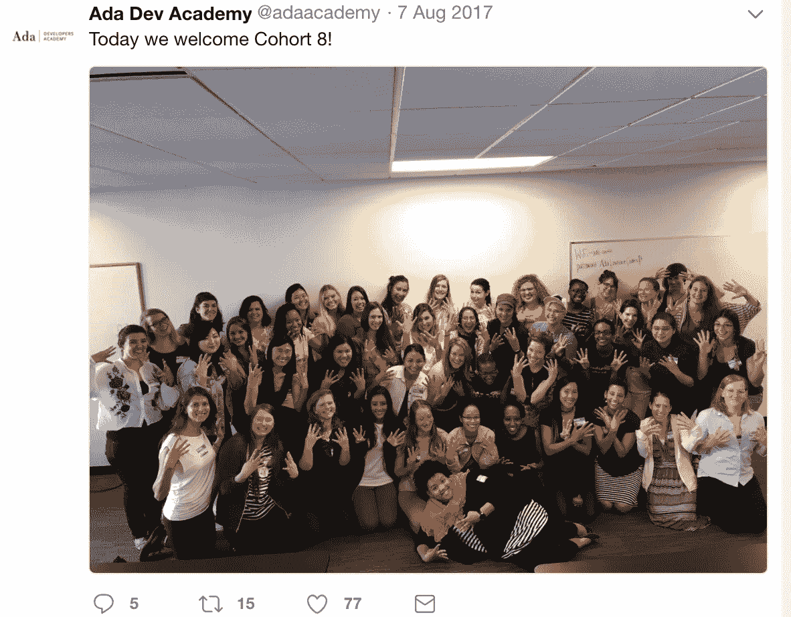

My Cohort of Adies C[8]!

15.我认识到**编码绝不是一门独立的或反社会的艺术**，它在我们班的合作结对编程和基于团队的任务中蓬勃发展

16.我还了解到，当我们被指派单独处理其他项目时，我能够独立工作并独立解决问题

17.我学会了如何使用和编写自己的 API 数据库

18.我申请了有史以来第一次在科技会议上发言

19.我发现了失眠的恐怖

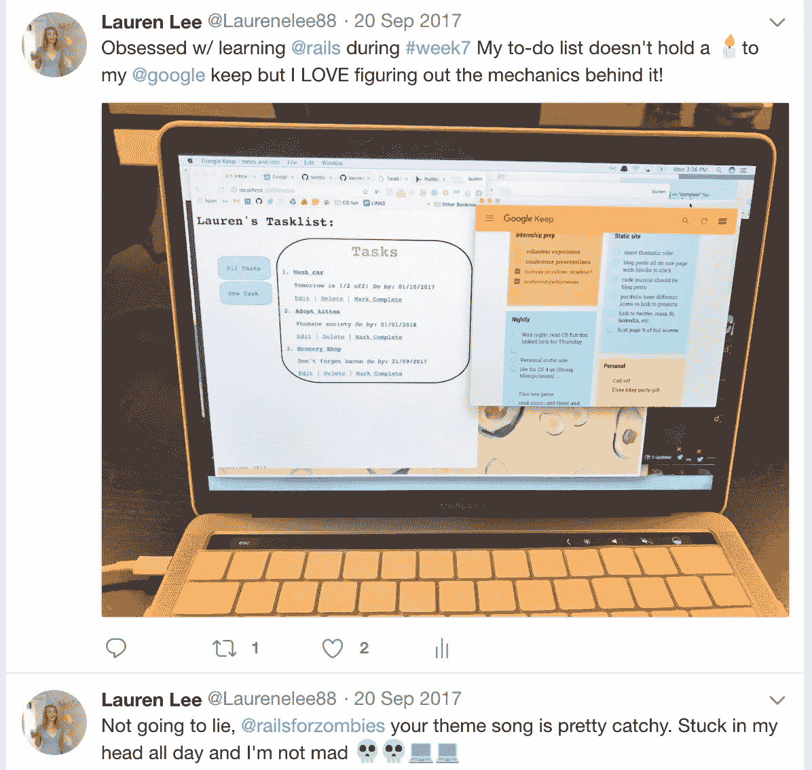

My first ever Rails app!

20.我被上述技术会议拒绝了，但这不会阻止我明年再次申请！

21.我学习了 Javascript 和主干

22.我用各种技术语言建立了许多网站和应用程序(点击这里查看我的 Github 回购目录

23.我学会了喜欢(也讨厌)测试驱动的开发

24.我开始学习计算机科学的基础(虽然，我仍然不知道二叉树是什么/它们是如何工作的……但是我们都在进步，对吗？)

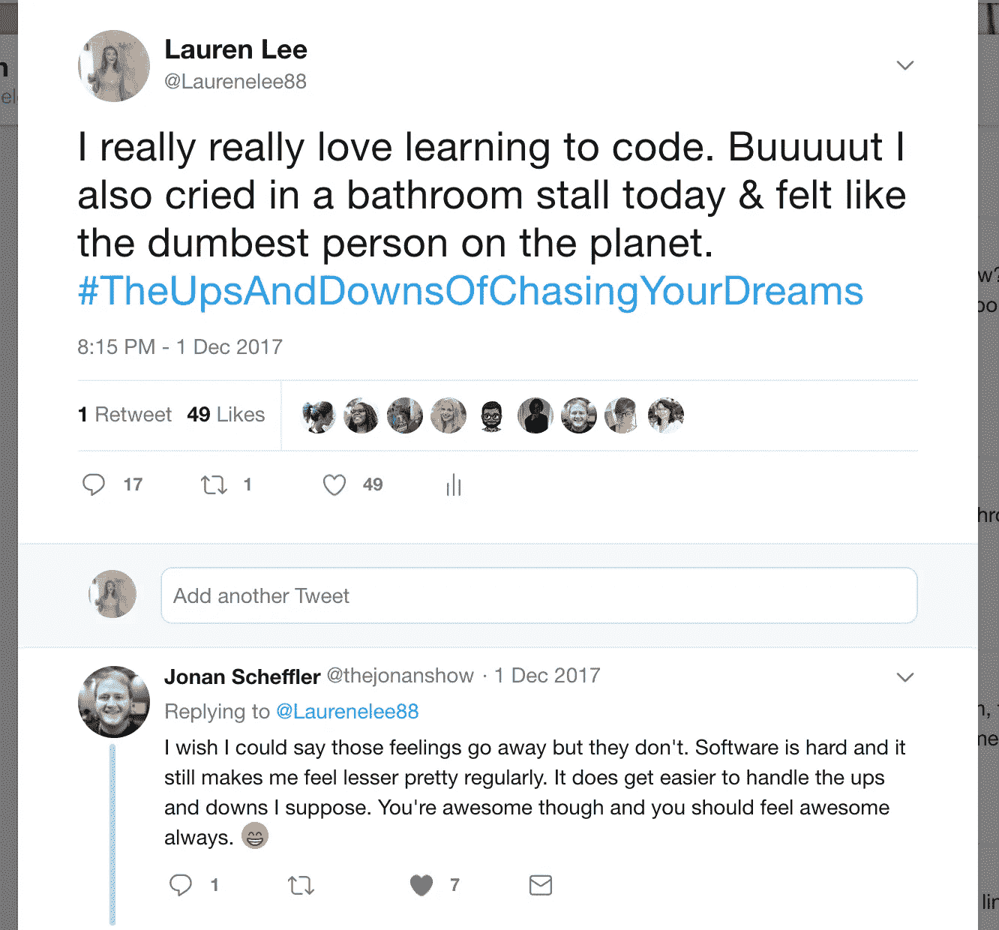

25.我不止一次在学校的浴室里哭泣/觉得自己完全不值得得到这样一个上 Ada 的好机会/觉得自己一定是骗了他们才让我进去的

26.在同学和 Ruby 新朋友的帮助和支持下，我努力培养自我价值感，最终意识到我也值得留在这里

27.我学到了重构的乐趣，有时回到一周前的代码，却意识到这有多糟糕，如果我知道什么是三元运算符，它会变得更简洁！

28.卢克和我在墨西哥的萨尤利塔举行了婚礼，我们 50 个最亲密的朋友和家人都出席了

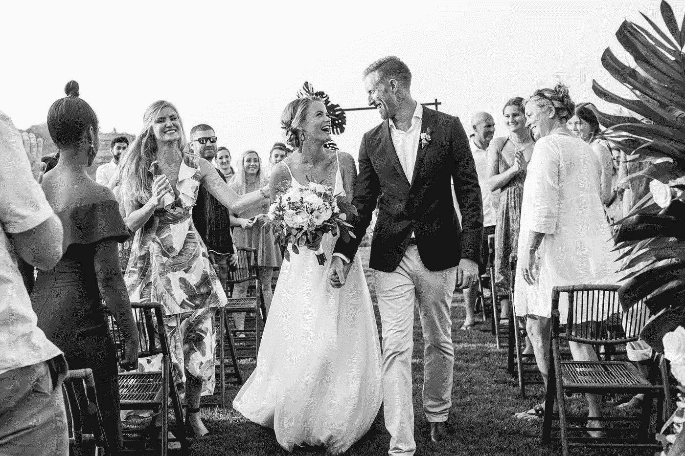

29.我翻阅了三本厚厚的笔记本，上面写满了激进的彩色编码笔记:

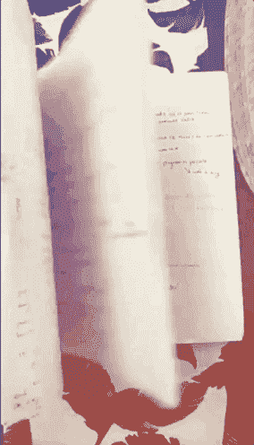

30.当我的电脑坏了，损失了两天的工作时，我知道了完美的饮食卫生的重要性

31.我开始在 ChickTech 做志愿者，回报并鼓励年轻女孩，她们也可以在 STEM 和科技界取得成功！

32.在为实习做准备时，我面试了 6 家不同的科技公司，用白板演示了许多算法&没有死

33.我评判了一个高中黑客马拉松，那里的学生真的相信我自己就是一个程序员！？

34.缓慢但稳定地，我也开始认同自己是一名程序员

35.我正式完成了 Ada 的课堂部分！

36.我自愿支持/帮助下一批 Ada 学生(亲切地称为 *Adies* )！他们的队列(C[9])课堂部分下周开始！😁😁😁😁😁😁

37.我被安排在我的**首选**进行实习，从二月份开始，我将在*亚马逊的 Kindle 团队*实习！

38.为了我的终极**顶点项目**，我自学了 React Native，并在短短 3 周内为寻找志愿服务机会的青少年编写了一个 iPhone 应用程序。下面是[截击](https://github.com/laurenelee/capstone-frontend-ReactNative/blob/master/README.md)的预告:

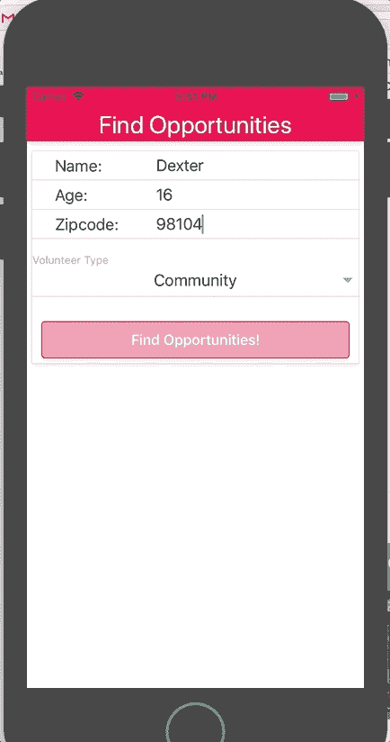

To watch my presentation click [HERE](https://www.youtube.com/watch?v=nfQDEmr37MM&t=29s)

39.哦，最后但同样重要的是，我们领养了一只小猫，给他取名德克斯特(他是我所知道的最好的咕噜声程序员)

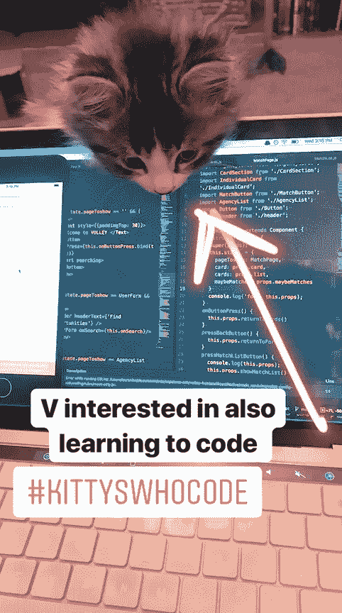

40.然后砰！💣从这一刻起，再过两天，我和我的同学们将完成我们的压顶作品，我们将把我们的项目展示给我们的朋友、家人、导师和未来的雇主！

# 哦……你可以说事情发生了一点点变化。

过去的一年对我来说不仅是一次智力复兴，而且在学习编码的过程中，我被鼓励比以往任何时候都更加脆弱地生活，并且发现了冒险可以带来什么惊人的事情。

我明白了，当我失败时，我成长得更多，而不是当我第一次尝试就做对了。

虽然这一年我的人际关系一直处于情感紧张状态，但我已经学会了品味我的业余时间，以及真诚明智地度过这段时间的重要性。

## 我学会了赌自己。

我曾认为电脑和互联网的运作是魔术，但现在在了解了幕后发生的事情后，我更加敬畏它的能力，并意识到它在连接人们和创造一个比我们生活的世界更美好的世界方面的力量。

虽然我有时可能会质疑离开我的教师职业，但最终我很高兴也很自豪能成为一名进入科技世界的女性，并成为一名有动力帮助创造一个更加合作、友好和多样化的空间的人。

就这样，我开始着手下一年的工作，继续我的编码之旅，这真的感觉像是一次伟大的冒险。这让我想起了我最喜欢的邓布利多的名言，我将以此结束:

> "现在，哈利，让我们步入黑夜，追寻那个轻浮的妖妇，冒险."

# 请务必点击这里查看我的 React 原生 iPhone 应用凌空[的视频演示！](https://www.youtube.com/watch?v=nfQDEmr37MM&t=29s)

Thank for reading! Follow my journey: @LoLoCoding

## 这个故事发表在 [The Startup](https://medium.com/swlh) 上，这是 Medium 最大的创业刊物，拥有 289，682+人关注。

## 在这里订阅接收[我们的头条新闻](http://growthsupply.com/the-startup-newsletter/)。

