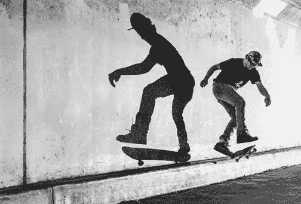
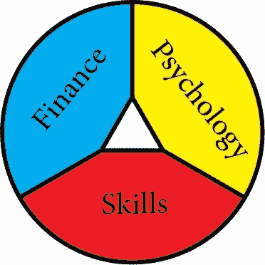

# 一年，一件事

> 原文：<https://medium.com/swlh/one-year-one-thing-1b6d6cdcc28a>

Photo by [Saksham Gangwar](https://unsplash.com/photos/gPnovpRp0S8?utm_source=unsplash&utm_medium=referral&utm_content=creditCopyText) on [Unsplash](https://unsplash.com/search/photos/dreams?utm_source=unsplash&utm_medium=referral&utm_content=creditCopyText)

为什么一年只专注于一件事会为你的成功打下基础。

> 你有没有在一整年的生命中把 100%的注意力放在一件事情上？

我猜你对这个问题的回答是一个大大的否定。

人很快就会厌倦。人们很快就会分心。人们被他们的恐惧和焦虑所淹没。人们很少对某件事深信不疑，以至于愿意孤注一掷。

这就是为什么有人能够花一年的时间在一件事情上，已经领先于 99%的人。

> 每天写一年关于生产力的博客。
> 
> 用一年的时间创建一个帮助人们建立更好习惯的应用程序。
> 
> 每天做一年的自由设计工作。

这里的意思并不是在一年之内，你将能够在你所做的事情上成为世界上最好的。或者你会非常成功。

更确切地说，这个想法是在那一年内，你将能够依靠那一件事情生活。

> 你将要……
> 
> …学习如何让你的企业盈利，足以养活自己。
> 
> …变得熟练——足以在艰难的市场中生存。
> 
> …为将您的业务提升到更高水平奠定最基本的基础。

# 一个无家可归的少年是如何运用这个原则并改变了他的生活

[卡斯滕·谢尔策](https://www.instagram.com/carstenschertzer/)成长在一个父母吸毒成瘾、仅靠政府救助生活的家庭。16 岁时，他决定离开家，再也不回来。

两年来，他从一个朋友的地方搬到另一个朋友的地方，靠收集食物优惠券为生，这些优惠券是作为在网上填写问卷的奖励。

最终，他找到了一份为建筑工地生产沙袋的工作。

用这份工作的收入，他买了一台专业相机，最初的目标是重拾他的滑冰摄影爱好。

Photo Credit: [Carsten Schertzer](http://v)

一次偶然的机会，他最终得到了一份拍摄婚礼的自由职业。他意识到，婚礼摄影让他充满激情，就像他过去的滑冰摄影爱好一样。

从那时起，他把自己的一切都投入到了婚纱摄影中。

他通过观看 Youtube 教程来学习所有关于摄影的知识。

他所做的是列出他认为在该领域建立职业生涯所必需的每一项技能，并把这个列表变成一个从最容易学到最难学的金字塔。

这包括像搜索引擎优化，营销，或客户获取技能。

经过大约一年的过程，慢慢学会了清单上的每一项技能，他能够靠这份工作生活，并搬进了公寓。

19 岁的时候。

如今，他拥有自己的工作室伊卢米娜工作室，并在世界各地拍摄照片。

# 一年，不受干扰。

这个想法背后的基本原则是，你需要创造一年的时间，你可以把每一点注意力都集中在你将要从事的项目上。

> 这意味着不要被财务问题分散注意力。
> 
> 这意味着不被其他项目所诱惑。
> 
> 这意味着甚至不考虑任何其他即将到来的机会。

一年完全专注于一件事，比几年的分散注意力更有价值。

我知道你分心的时候会怎样。

几年来，我一直在努力建立自己的跨文化交流博客生涯。

但我也在大学学习，试图解决我的财务状况，参与不同的初创公司，尝试学习新的语言，搬到不同的国家。

结果是…充其量是很差。

> 做得太多，你实际上什么也没做。

你必须找到为自己创造一年的方法，你所关注的只是一个项目，你相信这个项目有潜力为你未来的职业生涯打下基础。

当然，这很难实现。

几乎没有人能够完全专注于一件事。

这就是为什么，本文的其余部分关注如何为自己创造条件，让自己有可能在一个纯粹专注的环境中生活一整年。

# 如何使它成为可能

将这个计划变成现实的关键是做好正确的准备。不，我在这里并不是想简单地辞去你的工作，期待最好的结果。

准备工作应在三个层面进行:

**金融:**您需要有财务能力在本项目上投资一年，且没有额外的收入来源。

**心理学:**你需要在心理上有能力全心全意投入到这个项目中。

**技能:**您需要至少具备最基本的技能，以便开始您所选择的项目。

当这三个要素相互协调，并完全专注于一个项目时，一个人在一年后无法至少获得最低收入的可能性非常低。

尽管乍看起来可能不像这样，但卡斯滕·舍尔泽(Carsten Schertzer)在开始从事他的项目以通过婚纱摄影谋生时，满足了所有这三个要求。

**经济上，他当时的处境很有趣。**

尽管他开始旅行时没有收入，但实际上他当时并不需要收入。

他的“生活方式”允许他像那样生活一年，而不必有任何压力去赚更多的钱。他在那段时间赚的钱对他来说只是额外的奖励，但对他来说并不是继续前进所必需的。

从心理上来说，他没有什么可失去的，只要去尝试一下。

因为他已经处于最糟糕的境地，如果他成功了，情况只会变得更好，而如果他失败了，情况也会一样。因此，他有能力投入他所有的时间和精力来取得成功。

**就技能而言，**他从一开始就达到了最低的要求。

事实上，在他还是一名滑板摄影师的时候，他就拥有拍摄专业照片的技术技能，在此期间，他的照片被刊登在专业滑板杂志上。

现在，他需要关注的主要是调整自己的风格，以专注于婚礼行业，同时学习必要的商业技能。

这些都很好，但是这对你有什么影响呢？

嗯，这意味着你需要存足够的钱，这样你就能够维持一年的最低生活需求，而在这段时间里(可能)不会赚到任何钱。

这意味着你必须完全相信这个过程，同时承诺在这段时间内不承担任何其他项目。

这意味着你需要开始为自己做准备，从现在开始获得你需要的最基本的技能。

# 一些最后的话:

不要把你的注意力分散在许多不同的事情上，并在所有事情上挣扎，选择一个你认为会为你的职业生涯打下基础的项目。

让自己做好充分的准备，这样在心理、财务和技能层面上，你都准备好迈出这一大步。

然后，整整一年，把你所有的注意力都集中在那个项目上。

> 你可能不会在一年内成为你所在领域的市场领导者。你甚至可能挣不到和上一份工作一样的收入。你可以从你所做的事情中赚到足够的钱来生活。

但是到那一年结束的时候，你将会达到这样一个点，你可以做你真正想做的事情，而不是困在你讨厌的工作中。

从那里开始，事情只会向上发展。

因为你已经拥有了成功所需的技能。因为你已经处于会推动你前进的心态了。因为你已经有足够的经济保障来坚持下去。

> 整整一年专注于一件事，最终你会成功的。

如果你觉得这篇文章有用，请👏并与你的朋友分享。记住，你最多可以鼓掌 50 次——这对我真的很重要。

**您也可以通过** [**点击这里**](https://mailchi.mp/b0d1e1fba452/struggle-first-thrive-later) **免费订阅我的时事通讯。**

## 这篇文章发表在 [The Startup](https://medium.com/swlh) 上，这是 Medium 最大的创业刊物，拥有 294，522+人关注。

## 在此订阅接收[我们的头条新闻](http://growthsupply.com/the-startup-newsletter/)。

