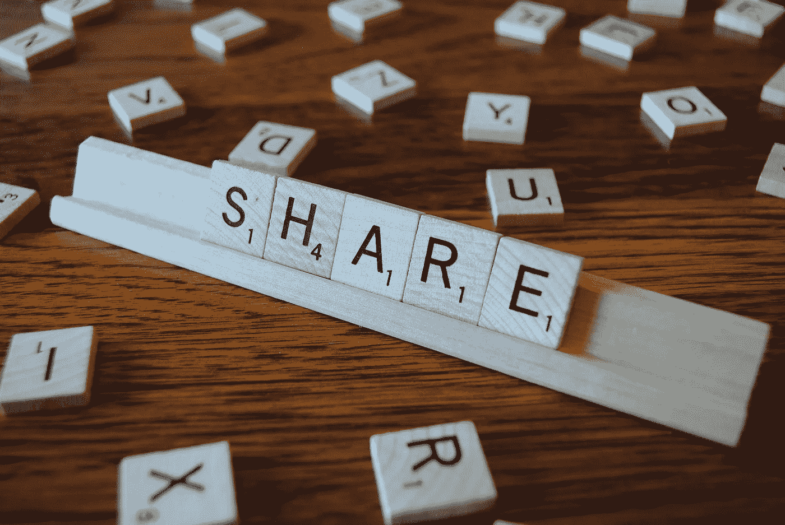

# 在线分享改变了这一切

> 原文：<https://medium.com/swlh/online-sharing-changed-it-all-f7c6b883b2d0>

## 尽管分享文化并不总是慷慨的，但它是互联网及其新经济的基础。

Photo: [Pixabay](https://pixabay.com/en/share-play-words-2482016/)

**文化产业**(尤其是出版、音乐和视听)产品的**数字化**以及作为运输基础设施(高速公路)的网络的出现，奠定了**新信息经济**的基础，在这种经济中**稀缺**被**丰富**所取代，而**边际成本和交易成本**接近于零。

在这种新的情况下，**分享文化商品**不再是向认识和亲近的人出借物品，而是成为陌生人之间的全球惯例。

Napster (1999 年)和 **Wikipedia** (2001 年)是新的分享方式(音乐和知识)的典型例子，这种方式在赋予普通人权力的同时，也夺走了那些商业模式基于中介分发包装产品(光盘和百科全书)的行业。

博客将这种文化传播到新闻和观点中，并对大众媒体进行检查，他们不相信博客，直到 Twitter 和脸书让他们看到他们已经失去了对新闻和观点的生产和传播的垄断。

一个数字化的网络世界是业余爱好者和慷慨大方者蓬勃发展的理想空间。用户发现，与实物商品不同，他们分享的越多，从其他人分享的东西中获益越多。

> 我明白了，我们分享得越多，我们从别人分享的东西中获益越多。杰夫·贾维斯，《公共部分:数字时代的分享如何改善我们的工作和生活方式》

**互惠**是网络最古老的价值观之一，自[第一个网络礼仪规范](https://tools.ietf.org/html/rfc1855)以来就存在。然而，分享的动机遵循一条宽广的道路，从慷慨到利己，经过关注和获得声誉。

> 分享的动机可以从声誉和关注到不太可测量的因素，如表达、乐趣、善缘、满足感和单纯的利己主义(…)。克里斯·安德森，《自由:激进价格的未来》

对于所有受影响的行业来说，最大的挑战不是试图防范不可避免的情况，而是发现和利用已经永远改变的情况所提供的新机会。

> 为公地做贡献不是利他主义；这通常是建立充满活力的商业生态系统的最佳方式，利用共享的技术和知识基础来加速增长和创新。唐·塔斯考特·y·安东尼·d·威廉姆斯，大规模协作如何改变一切

有能力**粉碎低效中介**的同一个网络也有潜力照亮[新的中介](http://www.open.edu/openlearn/money-management/management/business-studies/10-billion-dollar-companies-didnt-exist-10-years-ago) (Airbnb、Dropbox、Instagram、Spotify、Tinder、Tumblr、优步、WhatsApp……)。

分享不一定是免费的代名词，用户和平台通过多种路径获取价值。顺便说一下，我那本克里斯·安德森的《免费:激进价格的未来》花了我 18 美元。

*Jose Luis Orihuela 是一名教授、演说家和作家，出生于阿根廷，现居西班牙。他是纳瓦拉大学(潘普洛纳)通信学院的教员。26 个国家的访问学者和演讲者。作家和博客作者关注互联网对媒体、通信和文化的影响。他的最新著作有:《乳齿象手册》(2023 年)、《数字文化》(2021 年)、《互联网时代》(2015 年)、《推特世界》(2011 年)、《未来的 80 克拉维斯》(2011 年)和《博客革命》(2006 年)。从 2002 年开始在 eCuaderno(eCuaderno . com)发布，从 2007 年开始在 Twitter since)发布，从 2022 年开始在 mastosdon(mastosdon . social/@ jlo ri)发布。*

## 这篇文章发表在 [The Startup](https://medium.com/swlh) 上，这是 Medium 最大的创业刊物，拥有 277，994+读者。

## 在此订阅接收[我们的头条新闻](http://growthsupply.com/the-startup-newsletter/)。

