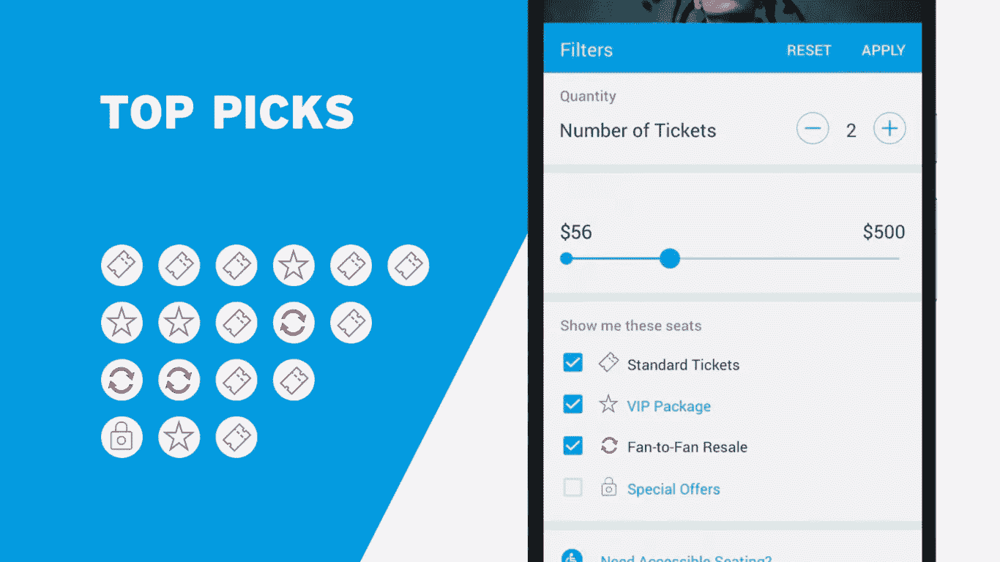

# 在线赛事门票市场:如何分一杯羹

> 原文：<https://medium.com/swlh/online-tickets-for-events-market-how-to-get-a-slice-of-33-billion-pie-f5acb5f4c27>

随着新兴在线市场的出现，活动门票的销售在过去十年中开始发生巨大变化。在考虑进入这个市场时，你应该考虑哪些重要的方面？

从纸质门票和在家打印，在线销售活动门票已经变成了数字化的移动体验。活动访客不再需要打印在线购买的门票来参观活动。根据 Statista 的数据，2018 年全球活动门票销售市场将达到约 338 亿美元的价值，其中美国国内产生的收入接近 120 亿美元。

随着电子商务、电子货币、内置指纹扫描仪和二维码的发展，用户只需轻点几下就可以安全地购买门票。经销商和客户都从行业发展中受益匪浅。随着新的有前途的技术的出现，售票显然将变得更加安全和可靠，这将鼓励进一步的细分市场增长。Statista 还预测，未来四年内，活动门票行业的平均年增长率将达到 11%，到 2022 年，全球收入将达到约 513 亿美元。

尽管与电影票相比，音乐和体育赛事门票的价格较高，但后者仍将是赛事门票销售行业中最大的细分市场。到 2018 年底，它在美国的价值将达到 144 亿美元。因此，要进入这个竞争激烈的市场，企业家应该更多地了解现有的成功项目。

# 游戏时间

尽管在线售票正在向移动领域转移，但现有的在线服务还有很多需要改进的地方。有些服务仍然需要打印购买的门票才能使用。这就是为什么你应该走在前面，允许用户在门口提供他们的门票进行扫描，而不是在家里打印，以防你考虑建立一个在线售票平台。就像在 Gametime 中一样，所有与购买相关的活动，比如寻找活动、选择合适的座位和订票，都应该在移动设备上处理。使用你的订票应用程序，顾客只需要出示他们的票，然后扫描进去。

此外，你的服务应该有一些独特的想法，以区别于竞争对手。例如，Gametime 专注于体育赛事前打折的最后一分钟门票。所以你可以在活动开始前卖掉你的票。这也使用户能够以较低的价格购买门票，而无需提前几周购买。由于其有前途的方法，这家初创公司在 2016 年筹集了 2000 万美元。该移动应用程序还允许用户在活动开始后 30 分钟内快速找到附近活动的门票。

# 游戏时间如何工作

一旦用户选择了一个活动，在线订票应用程序就会提供 50 个最合适的搜索结果。此外，每个座位描述包括来自相应体育场区域的全景的高分辨率图像。详细的座位地图允许用户比较不同座位的价格，并实时查看可用选项。

当用户选择座位时，只需轻点两下就能快速买到。购买后，移动应用程序会将门票发送到移动设备。然后，它可以立即与其他用户共享，或一键转售。用户还可以通过使用 Gametime 移动应用程序拍照来转售纸质门票。

# 斯图布

与 Gametime 相比，StubHub 更进一步，为其客户提供了通过 Apple TV 选择演唱会门票的可能性。这是卖票最好的地方之一。通过 StubHub，用户甚至可以在参观活动之前，通过高分辨率的图像来估计他们所在区域的全景。不过，要最终完成购买，用户应该使用智能手机或平板电脑。

苹果电视实际上是 StubHub 改进了为用户提供详细座位地图这一广为流传的想法的方式。全景图像在大型电视显示器上看起来肯定比在基于智能手机的小型显示器上更好。这是你在创建售票服务时应该使用的思考方式和方法。采纳一个经过测试的成功的想法，并加以改进。横向滚动的用户界面、活动图像和高分辨率座位地图将用户体验提升到了一个全新的水平。这就是为什么它是销售音乐会门票的最佳方式之一。

# StubHub 如何工作

当用户通过 Apple TV 找到一个必要的事件时，他们会收到一条带有链接的短信或推送通知(如果他们安装了 StubHub 移动应用程序)。点击链接后，如果用户还没有安装应用程序，他们会被重定向到应用程序或 Play Market/App Store 中的结账屏幕。

# 售票员

Ticketmaster 是世界领先的票务销售服务，或许也是在线销售赛事门票的最佳方式。它的移动应用程序专注于帮助用户根据价格与质量的平衡购买最好的座位。TicketMaster 移动应用程序相对于 web 应用程序的主要优势在于，移动解决方案允许用户使用推送通知加快几分钟的购票速度，并避免额外授权。当用户试图购买高需求事件的门票时，如此短的时间段可能非常重要。

据 Mashable 称，在 Ticketmaster [注册的场馆中，约有 60%允许](https://mashable.com/2014/06/09/ticketmaster-iphone-app/#V2RRZ8BLtZqO)游客使用上传到他们移动设备上的电子门票。为了确保可靠的安全性，防止欺诈性的门票转售(向多个客户出售同一张门票)，TicketMaster 在电子门票上放置了动画水印。

TicketMaster 是一个平台，人们既可以购买和出售门票，也可以将门票发送给朋友。

# TicketMaster 如何工作

要出售音乐会门票，用户必须输入一个理想的价格。他们还可以查看可用选项来设置适当的金额。这项服务对每笔交易收费。一旦购买了一张票，这项服务会以数字方式将它发送给买家，卖家会收到他或她的信用卡上的钱。选择座位时，用户可以将现有座位与其他人试图出售的机票进行比较。

# 我们如何帮助您

Stfalcon 是一个由专注的移动和 web 应用程序开发人员组成的专业团队，他们将客户的想法高效地转化为强大的数字解决方案。我们从零开始创建应用程序，并在构建预订服务方面拥有深厚的专业知识，例如为各种行业开发的[汽车票预订](https://stfalcon.com/en/portfolio/busfor)应用程序。在我们的投资组合中有一些订票项目的例子，让我们为自己的工作感到自豪。

整个欧洲的大型企业将他们的想法委托给我们，结果，他们在几周内就获得了一个经过优化的、无缺陷的、安全的现代设计解决方案。我们专注于使用先进技术的定制 web 应用，如 Symfony PHP-Framework、Docker、Python、MySQL 和 MongoDB，以及使用可靠库的移动解决方案，包括 Gson、ORM 和 Robospice。你总是可以确定你会及时推出你的项目，并开始征服你的市场份额。在 info@stfalcon.com[发送您的想法，与我们的开发专家一起将它们变成现实！](mailto:info@stfalcon.com)

## 这篇文章发表在[《创业](https://medium.com/swlh)》上，这是 Medium 最大的创业刊物，有 301，336+人关注。

## 在这里订阅接收[我们的头条新闻](http://growthsupply.com/the-startup-newsletter/)。

