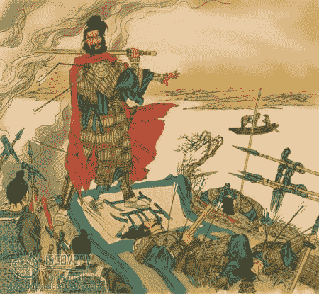
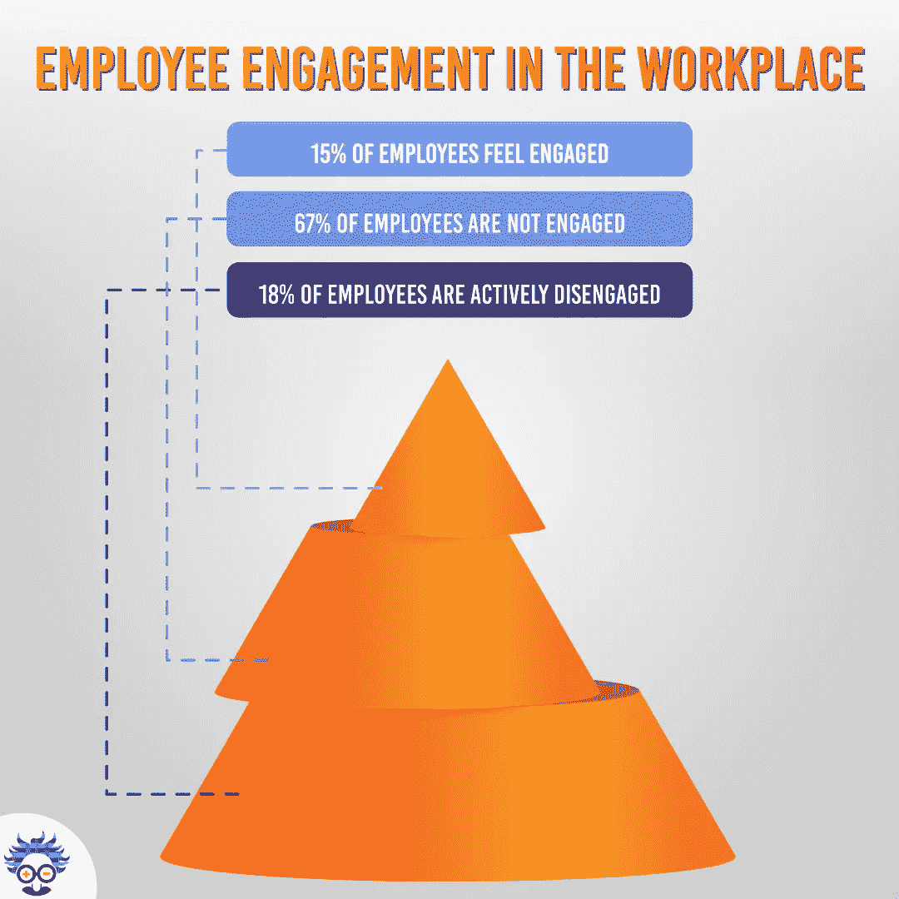
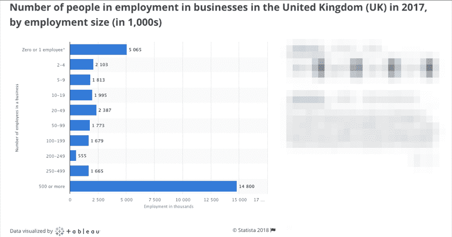
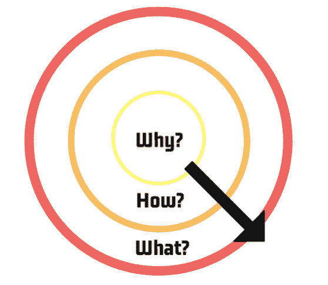
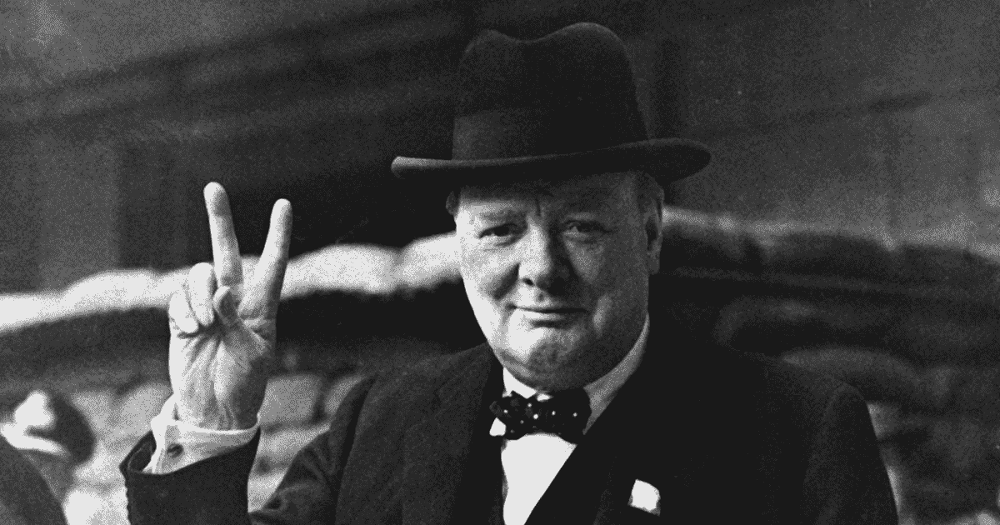

# 只有 15%的员工敬业。领导能学到什么？

> 原文：<https://medium.com/swlh/only-15-of-employees-are-engaged-what-can-leaders-learn-3eb92223c608>

Photo by [Hermes Rivera](https://unsplash.com/@hermez777?utm_source=medium&utm_medium=referral) on [Unsplash](https://unsplash.com?utm_source=medium&utm_medium=referral)

***“破釜沉舟！”***

这句古老的中国格言可以追溯到公元前 207 年，在秦朝*和楚国*之间的一场**激战中。****

**唐朝强大的军队驻扎在长江的北岸，有 30 万人。项羽率领的 6 万人的楚军已经在长江对岸扎营了近两个月，等待渡江的命令。**

**在第 47 天，项羽亲自率领他的军队投入了与强大得多的军队的战斗。他渡过了河，在比他大得多的敌人刚好够不着的地方扎营。**

**项羽看到他的军队被吓到了，于是做出了一个决定，这个决定将推动他进入中国民间传说。**

****

**他没有发表号召性的讲话，也没有美化胜利的战利品，而是等到他的军队睡着后，命令挑选出一批忠诚的士兵烧掉他的船(这样可以让他的军队安全返回到河的南边)，并摧毁水壶、大锅和所有的烹饪设备。**

**他的军队别无选择:**击败人数多得多的军队，夺取他们的补给，否则就会死亡。****

**这不仅使他们打败了驻扎在长江边的秦国军队，他们还取得了九连胜，俘虏和杀死了 30 多万敌人。项羽军队的勇敢和凶猛鼓舞了其他阵营加入他，直到他的军队拥有超过 40 万士兵。**

**这种不可思议的领导行为给了他的团队每个商业领袖都想要的东西，完全和不可分割的员工参与度。**

**(还有一点值得一提的是，大家记住项羽就是因为这一幕，而不是残忍的活埋 20 万俘虏的敌人)。**

# **员工敬业度:痛苦的事实**

**无论你是首席执行官、董事、经理还是主管，你都会理解员工参与的价值…**

**…然而，令人痛心的事实是，你们中的大多数人在确保员工参与方面做得不够。**

**这不是猜测，或猜测工作，这是事实。**

**盖洛普[***2017 年一项名为《全球工作场所现状*的研究发现，全球只有 **15%** 的员工真正投入到工作中。这使得令人吃惊的 85%的员工表现低于他们的潜力。**](https://news.gallup.com/reports/220313/state-global-workplace-2017.aspx?utm_source=2013StateofGlobalWorkplaceReport&utm_medium=2013SOGWReportLandingPage&utm_campaign=2013StateofGlobalReport_Redirectto2017page&utm_content=download2017now_textlink)**

**该研究还揭示出*‘员工高度敬业的公司* ***每股收益比同行高出 147%****’。***

****

**但是，在你们跑到停车场开始烧汽车和砸午餐盒之前，让我们更深入地看看这意味着什么，更重要的是，你(作为一名领导者)可以采取什么步骤来纠正它。**

# **员工敬业度:数字意味着什么**

****-敬业员工- 15%****

**这些员工对你的公司、团队和目标完全忠诚。他们热情地解决问题(这不一定是他们的责任)，激励他人，并对业务投入感情。敬业的员工通常会脱颖而出，成为领导者，不断创新，提出能让你的企业火起来的想法。他们了解这家公司，并感到与它有着深刻的联系。**

****-未就业员工- 67%****

**这些员工很难识别，因为他们不一定对工作不开心或不满意。更令人担忧的是，他们可能是你劳动力的主体。**

**“不敬业的员工”会做他们的工作，扮演他们的角色，但是他们**做的最少**。他们很少关心企业的目标、愿景和价值观，他们尽可能少做事的态度传递给了团队的其他成员。**

**这些成员每天都在梦游，他们总是投入时间，但很少消耗真正的精力。**

**不敬业的员工可以被激励达到“敬业”状态，但如果他们被留在同一职位，他们最终会落入“**主动离职”**类别。**

****-主动脱离- 18%****

**这些员工不仅仅是在工作中不开心，他们还会定期把自己的不开心表现出来。他们不断地破坏公司的成就，制造一种有毒的、令人不舒服的气氛。令人失望的是，这些人往往是他们专业领域的专家，表现得像自以为无所不知的人，他们认为自己可以做得更好，却从来没有尝试过。当一名员工降低到“主动脱离”状态时，几乎不可能再让他们参与进来。**

# **员工敬业度:领导策略**

****

**员工参与是提高生产力、创新和盈利能力以及大幅改善客户旅程的关键…**

**…然而，很少有公司努力测量、分析或改进它。**

**有一百万种不同的额外津贴可以暂时交给员工**来提高他们的参与度，但是，作为一名领导者，你有责任确保短期收益成为对**联系和承诺的永久感受**。****

****我读过大量关于员工敬业度的书籍和文章，其中许多都引用了来自谷歌办公室或其他类似科技公司的观点。我不反对这些想法，但我知道，如果你的领导风格不正确，它们只会创造短期收益。****

****所以，在你开始分发睡袋、健身课和免费假期之前，用下面的建议来完善**“成为领导者意味着什么”**。****

# ****成对的信念****

********

****大多数员工知道他们做什么以及如何做，但是很少有人知道他们为什么要做。****

****他们角色的“为什么”与业务的**为什么**直接相关。用你的企业存在的理由来改变员工的态度，从他们做什么，到他们为什么这样做。****

****如果他们和公司有着相同的信念，他们会发现一种深刻的联系和工作，不仅仅是最低限度的，而是最大限度的发挥他们的能力。****

****当你雇佣新员工时，确保(最重要的是)他们和你的公司有着相同的信念。****

****举个例子，看看 [***苹果***](http://www.apple.com/) 的运势。****

****苹果和所有其他科技公司一样，从同一群人中招聘员工，支付他们相似的薪酬，然而，在过去的 30 年里，他们创造了比其他任何人都多的突破性技术。这是因为他们所有的员工都明白他们为什么这么做，想法不同。****

****他们雇人，不是为了开发计算机，而是用不同的方式思考它。将他们的信念与员工联系起来，帮助他们从员工身上获得了比业内任何人都多的东西。****

# ****牺牲****

********

****你认为项羽的军队会赢得那场著名的战斗吗？如果他派他们去战斗，而他却留在船上，喝酒，变胖。****

****烧船的故事(我之前讲过)集中在军队上，但是我们不要忘记，通过摧毁所有的烹饪设备和击沉他的船只，**项羽实际上注定了他和他的军队一样的命运**。如果他们死了，他会的。****

****想象一下你的完美领导，他们会为你工作吗？或者你会为他们工作吗？****

****许多人认为领导力只是指导员工完成任务。像这样的领导者参与度低，员工流动率高。****

****事实是，你必须准备好为你的员工工作，远远超过他们对你的期望。明确强调“**为他们工作”**而不是他们“为你工作”的领导力，将创造更大的信任、合作和生产力。****

****想想历史上每一位伟大的领袖，他们到底为谁工作？****

******是英国在为丘吉尔工作，还是丘吉尔在为英国工作？******

****是印度在为甘地工作，还是甘地在为印度工作？****

******苹果员工为乔布斯工作过吗？还是他为他们工作？******

****当你能够将自我牺牲的品质融入到你的领导技巧中时，你会创造出更多的信念，员工也会受到极大的激励。****

# ****安全****

********

****当人们在组织中感到安全时，他们自然会更自由地表达自己，发展自己的才能。****

****危险或威胁**施加压力**，使员工在严格的规则下执行。这种情况从员工转移到客户身上，降低了员工满足客户需求的灵活性。****

****这也在有压力的员工之间制造了一个小圈子，让他们远离你。分离使得*牺牲*和*成对信念*的领导策略面临巨大风险。****

****一个强有力的领导者不需要威胁他们的员工去发挥他们的潜力。****

****感同身受，给你的员工自由，倾听他们的意见。提供一个开放、无所畏惧的环境保证了更高水平的参与，并给你机会作为一名领导者来提高。你的员工也是人，他们对你领导技巧的意见比任何人的都重要。****

# ****结论****

****如果你能让你的员工参与进来，这将对你的公司产生难以想象的影响。****

****从最基本的层面来说，每一个企业都是由一群人组成的。****

****那些积极参与并从员工身上获得最大收益的公司现在是市场领导者、令人兴奋的品牌和创新的引领者。想办法将你的信念与你的员工联系起来，证明你为团队工作(而不是相反),并确保他们感到安全…****

****…你就可以顺利上路了。****

****你认为领导者最好的品质是什么？你共事过的最好的领导是谁？****

******与我们的观众分享你的想法！******

*****原载于 2018 年 8 月 6 日*[*www.einsteinmarketer.com*](https://www.einsteinmarketer.com/employee-engagement/)*。*****

********

## ****这个故事发表在 [The Startup](https://medium.com/swlh) 上，这是 Medium 最大的创业刊物，拥有 356，974+人关注。****

## ****在此订阅接收[我们的头条新闻](http://growthsupply.com/the-startup-newsletter/)。****

********