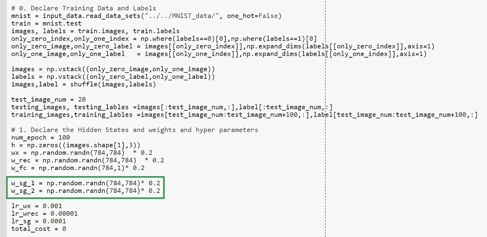
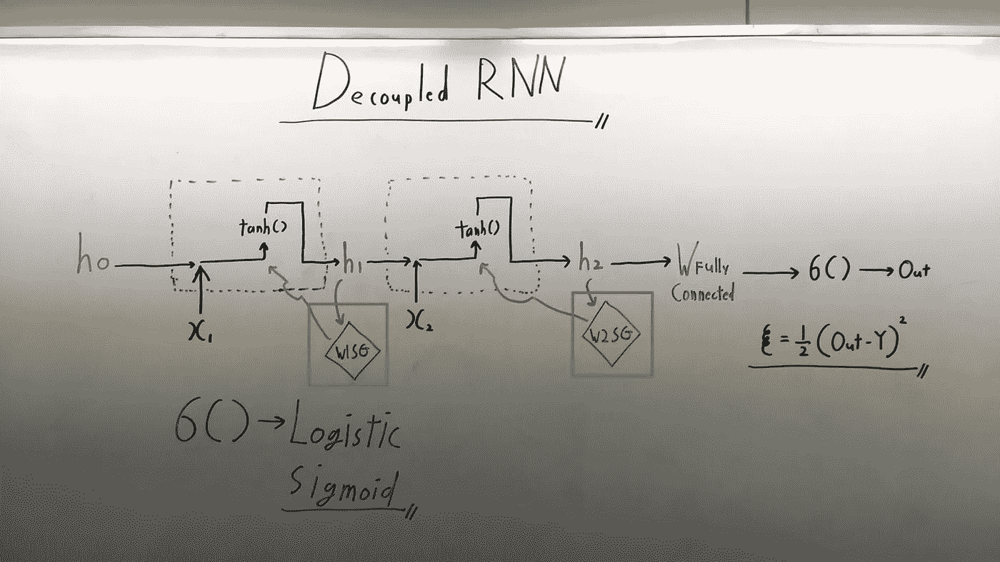
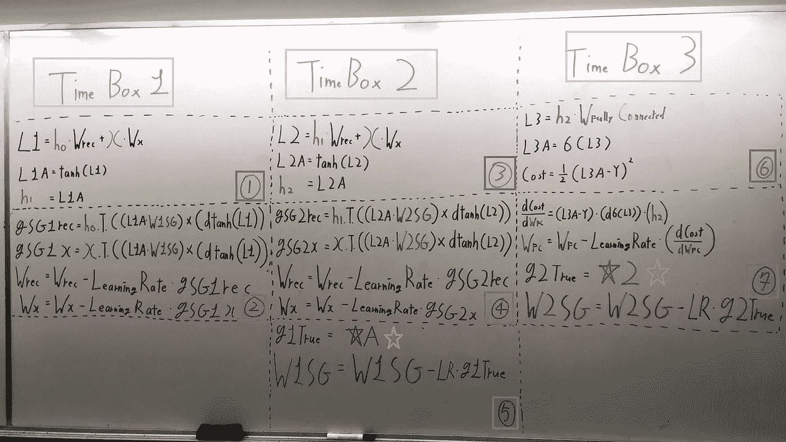
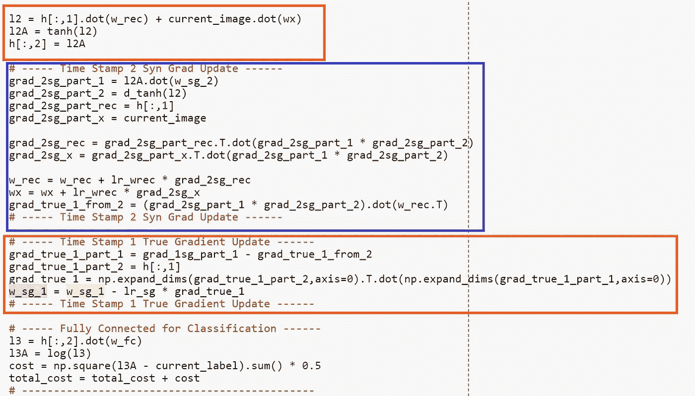
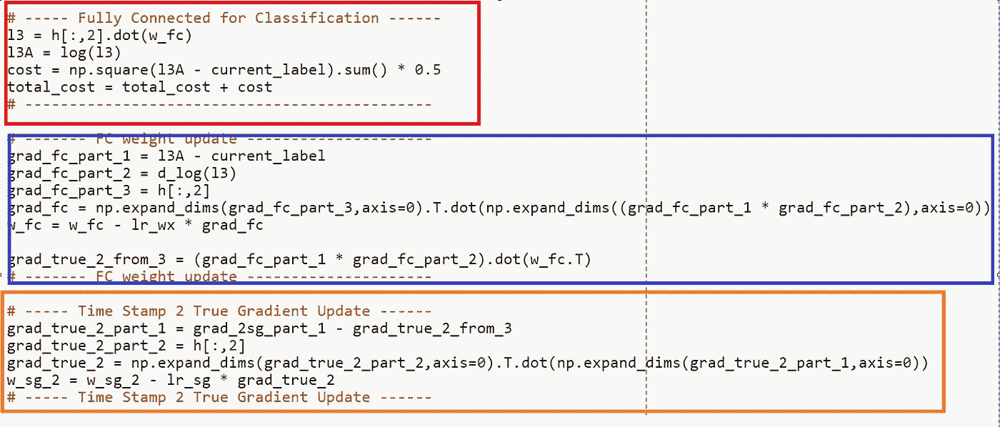
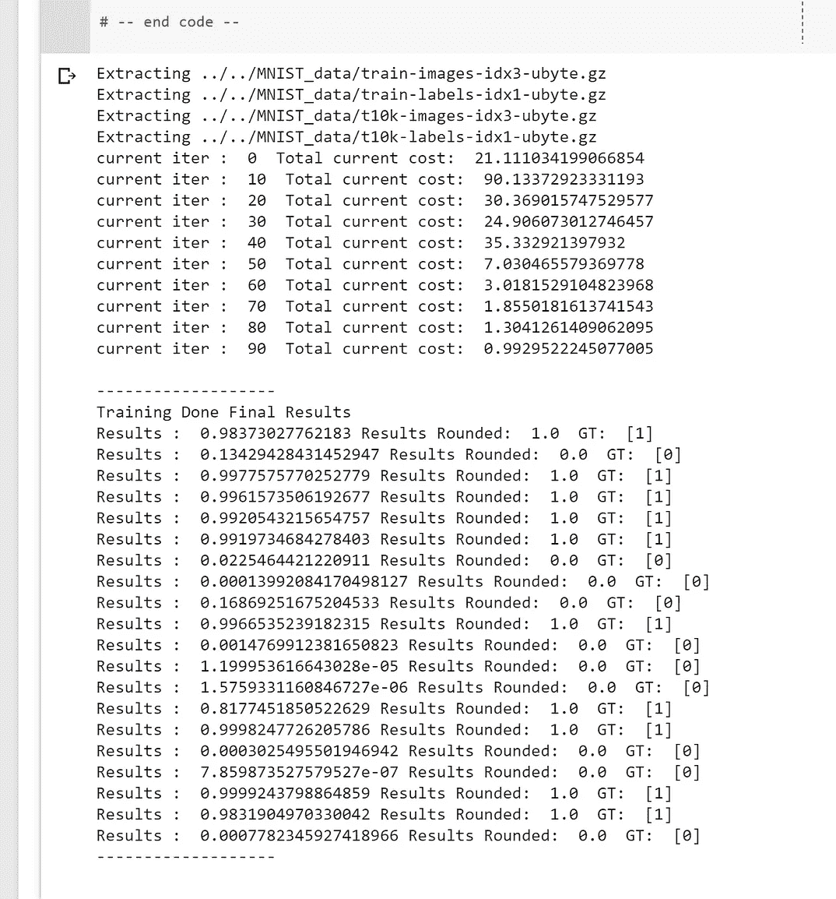
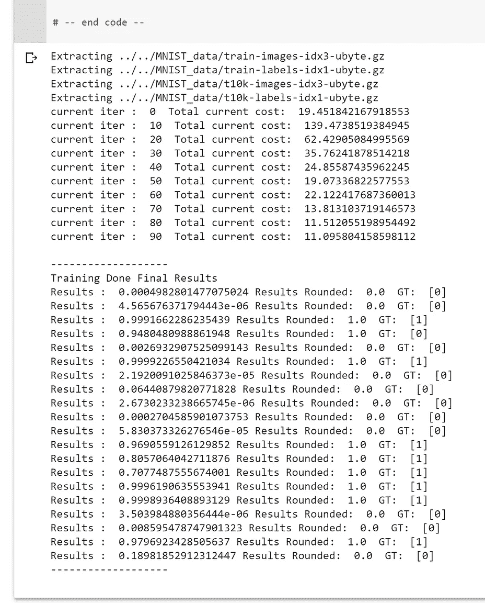
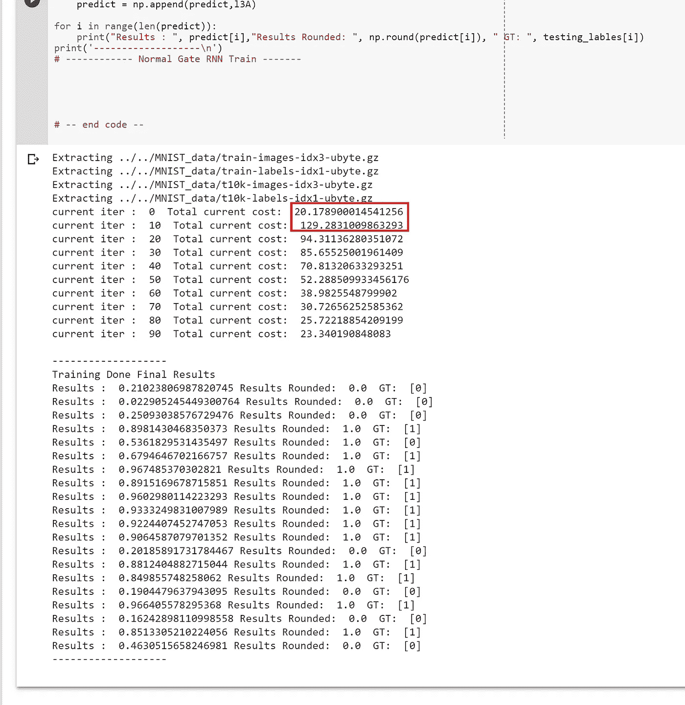
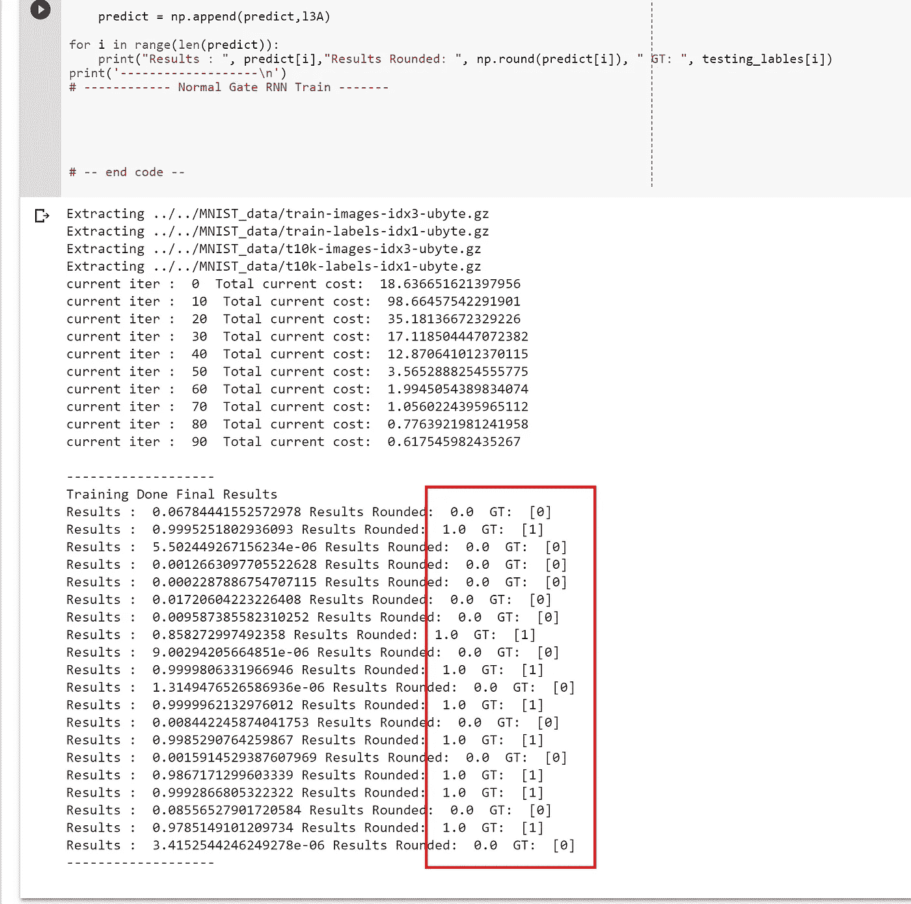
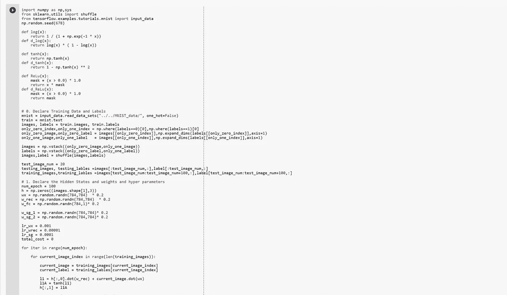

# Only Numpy:解耦递归神经网络，从 Google Brain 修改 NN，用交互式代码实现

> 原文：<https://medium.com/swlh/only-numpy-decoupled-recurrent-neural-network-modified-nn-from-google-brain-implementation-with-7f328e7899e6>

所以我和我的一个朋友[迈克尔](https://www.facebook.com/michael.a.pacheco9)聊了聊，他也对机器学习非常感兴趣，关于谷歌大脑的[使用合成梯度](https://arxiv.org/pdf/1608.05343.pdf)去耦合神经接口。他启发了我这个想法，解耦递归神经网络，我们能做到吗？但更重要的是，它的表现会好吗？

在继续讨论 IamTrask 之前，Google Brain 很好地介绍了解耦神经网络。所以[看看他的 tutoria](https://iamtrask.github.io/2017/03/21/synthetic-gradients/) l，太神奇了。我也对 NN 进行了蹩脚的解耦，这里是 T7。

**准备数据/声明超级参数**

如上所述，我们将仅对图像 0 和 1 的 MNIST 数据集执行简单的分类任务。我们将把它作为矢量格式处理，而不是(28*28)图像格式。另外，请注意绿框区域，因为那是我们的两个梯度，耶稣告诉我们真实的梯度。

**网络架构**

如上图，非常简单明了。在搬到 LSTM 或 GRU 之前，我想用香草 RNN 迈出我的第一小步。但是你可以看到绿色框中突出显示的，我们有两个甲骨文，告诉我们什么是真正的梯度。

**前馈/反向传播/梯度更新**

粉色盒子→每个 RNN 都有时间戳的概念，在这种情况下，因为每个时间戳都有很多事情要做。我决定叫他们时间盒 LOL。

红框→执行顺序。请注意，在更新重量之前，我们不必完全等待前馈过程完成，如方框 2、4、5 和 7 所示。

橙色星形→每个时间戳的真实梯度，我们需要这个值来更新每个时间戳的 Oracle(绿色菱形，您在第一张图片中看到的)。此外，获得这个值的数学公式非常长，所以我将在下一节中以代码实现的形式展示它们。

**时间盒 1 /2 的真实渐变—橙色星形 A / B**

红框→时间框 2 的前馈过程

蓝框→使用合成梯度 2 (w_sg_2)在时间框 2 对 Wrec 和 Wx 进行反向传播。

橙色框→用从时间框 2 获得的真实梯度更新合成梯度 1(w_sg_1)

并且为了更新我们的合成梯度 2(w_sg_2)，我们使用完全相同的概念，但是使用完全连接的层。

如上所述，非常相似的过程，但梯度从时间盒 3。

**培训及结果**

我做了多次训练和跑步，因为训练很不稳定。即使使用相同的 np.random.seed()值，有时网络也会很好地收敛，如左图所示，或者飞离，如右图所示。

一个非常有趣的例子是成本飙升，然后有所下降。然而，总的来说，该模型与 20 个图像的分类测试集很好。

通过几次尝试，100%的准确度也是可能的。

**交互代码**

*我搬到了谷歌 Colab 寻找交互代码！所以你需要一个谷歌帐户来查看代码，你也不能在谷歌实验室运行只读脚本，所以在你的操场上做一个副本。最后，我永远不会请求允许访问你在 Google Drive 上的文件，仅供参考。编码快乐！*

要获取代码，请点击此处。

**最后的话**

我一直惊讶于这样一个事实，即我们仍然可以不遵循严格的反向传播规则来训练神经网络。我还发表了一篇关于用[随机噪声分布](/@SeoJaeDuk/only-numpy-noise-training-training-a-neural-network-without-back-propagation-with-interactive-ad775f04cad6)训练神经网络的文章。

如果发现任何错误，请发电子邮件到 jae.duk.seo@gmail.com 找我。

同时，在我的 twitter [这里](https://twitter.com/JaeDukSeo)关注我，并访问[我的网站](https://jaedukseo.me/)，或我的 [Youtube 频道](https://www.youtube.com/c/JaeDukSeo)了解更多内容。如果你感兴趣的话，我还做了解耦神经网络的比较。

参考

1.  贾德伯格，m .，Czarnecki，W. M .，奥辛德罗，s .，维尼亚尔斯，o .，格雷夫斯，a .，& Kavukcuoglu，K. (2016)。使用合成梯度的去耦神经接口。 *arXiv 预印本 arXiv:1608.05343* 。
2.  没有反向传播的深度学习。(未注明)。检索于 2018 年 2 月 3 日，来自[https://iamtrask.github.io/2017/03/21/synthetic-gradients/](https://iamtrask.github.io/2017/03/21/synthetic-gradients/)
3.  Seo，J. D. (2017 年 12 月 24 日)。Only Numpy:在合成梯度中导出前馈和反向传播(解耦神经…2018 年 2 月 03 日检索，来自[https://medium . com/swlh/only-Numpy-derivating-Forward-feed-and-Back-Propagation-in-Synthetic-Gradient-Decoupled-Neural-ca4c 99666 bbf](/swlh/only-numpy-deriving-forward-feed-and-back-propagation-in-synthetic-gradient-decoupled-neural-ca4c99666bbf)
4.  Seo，J. D. (2018 年 02 月 01 日)。only Numpy:Noise Training-Training a Neural-Network-with Back Propagation with Interactive…2018 . 02 . 03 检索自[https://medium . com/@ SeoJaeDuk/only-Numpy-Noise-Training-Training-a-Neural-Network-with-Interactive-ad 775 f 04 cad6](/@SeoJaeDuk/only-numpy-noise-training-training-a-neural-network-without-back-propagation-with-interactive-ad775f04cad6)

## 这篇文章发表在[《创业](https://medium.com/swlh)》上，这是 Medium 最大的创业刊物，有 293，189+人关注。

## 在这里订阅接收[我们的头条新闻](http://growthsupply.com/the-startup-newsletter/)。

