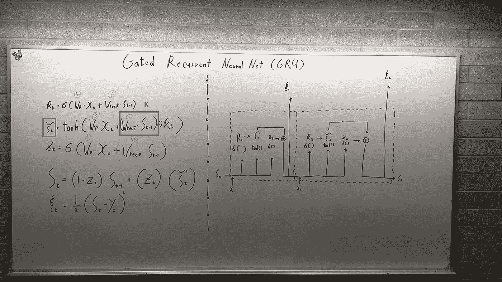

# Only Numpy:推导门控递归神经网络中的前馈和反向传播(GRU) —门控递归神经网络对序列建模的经验评估—第 1 部分

> 原文：<https://medium.com/swlh/only-numpy-deriving-forward-feed-and-back-propagation-in-gated-recurrent-neural-networks-gru-8b6810f91bad>

今天，我将在门控递归神经网络上推导前馈过程和反向传播，建议阅读论文“门控递归神经网络对序列建模的实证评估”——此处链接论文[。](https://arxiv.org/abs/1412.3555)

**网络架构**

Network Arch

现在左边的屏幕是你需要的所有等式，蓝色方框的符号叫做“候选激活”。(将它们简称为**CA**)现在也忽略红色方框，但是这在执行反向传播时变得非常重要。

R(t) →在时间戳 t 重置门
CA(t) →在时间戳 t 候选激活功能
Z(t) →在时间戳 t 更新门
S(t) →在时间戳 t 状态

像往常一样，我将使用 L2 成本函数，这是屏幕左侧显示的最底部的方程。

有一点很重要，要注意的是整个方程的权重。如上所示，总共有 6 个砝码。这意味着，当执行反向传播时，我们需要计算上述 6 个权重的错误率！

所以总的来说，我们可以预期总共有 6 个方程。

上图是 GRU 的两个图像

**正向进给过程**

如上所述，前馈操作非常简单，易于计算，在每个时间戳，我们可以使用 L2 成本函数计算错误率。如屏幕顶部所示，TS 代表时间戳。

**时间戳 2 处的反向传播**

像往常一样，对于每个 RNN，计算每个权重的最近反向传播，如我所说，有 6 个，相对容易。

1 →时间戳的错误率 2 相对于重量 Wz
2 →时间戳的错误率 2 相对于重量 Wrecz
3 →时间戳的错误率 2 相对于重量 Wca
4 →时间戳的错误率 2 相对于重量 wreca
5→时间戳的错误率 2 相对于重量 Wr
6→时间戳的错误率 2 相对于重量 Wrecr

注意:我没有做 6 等式，你自己试试吧。

**相对于 Wz 的时间戳 1 处的反向传播**

如上所述，正如我们已经预料到的，任何 RNN 的反向传播过程在早期都会变得混乱和复杂。同样，为了得到时间戳为 1 时的总错误率，我们需要得到时间戳为 1 和时间戳为 2 时的错误率。

此外，请注意红色下划线符号，所有反向传播共享该变量。这意味着如果我们首先计算共享变量，我们将能够节省计算时间。

红框→时间戳为 1 时的错误率
绿框→时间戳为 2 时的错误率

两个变量的总和就是我们需要更新权重的总梯度。

数学符号如上图，实际方程如下图。

## 最后的话

这是第一部分，我会很快给你们第二部分和第三部分的更新…(我希望如此)。如果发现任何错误，请发电子邮件到 jae.duk.seo@gmail.com 找我。

同时，在我的推特[这里](https://twitter.com/JaeDukSeo)关注我，并访问[我的网站](https://jaedukseo.me/)，或我的 [Youtube 频道](https://www.youtube.com/c/JaeDukSeo)了解更多内容。如果你感兴趣的话，我还在简单的 RNN [上做了反向传播。](/@SeoJaeDuk/only-numpy-vanilla-recurrent-neural-network-with-activation-deriving-back-propagation-through-time-4110964a9316)

## 这个故事发表在 [The Startup](https://medium.com/swlh) 上，这是 Medium 最大的创业刊物，拥有 295，232+人关注。

## 在此订阅接收[我们的头条新闻](http://growthsupply.com/the-startup-newsletter/)。

