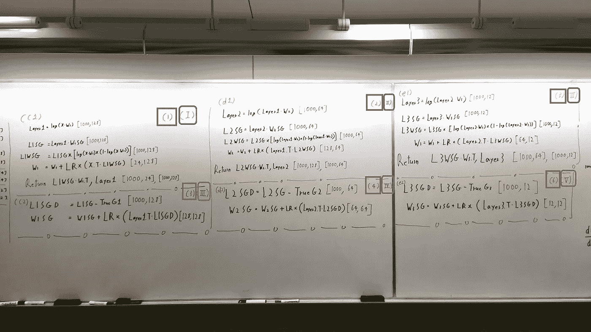

# 唯一 Numpy:用交互式代码专长导出合成梯度中的前馈和反向传播(解耦神经接口)。亚姆特拉斯克

> 原文：<https://medium.com/swlh/only-numpy-deriving-forward-feed-and-back-propagation-in-synthetic-gradient-decoupled-neural-ca4c99666bbf>

所以第一件事！平安夜快乐，节日快乐。我希望每个人都有一个愉快的假期。不管怎样，让我们开始吧，在阅读之前，我想让你们知道两件非常重要的事情。

1.  **我还没看完** [**论文**](https://arxiv.org/abs/1608.05343) **(使用合成渐变的解耦神经接口)！我想先讨论一下实现，然后转到论文，我将很快阅读论文，并很快做出自己的实现！！**
2.  **本帖所有的数学都是基于 iamtrask 对合成渐变的实现请点击链接** [**此处**](https://iamtrask.github.io/2017/03/21/synthetic-gradients/) **阅读神奇教程。**

更新:忘了加 LR 表示学习率

在我们开始一些符号之前，我想澄清一下，我们的成本函数是你们在上面看到的等式。另外，现在 ***忽略右上角的数字，但是它们很快就会变得非常重要*** ！！！！现在是网络架构。

我们只有三层 L1，L2，L3，和三个合成梯度发生器 L1SGG，L2SGG，L3SGG(每层下面的菱形)。输入层、层 1、层 2、层 3 的尺寸也分别为[1000，24]、[1000，128]、[1000，64]、[1000，12]。现在让我们看看每个权重和合成梯度的尺寸。

就是这样！再次为审查 WkSG ->层 K 合成梯度。还有，最后要注意的是，我写点积和矩阵转置的方式可能会让一些人困惑。

记数法**中间圈点是点积记数法**，那么上面的等式就是 Layer1 = logistic 函数(dot_product(x，w1))。

右下方的符号**圆圈是矩阵转置**，所以上面的等式是点积(L1WSG，W1 _ 转置)

现在让我们执行前馈操作和反向传播！！

以上是 iamtrask 的合成渐变的实现(再次链接[这里](https://iamtrask.github.io/2017/03/21/synthetic-gradients/)),因为每一层有两个部分。我们将分别研究每个操作。我将描述他们正在做什么，并从第 1 层开始。

***正向和合成更新*:执行常规的前馈操作，并使用合成梯度更新当前重量**

***更新合成权重*:使用真实渐变更新合成渐变**

所以，这里发生了很多事情。首先，方框中的蓝色数字描述了所得方程的维数。第二…

**T5【C1】->前进并合成更新
C2 - >更新合成权重-**

基本上，在 C1 步骤中，我们执行常规的前馈操作，以获得每一层的输出。例如，Layer1 = log(dot_product(x，w1))，并且在前向馈送操作之后，我们通过使用 W1SG(合成梯度)来更新权重 W1。

**Log() = >简称** [**逻辑函数**](https://en.wikipedia.org/wiki/Logistic_function)

从上面的图像中有两个非常有趣的地方值得注意:第一，与常规的梯度更新相比，这个过程是多么的相似。第二，底部写的退货声明。别担心，我会解释的。

所以下面是一些传统的方法来执行梯度更新。

获得成本函数相对于某一权重的导数有三个主要部分，首先使用链式法则，我们需要获得成本相对于某一层的输出的导数，某一层的输出相对于同一层的输入的导数，以及同一层的输入相对于权重的导数。现在将它与我们的前馈过程进行比较，它看起来有些什么非常相似！(这是显而易见的，但我仍然认为它有点酷)

现在第二部分，返回语句，如果你读了 iamtrask 的原教程你会得到这部分。基本上，我们将每一层声明为一个类，我们希望使用下一层的输出来更新当前层的权重，因此我们返回一些数字。(这里不赘述数学，但是如果你看到 L1WSG * W1_Transpose，这其实很有意义，非常类似于传统的渐变更新。)

现在让我们看看其余层的操作！

Layer 2 operation

Layer 3 Operation

再次重申一下…

***d1 - >正向和合成更新
d2 - >更新合成权重
e1 - >正向和合成更新
e2 - >更新合成权重***

这就是前馈操作和反向传播，然而这还不是全部！我们现在将观察解耦神经接口的真正力量，为什么它如此有用，以及这种力量来自哪里。

正如你所注意到的，每一个操作都有一个数字和罗马数字符号与之相关，这是我们可以执行的操作顺序，这就是为什么合成渐变如此神奇的原因。在传统的神经网络中，每一层都是锁定的，不能异步训练。但是由于我们的网络是解耦的，我们可以以不同的顺序训练。我带你去看。

## 红框排序:当我们**不使用多线程**时

## **蓝盒子订购:当我们使用多线程时**

# 红盒子订购案例:**T5 1->2->3->4->5->6**

换句话说，在我们执行前馈操作之后，我们将把结果值传递给下一层，等待下一层返回一些值。使用下一层值，执行更新合成权重。例如，在计算完第 1 层之后，我们可以将计算的第 1 层直接给第 2 层，其中会给我们 L2WSG * W2_Transpose。然后，我们可以毫不犹豫地对第 1 层执行更新合成权重！我们甚至没有等到最后一层(第三层)计算成本函数！这很好，但我们甚至可以做得更好！

# 蓝色盒子订购案例:I -> II -> III -> IV -> V

现在我们使用多线程，这意味着我们可以同时执行多个任务。让我们再看一个例子，在我们计算了第 1 层的值之后，我们将把该值提供给第 2 层，在第 2 层中，我们将再次得到 L2WSG * W2_Transpose。在这里，我们可以生成一个新的进程来计算更新第 1 层的合成权重，同时将第 2 层的计算结果传递给第 3 层！这很性感。)

# 交互式代码

我修改了 iamtrask 的原始代码，以满足红框和蓝框的情况。我会马上给你代码，但是请务必阅读下一部分，红盒子案例与蓝盒子案例的结果。

来自我的 GitHub 的红盒子案例:[链接](https://github.com/JaeDukSeo/Only_Numpy_Basic/blob/master/Decoupled_Neural_Network/1_Red_Box_Case.py)
来自 Trinket.io 的红盒子案例:[链接](https://trinket.io/python3/4d02398c48)

来自我的 Github 的蓝盒子案例:[链接](https://github.com/JaeDukSeo/Only_Numpy_Basic/blob/master/Decoupled_Neural_Network/2_Blue_Box_Case.py)
来自小饰品的蓝盒子案例. io: [链接](https://trinket.io/python3/8ffd5cc56c)

## 红盒子 vs 蓝盒子

理论上，产生一个子进程来训练网络听起来非常性感，但是我的实验产生了不同的结果。

Red Box Training Time

Blue Box Training Time

如上所述，红盒子方法比蓝盒子方法要快很多(大约快 98.27%)，这很令人失望，我真的不知道为什么会这样。不过好吧，我看完原文再回到这个问题！(如果你知道为什么会这样，请在下面的评论区留言！)

## 最后的话

再次感谢 iamtrask，请访问他的博客[这里](https://iamtrask.github.io)并在 twitter 上关注他[这里](https://twitter.com/iamtrask)。

此外，在我的推特[这里](https://twitter.com/JaeDukSeo)关注我，并访问[我的网站](https://jaedukseo.me/)，或我的 [Youtube 频道](https://www.youtube.com/c/JaeDukSeo)了解更多内容。如果你感兴趣，我还在简单的 RNN [上做了反向传播。](/@SeoJaeDuk/only-numpy-vanilla-recurrent-neural-network-with-activation-deriving-back-propagation-through-time-4110964a9316)

这是我在媒体上的第三篇文章，我对此很陌生，所以非常感谢建设性的批评，谢谢！(但是请注意，我从早上 6 点到 11 点写了这篇文章，因为我有严重的失眠问题，所以我的英语很差。)

感谢阅读！

## 这个故事发表在 [The Startup](https://medium.com/swlh) 上，这是 Medium 最大的企业家出版物，拥有 292，582+人。

## 在此订阅接收[我们的头条新闻](http://growthsupply.com/the-startup-newsletter/)。

