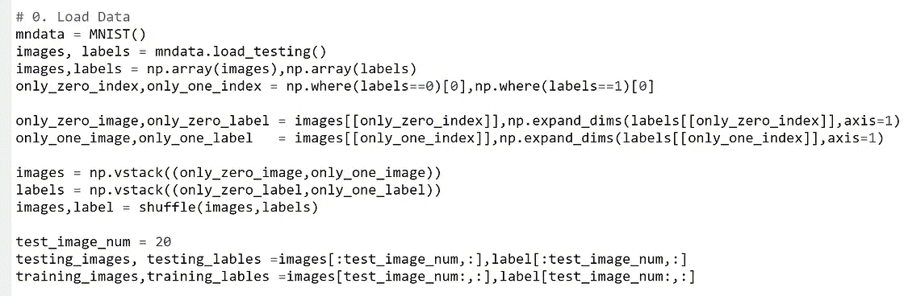
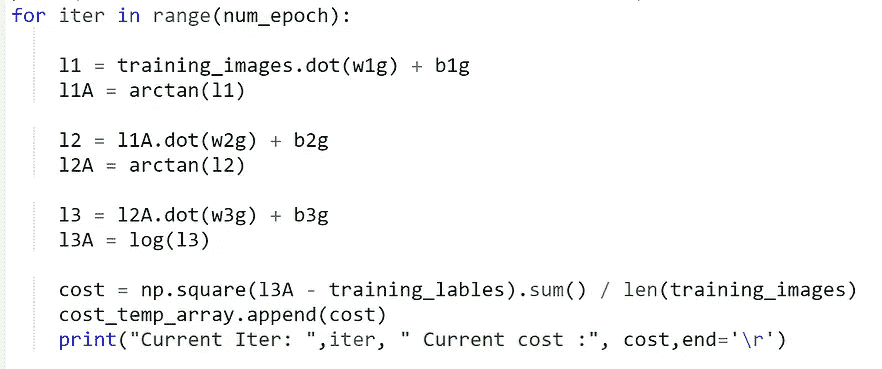
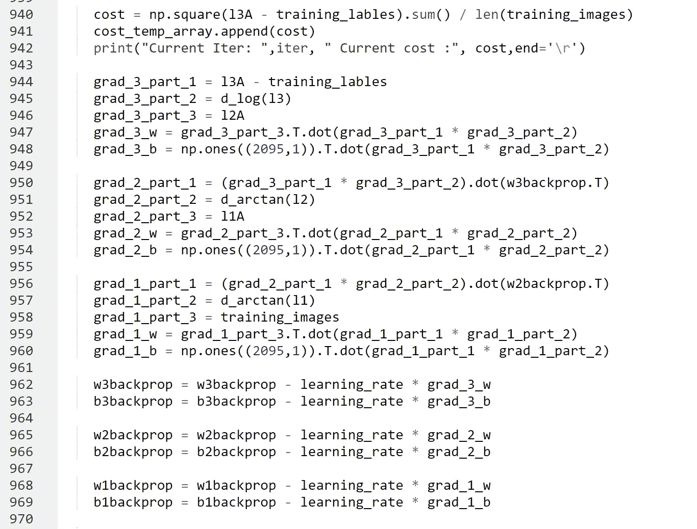
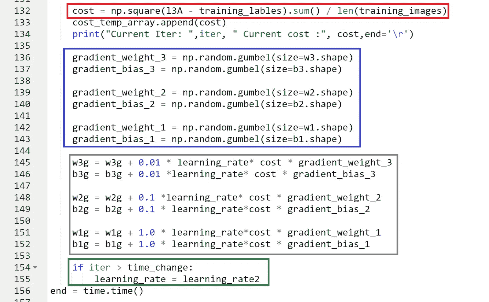
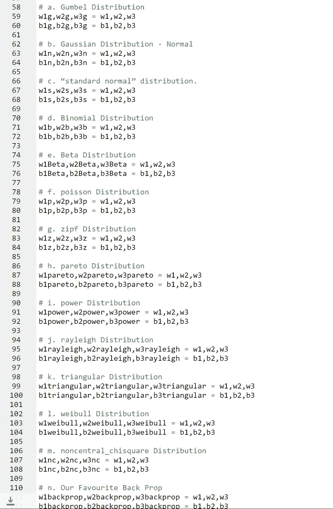
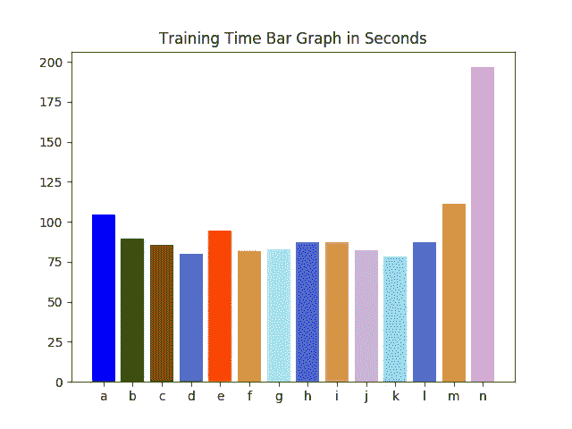
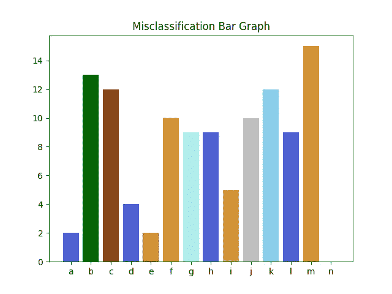
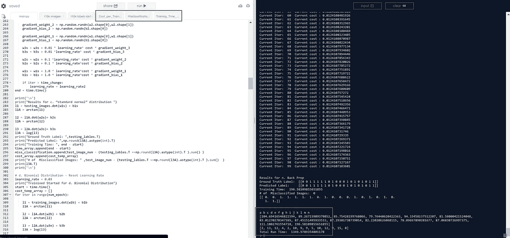
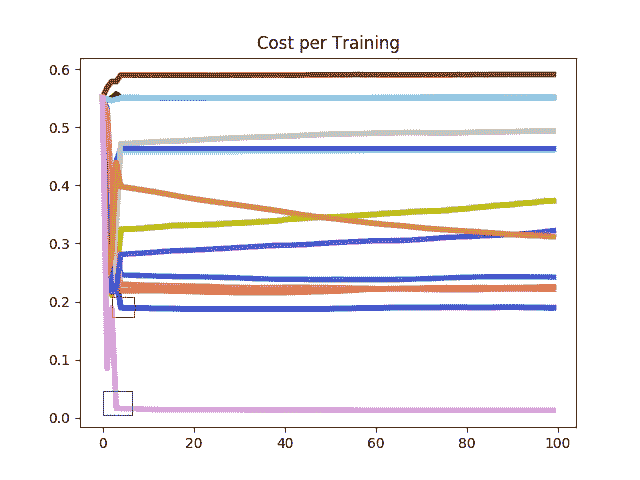

# only Numpy:Noise Training——用交互式代码训练一个没有反向传播的神经网络。

> 原文：<https://medium.com/swlh/only-numpy-noise-training-training-a-neural-network-without-back-propagation-with-interactive-ad775f04cad6>

今天我想做一些非常不同的事情。

**我的绝对无厘头理论**

所以我在想，在朝鲜我们有一个词叫做이열치열.它的意思是以火攻火或以武制武。我的父母会在夏天/冬天天气太热/太冷的时候告诉我这些。他们会告诉我吃或喝热汤/冰淇淋来消除炎热/寒冷。回想一下，逻辑没有任何意义，但是要把这个想法记在心里，同时阅读下一部分。

神经网络的一个挑战是知道隐藏层中给定数据的基本事实表示。简单地说，我们没有隐藏层的地面真实值，所以自然我们不知道数据是如何在那些隐藏层中被*假定*表示的。

但是我们需要隐藏层让网络执行复杂的任务。直接引用辛顿博士、鲁梅尔哈特博士和威廉姆斯博士在 1986 年发表的论文“L [通过错误传播获得内部表征](http://www.cs.toronto.edu/~fritz/absps/pdp8.pdf)”。

> 这个问题和许多类似的问题不能由没有隐藏单元的网络来解决，这些隐藏单元用来创建它们自己的输入模式的内部表示。

非常好的例子是经典的异或问题。

这也是我对 NN 的理解。模型试图学习或识别给定数据中的模式。一旦从训练数据中学习到某种模式。我们可以利用这种模式对图像或病人健康状况等进行分类..
然而，数据可能包含噪声，这使得模型更难学习识别该模式的适当权重。

从这里，我开始思考，我们能不能用噪音抵消数据中的噪音？

就像余弦波和正弦波是如何相互抵消的，就像이열치열，我们能以噪声对抗噪声吗？我想测试这个想法。

**警告！**
我不擅长数学，这种方法也没有确凿的证据证明为什么*会有点*的效果。如果任何数学家确切地知道为什么会发生这种情况(以及这背后的理论)，请在下面评论。

**数据/网络架构/前馈操作**

Left Image Preparing Data || Right Image Forward Feed Operation

我们将用简单的分类问题来测试噪声训练的想法。给定 MNIST 数据，我们将只对 0 或 1 图像执行分类。如右图所示，我们的神经网络是一个简单的三层网络。我们所有的网络共享完全相同的架构以及相同的超级参数。最后，我们使用平均 N2 成本函数。

**适当的反向传播**

如上所述，我们有适当的反向传播，其中保持链规则，我们没有任何破坏任何导数。

**噪声训练反向传播**

红框→我们网络的成本函数再次，我们使用平均 N2 成本。

蓝框→这是我们网络的关键区别！我们正在生成随机噪声(在上面的例子中，我们正在生成 Gumbel 分布。)为什么？因为我们要用这个作为我们的梯度，来更新我们的权重。

灰色框→这里我们要更新我们的权重。请注意(w3g，b3g) (w3g，b2g)和(w1g，b1g)的区别。如果我们让“成本”成为网络的一个信号，网络是如何运作的。那么我们可以很容易地假设这一点。随着网络运行良好，信号衰减，因此权重的更新变得更小。

**对于(w3g，b3g)我们乘以 0.01 →给权值以小信号
对于(w2g，b2g)我们乘以 0.1 →给权值以中等信号
对于(w1g，b1g)我们乘以 1.0 →给权值以大信号**

绿框→逐步学习率衰减

**使用的随机分布列表**

包括反向传播，共有 14 种方法来训练每个网络。

a → [冈贝尔分布](https://en.wikipedia.org/wiki/Gumbel_distribution)
b → [高斯分布](https://en.wikipedia.org/wiki/Normal_distribution)
c → [标准正态分布](https://en.wikipedia.org/wiki/Normal_distribution#Standard_normal_distribution)。
d → [二项式分布](https://en.wikipedia.org/wiki/Binomial_distribution)
e → [贝塔分布](https://en.wikipedia.org/wiki/Beta_Distribution)
f → [泊松分布](https://en.wikipedia.org/wiki/Poisson_distribution)
g → [Zipf 分布](https://en.wikipedia.org/wiki/Zipf%27s_law)
h → [帕累托分布](https://en.wikipedia.org/wiki/Pareto_distribution)
i → [幂分布](http://www.nematrian.com/PowerFunctionDistribution)
j → [瑞利分布](https://en.wikipedia.org/wiki/Rayleigh_distribution)
k → [三角形](https://en.wikipedia.org/wiki/Triangular_distribution)

每个发行版的更详细描述可以在 Scipy 文档中找到，要查看它们，请[点击此链接。](https://docs.scipy.org/doc/numpy/reference/routines.random.html)另外，请注意每个发行版的字母符号，因为我将引用它们来代表网络。

**训练结果—第 100 个历元数**

如上所述，n(反向传播)花了最多的时间来训练，对于其他网络，它大约是 77 秒到 101 秒。这是预料之中的，因为反向传播需要在更新权重之前计算大量导数。

**训练结果——20 幅测试图像中误分类图像的数量**

现在我知道测试集只包含 20 幅图像，但是我仍然很高兴看到 a ( [Gumbel 分布](https://en.wikipedia.org/wiki/Gumbel_distribution))网络和 e (Beta 分布)网络表现得相当好。只有两个错误分类的图像。然而，当然他们两个都没有达到反向传播模型 n 的精度，后者有 100%的精度。

所以我想我们做了一些交易。在反向传播上训练神经网络花费最长的时间，然而具有最高的精度。在有噪声的情况下，训练时间较短，但准确度一般。

**互动码**

***警告！如红框所示，整个程序的总运行时间约为 1349 秒。所以当你运行它的时候拿一杯咖啡。该计划将生成图像后，运行所有的网络，你可以访问他们所有的标签上显示的绿色方框。***

要访问[互动代码，请点击此链接。](https://repl.it/@Jae_DukDuk/Noise-Training)

***警告 2。所以我刚刚注意到，如果你不是 Repl(交互式代码网站)的订户，你就不能完全运行代码。运行这段代码的另一种方法是从网上下载所有文件，并在本地设置上运行。***

*更新:为了交互代码，我搬到了 Google Colab！所以你需要一个谷歌帐户来查看代码，你也不能在谷歌实验室运行只读脚本，所以在你的操场上做一个副本。编码快乐！然而，在移动后，我注意到一些非常不同的东西，因为 Tensorflow 的 MNIST 数据集是以不同的顺序排列的，当训练时，结果会与上面的一些不同。改变 Numpy 的随机种子值有助于改善或恶化我的结果。最后，我永远不会请求允许访问你在 Google Drive 上的文件，仅供参考。*

要访问 [Google Colab 版本的交互代码，请点击此处。](https://colab.research.google.com/notebook#fileId=17iKOvcZ90UV89yF6JQtqa2rbUEhq0ucK)

**遗言**

我想指出两件事。首先，我认为反向传播是深度神经网络的最佳训练方法之一，并坚信它在未来仍将是最好的方法之一。

第二，整个实验是为了看看是否有可能在没有反向传播的情况下“稍微”训练一个神经网络，我认为我们在一定程度上做到了。然而，有一个巨大的问题。如果我们绘制每个网络的成本值，我们会得到如下图。

如上所示，一个([冈贝尔分布](https://en.wikipedia.org/wiki/Gumbel_distribution))网络在成本值为 0.2(红框)左右停止学习。而 n(反向传播)网络能够将代价降低到 0。(绿框)所以我不认为香草梯度体面是一个合适的噪声训练优化算法。知道如何有效地摆脱局部最小点以及所有这些背后的精确数学将是非常令人满意的。

如果发现任何错误，请发电子邮件到 jae.duk.seo@gmail.com 找我。

同时，在我的推特[这里](https://twitter.com/JaeDukSeo)关注我，访问[我的网站](https://jaedukseo.me/)，或者我的 [Youtube 频道](https://www.youtube.com/c/JaeDukSeo)了解更多内容。如果你感兴趣，我还在这里做了解耦神经网络[的比较。](https://becominghuman.ai/only-numpy-implementing-and-comparing-combination-of-google-brains-decoupled-neural-interfaces-6712e758c1af)

**参考**

1.  随机抽样(numpy.random)。(未注明)。检索于 2018 年 2 月 1 日，来自[https://docs . scipy . org/doc/numpy/reference/routines . random . html](https://docs.scipy.org/doc/numpy/reference/routines.random.html)
2.  鲁梅尔哈特，丁顿，通用电气公司和威廉姆斯，R. J. (1985)。*通过错误传播学习内部表示*(编号 ICS-8506)。加州大学圣地亚哥拉荷亚认知科学研究所。
3.  T.(2009 年 9 月 17 日)。了解你的分销类型。检索于 2018 年 2 月 1 日，来自[https://www.youtube.com/watch?v=-PwugYB9Zjs](https://www.youtube.com/watch?v=-PwugYB9Zjs)
4.  动词 （verb 的缩写）(2011 年 01 月 07 日)。数学教程:描述统计分布(第 1 部分，共 2 部分)。检索于 2018 年 2 月 1 日，来自[https://www.youtube.com/watch?v=achLJ8PRyBw](https://www.youtube.com/watch?v=achLJ8PRyBw)
5.  C.(2014 年 6 月 30 日)。理解随机变量-概率分布 1。检索于 2018 年 2 月 1 日，来自[https://www.youtube.com/watch?v=lHCpYeFvTs0](https://www.youtube.com/watch?v=lHCpYeFvTs0)

## 这个故事发表在 [The Startup](https://medium.com/swlh) 上，这是 Medium 最大的企业家出版物，拥有 293，189+人。

## 在这里订阅接收[我们的头条新闻](http://growthsupply.com/the-startup-newsletter/)。

