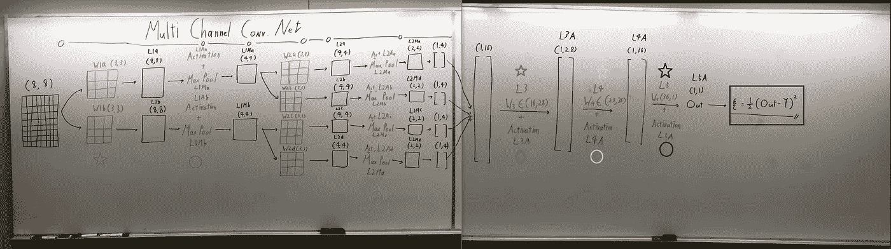
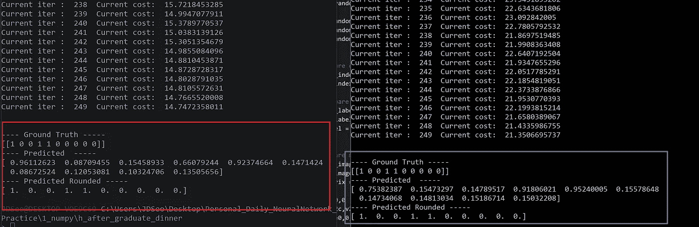

# 只有 Numpy:(为什么我做手动反向传播)在 Numpy 上用交互式代码实现多通道/层卷积神经网络

> 原文：<https://medium.com/swlh/only-numpy-why-i-do-manual-back-propagation-implementing-multi-channel-layer-convolution-neural-7d83242fcc24>

因此，我发表了一篇关于理解最大池层反向传播以及转置卷积的文章。下一步将是利用这些知识制作一个多频道/多层 CNN，所以…我们去吧！另外，仅供参考，我正在使用动量优化器。

在阅读这篇帖子之前，我推荐阅读这个 Quora 问题，“ [*为什么 Geoffrey Hinton 怀疑反向传播，希望 AI 重新开始？*](https://www.quora.com/Why-is-Geoffrey-Hinton-suspicious-of-backpropagation-and-wants-AI-to-start-over) ”或者这篇博文“ [*为什么我们要对反向传播*](/intuitionmachine/the-deeply-suspicious-nature-of-backpropagation-9bed5e2b085e) ”深表怀疑。两个都很有意思。

此外，请注意，如果你已经很好地理解了通过转置卷积和最大池层反向传播会更好，因为我不会在这篇文章中详细介绍。

**训练数据和声明超参数**

如上所述，所有的核都是(3*3)矩阵，我们正在对仅用于 0 和 1 图像的数据集“[识别手写数字](http://scikit-learn.org/stable/auto_examples/classification/plot_digits_classification.html)”执行一个非常简单的二进制任务。

**网络架构**

输入→尺寸为(8*8)的图像

红星→具有两个不同通道的第 1 层
红色圆圈→激活和最大池层应用于第 1 层

蓝星→具有四个不同通道的第 2 层
蓝圈→激活和最大池操作应用于第 2 层

绿色星形→具有(16*28)
全连接权重(W3)维度的第 3 层绿色圆圈→应用于第 3 层的激活函数

粉色星形→第 4 层，全连接权重(W4)维度为(28*36)
粉色圆形→激活层应用于第 4 层

黑色星形→第 5 层，全连接权重(W5)维度为(36*1)
黑色圆圈→激活层应用于第 5 层

黑盒→使用 L2 范数的成本函数

**执行正向进给操作**

每种颜色代表该层的操作，这里需要注意两点。

1.  我在每个卷积层之前执行零填充以保持维度。
2.  我为每一层使用了各种不同的激活函数。

**对 W5、W4 和 W3 实施反向传播**

对于标准全连接层，每个激活函数具有适当导数的标准反向传播，没有什么特别的。

**关于所有 W2 (W2a、W2b、W2c 和 W2d)的反向传播被实现**

第一行代码(带下划线的绿色)→从前一层向后传播
绿色方框区域→按照 W2a、W2b、W2c 和 W2d 各自的顺序计算梯度。

**针对所有 W1 (W1a 和 W1b)实现的反向传播**

第一个红框→相对于 W1a 的梯度
第二个红框→相对于 W2a 的梯度

**训练及结果**

很好，结果最后的结果不算太差。如上所示，历元的数量被设置为 500。并且网络对测试集上的每个图像进行了分类，除了一个。

**打破反向传播中的数学运算**

因此，以上是适当的反向传播，其中我们执行前一层的导数和激活函数的导数之间的逐元素乘法。然而，出于好奇，我决定做如下事情。

蓝线→简单元素乘法
绿线→仅在最大池层
红线后对计算的导数执行转置→仅在最大池层的掩码上执行转置。

为简单起见，我将上述网络称为断背道具网。

我并不期待网络在改变后表现良好，我只是好奇。但是，让我们看看下面显示的结果。我做了三个不同的实验，每次都用不同的超参数。(仅改变最后完全连接的层的尺寸。)

**结果 1:两个网络的权重维数分别为 W3(16*18)、W4(18*20)和 W5(20，1)**

红框→断背道具网的结果。
蓝框→原网结果

正如所看到的，对于第一个实验，两个网络在测试数据上都有 100%的准确性，然而断网在时期 250 具有较低的成本。

**结果 2:两个网络的权重维数分别为 W3(16*48)、W4(48*56)和 W5(56，1)**

红框→断网结果
蓝框→原网结果
绿星→网络哪里预测错了

这一次很有意思，破网有更高的成本，然而在测试数据上有 100%的准确性。而原始网络成本较低，在测试数据上有些预测是错误的。

**结果 3:忘记了权重的维度(LOL ),但是它们对于两个网络具有相同的维度。**

红框→断网结果
蓝框→原网结果

同样，两个网络在测试数据上都有 100%准确性。而断网成本较高。

**互动代码:原创网**

*注意:在线编译器没有“从 sklearn 导入数据集”，所以我不能复制并粘贴我在笔记本电脑上使用的代码。所以我复制了四个训练样本，分别代表手写数字 0，1，1，0，并调整了超参数。*

要访问原始网络代码，请点击此链接。

**互动代码:断网**

*注意:在线编译器没有“从 sklearn 导入数据集”，所以我不能复制并粘贴我在笔记本电脑上使用的代码。所以我复制了四个训练样本，分别代表手写数字 0，1，1，0，并调整了超参数。*

要访问断网代码，请点击此处。

## 最后的话

像这样的结果令我着迷，这也是我做手工反向传播的原因。甚至辛顿博士也怀疑反向传播，并希望人工智能重新开始。我不知道如何重新开始 LOL，但我认为对我们来说，更深入地了解反向传播是至关重要的，并尝试创造性的方法，看看其他方法是否也是很好的反向传播。

如果发现任何错误，请发电子邮件到 jae.duk.seo@gmail.com 找我。

同时，在我的 twitter [这里](https://twitter.com/JaeDukSeo)关注我，并访问[我的网站](https://jaedukseo.me/)，或我的 [Youtube 频道](https://www.youtube.com/c/JaeDukSeo)了解更多内容。如果你感兴趣的话，我还做了解耦神经网络的比较。

**参考文献**

1.  佩雷斯，C. E. (2017 年 9 月 16 日)。为什么我们应该对反向传播深感怀疑。检索于 2018 年 1 月 29 日，来自[https://medium . com/intuition machine/the-deep-suspective-nature-of-back propagation-9 bed 5 e2b 085](/intuitionmachine/the-deeply-suspicious-nature-of-backpropagation-9bed5e2b085)e
2.  识别手写数字。(未注明)。检索于 2018 年 1 月 29 日，来自[http://sci kit-learn . org/stable/auto _ examples/classification/plot _ digits _ classification . html](http://scikit-learn.org/stable/auto_examples/classification/plot_digits_classification.html)
3.  巴蒂亚河(2018 年 1 月 18 日)。反向传播:它是当今人工智能的致命弱点吗？检索于 2018 年 1 月 29 日，来自[https://analyticsindiamag . com/back-propagation-is-it-the-achilles-heel-of-todays-ai/](https://analyticsindiamag.com/back-propagation-is-it-the-achilles-heel-of-todays-ai/)
4.  2018.【在线】。可用:[https://www . quora . com/Why-is-Geoffrey-hint on-suspective-of-back propagation-and-wants-AI-to-start-over。](https://www.quora.com/Why-is-Geoffrey-Hinton-suspicious-of-backpropagation-and-wants-AI-to-start-over.)【访问时间:2018 年 1 月 29 日】。

## 这篇文章发表在[《创业](https://medium.com/swlh)》上，这是 Medium 最大的创业刊物，有 298，432+人关注。

## 在这里订阅接收[我们的头条新闻](http://growthsupply.com/the-startup-newsletter/)。

