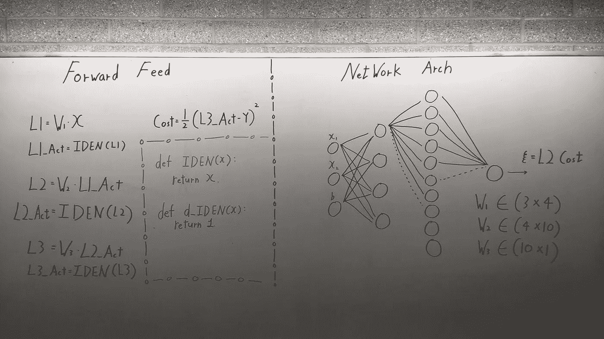
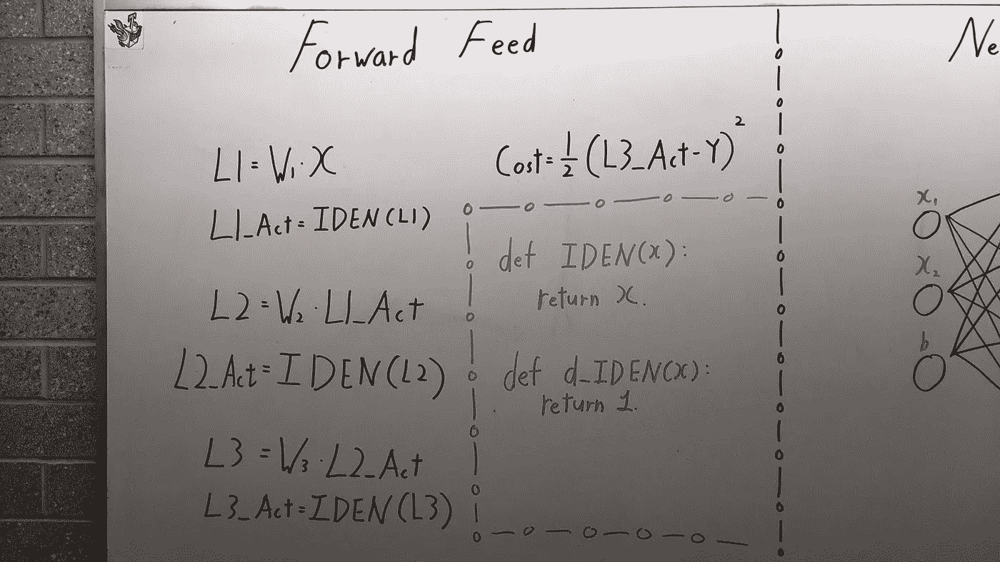
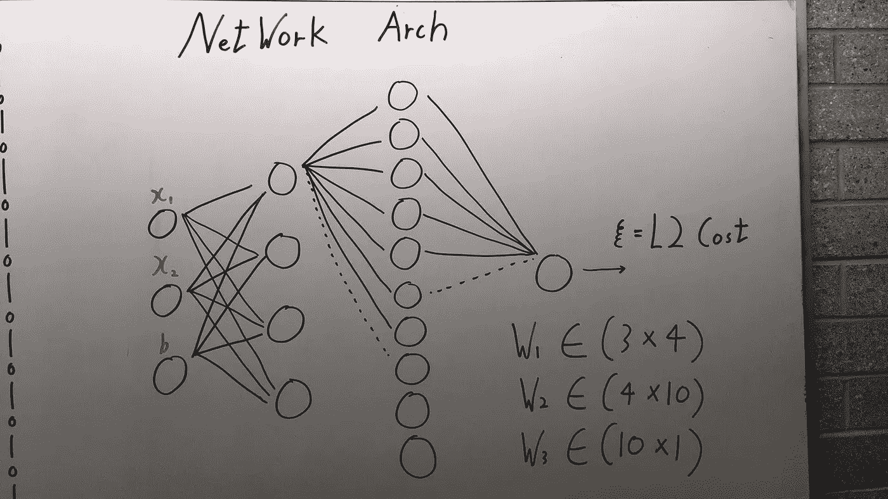
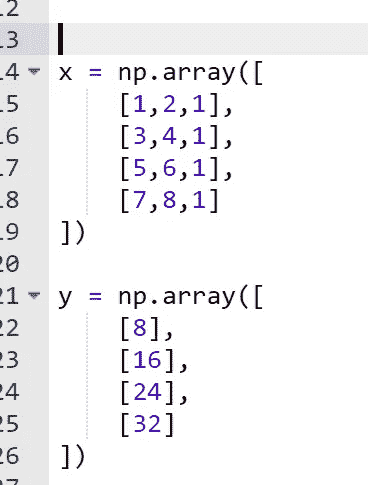
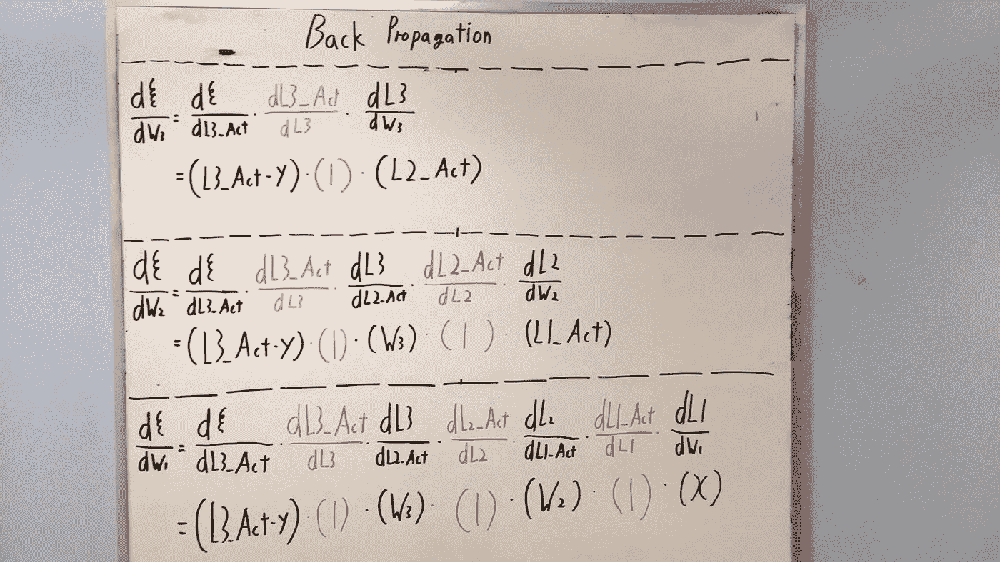
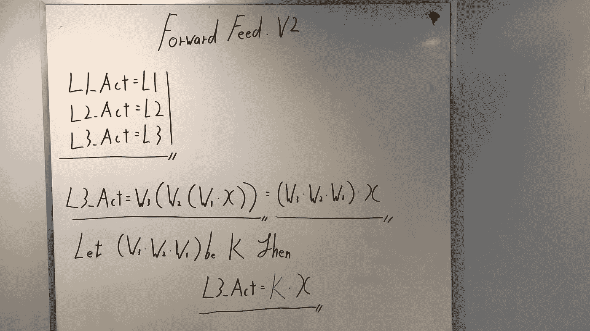
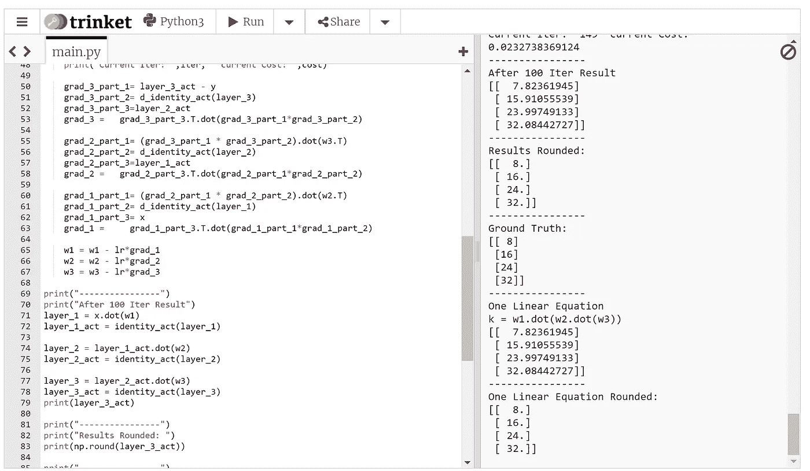
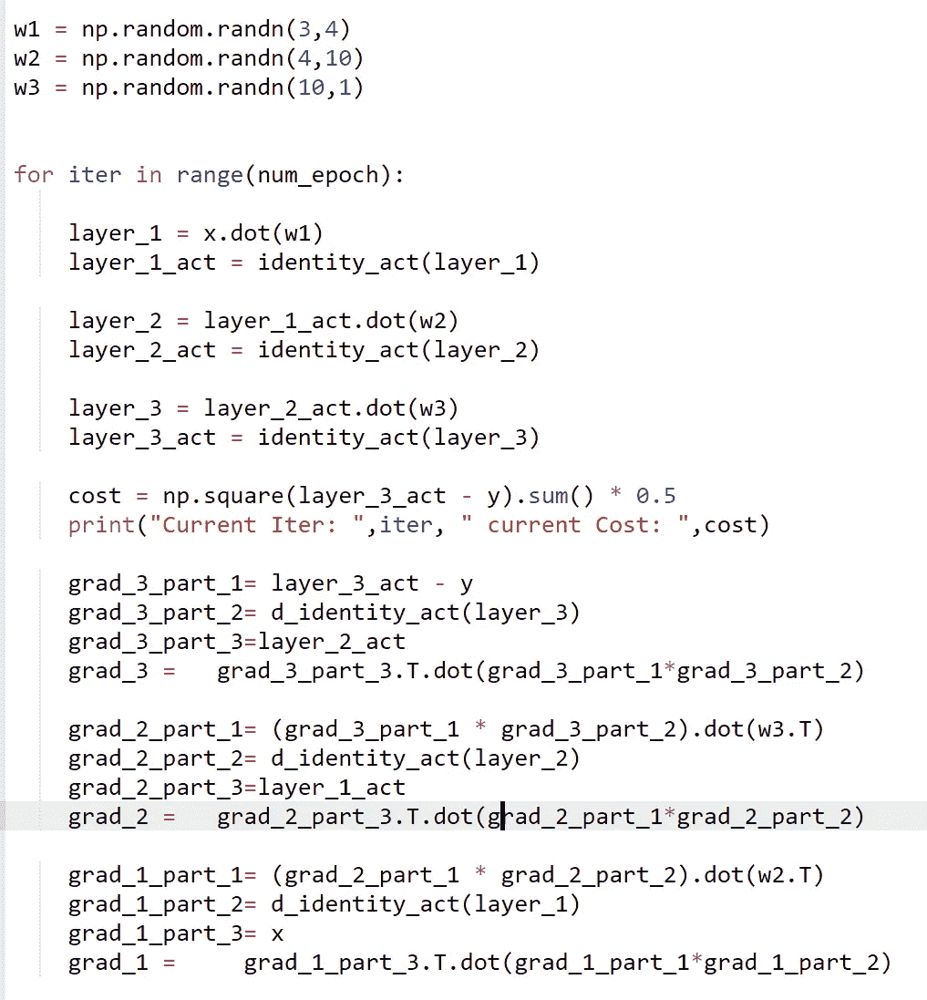
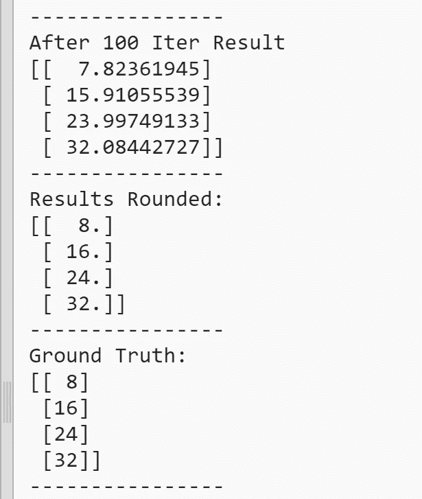
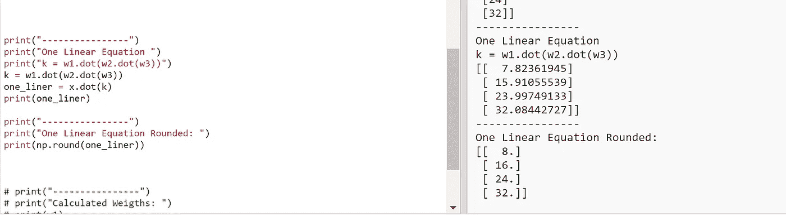

# Only Numpy:为什么我们在深度神经网络中需要激活函数(非线性)——使用交互式代码

> 原文：<https://medium.com/swlh/only-numpy-why-we-need-activation-function-non-linearity-in-deep-neural-network-with-529e928820bc>

所以今天，我不想做太复杂的事情，而是用代码做一个简单的证明。让我们进入正题，为什么我们需要激活功能？

## ***非线性***

这就是我们需要激活功能，因为上述原因。如果你想知道详情，请阅读这篇博文。

**网络架构+前馈过程**



所以这里有两点需要注意，
1。我们正在使用 IDEN 激活功能，如上所示。它只返回输入的内容。而求导只是 1。下面是一个 python 实现。

```
def identity_act(x):
      return x

def d_identity_act(x):
  return 1
```

2.如右图所示，这是标准的神经网络，没有什么特别之处。



如上所述，我们使用 L2 成本函数。



此外，如上所述，我们拥有的 3 个权重的维度是(3*4)、(4*10)和(10*1)。我们的输入矩阵如下所示。



```
So if we do the math.
Layer_1 = x.dot(w1) → (4*3)(3*4) →(4*4)
Layer_1_act = IDEN(Layer_1) →(4*4)Layer_2 = Layer_1_act.dot(w2) → (4*4)(4*10) →(4*10)
Layer_2_act = IDEN(Layer_2) → (4*10)Layer_3 = Layer_2_act.dot(w3) →(4*10)(10*1) →(4*1)
Layer_3_act = IDEN(Layer_3) → (4*1)Cost = np.square(Layer_3_act-Y).sum() * 0.5
```

**反向传播**



带**矢量化的标准反向传播，**没什么特别的。但是请注意我用红色写的地方，这些是我们对激活函数 IDEN 求导的地方，它给出 1。

**前馈版本 2**



如上所述，因为我们的激活函数是线性的。我们可以用一个巧妙的技巧把整个网络变成一个简单的数学行！

**交互代码**



这里是代码的[链接。](https://trinket.io/python3/55549b9fea)

现在让我们一个接一个地看看每一部分。



上面是标准的前馈和反向传播，没什么特别的，下面是结果。



正如看到的 100%的准确性，(当四舍五入)，现在让有趣的东西。让我们计算 K 值。



如上所述，我们可以通过简单的点积来计算 K 值，只需执行 x.dot(k)即可获得相同的结果！

## 最后的话

如果发现任何错误，请发电子邮件到 jae.duk.seo@gmail.com 找我。

与此同时，请在我的推特[这里](https://twitter.com/JaeDukSeo)关注我，并访问[我的网站](https://jaedukseo.me/)，或我的 [Youtube 频道](https://www.youtube.com/c/JaeDukSeo)了解更多内容。如果你感兴趣的话，我还在简单的 RNN [上做了反向传播。](/@SeoJaeDuk/only-numpy-vanilla-recurrent-neural-network-with-activation-deriving-back-propagation-through-time-4110964a9316)


## 这个故事发表在 [The Startup](https://medium.com/swlh) 上，这是 Medium 最大的企业家出版物，拥有 293，189+人。

## 在这里订阅接收[我们的头条新闻](http://growthsupply.com/the-startup-newsletter/)。

