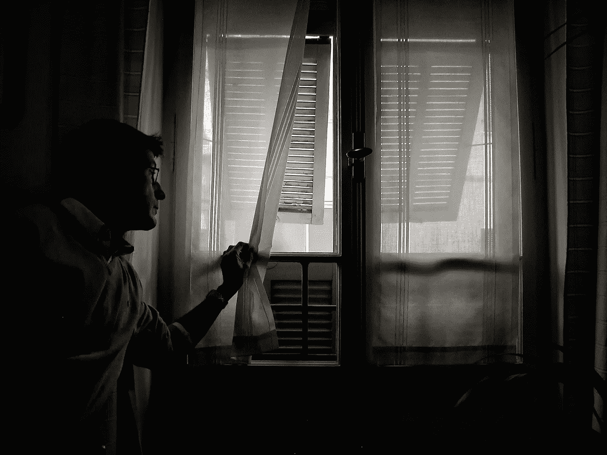

# 只剩六个月可活了

> 原文：<https://medium.com/swlh/only-six-months-left-to-live-37c7fea071f0>

Photo by [Geetanjal Khanna](https://unsplash.com/photos/8CwoHpZe3qE?utm_source=unsplash&utm_medium=referral&utm_content=creditCopyText) on [Unsp](https://unsplash.com/search/photos/death?utm_source=unsplash&utm_medium=referral&utm_content=creditCopyText)

> 帮助你打破无所作为、麻痹和错误关注模式的终极练习。

想象一下，今天你去取常规体检的结果。只是这一次，你从医生那里得到了你完全没有准备好的消息。

你得了绝症，只能活六个月了。

我知道这听起来有多疯狂。

但是，请帮你自己一个忙，实际上**做一下**这个思想练习。我知道让自己去做有多难。毕竟，这是我们一生中最不想要的事情。

我刚刚自己做的。

它会吓到你。吓死你了。

但这也是改变你生活的最有力的方法，而这些改变你可能已经忽略了很多年，甚至几十年。

**原因如下:**

正如史蒂文·普莱斯菲尔德在《T4》的《艺术的战争》中写道:“当我们意识到自己可能不久于人世时，那一瞬间发生的事情就是，如果我们的意识转移了。它从自我转移到自我”。

一旦我们意识到我们可能会很快死去，我们就会自动开始将注意力转向我们生命中最重要的方面，并采取行动，以充分利用我们剩余的时间。

没有人想在没有让自己的生活有条不紊的情况下死去。

当你想象你将在六个月后死去，并且你强迫自己暂时真正相信这个事实，那么你正在挖掘和如果它是真的一样的能量。

# 但是要小心。

## 你下一步做什么也同样重要。

Photo by [Ian Espinosa](https://unsplash.com/photos/SrtIO_uBlVI?utm_source=unsplash&utm_medium=referral&utm_content=creditCopyText) on [Unsplash](https://unsplash.com/search/photos/death?utm_source=unsplash&utm_medium=referral&utm_content=creditCopyText)

这个练习的第一个可能的结果是，你只是被吓到了。在这种情况下，焦虑会淹没你，窒息你，吞没你，直到你无法再逃避它。

**以下是确保这种情况不会发生的方法:**

你需要做的一件事是迅速将你的思维模式从刚刚收到消息的人转移到已经思考了一会儿的人身上。

刚刚收到这个消息的人非常震惊。

已经思考了一段时间的人，正在思考这对他们的生活意味着什么，他们现在需要采取什么步骤，以及如何最大限度地利用他们剩下的时间。

一旦你进入那种状态，开始问自己一些有目的的问题。

像这样的问题:

*   我现在需要做什么？
*   我需要做些什么来让我的生活有条不紊？
*   我需要做些什么来确保这六个月是我一生中最快乐的时光？
*   在这六个月里，我还没有实现什么，我可以让它发生，并给我一种满足感和成就感？
*   对我来说真正重要的是什么？在我剩下的一点时间里，我需要整理的事情？

# 打破不作为、瘫痪和错误关注的模式。

Photo by [Marco Bianchetti](https://unsplash.com/photos/2xq9iscePyE?utm_source=unsplash&utm_medium=referral&utm_content=creditCopyText) on [Unsplash](https://unsplash.com/search/photos/dark?utm_source=unsplash&utm_medium=referral&utm_content=creditCopyText)

这个练习的目的是促使你行动起来。不是任何行动，而是专注于真正重要的事情。

它旨在粉碎我们三个最常见的敌人:

*   不活动
*   分析瘫痪
*   错误的焦点

通常情况下，我们只是没有对生活中最重要的方面采取行动。我们陷入了试图分析形势的困境。或者，我们让自己忙于其他事情，根本没有其他空间了。

我们的内部阻力在起作用。

我们拖延。

虽然，在内心深处，我们知道我们没有在做对我们真正重要的事情，但是我们找不到打破这种模式的方法。

迫在眉睫的死亡是打破这种模式的最有力的方式。

它迫使我们进入真正专注的状态。

这就是我们试图通过这个练习来模拟的精神状态。

# 一些最后的话:

过着有创造力或企业家精神的生活迫使我们不断与自己的内心斗争。这是一种残酷的生活方式，不断将我们暴露在人类自身最黑暗的一面。

反抗军。

让我们不断自我毁灭的东西。

如果我们死而一事无成，那将是最幸福的事。

它会来参加你的葬礼，嘲笑你，因为它真的把你打死了。

这是你六个月后想要的吗？

没有吗？

那么现在就采取行动。做练习。

问问你自己:

> “在接下来的六个月里，我需要做(和实现)什么，如果我真的要死了，能让我快乐、满足和自豪地死去？”

**如果你觉得这篇文章有用请做👏并与你的朋友分享。记住，你最多可以鼓掌 50 次——这对我真的很重要。**

**您也可以通过** [**点击这里**](https://mailchi.mp/b0d1e1fba452/struggle-first-thrive-later) **免费订阅我的时事通讯。**

## 这个故事发表在 [The Startup](https://medium.com/swlh) 上，这是 Medium 最大的企业家出版物，拥有 306，072+人。

## 在此订阅接收[我们的头条新闻](http://growthsupply.com/the-startup-newsletter/)。

