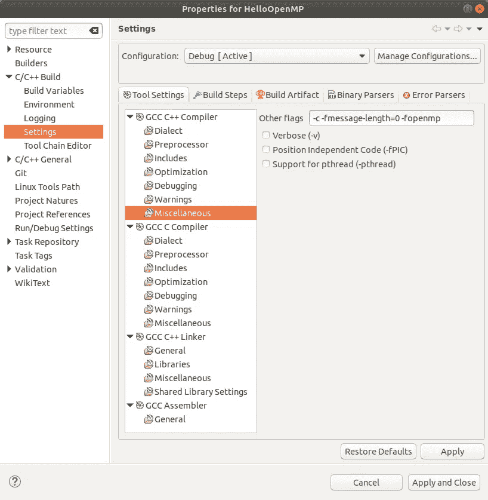
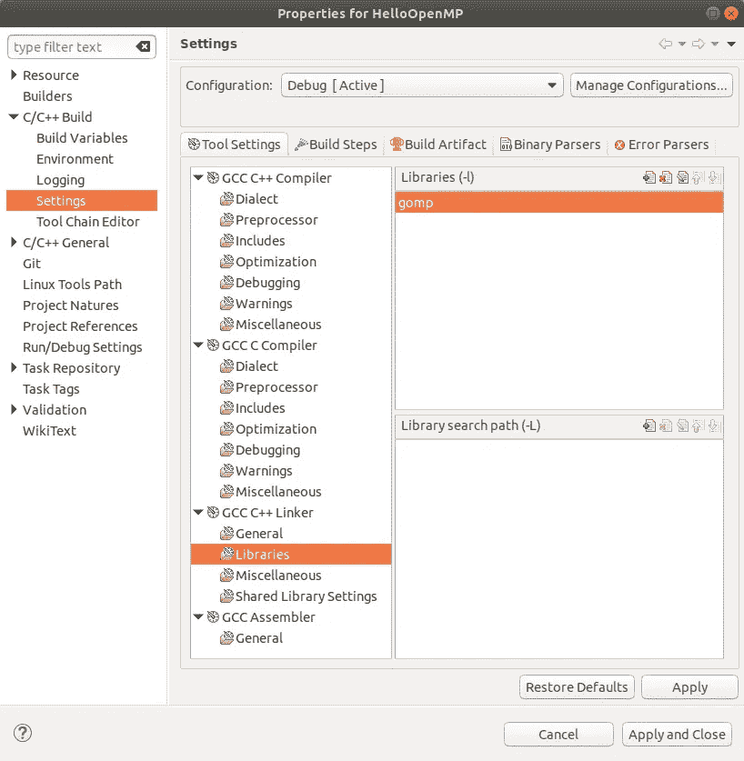

# Ubuntu 上的 OpenMP

> 原文：<https://medium.com/swlh/openmp-on-ubuntu-1145355eeb2>

OpenMP 是一个用于在多个处理器上同时执行 C、C++和 Fortran 代码的库。如果您的代码使用了大量的循环，并且充分利用了 CPU 的能力，那么这将使您的代码运行得更快。如果你只是想看代码，这里的链接是。

## 在 Ubuntu / Linux 上设置 OpenMP

我不完全确定这在其他平台上是如何工作的。这在 Mac 上几乎是不可能的，在 Windows 上有一些奇怪的设置说明，但在 Linux 和 Ubuntu 上这真的很容易。

1.  在您的终端中运行`sudo apt-get install libomp-dev`。
2.  创建一个`C++ Project`，并将其命名为`HelloOpenMP`。
3.  选择您的项目，并转到`Properties`对话框。
4.  去`C/C++ Build -> Settings`。
5.  选择`GCC C++ Compiler / Miscellaneous`。
6.  在`Other flags`输入中，添加`-fopenmp`。
7.  选择`GCC C++ Linker / Libraries`。
8.  在`Libraries (-l)`字段中，点击添加按钮并输入`gomp`。

之后，您的属性应该看起来像这样:



Left: compiler flags, Right: linker libraries

就是这样！

## 使用 OpenMP

假设您有一个很棒的程序，可以打印出 10 个数字的列表:

```
#include <stdio.h>int main(){
  for(int i=0;i<10;i++){
    printf("%i\n",i);
  }
  return 0;
}
```

这将输出如下内容:

```
0
1
2
3
4
5
6
7
8
9
```

现在，让 *OpenMP* 开始吧！

```
#include <stdio.h>int main(){
#pragma omp parallel for
  for(int i=0;i<10;i++){
    printf("%i\n",i);
  }
  return 0;
}
```

这将输出如下内容:

```
4
7
6
9
0
1
8
2
3
5
```

这些数字是无序的，因为循环中的每次迭代都是在稍微不同的时间并行执行的。

等等，什么？“怎么会那么容易？”我听到你说。如果你的编译器支持 OpenMP 的话，实际上就是这么简单。一般来说，最新版本的 GCC 应该没问题。如果你的编译器不支持它，编译指令会被忽略！并且您的代码退回到单核缓慢状态。所以 OpenMP 完全兼容任何机器。

源代码可以在[这里](https://github.com/mackycheese/Ubuntu-C-CPP-Projects/tree/master/HelloOpenMP)找到。

## 结束了

我用我制作的自定义 PPM 图像库制作了一个小的 mandelbrot 程序:

```
#include <math.h>
#include "ppm.h"
#include <chrono>
#include "complex.h"
#include "omp.h"using namespace std::chrono;///https://stackoverflow.com/a/19555298/9609025
long curTime(){
  milliseconds ms = duration_cast< milliseconds >(system_clock::now().time_since_epoch());
  return ms.count();
}int main(){
  int w=1000;
  int h=1000;

  ppm img;
  img.setSize(w,h);
  img.allocMem(); long start,end; start=curTime();
#pragma omp parallel for
  for(int x=0;x<w;x++){
#pragma omp parallel for
    for(int y=0;y<h;y++){
//   printf("%i %i\n",x,y);
      float fx=x;
      float fy=y;
      fx/=w;
      fy/=h;
      fx*=4;
      fy*=4;
      fx-=2;
      fy-=2; complex c=fromXY(fx,fy);
      complex c0=c; int max=50;
      int i=0; for(i=0;i<max&&c.r<10000;i++){
       c=c^2;
       c=c+c0;
      } float f=((float)i)/((float)max); img.setPixel(x,y,f);
    }
  } end=curTime(); unsigned long diff1=end-start; start=curTime();
  for(int x=0;x<w;x++){
    for(int y=0;y<h;y++){
//   printf("%i %i\n",x,y);
      float fx=x;
      float fy=y;
      fx/=w;
      fy/=h;
      fx*=4;
      fy*=4;
      fx-=2;
      fy-=2; complex c=fromXY(fx,fy);
      complex c0=c; int max=50;
      int i=0; for(i=0;i<max&&c.r<10000;i++){
        c=c^2;
        c=c+c0;
      } float f=((float)i)/((float)max); img.setPixel(x,y,f);
    }
  }
  end=curTime(); long diff2=end-start; printf("With OMP    : %lums\n",diff1);
  printf("Without OMP : %lums\n",diff2);
  printf("Speedup     : %lums\n",diff2-diff1); img.clamp();
  img.save("mandelbrot.ppm");
  img.dealloc(); return 0;}
```

在我的电脑上，它会显示以下内容:

```
With OMP    : 451ms
Without OMP : 1475ms
Speedup     : 1024ms
```

相当牛逼！

这可以应用于 C++中任何可以独立于其他迭代执行的循环，具有巨大的加速。当 OpenMP 和我的一些路径跟踪算法一起使用时，我获得了更大的加速。

这个新的库使得在 CPU 上同时运行多个东西变得更加容易，并且与 OpenCL 相比，更易于使用。

[](https://medium.com/swlh)

## 这篇文章发表在 [The Startup](https://medium.com/swlh) 上，这是 Medium 最大的创业刊物，拥有+ 379，528 名读者。

## 在这里订阅接收[我们的头条新闻](http://growthsupply.com/the-startup-newsletter/)。

[](https://medium.com/swlh)